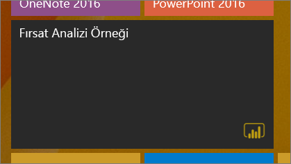
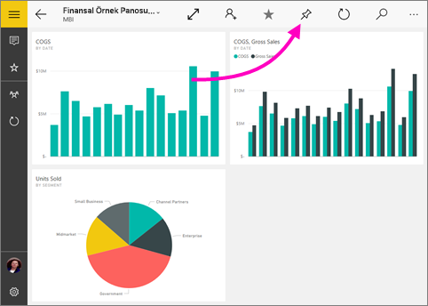

# Power BI mobil uygulamasındaki bir panoyu Windows 10 Başlangıç ekranına sabitleme
Windows 10 için Power BI mobil uygulamasındaki Power BI panolarını Windows Başlangıç ekranına sabitleyebilirsiniz. Başlangıç ekranında bulunan kutucuğa tıkladığınızda pano Windows 10 için Power BI mobil uygulamasında açılır.

>[!NOTE]
>**Windows 10 Mobile kullanan telefonlar** için Power BI mobil uygulama desteği, 16 Mart 2021’de sona erecektir. [Daha fazla bilgi](/legal/powerbi/powerbi-mobile/power-bi-mobile-app-end-of-support-for-windows-phones)

## Bir panoyu Başlangıç ekranınıza kutucuk olarak sabitleme
1. Bir pano açın.
2. **Başlangıç ekranına sabitle**  simgesine dokunun.
   
   
   
   Kutucuğu görmek için cihazınızın Başlangıç ekranına gidin.
   
   

## Sonraki adımlar
* Microsoft Store'dan [Windows 10 için Power BI mobil uygulamasını indirme](https://go.microsoft.com/fwlink/?LinkID=526478)  
* [Windows 10 için Power BI mobil uygulamasını kullanmaya başlama](mobile-windows-10-phone-app-get-started.md)  
* [Power BI nedir?](../../fundamentals/power-bi-overview.md)
* Sorularınız mı var? [Power BI Topluluğu'na sorun](https://community.powerbi.com/)