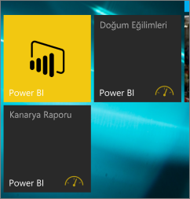

# Power BI mobil uygulamasındaki bir panoyu Windows 10 Başlangıç ekranına sabitleme
Windows 10 için Power BI mobil uygulamasındaki Power BI panolarını Windows Başlangıç ekranına sabitleyebilirsiniz. Bunlar *canlı kutucuklar* haline gelir. Başlangıç ekranında bulunan kutucuğa tıkladığınızda pano Windows 10 için Power BI mobil uygulamasında açılır.

## Bir panoyu Başlangıç ekranınıza canlı kutucuk olarak sabitleme
1. Bir pano açın.
2. **Başlangıç ekranına sabitle**  simgesine dokunun.
   
   
   
   Canlı kutucuğu görmek için cihazınızın Başlangıç ekranına gidin.
   
   

## Sonraki adımlar
* Microsoft Store'dan [Windows 10 için Power BI mobil uygulamasını indirme](http://go.microsoft.com/fwlink/?LinkID=526478)  
* [Windows 10 için Power BI mobil uygulamasını kullanmaya başlama](mobile-windows-10-phone-app-get-started.md)  
* [Power BI nedir?](../../power-bi-overview.md)
* Sorularınız mı var? [Power BI Topluluğu'na sorun](http://community.powerbi.com/)

