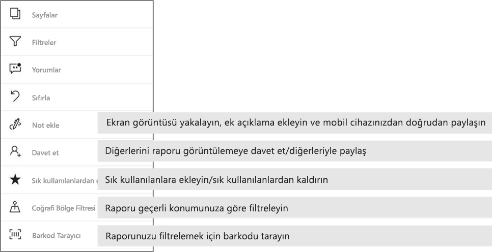

# Power BI mobil uygulamalarında raporları araştırma
Aşağıdakiler için geçerlidir:

|  |  |  |  |  |
|:--- |:--- |:--- |:--- |:--- |
| iPhone'lar |iPad'ler |Android telefonlar |Android tabletler |Windows 10 cihazları |

Power BI raporu, verilerinizin etkileşimli bir görünümüdür ve verilerinize dayalı farklı bulguları ve öngörüleri temsil eden görseller içerir. Power BI mobil uygulamalarında raporları görüntülemek, üç adımlı bir işlemin üçüncü adımıdır.

1. [Power BI Desktop'ta rapor oluşturun](../../desktop-report-view.md). Power BI Desktop'ta [bir raporu telefonlar için en iyi duruma getirebilirsiniz](mobile-apps-view-phone-report.md). 
2. Oluşturduğunuz raporları Power BI hizmetinde [(https://powerbi.com)](https://powerbi.com) veya [Power BI Rapor Sunucusu](../../report-server/get-started.md)'nda yayımlayın.  
3. Ardından Power BI mobil uygulamalarını kullanarak bu raporlarla etkileşim kurun.

## Bir Power BI raporunu mobil uygulamada açma
Power BI raporlarını aldığınız yere bağlı olarak bu raporlar mobil uygulamanın farklı konumlarında depolanır. Raporlar; Uygulamalar, Benimle Paylaşılan veya Çalışma Alanı (Çalışma Alanım dahil) bölümlerinde ya da bir rapor sunucusunda olabilir. Raporlar bazı durumlarda listelenir, bazı durumlarda da bir raporu almak için ilişkili panoya göz atmanız gerekebilir.

Listeler ve menülerde rapor adının yanında, bu öğenin rapor olduğunu anlamanıza yardımcı olan bir simge bulursunuz. 

 

Power BI Mobil uygulamalarında raporlar için iki simge vardır:

*  uygulamada yatay yönlendirmede gösterilecek ve tarayıcıda göründüğü gibi görünecek bir rapora işaret eder.

*  telefon için iyileştirilmiş en az bir rapor sayfası olan ve dikey olarak gösterilecek bir rapora işaret eder. 

Not: Rapor sayfası telefon düzeninde olsa bile, telefonunuzu yatay tutarak her zaman yatay düzen elde edebilirsiniz. 

Panodan rapor almak için bir kutucuğun sağ üst köşesindeki üç nokta (...) simgesine > **Rapor aç** seçeneğine dokunun.
  
  
  
  Rapor aç seçeneği, kutucukların hepsinde bulunmaz. Örneğin, Soru-Cevap kutusunda soru sorarak oluşturulan kutucuklara dokunulduğunda rapor açılmaz. 
  
## Raporlarla etkileşim kurma
Uygulamada bir rapor açıldıktan sonra raporla çalışmaya başlayabilirsiniz. Raporunuzla ve verileriyle yapabileceğiniz birçok şey vardır. Rapor alt bilgisinde raporda gerçekleştirebileceğiniz eylemleri bulursunuz ve raporda gösterilen verilere dokunarak ve uzun dokunarak verileri ayrıntılı olarak inceleyebilirsiniz.

### Dokunmayı ve uzun dokunmayı kullanma
Dokunma, bir fare tıklamasına eşittir. Dolayısıyla veri noktası temelinde raporu çapraz vurgulamak istiyorsanız söz konusu veri noktasına dokunun.
Bir dilimleyici değerine dokunulduğunda değer seçilir ve raporun kalan bölümü bu değere göre dilimlenir. Bir bağlantıya, düğmeye veya yer işaretine dokunulduğunda, yazar tarafından tanımlanan eyleme göre dokunulan öğe etkinleştirilir.

Görsele dokunduğunuzda bir kenarlık gösterildiğini fark etmişsinizdir. Kenarlığın sağ üst köşesinde üç nokta (...) vardır. Buna dokunulduğunda, söz konusu görsel üzerinde gerçekleştirebileceğiniz eylemlerin bulunduğu bir menü getirilir.

### Araç İpucu ve Detaylandırma eylemleri

Veri noktasına uzun dokunduğunuzda (dokunup beklediğinizde) bu veri noktasının temsil ettiği değerleri içeren bir araç ipucu gösterilir. 

Rapor yazarı rapor sayfası ipucunu yapılandırdıysa, varsayılan araç ipucu yerine rapor sayfası araç ipucu gösterilir.

> [!NOTE]
> Rapor araç ipuçları 640 piksel boyutu ve 320 görünüm penceresinden daha büyük çözünürlüğe sahip cihazlarda desteklenir. Cihazınız daha küçükse uygulama varsayılan araç ipuçlarını kullanır.

Rapor yazarları veriler içinde hiyerarşiler ve rapor sayfaları arasında ilişkiler tanımlayabilir. Hiyerarşi, bir görsel veya değerden başka bir rapor sayfasında detaya gitmeye ve detaylandırmaya olanak tanır. Bu nedenle bir değere uzun dokunduğunuzda alt bilgide araç ipucuna ek olarak ilgili detaylandırma seçenekleri de gösterilir. 

*Detaylandırma* sayesinde, bir görselin belirli bir bölümüne dokunduğunuzda Power BI sizi raprodaki farklı, dokunduğunuz değere göre filtrelenmiş bir sayfaya götürür.  Raporun yazarı, her biri sizi farklı bir sayfaya götüren bir veya daha fazla detaylandırma seçeneği tanımlayabilir. Bu durumda, hangi sayfayı detaylandırmak istediğinizi seçebilirsiniz. Geri düğmesini kullanarak bir önceki rapor sayfasına dönebilirsiniz.

[Power BI Desktop’ta detaylandırma ekleme](../../desktop-drillthrough.md) hakkında bilgi edinin.
   
   > [!IMPORTANT]
   > Power BI Mobil uygulamasında, matris ve tablo görsellerinde detaylandırma özelliği sütun ve satır başlıklarıyla değil yalnızca hücre değeri aracılığıyla etkinleştirilir.
   
   
   
### Rapor alt bilgisindeki eylemleri kullanma
Rapor alt bilgisinde, geçerli rapor sayfasında veya raporun tamamında gerçekleştirebileceğiniz eylemler vardır. Alt bilgide en kullanışlı eylemlere hızlı erişim sağlanır ve tüm eylemlere üç nokta (...) menüsünden erişilebilir.

Alt bilgiden gerçekleştirebileceğiniz eylemler:
1) Rapor filtresini sıfırlama ve seçimlerin çapraz vurgulamasını özgün durumuna döndürme.
2) Bu raporda açıklamaları görüntülemek ve eklemek için konuşma bölgesini açma.
3) Rapora şu anda uygulanmış durumda olan filtreyi görüntülemek ve değiştirmek için filtre bölmesini açma.
4) Bu rapordaki tüm sayfaları listeleme. Sayfa adına dokunulduğunda o sayfa yüklenir ve gösterilir.
Ekranınızın kenarından ortaya doğru çekerek rapor sayfaları arasında hareket edilebilir.
5) Tüm rapor eylemlerini görüntüleme.

#### Tüm rapor eylemleri
Rapor alt bilgisinde ... seçeneğine dokunulduğunda rapor üzerinde gerçekleştirebileceğiniz tüm eylemler gösterilir. 

Bazı eylemler belirli rapor özelliklerine bağımlı olduğundan devre dışı bırakılabilir.
Örnek:
1) Raporunuzdaki veriler coğrafi verilerle yazara göre kategorilere ayrılmışsa **Geçerli konuma göre filtrele** seçeneği etkinleştirilir. [Raporunuzdaki coğrafi verileri tanımlamayı öğrenin](https://docs.microsoft.com/power-bi/desktop-mobile-geofiltering).
2) **Raporu barkoda göre filtrelemek için tara** seçeneğinin etkinleştirilmesi için raporunuzdaki veri kümesinin barkod olarak etiketlenmiş olması gerekir. [Power BI Desktop'ta barkodları etiketleme](https://docs.microsoft.com/power-bi/desktop-mobile-barcodes). 
3) **Davet et** seçeneğinin etkinleştirilmesi için bu raporu başkalarıyla paylaşma izninizin olması gerekir. İzninizin olması için de raporun sahibi olmalısınız veya sahip tarafından size yeniden paylaşım izni verilmiş olmalıdır.
4) Kuruluşunuzda Power BI Mobil uygulamasından paylaşımı yasaklayan bir [Intune koruma ilkesi](https://docs.microsoft.com/intune/app-protection-policies) varsa **Not ekle ve paylaş** seçeneği devre dışı bırakılabilir. 

## Sonraki adımlar
* [Telefonunuz için en iyi duruma getirilmiş Power BI raporlarını görüntüleme ve raporlarla etkileşim kurma](mobile-apps-view-phone-report.md)
* [Telefonlar için en iyi duruma getirilmiş bir rapor sürümü oluşturma](../../desktop-create-phone-report.md)
* Sorularınız mı var? [Power BI Topluluğu'na sorun](http://community.powerbi.com/)

