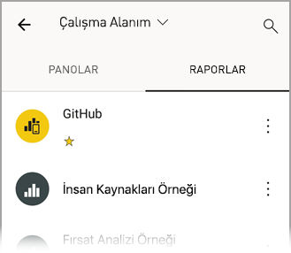
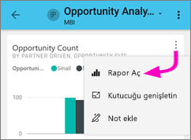
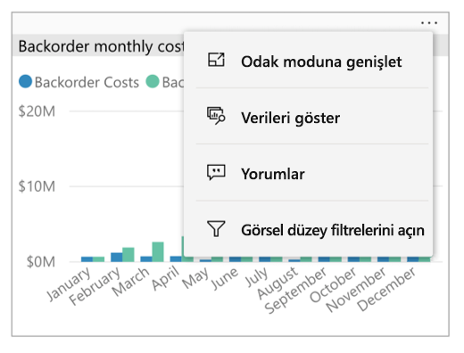
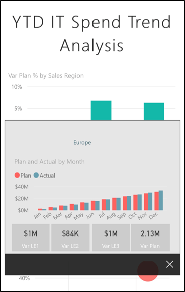
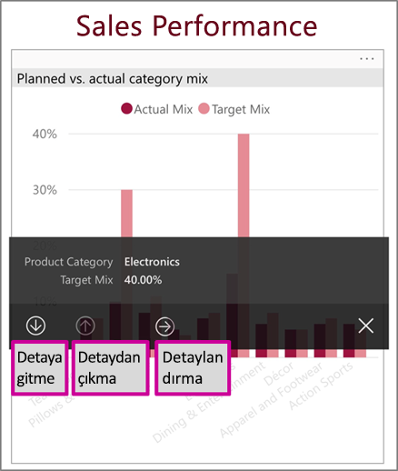
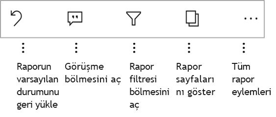
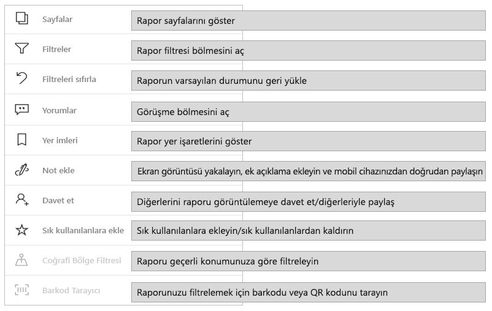
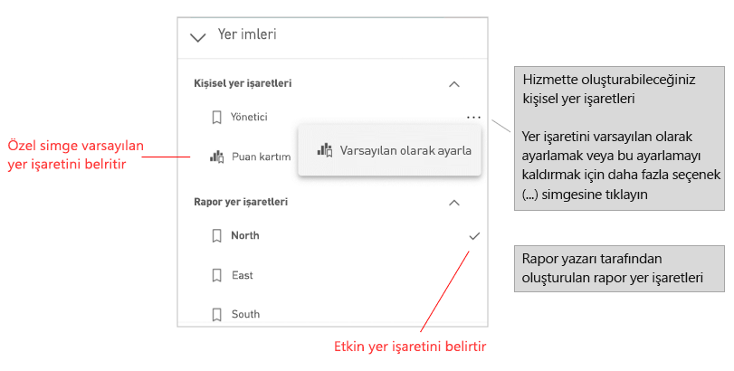
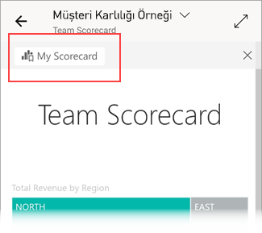

# Power BI mobil uygulamalarında raporları araştırma
Aşağıdakiler cihazlar için geçerlidir:

|  |  |  |  |  |
|:---: |:---: |:---: |:---: |:---: |
| iPhone'lar |iPad'ler |Android telefonlar |Android tabletler |Windows 10 cihazları |

Power BI raporu, verilerinizin etkileşimli bir görünümüdür ve verilerinize dayalı farklı bulguları ve öngörüleri temsil eden görseller içerir. Power BI mobil uygulamalarında raporları görüntülemek, üç adımlı bir işlemin üçüncü adımıdır:

1. [Power BI Desktop'ta rapor oluşturun](../../desktop-report-view.md). Power BI Desktop'ta [bir raporu telefonlar için en iyi duruma getirebilirsiniz](mobile-apps-view-phone-report.md).
2. Oluşturduğunuz raporları Power BI hizmetinde [(https://powerbi.com)](https://powerbi.com) veya [Power BI Rapor Sunucusu](../../report-server/get-started.md)'nda yayımlayın.  
3. Power BI mobil uygulamalarını kullanarak raporlarla etkileşim kurun.

## Bir Power BI raporunu mobil uygulamada açma
Power BI raporlarını aldığınız yere bağlı olarak bu raporlar mobil uygulamanın farklı konumlarında depolanır. Raporlar; Uygulamalar, Benimle Paylaşılan veya Çalışma Alanı (Çalışma Alanım dahil) bölümlerinde ya da bir rapor sunucusunda olabilir. Raporlar bazı durumlarda listelenir, bazı durumlarda da bir raporu almak için ilişkili panoya göz atmanız gerekebilir.

Listeler ve menülerde rapor adının yanında, öğenin rapor olduğunu anlamanıza yardımcı olan bir simge bulursunuz:

Power BI mobil uygulamalarında raporlar için iki simge vardır:

*  raporun uygulamada yatay yönlendirmede görüntüleneceğini belirtir. Tarayıcıda göründüğü gibi görünecektir.

*  en az bir sayfası telefon için iyileştirilmiş olan raporun dikey yönlendirmede görüntüleneceğini belirtir.

> [!NOTE]
> Rapor sayfası telefon düzeninde olsa bile telefonunuzu yatay tuttuğunuzda her zaman yatay düzen elde edersiniz.

Panodan rapor almak için kutucuğun sağ üst köşesindeki **Diğer seçenekler**’e (...) ve sonra **Raporu aç**’a dokunun:
  
  
  
  Tüm kutucuklar rapor olarak açılamaz. Örneğin Soru-Cevap kutusunda soru sorduğunuzda oluşturulan kutucuklara dokunduğunuzda rapor açılmaz.
  
## Raporlarla etkileşimli çalışma
Uygulamada bir rapor açtıktan sonra raporla çalışmaya başlayabilirsiniz. Raporunuzla ve içindeki verilerle yapabileceğiniz birçok şey vardır. Rapor alt bilgisinde, rapor üzerinde gerçekleştirebileceğiniz eylemleri bulabilirsiniz. Raporda gösterilen verilere dokunarak ve uzun dokunarak, verileri dilimleyip analiz de edebilirsiniz.

### Dokunmayı ve uzun dokunmayı kullanma
Dokunma hareketi fare tıklamasıyla aynı işlevi görür. Dolayısıyla bir veri noktası temelinde raporu çapraz vurgulamak istiyorsanız söz konusu veri noktasına dokunun.
Dilimleyici değerine dokunduğunuzda değer seçilir ve raporun kalan bölümü bu değere göre dilimlenir.
Bağlantıya, düğmeye veya yer işaretine dokunduğunuzda rapor yazarı tarafından tanımlanan eylem gerçekleşir.

Görsele dokunduğunuzda bir kenarlık gösterildiğini fark etmişsinizdir. Kenarlığın sağ üst köşesinde **Diğer seçenekler** (...) düğmesini görürsünüz. Üç noktaya dokunursanız bu görsel üzerinde gerçekleştirebileceğiniz eylemleri içeren bir menü görürsünüz:

### Araç ipucu ve detaylandırma eylemleri

Veri noktasına uzun dokunduğunuzda (dokunup beklediğinizde) bu veri noktasının temsil ettiği değerleri gösteren bir araç ipucu görüntülenir:

Rapor yazarı rapor sayfası ipucunu yapılandırdıysa, varsayılan araç ipucu yerine rapor sayfası araç ipucu gösterilir:

> [!NOTE]
> Rapor araç ipuçları en az 640 piksele 320 piksel görünüm penceresi olan cihazlarda desteklenir. Cihazınız daha küçükse uygulama varsayılan araç ipuçlarını gösterir.

Rapor yazarları veriler içinde hiyerarşiler ve rapor sayfaları arasında ilişkiler tanımlayabilir. Hiyerarşiler, bir görsel veya değerden başka bir rapor sayfasında detaya gitmenize ve detaylandırmanıza olanak tanır. Bu nedenle bir değere uzun dokunduğunuzda alt bilgide araç ipucuna ek olarak ilgili detaylandırma seçenekleri de gösterilir:

Görselin belirli bir bölümüne dokunup sonra da *detaylandırma* seçeneğine dokunduğunuzda Power BI sizi raporun dokunduğunuz değere göre filtrelenmiş farklı bir sayfasına götürür. Raporun yazarı, her biri sizi farklı sayfaya götüren bir veya daha fazla detaylandırma seçeneği tanımlayabilir. Bu durumda, hangi seçenekle detaylandırmak istediğinizi seçebilirsiniz. Geri düğmesini kullanarak bir önceki sayfaya dönebilirsiniz.

Daha fazla bilgi için [Power BI Desktop’ta detaylandırma ekleme](../../desktop-drillthrough.md) konusunu okuyun.
   
   > [!IMPORTANT]
   > Power BI mobil uygulamalarında matris ve tablo görsellerinin detaylandırma eylemleri sütun veya satır üst bilgileri aracılığıyla değil yalnızca hücre değerleri aracılığıyla etkinleştirilir.
   
   
   
### Rapor alt bilgisindeki eylemleri kullanma
Rapor alt bilgisinden, geçerli rapor sayfasında veya raporun tamamında çeşitli eylemler gerçekleştirebilirsiniz. Alt bilgi en yaygın kullanılan eylemlere hızlı erişim sağlar. Diğer eylemlere ise **Diğer seçenekler** (...) düğmesine dokunarak erişebilirsiniz:

Alt bilgiden şu eylemleri gerçekleştirebilirsiniz:
* Rapor filtresini sıfırlama ve seçimlerin çapraz vurgulamasını özgün durumuna döndürme.
* Raporda açıklamaları görüntülemek ve açıklama eklemek için konuşma bölmesini açma.
* Rapora şu anda uygulanmış durumda olan filtreyi görüntülemek veya değiştirmek için filtre bölmesini açma.
* Rapordaki tüm sayfaları listeleme. Sayfa adına dokunulduğunda o sayfa yüklenir ve gösterilir.
Ekranınızın kenarından ortaya doğru çekerek rapor sayfaları arasında geçiş yapabilirsiniz.
* Tüm rapor eylemlerini görüntüleme.

#### Tüm rapor eylemleri
Rapor alt bilgisinde **Diğer seçenekler** (...) düğmesine dokunduğunuzda rapor üzerinde gerçekleştirebileceğiniz tüm eylemleri görürsünüz:

Bazı eylemler belirli rapor özelliklerine bağımlı olduğundan devre dışı bırakılabilir.
Örnek:

**Yer İşaretleri**'nin var olması için raporda [yer işaretlerinin](mobile-reports-in-the-mobile-apps.md#bookmarks) ayarlanmış olması gerekir. Hem Power BI hizmetinde tanımlayabileceğiniz kişisel yer işaretleri hem de rapor oluşturucusu tarafından tanımlanan yer işaretleri gösterilir. Yer işaretlerinden biri varsayılan yer işareti olarak tanımlandıysa, rapor yüklendiğinde söz konusu görünümde açılır.

Kuruluşunuzda Power BI mobil uygulamasından paylaşımı yasaklayan bir [Intune koruma ilkesi](https://docs.microsoft.com/intune/app-protection-policies) varsa **Not ekle ve paylaş** seçeneği kapalı olabilir.

**Davet et** seçeneğinin etkinleştirilmesi için raporu başkalarıyla paylaşma izninizin olması gerekir. İzninizin olması için de raporun sahibi olmalısınız veya raporun sahibi size yeniden paylaşım izni vermiş olmalıdır.

Rapor yazarı raporu coğrafi verilere göre kategorilere ayrılmışsa **Geçerli konuma göre filtrele** seçeneği etkinleştirilir. Daha fazla bilgi için [rapordaki coğrafi verileri tanımlama](https://docs.microsoft.com/power-bi/desktop-mobile-geofiltering) konusunu okuyun.

**Raporu barkoda göre filtrelemek için tara** seçeneğinin etkinleştirilmesi için raporunuzdaki veri kümesinin **Barkod** olarak etiketlenmiş olması gerekir. Daha fazla bilgi için [Power BI Desktop'ta barkodları etiketleme](https://docs.microsoft.com/power-bi/desktop-mobile-barcodes) konusunu okuyun.

### Yer imleri

Power BI mobil uygulaması hem rapor oluşturucusunun tanımladığı rapor yer işaretlerini hem de Power BI hizmetinde tanımlayabileceğiniz kişisel yer işaretlerini destekler. Yer işaretleri menüsünü [rapor eylemleri araç çubuğunda](mobile-reports-in-the-mobile-apps.md#all-report-actions) **Diğer seçenekler**'in (...) altında bulabilirsiniz.

Raporun yer işareti görünümü açık durumdayken, yer işaretinin adı raporun en üstünde gösterilir.

[Power BI hizmetinde yer işaretleri hakkında daha fazla bilgi edinin](https://docs.microsoft.com/power-bi/consumer/end-user-bookmarks).

## Sonraki adımlar
* [Telefonunuz için en iyi duruma getirilmiş Power BI raporlarını görüntüleme ve raporlarla etkileşim kurma](mobile-apps-view-phone-report.md)
* [Telefonlar için en iyi duruma getirilmiş bir rapor sürümü oluşturma](../../desktop-create-phone-report.md)
* Sorularınız mı var? [Power BI Topluluğu'na sorun](https://community.powerbi.com/)

