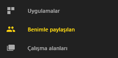

# Power BI mobil uygulamalarından pano veya rapor paylaşma
Aşağıdakiler cihazlar için geçerlidir:

|  |  |  |  |  |
|:--- |:--- |:--- |:--- |:--- |
| iPhone'lar |iPad'ler |Android telefonlar |Android tabletler |Windows 10 cihazları |

[Power BI Pro lisansı](../../service-features-license-type.md) ile Power BI mobil uygulamalarından bağlantı paylaşarak başkalarını panolarınızı ve raporlarınızı görüntülemeye davet edebilirsiniz. Kuruluşunuzun içindeki veya dışındaki, kurumsal posta hesabına sahip olan ya da olmayan herhangi biriyle paylaşabilirsiniz. Power BI Pro lisansı olmasına sahip olmaları veya içeriğin [Premium kapasitede](../../service-premium-what-is.md) olması gerekmez.

iOS ve Android cihazlarda Power BI mobil uygulamalarından [kutucuklara, raporlara veya görselleştirmelere not ekleyip anlık görüntülerini](mobile-annotate-and-share-a-tile-from-the-mobile-apps.md) istediğiniz kişiyle paylaşabilirsiniz. 

## iPhone cihazınızdan paylaşımda bulunma
1. Panonun veya raporun alt tarafındaki eylemler çubuğunda **Paylaş** simgesine  dokunun.
   
   
2. Virgülle ayırarak adları yazın ve davetinizle birlikte gönderilecek iletinizi girin.
3. Yeniden paylaşıma izin vermek için **Alıcıların yeniden paylaşmasına izin ver**'i seçili durumda bırakın.
   
   Yeniden paylaşma işlevi, iş arkadaşlarınızın davet e-postasını kuruluşunuzdaki diğer kullanıcılarla web veya mobil uygulamalar üzerinden paylaşmasını sağlar.
5. Sağ üst köşede bulunan **Gönder**'e dokunun.
   
   Alıcılara panonun veya raporun doğrudan bağlantısını içeren bir davet e-postası gönderilir. Davetin süresi bir ay sonra dolar. Davet tarayıcıda veya Power BI mobil uygulamasında açıldığında ilgili kişinin Power BI hesabının **Benimle paylaşılan** bölümüne eklenir.
   
   
   
   [İş arkadaşlarınızla paylaşımda bulunma hakkında notlar](../../service-share-dashboards.md) sayfasını inceleyin.

### iPhone cihazınızdan bir paylaşımı kaldırma
Bir paylaşımı kaldırabilmek için bu paylaşımın sahibi olmanız gerekir.

1. Panonun veya raporun alt tarafındaki eylemler çubuğunda **Paylaş** simgesine  dokunun.
2. **İş arkadaşınızı davet edin**'e dokunun.
   
   Bu panoyu veya raporu paylaştığınız iş arkadaşlarınızın listesini ve şu ifadeleri görürsünüz:
   
   * **Görüntüleyebilir**: Bu kişiler paylaşımı görüntüleyebilir ancak paylaşamaz.
   * **Görüntüleyebilir ve Davet Edebilir**: Bu kişiler paylaşımı görüntüleyebilir ve diğer iş arkadaşlarıyla paylaşabilir.
1. **Düzenle**'ye dokunun.
   
    
4. Paylaşımı kaldırmak için herhangi bir adın yanında bulunan kırmızı daireye dokunup **Sil**'i seçin.

## iPad cihazınızdan paylaşımda bulunma
1. Panonuzun veya raporunuzun sağ üst köşesindeki **Paylaş** simgesine  dokunun.
2. E-posta adreslerini ve davetinizle birlikte gönderilecek iletinizi yazın.
3. Yeniden paylaşıma izin vermek için **Alıcıların yeniden paylaşmasına izin ver**'i seçili durumda bırakın.
   
   Yeniden paylaşma işlevi, iş arkadaşlarınızın davet e-postasını kuruluşunuzdaki diğer kullanıcılarla web veya mobil uygulamalar üzerinden paylaşmasını sağlar. 

4. Sağ üst köşede bulunan **Gönder**'e dokunun.
   
   Alıcılara panonun veya raporun doğrudan bağlantısını içeren bir davet e-postası gönderilir. Davetin süresi bir ay sonra dolar. Davet tarayıcıda veya Power BI mobil uygulamasında açıldığında, ilgili kişinin Power BI hesabının **Benimle paylaşılan** bölümüne eklenir.
   
   
   
   [İş arkadaşlarınızla paylaşımda bulunma hakkında notlar](../../service-share-dashboards.md) sayfasını inceleyin.

### iPad cihazınızdan bir paylaşımı kaldırma
Bir paylaşımı kaldırabilmek için bu paylaşımın sahibi olmanız gerekir.

1. Panonuzun veya raporunuzun sağ üst köşesindeki **Paylaş** simgesine  dokunun.
   
   Bu panoyu veya raporu paylaştığınız iş arkadaşlarınızın listesini ve şu ifadeleri görürsünüz:
   
   * **Görüntüleyebilir**: Bu kişiler paylaşımı görüntüleyebilir ancak paylaşamaz.
   * **Görüntüleyebilir ve Davet Edebilir**: Bu kişiler paylaşımı görüntüleyebilir ve diğer iş arkadaşlarıyla paylaşabilir.
2. **Düzenle**'ye dokunun.
3. Paylaşımı kaldırmak için herhangi bir adın yanında bulunan kırmızı daireye dokunup **Sil**'i seçin.

## Android cihazınızdan paylaşımda bulunma
1. Panoların veya raporların giriş sayfasında üç nokta (...) simgesine ve **İş arkadaşınızı davet edin**'e dokunun.
   
   
2. Dilerseniz bir panonun veya raporun içinde Davet et simgesine dokunun geçin.

    Panonun sahibi sizseniz bu panoyu veya raporu paylaştığınız iş arkadaşlarınızın listesini ve şu notları görürsünüz:

    -   **Görüntüleyebilir**: Bu kişiler paylaşımı görüntüleyebilir ancak paylaşamaz.
    -   **Görüntüleyebilir ve yeniden paylaşabilir**: Bu kişiler paylaşımı görüntüleyebilir ve diğer iş arkadaşlarıyla paylaşabilir.

1. E-posta adreslerini ve pano davetinizle birlikte gönderilecek iletinizi yazın. İleti yazmazsanız Power BI varsayılan metni gönderir.
2. Yeniden paylaşıma izin vermek için **Alıcıların bu panoyu paylaşmasına izin verin**'i seçili durumda bırakın.
   
   Yeniden paylaşma işlevi, iş arkadaşlarınızın davet e-postasını kuruluşunuzdaki diğer kullanıcılarla tarayıcı veya mobil uygulamalar üzerinden paylaşmasını sağlar.
   
1. Postayı göndermek için sağ üst köşedeki **Gönder** simgesine  dokunun.
   
   Alıcılara panonun doğrudan bağlantısını içeren bir davet e-postası gönderilir. Davetin süresi bir ay sonra dolar. Davet tarayıcıda veya Power BI mobil uygulamasında açıldığında, ilgili kişinin Power BI hesabının **Benimle paylaşılan** bölümüne eklenir.
   
   
   
   [İş arkadaşlarınızla pano paylaşma hakkında notlar](../../service-share-dashboards.md) sayfasını inceleyin.

### Android cihazınızdan bir paylaşımı kaldırma
Bir paylaşımı kaldırabilmek için bu paylaşımın sahibi olmanız gerekir.

1. Panonuzun veya raporunuzun sağ üst köşesinde bulunan davet et simgesine geçin. 
   
   Bu panoyu veya raporu paylaştığınız iş arkadaşlarınızın listesini görürsünüz.
2. İş arkadaşınızla paylaştığınız bir panonun veya raporun paylaşımını kaldırmak için herhangi bir adın yanında bulunan **X** işaretine dokunup \> **Kaldır**'ı seçin.

## Windows 10 cihazınızdan paylaşımda bulunma
1. Bir panonun veya raporun içinde Davet et simgesine geçin.
   
   Alternatif olarak, panoların veya raporların giriş sayfasında sağ tıklayıp ya da basılı tutup **Davet et**’e dokunun.
   
   
   
   Panonun sahibi sizseniz, bu panoyu paylaştığınız iş arkadaşlarınızın listesini ve şu notları göreceksiniz:
   
   **Görüntüleyebilir**: Bu kişiler paylaşımı görüntüleyebilir ancak paylaşamaz.
   
   **Görüntüleyebilir ve yeniden paylaşabilir**: Bu kişiler paylaşımı görüntüleyebilir ve diğer iş arkadaşlarıyla paylaşabilir.
2. E-posta adreslerini ve davetinizle birlikte gönderilecek iletinizi yazın. İleti yazmazsanız Power BI varsayılan metni gönderir.
   
   
3. Yeniden paylaşıma izin vermek için **Alıcıların yeniden paylaşmasına izin ver**'i seçili durumda bırakın.
   
   Yeniden paylaşma işlevi, iş arkadaşlarınızın bu paylaşımı kuruluşunuzdaki diğer kullanıcılarla tarayıcı veya mobil uygulamalar üzerinden paylaşmasını sağlar.
   
1. **Gönder** simgesine  dokunun.
   
   Alıcılara panonun veya raporun doğrudan bağlantısını içeren bir davet e-postası gönderilir. Davetin süresi bir ay sonra dolar. Davet tarayıcıda veya Power BI mobil uygulamasında açıldığında, ilgili kişinin Power BI hesabının **Benimle paylaşılan** bölümüne eklenir.
   
   
   
   [İş arkadaşlarınızla paylaşımda bulunma hakkında notlar](../../service-share-dashboards.md) sayfasını inceleyin.

## Sonraki adımlar
* [Mobil uygulamalarda kutucuklara, raporlara veya görsellere not ekleme ve bunların anlık görüntülerini paylaşma](mobile-annotate-and-share-a-tile-from-the-mobile-apps.md)
* [Power BI’da pano veya rapor paylaşma](../../service-share-dashboards.md)
* Sorularınız mı var? [Power BI Topluluğu'na sorun](http://community.powerbi.com/)

