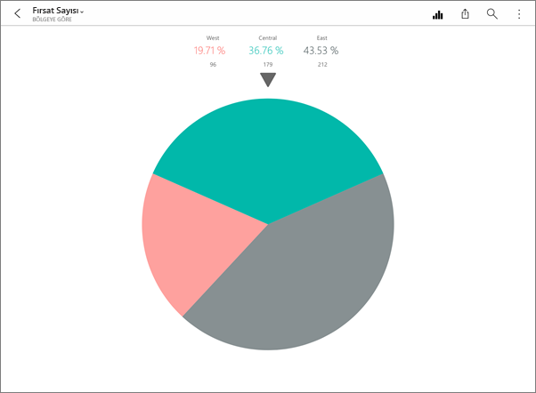
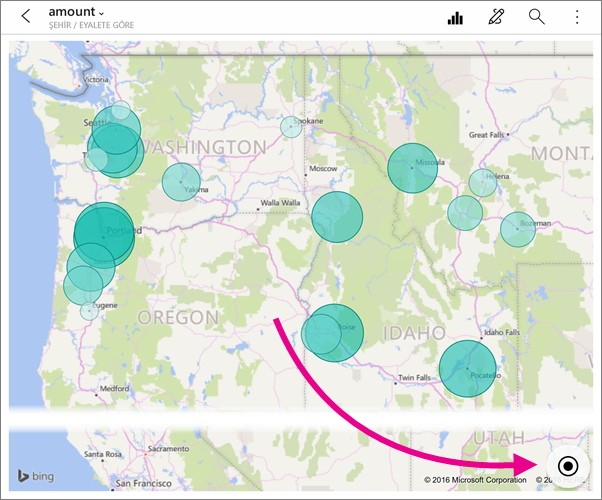
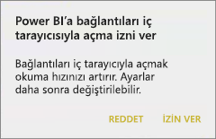
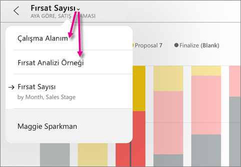
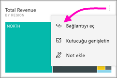
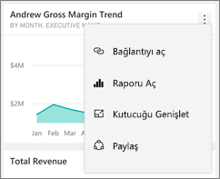
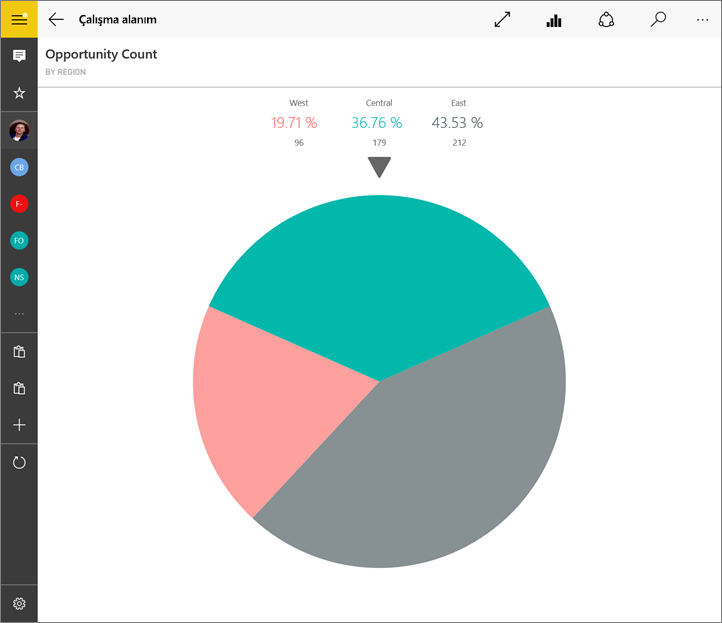
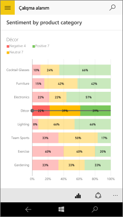
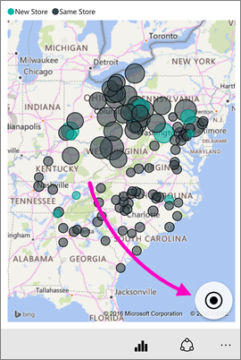

# Power BI mobil uygulamalarındaki kutucukları keşfetme
Aşağıdakiler cihazlar için geçerlidir:

|  |  |  |  |  |
|:--- |:--- |:--- |:--- |:--- |
| iPhone'lar |iPad'ler |Android telefonlar |Android tabletler |Windows 10 cihazları |

Kutucuklar verilerinize ilişkin, panoya sabitlenmiş canlı ve anlık veri görüntüleridir. Veriler değiştikçe değerler de değişir. **[Kutucuklar Power BI hizmetindeki panolara eklenir](../end-user-tiles.md).** 

Ardından Power BI mobil uygulamalarında bu kutucukları odak modunda açarak onlarla etkileşime geçersiniz. Bing ve R tabanlı kutucuklar dahil olmak üzere her türden görsel öğe içeren kutucukları açabilirsiniz.

## iOS uygulamalarında kutucuklar

1. [iOS mobil uygulamasında bir pano](mobile-apps-view-dashboard.md) açın.
2. Kutucuklardan birine dokunun. Kutucuk verilerini daha kolay görüntülemenizi ve araştırmanızı sağlayan odak modu açılır. Odak modunda şunları yapabilirsiniz:
   
   Çizgi, çubuk veya sütun türündeki grafiklerde görselleştirmenin belirli bölümlerine dokunarak ilgili değerleri görüntüleyebilirsiniz.
   
    
   
   *Örneğin bu çizgi grafikte **This Year Sales** ve **Last Year Sales** için **August** dönemindeki değerler seçilmiştir.*  
   
   Pasta grafiğinde pasta dilimlerinden birine dokunarak dilimin değerinin pastanın en üstünde gösterilmesini sağlayabilirsiniz.  
   
   
3. Haritada **Haritayı Ortala** simgesine  dokunarak haritanın geçerli konumunuza göre ortalanmasını sağlayabilirsiniz.

   

4. [Kutucuğa not eklemek](mobile-annotate-and-share-a-tile-from-the-mobile-apps.md#annotate-and-share-the-tile-report-or-visual) için kalem simgesine  ve ardından [bunu başkalarıyla paylaşmak](mobile-annotate-and-share-a-tile-from-the-mobile-apps.md#annotate-and-share-the-tile-report-or-visual) için paylaş simgesine  dokunun.

5. [Kutucuklara uyarı ekleyebilirsiniz](mobile-set-data-alerts-in-the-mobile-apps.md). Değerler hedeflerin üzerine çıktığında veya altına düştüğünde Power BI sizi bilgilendirir.

6. Bazen panoyu oluşturan kişi kutucuğa bağlantı ekleyebilir. Öyleyse odak modundayken  bir bağlantı simgesi vardır:
   
    
   
    Bağlantılar diğer Power BI panolarına veya dış URL'lere yönlendirebilir. [Bağlantıya dokunarak](../../create-reports/service-dashboard-edit-tile.md#hyperlink) Power BI uygulamasının içinde açabilirsiniz. Bağlantı dış siteyse Power BI bağlantıya izin vermenizi ister.
   
    
   
    Bağlantıyı Power BI uygulamasında açıktan sonra kopyalayıp bir tarayıcı penceresinde de açabilirsiniz.
7. Kutucuğun temel aldığı [raporu açın](mobile-reports-in-the-mobile-apps.md) .
8. Odak modundan çıkmak için kutucuğun adına dokunduktan sonra panonun adına veya **Çalışma Alanım**'a dokunabilirsiniz.
   
    

## Android telefon ve tabletlerdeki mobil uygulamada bulunan kutucuklar
1. [Power BI mobil uygulamasında bir panoyu](mobile-apps-view-dashboard.md) açın.
2. Kutucuk verilerini daha kolay görüntülemenizi ve araştırmanızı sağlayan odak modunu açmak için bir kutucuğa dokunun.
   
   
   
    Odak modunda şunları yapabilirsiniz:
   
   * Görselleştirmenin belirli bir noktasındaki değerleri görüntülemek üzere çizgi, çubuk, sütun veya kabarcık türündeki bir grafikte bulunan çubuğu hareket ettirmek için grafiğe dokunabilirsiniz.  
   * [Kutucuğa not eklemek](mobile-annotate-and-share-a-tile-from-the-mobile-apps.md#annotate-and-share-the-tile-report-or-visual) için Kalem simgesine  ve ardından bunu başkalarıyla [paylaşmak](mobile-annotate-and-share-a-tile-from-the-mobile-apps.md#annotate-and-share-the-tile-report-or-visual) için Anlık görüntüyü paylaş simgesine  dokunun.
   * Raporu aç simgesine  dokunarak mobil uygulamada [raporu görüntüleyebilirsiniz](mobile-reports-in-the-mobile-apps.md).
3. Bazen panoyu oluşturan kişi kutucuğa bağlantı ekleyebilir. Bu durumda dikey üç nokta simgesine ( **...** ) dokunduğunuzda **Bağlantıyı aç**  seçeneğini görürsünüz:
   
    
   
    Bağlantılar diğer Power BI panolarına veya dış URL'lere yönlendirebilir. [Bağlantıya dokunarak](../../create-reports/service-dashboard-edit-tile.md#hyperlink) Power BI uygulamasının içinde açabilirsiniz. Bağlantı dış siteyse Power BI bağlantıya izin vermenizi ister.
   
    
   
    Bağlantıyı Power BI uygulamasında açıktan sonra kopyalayıp bir tarayıcı penceresinde de açabilirsiniz.
4. Kutucuğu kapatıp panoya dönmek için sol üst köşedeki oka dokunabilirsiniz.

## Windows 10 mobil uygulamasındaki kutucuklar

>[!NOTE]
>**Windows 10 Mobile kullanan telefonlar** için Power BI mobil uygulama desteği, 16 Mart 2021’de sona erecektir. [Daha fazla bilgi](/legal/powerbi/powerbi-mobile/power-bi-mobile-app-end-of-support-for-windows-phones)

1. Windows 10 için [Power BI mobil uygulamasında bir pano açın](mobile-apps-view-dashboard.md).
2. Kutucuk üzerindeki dikey üç nokta simgesine dokunun. Buradan şunları yapabilirsiniz: 
   
    
   
    [Kutucuğun anlık görüntüsünü paylaşabilirsiniz](mobile-windows-10-phone-app-get-started.md).
   
    [Temeldeki raporu görüntülemek için](mobile-reports-in-the-mobile-apps.md) **Raporu Aç**’a  dokunun.
   
    Mevcut olması halinde [bağlantıyı açabilirsiniz](../../create-reports/service-dashboard-edit-tile.md#hyperlink). Bağlantılar Power BI panolarına veya dış URL'lere yönlendirebilir.
3. **Kutucuğu Genişlet**’e  dokunun. Kutucuk verilerini daha kolay görüntülemenizi ve araştırmanızı sağlayan odak modu açılır. Bu modda şunları yapabilirsiniz:
   
   Bir pasta grafiğini döndürerek dilimin değerinin pastanın en üstünde gösterilmesini sağlayabilirsiniz.  
   
   
   
   Görselleştirmenin belirli bir noktasındaki değerleri görüntülemek üzere çizgi, çubuk, sütun veya kabarcık türündeki bir grafikte bulunan çubuğu hareket ettirmek için grafiğe dokunabilirsiniz.  
   
   
   
   *Bu çubuk grafikte **Decor** çubuğunun değerleri grafiğin en üstünde gösterilmektedir.*
   
   **Tam ekran** simgesine  dokunarak kutucuğu, gezinti ve menü çubuklarının görünmediği tam ekran modunda açabilirsiniz.
   
   > [!NOTE]
   > Ayrıca Windows 10 için Power BI mobil uygulamasında [panoları ve raporları tam ekran modunda görüntüleyebilirsiniz](mobile-windows-10-app-presentation-mode.md).
   > 
   > 
   
   Haritada **Haritayı Ortala** simgesine  dokunarak haritanın geçerli konumunuza göre ortalanmasını sağlayabilirsiniz.
   
   
   
   Anlık Görüntü Paylaş simgesine  dokunarak [bir kutucuğu başkalarıyla paylaşabilirsiniz](mobile-windows-10-phone-app-get-started.md).   
   
   Raporu Aç simgesine  dokunarak kutucuğun bağlı olduğu [raporu görüntüleyebilirsiniz](mobile-reports-in-the-mobile-apps.md). 
4. Kutucuğu kapatıp panoya dönmek için geri okuna veya geri düğmesine dokunabilirsiniz.

## Sonraki adımlar
* [Power BI nedir?](../../fundamentals/power-bi-overview.md)
* Sorularınız mı var? [Power BI Topluluğu'na sorun](https://community.powerbi.com/)