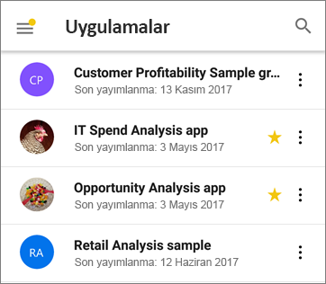
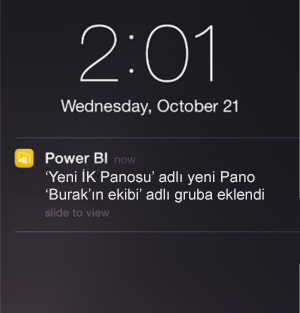

# Power BI mobil uygulamalarındaki yenilikler
İlgili "Yenilikler" bilgileri için aşağıdaki sayfalara bakın:

* [Mobil uygulamalar için Power BI ekip blogu](https://powerbi.microsoft.com/blog/tag/mobile/)
* [Power BI Desktop'taki yenilikler](../../desktop-latest-update.md)  
* [Power BI hizmetindeki yenilikler](../../service-whats-new.md)  

## Kasım 2018

### Modern görsel üst bilgi 

Yeni ‘modern görsel üst bilginin’ kullanıldığı raporlarda artık üst bilgiler için yer ayrılmaz ve bu sayede daha az boş alan bırakılarak görselleştirmelerinize daha fazla yer kalır.

### Gelişmiş sunu modu (Windows)

Surface Hub ve Windows 10 cihazları için gelişmiş sunu modu.  Geliştirilmiş sunu ve işbirliği araçlarıyla, ayrıca verilerinize odaklanabilmenizi sağlayan kenarlıksız, geniş ekran için iyileştirilmiş görünümle gelişmiş Surface Hub toplantı odası deneyiminden yararlanın. Sunu modu, verilerinizi etkili bir şekilde sunmak ve bunlar üzerinde tartışmak için mürekkep gibi araçlar da sağlar. [Burada](https://powerbi.microsoft.com/en-us/blog/presentation-mode-in-power-bi-windows-app/) sunu modu hakkında daha fazla bilgi bulabilirsiniz.

### Tabletlerde dikey rapor düzeni (iOS ve Android)

Tablette dikey mod yönlendirmesinde rapor görüntülemek için artık mevcut olduğunda telefon raporu düzenini kullanıyoruz. [Power BI Hizmetinde veya Power BI Desktop'ta telefon düzeni oluşturma](https://docs.microsoft.com/en-us/power-bi/desktop-create-phone-report/) hakkındaki diğer yazıları okuyun.

### Rapor sorgu dizesi desteği 

Sorgu dizesini içeren rapor bağlantısı açıldığında artık mobil uygulamada açılıyor ve sorgu dizesinde tanımlanan koşullar temelinde önceden filtreleniyor. [Sorgu dizesiyle rapor url'si oluşturma](https://docs.microsoft.com/en-us/power-bi/service-url-filters/) hakkında daha fazla bilgi edinin.  

### Paylaşılan kimlik bilgileri (artık Android'de)

Mobil uygulamanızdan Power BI'da oturum açmak hiç bu kadar kolay olmamıştı. Paylaşılan kimlik bilgileriyle, Power BI hizmetinde kimliğinizi doğrulamak için cihaz üzerinde diğer Office 365 uygulaması kimlik bilgilerini kullanarak oturum açma işlemini basitleştirdik.

### Uygulama içi URL'ler (artık Android'de) 

Diğer Power BI yapıtlarını işaret eden raporlardaki bağlantılar artık doğrudan uygulamanın içinde açılmaktadır. Bu özellik sayesinde, bir raporu panoya bağlama gibi özel gezinti akışları oluşturabilirsiniz.

### Verileri gösterme ve değerleri kopyalama

Rapor görsel eylem menüsünde (...) şimdi temel alınan verileri tablo biçiminde gösteren bir seçenek sağlanıyor. Tabloya girdikten sonra, o tablodaki verileri uzun süre dokunarak seçebilir ve kopyalayabilirsiniz (kopyalamayı kısıtlayan bir Intune ilkesinin olmadığı varsayımıyla).

## Ekim 2018

### Sayfalandırılmış rapor önizlemesi (tüm cihazlar)

Sayfalandırılmış raporlar artık Power BI hizmetinde kullanılabilir. Power BI Hizmetinde sayfalandırılmış raporlara erişimi olan kullanıcılar, bu raporları mobil uygulamalarından da erişebilir. 

[Mobilde sayfalandırılmış raporlar hakkındaki Power BI blog gönderisini](https://powerbi.microsoft.com/en-us/blog/power-bi-paginated-reports-also-available-in-power-bi-mobile-apps-preview/) okuyun.

### Paylaşılan kimlik bilgileri (iOS)

Mobil uygulamanızdan Power BI'da oturum açmak hiç bu kadar kolay olmamıştı. Paylaşılan kimlik bilgileriyle, Power BI hizmetinde kimliğinizi doğrulamak için cihaz üzerinde diğer Office 365 uygulaması kimlik bilgilerini kullanarak oturum açma işlemini basitleştirdik.

### Uygulama içi URL'ler (iOS) 

Diğer Power BI yapıtlarını işaret eden raporlardaki bağlantılar artık doğrudan uygulamanın içinde açılmaktadır. Bu özellik sayesinde, bir raporu panoya bağlama gibi özel gezinti akışları oluşturabilirsiniz.

### iOS12 ve watchOS 5 desteği 

iOS için Power BI uygulamasını, mobil cihazlarda ve saatte yeni işletim sistemiyle sorunsuz çalışacak şekilde güncelleştirdik.

## Eylül 2018

### Tarayıcıda telefon raporu düzenleme (tüm cihazlar)

Artık yalnızca Power BI Desktop'ta değil Power BI hizmetinde daha önce yayımlanmış bir raporun düzenini oluşturabilirsiniz. Bunu tarayıcınızda Düzenleme modunda oluşturursunuz.

### Pano yorumları (iOS ve Android) 

Verilerinizi tartışmak için panolara ve belirli kutucuklara doğrudan yorum ekleyebilirsiniz; panoları görenler yorumlarınızı da görür. Ayrıca kuruluşunuzdaki başkalarını da bu kişilere @mentioning (değinme) yoluyla söyleşiye çekebilirsiniz. @mentioned (değindiğiniz) kişiler mobil telefonlarına iletiniz ile birlikte bir anında iletme bildirimi de alır.

Şu anda iOS ve Android cihazlarda bulunmaktadır. Windows desteği yakında gelecektir.

Power BI [pano yorumlarıyla ilgili blog yazısını](https://powerbi.microsoft.com/blog/announcing-dashboard-comments-in-power-bi/) okuyun.

### Çoklu Oturum Açma (Windows)

Çoklu Oturum Açma (SSO), Windows için Power BI Mobil'de en çok istenen özelliklerinden biridir. Artık birincil kuruluş hesabınızı yalnızca etki alanına katılmış Windows mobil cihazlarınızda değil sorunsuz bir şekilde Power BI hizmetinde de oturma açmak için kullanabilirsiniz. [SSO ve Windows mobil uygulamaları](mobile-windows-10-app-single-sign-on-sso.md) hakkında daha fazla bilgi edinin.

## Önceki aylar

### Temmuz 2018

#### Yalnızca iOS ve Android

**Paylaşılan filtreler**

Artık paylaşılan filtreler ve dilimleyicilerle rapor alabilirsiniz.

**Arka plan resmi desteği**

Mobil cihazınızda yatay modda bir rapor görüntülediğinizde, web üzerinde Power BI'da gördüğünüz arka plan görüntülerinin aynılarını görürsünüz.

### Haziran 2018

#### Tam tuval raporlar

Tek bakışta raporunuzun daha büyük bir kısmını görebilmeniz için, raporunuzun yüklenmesinin ardından kısa bir süre sonra üstteki ve alttaki eylem çubukları kaybolur.

#### Artırılmış telefon raporu tuval boyutu

Telefon raporu tuval boyutunu, öncekinden daha fazla görsele yer açmak için artırdık.

### Mayıs 2018

#### Mobil detaylandırma: tüm mobil uygulamalar

Rapor yazarı söz konusu eylemi tanımladıysa, seçilen bir veri noktasından, mobil uygulamalardaki başka bir rapor sayfasına detaylandırma yapabilirsiniz. 

#### Geri düğmesi: tüm mobil uygulamalar

Artık çekme hareketi yaparak, eylem çubuğunda bir rapor sayfası seçerek veya detaylandırma işlevini kullanarak gezindiğinizde geri düğmesi, baktığınız önceki sayfaya geri gitmenizi sağlar. 

#### Pano temaları: tüm mobil uygulamalar

Rapor yazarları, Power BI hizmetinde pano temalarını özelleştirdiğinde panonun görünümü mobil uygulamada da değişir. Ancak arka plan görüntülerini görmezsiniz.

#### iOS: Uzaktan bir rapora Power BI iOS mobil uygulama erişimini yapılandırma

BT yöneticiniz artık bir MDM aracı kullanarak rapor sunucusuna erişmek için Power BI iOS mobil uygulamasını yapılandırabilir. Ayrıntılı bilgi için bkz. [Uzaktan bir rapor sunucusuna Power BI iOS mobil uygulama erişimini yapılandırma](../../report-server/configure-powerbi-mobile-apps-remote.md).

#### Karma Gerçeklik için Power BI uygulaması (Önizleme)

Karma Gerçeklik için Power BI uygulaması artık Microsoft Mağazası’nda mevcut. Panolarınızı ve raporlarınızı, sanal dünyada sarmalanmış şekilde görüntüleyin ve ortamınız bağlamında belirli konumlarda bunları görüntüleyin. İçerik için yeni [Hololens’te Power BI Tanıtımı](https://www.youtube.com/watch?v=J_X_nOFUBss) videosuna bakın veya yeni [Karma Gerçeklik için Power BI uygulaması](mobile-mixed-reality-app.md) ile ilgili makaleyi okuyun.

### Nisan 2018

#### Mobil detaya gitme veya detaydan çıkma

Artık mobil cihazınızdaki rapor görsellerinde detaya gidebilir ve detaydan çıkabilirsiniz. Bu yeni özelliğe erişmek için bir rapor görselinde araç ipucu menüsünü basılı tutarak açın ve sonra detaylandırma düğmelerine dokunarak verilerinizi derinlemesine inceleyin. [Mobil uygulamalarda ayrıntı artırma ve azaltma](https://powerbi.microsoft.com/blog/drill-down-up-in-power-bi-mobile-apps/) hakkında daha fazla bilgi.

#### Kalıcı filtreler

Kısa süre önce rapor filtrelerini ve dilimleyicileri güncelleştirdiğimiz için web üzerinde Power BI'dan Power BI mobil uygulamasına otomatik olarak kaydedilmiştir. Bundan böyle, mobil uygulamada ayarladığınız filtreler ve dilimleyiciler web üzerinde Power BI’ya otomatik olarak kaydedilir.

### Mart 2018

#### Karma Gerçeklik için Power BI uygulaması (Önizleme)

Bulunduğunuz yere verileri getirme çalışmamızda son adım olarak, Karma Gerçeklik için Power BI uygulamasını oluşturduk. Panolarınızı ve raporlarınızı, sanal dünyada sarmalanmış şekilde görüntüleyin ve ortamınız bağlamında belirli konumlarda bunları görüntüleyin. Yeni [Karma Gerçeklik için Power BI uygulaması](mobile-mixed-reality-app.md) hakkında daha fazla bilgi edinin.

#### Raporları ve panoları harici olarak paylaşın

Panoları ve raporları, kuruluşunuzun dışındaki kullanıcılarla doğrudan uygulama üzerinden paylaşın. Hem kuruluş hesaplanır hem de sosyal hesaplar için harici paylaşım etkindir. 

#### Kalıcı filtreler

Web üzerinde Power BI’da filtreleri ve dilimleyicileri ayarladığınızda, kaldığınız yerden devam edebilmeniz için tüm filtre tercihleriniz mobil uygulamanıza da kaydedilir.

#### iPad’de raporları yenileme

Power BI raporları, artık iPad uygulamasında yenileme düğmesine sahip.

### Şubat 2018

#### Rapor paylaşma

Artık bir raporu doğrudan mobil uygulamalardan paylaşabilirsiniz. [Mobil uygulamalardan pano ve rapor paylaşma](mobile-share-dashboard-from-the-mobile-apps.md) hakkında daha fazla bilgi edinin

#### Gelişmiş araç ipuçları

Araç ipuçlarına erişmek için bir rapor görselinin üzerine dokunup basılı tuttuğunuzda artık yol boyunca her bir veri noktasıyla ilgili ayrıntıları keşfetmek için görsel boyunca parmağınızı sürükleyebilirsiniz.

### Ocak 2018

#### Rapor sık kullanılanları

Raporları sık kullanılanlara ekleyerek **Sık Kullanılanlar** sayfasında görünmesini sağlayın. [Power BI mobil uygulamalarındaki sık kullanılanlar](mobile-apps-favorites.md) hakkında daha fazla bilgi edinin.

#### Paylaşılan raporları görüntüleme

Bir kişi sizinle rapor paylaştığında, bu rapor **Benimle paylaşılan** sayfasındaki panolarla birlikte listelenir.

#### Geliştirilmiş köprü desteği

Artık özel görsellerdeki bağlantılara dokunarak bunları mobil tarayıcınızda açabilirsiniz.

#### Intune tümleştirmesi (Android)

Intune mobil cihaz yönetimini kullanarak koşullu erişim desteği.

### Aralık 2017

#### Güvenlik yönetimi iyileştirildi 

Kuruluşunuzun verilerini daha iyi korumak için Android cihazlarda koşullu erişim (CA) ve Microsoft Intune mobil aygıt yönetimi (MDM) için destek ekledik. Bu destek iOS’ta zaten mevcuttur.

#### Geliştirilmiş izin yönetimi

Veri kümeleri, panolar ve raporlar için kullanıcı izinlerine yönelik daha kapsamlı yönetime olanak sağlamak üzere bazı değişiklikler yaptık.

#### Otomatik olarak yüklenen uygulamalar

Power BI'daki bazı uygulamaları herhangi bir şekilde yüklemeniz gerekmez. Kuruluşunuzdaki uygulama oluşturucuları, bir dizi pano ve rapor içeren *uygulamalar* oluşturabilir. Ardından, uygulamayı yayımlayabilir ve Power BI hizmeti ile Power BI mobil uygulamalarında otomatik olarak yüklenecek şekilde ayarlayabilirler. Siz herhangi bir işlem yapmadan yüklenecek şekilde ayarlanan uygulamalar otomatik olarak **Uygulamalar** menünüzde görünür:

### Kasım 2017
#### iPhone X için en iyi duruma getirme

Uygulama düzenini iPhone X için en iyi duruma getirdik. Böylece, verilerinizi her cihazda güzelce araştırabilirsiniz.

### Ekim 2017
#### Android cihazlardaki telefon raporlarına yönelik filtreler

Power BI Desktop'ta telefonlar için en iyi duruma getirilmiş sayfalar içeren bir rapor oluşturursanız ve raporda filtreler varsa artık bu filtreleri Android cihazınızdaki telefon raporunda da uygulayabilirsiniz. Android cihazlardaki Power BI raporlarına yönelik filtreler hakkında daha fazla bilgi edinin.

#### Raporlarda bulunan Verileri göster seçeneği

Artık, verilerinizin temel aldığı sayıları görmek için raporlarınızdaki görselleri tablo görünümüne geçirebilirsiniz. Bu özelliğe erişmek için raporunuzdaki görselin ... menüsündeki "Verileri göster" seçeneğine veya genişletilmiş görsel eylem menüsündeki yeni simgeye dokunun.

### Eylül 2017
#### iPhone cihazlarındaki telefon raporlarına yönelik filtreler
Power BI Desktop'ta telefonlar için en iyi duruma getirilmiş sayfalarla oluşturduğunuz bir raporda filtreler mevcutsa artık bu filtreleri iPhone'unuzdaki telefon raporunda da uygulayabilirsiniz. [iPhone cihazlarındaki Power BI raporlarına yönelik filtreler](https://powerbi.microsoft.com/blog/filters-coming-for-phone-reports-on-ios/) hakkında daha fazla bilgi edinin.

### Ağustos 2017
#### iOS ara sunucu ayarları desteği
Artık Power BI iOS mobil uygulamasında ara sunucu ayarlarını yapabilirsiniz. Bu, Power BI'ın mobil cihazınızda artık VPN bağlantıları ile çalışabileceği ve çok daha fazla sayıda kullanıcı ve kuruluşun, hareket halindeyken Power BI'ın gücünden güvenli bir şekilde yararlanabileceği anlamına gelir.

### Temmuz 2017
[Temmuz 2017 güncelleştirmesi ile kullanıma sunulan mobil uygulama özelliklerine ilişkin özete](https://powerbi.microsoft.com/blog/power-bi-service-and-mobile-july-feature-summary/#ios-preview) göz atın

#### iOS cihazları
**iOS'te yeni Soru-Cevap deneyimi (Önizleme)** Yalnızca sorunuza cevap almak yerine artık doğal dili kullanarak kapsamlı öngörüler elde edebilirsiniz. Ne aradığınızdan emin olmadığınız durumlarda bile Soru-Cevap, verilerinize ilişkin öngörüleri etkin bir şekilde ortaya koyar. Microsoft Research ekibi ile iş birliği halinde geliştirilen, mobil cihazlardaki yeni Soru-Cevap deneyimi ürünümüzün sahip olduğu güçlü teknolojileri sergiliyor. Deneme sürümünü edinin, [iOS mobil uygulamalarında verileriniz hakkında soru sorun](mobile-apps-ios-qna.md).

### Esnek görseller
**Telefon raporları ve panoları için esnek görseller** Pano veya raporunuzdaki görsellerin *esnek* hale gelip ekran boyutu ne olursa olsun maksimum sayıda veri ve öngörü görüntüleyecek şekilde dinamik olarak değişmesini sağlayabilirsiniz. [Esnek görsellerle ilgili bloga](https://powerbi.microsoft.com/blog/power-bi-desktop-july-feature-summary-2/#responsiveVisuals) göz atın.

### Haziran 2107
#### Tüm cihazlar
**Uygulamaları sık kullanılanlara ekleme** Mevcut sürümde panoları sık kullanılanlara ekleyebiliyorsunuz. Kısa bir süre önce [Power BI, uygulamalar özelliğini de kullanıma sundu](../../service-create-distribute-apps.md) ve artık uygulamaları da sık kullanılanlara ekleyebilirsiniz. 

### Mayıs 2017
#### Tüm cihazlar
**Yeni menü: Benimle Paylaşılan** Mobil uygulama menüsündeki Benimle Paylaşılan bölümünde, sizinle paylaşılan tüm içeriği görebilirsiniz.

**Yeni menü: Uygulamalar** Uygulamalar, veri temelli kararlar almayı daha da hızlı ve kolay hale getirmeye yönelik önemli ölçümler sunmak için kuruluşunuz tarafından oluşturulan panolardan ve raporlardan oluşan koleksiyonlardır.

[Power BI içeriğinizin nasıl düzenlendiği](mobile-apps-quickstart-view-dashboard-report.md) hakkında daha fazla bilgi edinin.

#### iOS cihazları ve Android cihazlar
**Power BI Rapor Sunucusu önizlemesi** Power BI raporları oluşturun ve raporlarınızı şirket içinde yayımlayın. Ardından [iOS veya Android mobil cihazınızda bu raporları görüntüleyin ve raporlarla etkileşim kurun](mobile-app-ssrs-kpis-mobile-on-premises-reports.md). 

### Nisan 2017
[Nisan 2017 güncelleştirmesi ile kullanıma sunulan mobil uygulama özelliklerine ilişkin özete](https://powerbi.microsoft.com/blog/power-bi-mobile-apps-feature-summary-march-april-2017/) göz atın

#### Tüm cihazlar
**Telefon raporları için arka plan rengi** Power BI Desktop'ta bir rapor için arka plan rengi tanımladığınızda telefon raporunda da aynı arka plan rengi görüntülenir. [Rapor sayfalarını telefonlar için en iyi duruma getirme](../../desktop-create-phone-report.md) hakkında daha fazla bilgi edinin.

**Mobil cihaz dostu özel görseller geliştirin** Mobil cihazlarda düzgün görünen ve çalışan özel görseller oluşturmaya ilişkin ipuçları için bu [Geliştirici kılavuzuna](https://github.com/Microsoft/PowerBI-visuals/blob/master/Tutorial/MobileGuideline.md) göz atın.

#### iOS cihazları
**Verilerinizle konuşma: Konuşarak soru sorma** Artık [Soru-Cevap özelliğini kullanarak verileriniz hakkında sorular sormak için](mobile-apps-ios-qna.md) yazmak yerine konuşabilirsiniz. 

### Mart 2017
[Mart 2017 güncelleştirmesi ile kullanıma sunulan mobil uygulama özelliklerine ilişkin özete](https://powerbi.microsoft.com/blog/power-bi-mobile-apps-feature-summary-march-2017/) göz atın.

#### Tüm cihazlar
**Dilimleyici etkileşimleri**

Zaman dilimleyicileri için dokunma etkileşimini iyileştirdik.

#### iOS cihazları
**Soru-Cevap özelliğiyle verileriniz hakkında soru sorma ve geri bildirimde bulunma** Soru-Cevap özelliğini kullanarak verileriniz hakkında sorular sorun ve bize geri bildirimde bulunmak için bir gülen yüz veya üzgün yüz ifadesi gönderin.

**Sık kullanılan işlemler için 3D Touch'ı kullanma** iPhone 6s veya sonraki modellerde bildirimlere, arama işlevine ve son kullanılan panolara erişmek için giriş ekranınızdaki Power BI uygulama simgesine sertçe basın.

**Sağdan sola diller için destek** Power BI mobil uygulamaları artık sağdan sola dilleri destekliyor. Bu bağlamda "sağdan sola diller" ile sağdan sola doğru yazılan ve bağlamsal şekillendirme gerektiren İbranice ve Arapça yazma sistemleri kastedilmektedir. [Power BI mobil uygulamalarında desteklenen dillerin](mobile-apps-supported-languages.md) bulunduğu listeye göz atın.

#### Android cihazlar
**Birden fazla SSRS sunucusuna bağlanma** 

Artık, aynı anda beş adede kadar SQL Server Reporting Services (SSRS) sunucusuna bağlanabilirsiniz.

**Panolar için erişim isteme** 

Artık, erişiminiz olmayan bir panonun QR kodunu tarayarak doğrudan mobil uygulamadan bir erişim isteği gönderebilirsiniz.

### Şubat 2017
#### Tüm cihazlar
**Daha kolay kaydırma deneyimi** 

Artık bir rapordaki çubuk grafikte ve sütun grafiğinde kaydırma yapmak için kenardaki kaydırma çubuğuna dokunmak yerine grafiğin kendisine dokunabilirsiniz.

#### iOS cihazları
**Soru-Cevap önizlemesiyle verileriniz hakkında soru sorma** 

Soru-Cevap özelliğiyle kendi sözcüklerinizi kullanarak verileriniz hakkında sorular sorduğunuzda Power BI sorularınızı cevaplıyor. Soru-Cevap özelliğini http://powerbi.com adresindeki Power BI hizmetinde zaten kullanabiliyordunuz. Bu özelliği artık [iPhone veya iPad'inizdeki mobil uygulamada da kullanabilirsiniz](mobile-apps-ios-qna.md).

**Birden fazla SSRS sunucusuna bağlanma** 

Artık, aynı anda beş adede kadar SQL Server Reporting Services (SSRS) sunucusuna bağlanabilirsiniz.

#### Android tabletler
Android tabletler için **Power BI mobil uygulaması** genel kullanıma sunuldu. [Android tabletinizde Power BI](mobile-android-app-get-started.md) ile çalışmaya başlayın.

#### iOS cihazları ve Android cihazlar
**Pano kutucukları için yeni menü** Bağlantılı rapora gitme, kutucuğu genişletme veya uyarıları yönetme işlemlerinin tamamını doğrudan, panolardaki kutucuklarda bulunan bir menüden gerçekleştirebilirsiniz. 

Bu menü, iOS işletim sistemi ve Android tabletler için ilk kez kullanıma sunuldu. Android telefonlar için artık yatay modda da kullanılabiliyor. Windows telefonlarında ve Android telefonlarında dikey modda kullanılıyordu.

### Ocak 2017
[Ocak 2017 güncelleştirmesi ile kullanıma sunulan mobil uygulama özelliklerine ilişkin özete](https://powerbi.microsoft.com/blog/power-bi-mobile-apps-feature-summary-january-2017) göz atın.

#### Tüm cihazlar
**Tablo ve matrislerde 100'den fazla satır yükleme** Artık, panonuzda veya raporunuzda çok büyük bir tablo ya da matris olması halinde kutucukta olabildiğince fazla sayıda veri gösteriyoruz. Odak modunda aşağı kaydırma hareketiyle diğer satırları yükleyebileceksiniz.

**Telefon raporu - genel kullanım** Power BI telefon raporları artık genel kullanıma sunuldu. Power BI Desktop'ta, mobil cihaz kullanıcıları için, mevcut bir raporun dikey görünümünü özelleştirebilirsiniz. [Power BI Desktop'ta telefon raporları yazma](../../desktop-create-phone-report.md) ve [telefonlarda rapor deneyimi](mobile-apps-view-phone-report.md) hakkında daha fazla bilgi edinin.

#### iOS
**Active Directory Federasyon Hizmetleri (AD FS) Önizlemesini kullanarak SSRS Kimlik Doğrulaması** Artık kuruluş hesabınız ile mobil cihazınızı kullanarak şirket içi SQL Server Reporting Services sunucularında oturum açabilirsiniz. [SSRS sunucularına bağlanmak için OAuth yöntemini kullanma](mobile-oauth-ssrs.md) hakkında daha fazla bilgi edinin.

#### Android
**Active Directory Federasyon Hizmetleri (AD FS) Önizlemesini kullanarak SSRS Kimlik Doğrulaması** Artık kuruluş hesabınız ile mobil cihazınızı kullanarak şirket içi SQL Server Reporting Services sunucularında oturum açabilirsiniz. [SSRS sunucularına bağlanmak için OAuth yöntemini kullanma](mobile-oauth-ssrs.md) hakkında daha fazla bilgi edinin.

**Yeni ve iyileştirildi: İçgörülere not ekleme ve içgörüleri hızla paylaşma** Paylaşma ve not ekleme özellikleri artık Android cihazlarda tamamen kullanılabilir durumda. İyileştirilen menü sayesinde öngörülere not eklemek ve bunları paylaşmak çok daha kolay ve hızlı hale geldi. Ayrıca artık, not eklenen raporları doğrudan Power BI uygulamasından paylaşabilirsiniz.

### Aralık 2016
[Aralık 2016 güncelleştirmesi ile kullanıma sunulan mobil uygulama özelliklerine ilişkin özete](https://powerbi.microsoft.com/blog/power-bi-mobile-apps-feature-summary-december-2016) göz atın.

#### Tüm cihazlar
**Çevrimdışı arka planda yenileme**

Çevrimdışıyken verilerinizin en güncel haline erişebilmeniz için uygulamanın arka planında yenileme işlemleri gerçekleştiriyoruz. Böylece, uzun bir süre boyunca erişim sağlamamış olmanız halinde bile iş verileriniz her zaman güncel kalıyor. Belirli panoların her zaman güncel kalmasını sağlamak için bunları sık kullanılan olarak işaretlediğinizden emin olun. [Power BI mobil uygulamalarındaki çevrimdışı özellikler](mobile-apps-offline-data.md) hakkında daha fazla bilgi edinin.

#### iOS cihazları
**Not ekleme ve paylaşma**

Artık kutucuklara, raporlara veya görselleştirmelere not ekleyebilir ve bunları iOS için Power BI mobil uygulamasından paylaşabilirsiniz. 

* [iPhone'da](mobile-annotate-and-share-a-tile-from-the-mobile-apps.md)
* [iPad'de](mobile-annotate-and-share-a-tile-from-the-mobile-apps.md)

**Panolar için erişim isteme**

Artık, erişiminiz olmayan bir panonun QR kodunu tarayarak doğrudan mobil uygulamadan bir erişim isteği gönderebilirsiniz.

**Resim kutucuğundaki özel URL**

Resim kutucuğunda pano sahibi tarafından tanımlanmış özel bir URL varsa kutucuğa dokunduğunuzda doğrudan bu URL'ye yönlendirilirsiniz. Kutucuğu odak modunda açmanız gerekmez. 

#### iPhone
**Apple Watch iyileştirmeleri**

Apple Watch verilerini artık doğrudan Watch uygulamasından yenileyebilirsiniz. Pano dizini sayfasında, verilerinizi yenilemek için ekrana sertçe basın. (Bu özelliğin kullanılabilmesi için Power BI mobil uygulamasının arka planda çalışıyor olması gerekir).

#### Android
**Resim kutucuğundaki özel URL**

Resim kutucuğunda pano sahibi tarafından tanımlanmış özel bir URL varsa kutucuğa dokunduğunuzda doğrudan bu URL'ye yönlendirilirsiniz. Kutucuğu odak modunda açmanız gerekmez. Ayrıca önceden tanımlanmış özel URL'ler içeren pano kutucukları, okuyucuları uygulamadaki raporlara yönlendiriyor.

### Kasım 2016
[Power BI mobil uygulamaları için Kasım 2016 güncelleştirmesiyle kullanıma sunulan özelliklere ilişkin özete](https://powerbi.microsoft.com/blog/power-bi-mobile-apps-feature-summary-november-2016/) göz atın.

#### Android tabletler
**Android tabletler için Power BI mobil uygulaması** Önizleme kullanıma sunuldu.

* [Android tabletinizde Power BI](mobile-android-app-get-started.md)'ı deneyin
* [Android tabletinizde Reporting Services mobil raporlarını ve KPI'lerini](mobile-app-ssrs-kpis-mobile-on-premises-reports.md) inceleyin

#### Android cihazlar
**Önizleme: Intune Mobil Uygulama Yönetimi** Microsoft Intune Mobil Uygulama Yöneticisi’ne (MAM) yönelik Power BI desteği artık, Android cihaz kullanan Power BI Pro kullanıcıları için önizlemede. 

**Sık kullanılanlar** Android cihazınızda sık kullandığınız panolarınızı etiketleyerek [sık kullanılan Power BI panolarınızın, Reporting Services mobil raporlarınızın ve KPI'lerinizin](mobile-android-app-get-started.md#view-your-favorite-dashboards-kpis-and-reports) tamamını tek bir yerde görebilirsiniz. 

#### iOS cihazları
**Bağlantılar** Artık, tıklama yoluyla kutucuklardaki ve görselleştirmelerdeki URL'leri bir tarayıcıda açabilirsiniz.

#### Windows cihazları
Bulunduğunuz konuma yakın verilere odaklanmak için **haritaları ortalama**

### Eylül/Ekim 2016
[Power BI mobil uygulamaları için Ekim 2016 güncelleştirmesiyle kullanıma sunulan özelliklere ilişkin özete](https://powerbi.microsoft.com/blog/power-bi-mobile-apps-feature-summary-october-2016/) göz atın.

#### Tüm cihazlar
**Giriş sayfası olarak, Sık Kullanılanlar'ı görüntüleme** Sık kullanılan olarak işaretlediğiniz panolarınız varsa Sık Kullanılanlar sayfası, giriş sayfanız olur. 

**İyileştirilmiş gezinti** Ana gezinti bölmesine yeni bir görünüm kazandırıldı. Gruplar gezinti menüsü ise gruplar kataloğuna taşındı. 

**Rapor ve panolara yönelik performans iyileştirmeleri** Power BI mobil uygulamalarında rapor ve pano yükleme deneyimleri iyileştirildi

**İyileştirilmiş uyarı bildirimleri** Veri temelli uyarılarınıza ilişkin bildirimler artık uyarıyı hangi faktörün neden tetiklediğiyle ilgili daha fazla bilgi içeriyor.

#### iPhone cihazları için iOS
**Apple Watch'a yönelik yenileme iyileştirmeleri** Apple Watch mobil uygulaması, watchOS 3 sürümü için iyileştirildi

#### Android telefonlar
**Elle kutucuk yenileme** Artık pano kutucuklarınızı elle yenileyebilirsiniz. DirectQuery temelli kutucuklarda bu işlem gerçekleştirildiğinde veri kümesindeki en güncel veriler alınır.

#### Windows 10 telefonları
**Coğrafi filtreleme** Artık Windows 10 telefonunuzda raporunuzu geçerli konumunuza göre filtreleyip yalnızca ihtiyacınız olan verileri görebilirsiniz.

**SandDance görselleştirmesi** Bu özel görselleştirme artık Surface Hub'da kullanılabilir

### Ağustos 2016
#### Tüm telefonlar
**Sık Kullanılanlar** Sık kullandığınız panoları tüm Power BI mobil uygulamalarında görüntülemenin yanı sıra, iOS işletim sistemi yüklü cihazlar ve Windows 10 cihazlarındaki Power BI mobil uygulamalarında sık kullanılanlar listesini yönetebilirsiniz. [Power BI mobil uygulamalarındaki sık kullanılanlar](mobile-apps-favorites.md) hakkında daha fazla bilgi edinin.

**Pano verilerini sınıflandırma** Pano sahiplerinin, panoları için atamış oldukları veri sınıflandırmalarını görebilirsiniz. [Panoları sınıflandırma](../../service-data-classification.md) hakkında daha fazla bilgi edinin.

**Veri temelli uyarılar** Verileriniz KPI, ölçek ve kart kutucukları için önceden belirlenmiş yollarla değiştirildiğinde bir uyarı alırsınız. Aşağıdakiler hakkında daha fazla bilgi edinin:

* [Android telefonlar için Power BI uygulamasındaki uyarılar](mobile-set-data-alerts-in-the-mobile-apps.md). 
* [iOS için Power BI uygulamasındaki uyarılar](mobile-set-data-alerts-in-the-mobile-apps.md). 
* [Windows 10 cihazları için Power BI uygulamasındaki uyarılar](mobile-set-data-alerts-in-the-mobile-apps.md).

#### iPhone ve iPad'lerdeki iOS
**iPad'lerde kutucukları odak modunda tam ekran görüntüleme** Artık iPad'inizde bir kutucuğa dokunduğunuzda kutucuk odak modunda tam ekran olarak açılır ve böylece iPad ekran boyutunun tamamından faydalanabilirsiniz.

**Kutucukları elle yenileme** iOS için Power BI mobil uygulamasında panonuzu açıp ekranı en üst kısmından aşağı doğru kaydırarak kutucuklarınızı elle yenileyebilirsiniz. 

**Intune MAM desteği** Microsoft Intune mobil uygulama yönetimi (MAM) özelliklerine yönelik destek kullanıma sunuldu.

[Power BI mobil uygulamalarındaki Microsoft Intune](../../service-admin-mobile-intune.md) hakkında daha fazla bilgi edinin.

#### Windows 10 cihazları
**Tam ekran ve sunu modları** Windows 10 cihazlarında raporları Surface Hub sunu modunda açabilirsiniz. Ayrıca panoları, raporları ve kutucukları tam ekran modunda görüntüleyebilirsiniz.

### Temmuz 2016
#### Tüm telefonlar
Power BI hizmetinde artık [panoların telefonda kullanıma yönelik görünümlerini](../../service-create-dashboard-mobile-phone-view.md) dikey modda oluşturabilirsiniz. 

#### Android telefonlar
**Sık Kullanılanlar sekmesi** Sık kullandığınız tüm panolarınıza tek bir konumdan erişebilirsiniz.

**İyileştirilmiş güvenlik yönetimi** Belirli bir panoda sunulan iş verileri için bir risk sınıflandırması seçin.

**İyileştirilmiş uyarı ve başlıklar** Uyarı ve başlıkları mobil uygulama için iyileştirdik.

**Rapor sayfaları için QR kodları** Hizmette oluşturulan bir QR kodu ile raporun tamamı yerine belirli bir sayfa ile bağlantı kurabilirsiniz.

**İyileştirilmiş uyarılar** Veri temelli uyarılar artık aygıtınızın yerel ayarına göre biçimlendiriliyor.

#### iPhone ve iPad'lerdeki iOS
**İyileştirilmiş güvenlik yönetimi** Belirli bir panoda sunulan iş verileri için bir risk sınıflandırması seçin.

**Mobil öngörüler** Kümelenmiş sütun grafik kutucuklarında özet veriler (maksimum, minimum ve tümü) görüntüleyin.

**Elle yenileme deneyimi iyileştirildi** Artık pano kutucuklarınızı elle yenileyebilirsiniz. DirectQuery temelli kutucuklarda bu işlem gerçekleştirildiğinde veri modelindeki en güncel veriler alınır.

**İyileştirilmiş uyarı ve başlıklar** Uyarı ve başlıkları mobil uygulama için iyileştirdik.

**Rapor sayfaları için QR kodları** Hizmette oluşturulan bir QR kodu ile raporun tamamı yerine belirli bir sayfa ile bağlantı kurabilirsiniz.

**Genel iyileştirmeler** Mobil uygulamadaki kutucuklara ilişkin hata iletilerini iyileştirdik.

#### Windows 10 cihazları
**İyileştirilmiş güvenlik yönetimi** Belirli bir panoda sunulan iş verileri için bir risk sınıflandırması seçin.

**İyileştirilmiş uyarı ve başlıklar** Uyarı ve başlıkları mobil uygulama için iyileştirdik.

### Haziran 2016
Daha ayrıntılı bilgi için [Power BI mobil uygulamaları için Haziran ayında yapılan güncelleştirmelere ilişkin blog gönderisine](https://powerbi.microsoft.com/blog/power-bi-mobile-apps-update-june-2016/) göz atın.

#### Genişletilmiş gerçeklik modunda görüntülenen QR kodları (iOS)
Artık, Power BI hizmeti tarafından oluşturulmuş bir QR kodunu taradığınızda kutucuk, genişletilmiş gerçeklik modunda görüntüleniyor. 

[Gerçek dünyadaki verilere bağlanma](mobile-apps-data-in-real-world-context.md) hakkında daha fazla bilgi edinin.

#### Barkodlarla verileri filtreleme (iPhone)
Artık, mağazalardaki ürünlerde veya raflarda bulunan barkodları taradığınızda; taranan değere göre filtrelenen, ilgili Power BI raporlarını görüntüleyebilirsiniz. 

[Barkodlarla verilerinizi filtreleme](mobile-apps-scan-barcode-iphone.md) hakkında daha fazla bilgi edinin.

#### SQL Server 2016 Reporting Services mobil raporları
Artık bir Reporting Services KPI'sinden veya mobil rapordan başka bir mobil rapora veya herhangi bir özel URL'ye kadar detaylandırma yapabilirsiniz.

#### Bildirim merkezi
Power BI mobil uygulamanızdaki bildirim merkezinde, sizinle paylaşılan yeni verileri veya panoları ya da bulunduğunuz gruplardaki değişiklikleri görebilirsiniz.

### Mayıs 2016
#### iOS cihazları ve Android telefonlar
* **QR kodları** artık **raporlar** için de kullanılabilir. Power BI uygulamanızda kodu taradığınızda, gezinmenize veya arama yapmanıza gerek kalmadan doğrudan ilgili bir rapora yönlendirilirsiniz.
* SQL Server 2016 Reporting Services için **gelişmiş veri yönetimi**: Cihazınızda veri tüketimi azaltıldı ve yükleme süreleri kısaltıldı.
* **SQL Server 2016 temalı mobil raporlar**: Cihazınızdaki mobil raporlar için temalara bakın.
* **Coğrafi filtreleme**: Raporları, bulunduğunuz konuma göre filtreleyin.

### Nisan 2016
Daha ayrıntılı bilgi için [Power BI mobil uygulamaları için Nisan ayında yapılan güncelleştirmelere ilişkin blog gönderisine](https://powerbi.microsoft.com/blog/power-bi-mobile-apps-update-april-2016/) göz atın.

#### Tüm uygulamalar
* Rapor dilimleyicilerinde birden fazla seçenek belirleyebilirsiniz.

#### Android mobil uygulaması
* **SQL Server 2016 [Reporting Services mobil raporları](mobile-app-ssrs-kpis-mobile-on-premises-reports.md)** artık Android telefonlarda.
* **Rapor galerisi** Raporlarınızı doğrudan rapor galerisinde açın.
* **NTLM kimlik doğrulaması** SQL Server 2016 Reporting Services'deki mobil raporlara yönelik destek.

#### Windows 10 cihazları için Power BI uygulaması
* **Sunu modu** Power BI uygulamasında Power BI panolarını ve raporlarını sunu modunda görüntüleyin.
* **SQL Server 2016 [Reporting Services mobil raporları](mobile-app-windows-10-ssrs-kpis-mobile-reports.md)** artık Windows 10 cihazlarında.
* Farenizle bir pano kutucuğunun üzerine geldiğinizde **veri araç ipuçlarını** görürsünüz.

### Mart 2016
[Mart 2016'da yapılan güncelleştirmelere ilişkin Power BI mobil uygulamaları blog gönderisine](https://powerbi.microsoft.com/blog/power-bi-mobile-apps-update-march-2016/) göz atın.

#### iPhone mobil uygulaması
**Apple Watch** Power BI kutucuklarınızı ve KPI'lerinizi [Apple Watch](mobile-apple-watch.md)'unuzda görüntüleyebilirsiniz.

**iOS 9.0 ve sonraki sürümleri** Power BI için mümkün olan en iyi deneyimi sunmak ve yeni özellikleri sergilemek üzere artık yalnızca iOS 9.0 ve sonraki sürümleri yüklü cihazları destekliyoruz.

**Genel arama** Verilerinizi hızla bulabilmeniz için yeni bir "son görüntülenen" listesi ile birlikte genel arama özelliği ekledik.

**Rapor galerisi** Raporlarınızı doğrudan rapor galerisinde açın.

**Çevrimdışı modda veri yenileme** Yeni arka planda yenileme özelliğiyle, önbelleğe alınmış verileriniz siz çevrimiçiyken otomatik olarak güncelleştirilir; böylece [çevrimdışı olduğunuzda bile](mobile-apps-offline-data.md) verilerinizin en güncel halini görüntüleyebilirsiniz. 

**Bing ve R kutucukları** Bing ve R kutucuklarını odak modunda açabilirsiniz.

#### Android mobil uygulaması
**SQL Server 2016 mobil raporları ve KPI'leri** [SQL Server 2016 mobil raporlarını ve KPI'lerini görüntülemenin](mobile-app-ssrs-kpis-mobile-on-premises-reports.md) yanı sıra SSRS klasörleri arasında gezinebilirsiniz.

**Raporları görüntüleme** Panolarınızdaki kutucuklardan raporları açabilirsiniz.

**Çevrimdışı modda veri yenileme** Yeni arka planda yenileme özelliğiyle, önbelleğe alınmış verileriniz siz çevrimiçiyken otomatik olarak güncelleştirilir; böylece [çevrimdışı olduğunuzda bile](mobile-apps-offline-data.md) verilerinizin en güncel halini görüntüleyebilirsiniz. 

#### Windows 10 cihazları için Power BI uygulaması
**Hızlı erişim** İhtiyacınız olan verileri bulabilmek için yeni "son kullanılan" listesini ve genel arama özelliğini kullanarak panolarınıza, raporlarınıza ve gruplarınıza hızla erişebilirsiniz.

**Bing ve R kutucukları** Bing ve R kutucuklarını odak modunda açabilirsiniz.

**Başlangıç ekranınızda daha fazla canlı kutucuk** [KPI'leri ve satır kartlarını Başlangıç ekranınıza](mobile-pin-dashboard-start-screen-windows-10-phone-app.md) canlı kutucuk olarak sabitleyerek önemli ölçümlerinizin tamamını tek bakışta görebilirsiniz.

**Sıkıştırarak yakınlaştırma** Tabletinizde sıkıştırarak yakınlaştırma hareketini kullanarak panoları daha ayrıntılı bir şekilde inceleyebilirsiniz.

**Bildirimler** Veri kümeleriniz, raporlarınız ve panolarınız yeni verilerle güncelleştirildiğinde bildirim alın.

**Rapor galerisi** Raporlarınızı doğrudan rapor galerisinde açın.

### Şubat 2016
#### Android
Panoları [Android telefonlarda yatay modda](mobile-apps-view-dashboard.md#view-dashboards-on-your-android-phone) görüntüleyebilirsiniz. 

#### Windows 10 cihazları için Power BI uygulaması
Panoları [Windows 10 telefonlarında yatay modda](mobile-apps-view-dashboard.md#view-dashboards-on-your-windows-10-device) görüntüleyebilirsiniz.

[Raporları Windows 10 telefonunuzda görüntüleyebilirsiniz](mobile-reports-in-the-mobile-apps.md).

[Windows 10 mobil panolarınızda daha hızlı içgörü](mobile-tiles-in-the-mobile-apps.md) elde etme: Doğrudan panodan bir raporu açın veya bir kutucuk anlık görüntüsünü paylaşın.

### Ocak 2016
Ocak ayında yapılan iyileştirmelerin tümü, Aralık 2015'te kullanıma sunulan yeni [Windows 10 telefonları için Power BI uygulamasında](mobile-windows-10-phone-app-get-started.md) zaten mevcuttu. Artık bu iyileştirmeleri, mobil cihazlara yönelik diğer Power BI uygulamalarında da sunuyoruz. Bu iyileştirmeler ile ilgili blog gönderisine göz atın.

**Gerçek zamanlı veri desteği** Panolar gerçek zamanlı olarak yenilenir, böylece verileri elle yenilemenize gerek kalmaz.

**Çevrimdışı göstergeleri** Sinyaliniz olmadığında panonuzun üst kısmında bir çevrimdışı göstergesi görürsünüz.

**Önbelleğe alınan verilere erişme** Artık, önbelleğe alınan veriler için süre sınırı ortadan kalktı. Böylece, çevrimdışı olduğunuzda bile, önbelleğe alınan verilerinize sınırsız erişim sağlayabilirsiniz.

**R kutucukları ve web pencere öğeleri** Mobil cihazınızdaki panolarda bu yeni kutucuk türlerini görüntüleyin.

**Bing panoları** Power BI hizmetinde artık [Bing arama sonuçları ile panolar](../../service-connect-to-services.md) oluşturup bunları mobil cihazınızda görüntüleyebilirsiniz.

**Panolara kutucuk olarak sabitlenen rapor sayfaları** Rapor sayfalarının tamamını Power BI hizmetindeki panolara sabitleyebilir ve rapor sayfalarını iPhone'unuzda veya Android telefonunuzda Power BI uygulamasında görüntüleyebilirsiniz.

### Aralık 2015
Power BI ekibi, 2015 yılını birkaç önemli özellik ve güncelleştirme ile sonlandırdı.

#### iOS'te SQL Server 2016 Reporting Services mobil raporları
Artık SQL Server mobil raporlarınızı iOS cihazlarınızdaki (hem iPad hem de iPhone) Power BI uygulamasında görüntüleyebilirsiniz. Daha fazla bilgi edinin:

* [SQL 16 SSRS on Power BI app for iOS (iOS için Power BI uygulamasında SQL 16 SSRS)](http://blogs.msdn.com/b/powerbi/archive/2015/12/30/sql-16-ssrs-on-power-bi-app-for-ios.aspx) blog gönderisi
* [iPhone ve iPad uygulamalarında SQL Server mobil raporları ve KPI'leri](mobile-app-ssrs-kpis-mobile-on-premises-reports.md) konulu belgeye göz atın

#### Windows 10 telefonları için Power BI uygulaması
Windows 10 telefonları için yeni Power BI uygulaması, dokunma deneyimi ve mobil verimlilik için iyileştirildi. Panoları ve raporları inceleyebilir, verileri görüntülemeleri için iş arkadaşlarınızı davet edebilir ve ekibinizle etkileşim kurmak için öngörüleri e-posta aracılığıyla paylaşabilirsiniz. Ayrıca artık [Power BI panolarını Windows telefonunuzun Başlangıç ekranına sabitleyebilirsiniz](mobile-pin-dashboard-start-screen-windows-10-phone-app.md).

* [Windows 10 telefonları için Power BI uygulaması ile ilgili blog gönderisini](http://blogs.msdn.com/b/powerbi/archive/2015/12/30/announcing-the-power-bi-app-for-windows-10-mobile.aspx) okuyun.
* [Windows 10 telefonları için Power BI uygulaması ile çalışmaya başlayın](mobile-windows-10-phone-app-get-started.md).

#### Diğer yenilikler
Daha ayrıntılı bilgi için [Power BI mobil uygulamaları için Aralık ayında yapılan güncelleştirmelere ilişkin blog gönderisine](http://blogs.msdn.com/b/powerbi/archive/2015/12/30/power-bi-mobile-apps-update-_2d00_-december-2015.aspx) göz atın.

* İş arkadaşlarınız sizinle bir pano paylaştığında bildirim alırsınız. (iOS)
* Panolarınızda sabitlenen rapor sayfalarının tamamını görüntüleyebilirsiniz. (iOS ve Android)
* Android telefonunuzda [QR kodlarını tarayarak](http://blogs.msdn.com/b/powerbi/archive/2015/12/08/bridge-the-gap-between-your-physical-world-and-your-bi-using-qr-codes.aspx) ilgili kutucuklara doğrudan gidebilirsiniz.

### Kasım 2015
[Power BI mobil uygulamaları için Kasım 2015 güncelleştirmesine ilişkin blog gönderisine](http://blogs.msdn.com/b/powerbi/archive/2015/11/24/power-bi-mobile-apps-update-_2d00_-november-2015.aspx) göz atın.

#### Tüm Power BI mobil uygulamaları
* Yeni bir karşılama deneyimi.
* İyileştirilmiş grafik veri kapasitesi.

#### iOS ve Android mobil uygulamaları
* Kuruluşlar artık [iOS ve Android işletim sistemlerine yönelik Power BI mobil uygulamalarını Microsoft Intune ile yapılandırarak](../../service-admin-mobile-intune.md) cihazları ve uygulamaları yönetebilir.

#### iPhone mobil uygulaması
* Doğrudan iPhone'unuzdan [panolara resim kutucukları ekleyin](mobile-iphone-app-get-started.md).
* [Power BI hizmetinde QR kodları oluşturup](../../service-create-qr-code-for-tile.md) iPhone'unuzda bu kodları tarayarak Power BI uygulamasında belirli bir kutucuğu açabilirsiniz.

#### Windows cihazları için Power BI uygulaması
* [Kutucuklardan belirli URL'lere doğrudan bağlanın](../../service-dashboard-edit-tile.md#hyperlink).

### Ekim 2015
[Power BI mobil uygulamaları için Ekim ortasında yayımlanan güncelleştirmelere ilişkin blog gönderisine](http://blogs.msdn.com/b/powerbi/archive/2015/10/21/power-bi-mobile-mid-october-updates-are-here.aspx) göz atın.

#### Tüm Power BI mobil uygulamaları
* Yüzde temelli Y ekseni içeren çizgi grafikler artık, görsel aralığı, gerçek verilerinize göre hesaplıyor. Graf, varsayılan bir değer yerine artık grafikteki en düşük veri noktasından başlıyor.
* Artık çizgi grafiklere, sütun grafiklerine ve çubuk grafiklere veri etiketleri ekleyebilirsiniz. 
  
    

#### iPhone
* Gruplarınızda oluşturulan en yeni panolarla her zaman en güncel bilgilere sahip olun. Ekip üyeleriniz gruplarınızdan birine yeni pano eklediğinde iPhone'unuza bildirim gönderilir.
  
    
* Artık panoları yatay modda görüntülemek için telefonunuzu çevirmeniz yeterli. [iPhone uygulamasındaki yatay mod](http://blogs.msdn.com/b/powerbi/archive/2015/11/02/enjoy-the-landscape-with-the-power-bi-iphone-app.aspx) hakkında daha fazla bilgi edinin.
  
    

### Eylül 2015
Android, iOS (hem iPhone hem de iPad) ve Windows işletim sistemlerine yönelik Power BI mobil uygulamalarında iyileştirmeler yapıldı. [Power BI mobil uygulamaları için Eylül ortasında yayımlanan güncelleştirmelere ilişkin blog gönderisine](http://blogs.msdn.com/b/powerbi/archive/2015/09/23/power-bi-mobile-mid-september-updates-are-here.aspx) göz atın.

#### Android
* Grup çalışma alanları desteği: Grup çalışma alanlarında iş arkadaşlarınızla işbirliği yapın. 
* Kimliği doğrulanmamış kullanıcılar için destek:  Kullanıcıların uygulamada oturum açamadığı birkaç senaryo için, destek ekibi ile iletişim kurmaya ve geri bildirim göndermeye yönelik hızlı, kullanışlı bir yöntem geliştirdik.
* Rol tabanlı güvenlik yöntemi ile panolara erişim sırasında sunulan kullanıcı deneyimi iyileştirildi.          
* Grafiklerin veri biçimlendirmesi ve tüm pano kutucuklarının hizalaması iyileştirildi. 

#### iOS (iPhone ve iPad)
* Yeni ve iyileştirilmiş gezinti: Yeni gezinme çekmecesi, tüm ekranı kaplayarak uygulamada gezinme deneyimini iyileştiriyor. 
* Grup çalışma alanları: Grup çalışma alanlarında iş arkadaşlarınızla işbirliği yapın. 
* İyileştirilmiş kimlik doğrulama işlemi: Kalite, performans ve işlev iyileştirmeleri, SSO (Çoklu Oturum Açma) da dahil olmak üzere uygulamadaki kimlik doğrulama işlemini daha da iyi hale getirmiştir. 
* X eksenlerini sıkıştırma deneyimi geliştirilerek çizgi grafik kutucuklarının veri gösterimi iyileştirildi.
* Rol tabanlı güvenlik yöntemi ile kullanıma yönelik kullanıcı deneyimi iyileştirildi.
* Matris grafik kutucukları için dokunma deneyimine yönelik iyileştirmeler: Artık matris verilerinizde kaydırma yaparak tüm verileri kolay ve sezgisel şekilde görüntüleyebilirsiniz.
* Grafiklerin veri biçimlendirmesi ve pano kutucuklarının hizalaması iyileştirildi. 
* iOS 7 desteğinin kaldırılması: Power BI için en üst düzey güvenlik standartlarını korumak üzere artık iOS 7 yüklü cihazlar için destek sunmuyoruz. iOS 8 veya sonraki sürümleri gereklidir. 
* Uygulamaya eklenen geri bildirim ve derecelendirme özellikleri: Topluluğun yol haritamız üzerindeki etkisini artırmak ve sorunlar için doğrudan uygulama üzerinden, kolayca destek sunabilmemiz için uygulamaya, geri bildirim ve derecelendirme özellikleri ekledik.

#### Windows
* Odak modunda harita kutucuğu işleme işlemi, tüm ekran kaplanacak şekilde iyileştirildi.
* Rol tabanlı güvenlik yöntemi ile panolara erişim sırasında sunulan kullanıcı deneyimi iyileştirildi. 
* Yeni bir özellik sayesinde, pano kutucuklarını odak modunda incelerken panoya geri dönüp bir sonraki kutucuğu seçmenize gerek kalmadan pano kutucukları arasında gezinebilirsiniz.
* Kararlılık ve performansa yönelik ek iyileştirmeler. 

