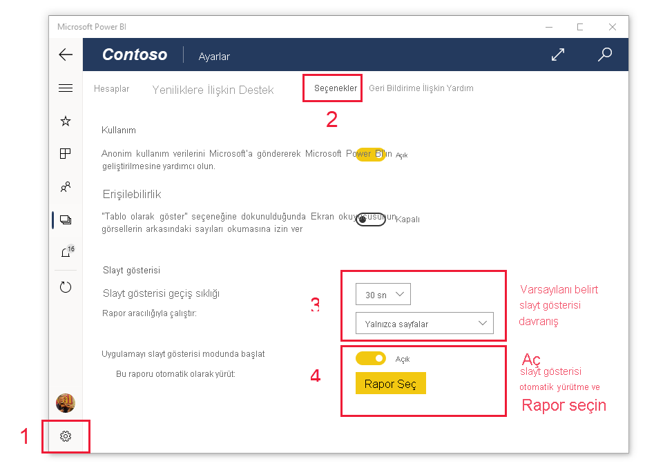

# Raporları ve panoları Surface Hub'da ve Windows 10 cihazlarında sunu modunda görüntüleme
Windows 10 cihazlarında ve Surface Hub'da raporları ve panoları tam ekran modunda görüntülemek için sunu modunu kullanabilirsiniz. Sunu modu Power BI içeriğini toplantılarda, konferanslarda ya da ofisteki projektörde görüntülemek veya küçük ekranlarda daha fazla alan kullanmak için kullanışlıdır.

Sunu modunda:
* Raporunuzdaki verilere daha kolay bir şekilde odaklanmanız için tüm “grafik öğeleri” (gezinti ve menü çubukları gibi) kaybolur.
* Verilerinizle etkileşim kurmanızı ve sunuyu yönetmenizi sağlamak amacıyla bir eylem araç çubuğu kullanılabilir hale gelir.
* Sayfalar, yer işaretleri veya ikisi arasında otomatik olarak geçiş yapan bir slayt gösterisi oynatabilirsiniz.

>[!NOTE]
>**Windows 10 Mobile kullanan telefonlar** için Power BI mobil uygulama desteği, 16 Mart 2021’de sona erecektir. [Daha fazla bilgi](https://go.microsoft.com/fwlink/?linkid=2121400)

## Sunu modunu kullanma
Power BI mobil uygulamasında, **Tam ekran** simgesine dokunarak tam ekran moduna geçin.
 Uygulamanın grafik öğeleri görüntüden kaldırılır ve ekranın alt kısmında veya sağ ve sol kenarlarında (ekranınızın boyutuna bağlı olarak) bir eylem araç çubuğu gösterilir.

Araç çubuğunda dokunarak aşağıdaki eylemleri gerçekleştirebilirsiniz:

|||
|-|-|
||Önceki sayfaya **geri dönün**. Simgeye uzun süre dokunduğunuzda içerik haritası pencereleri açılır. Bu, raporunuzu veya panonuzu içeren klasöre gitmenize olanak tanır.|
||Sunumunuzdaki raporun farklı bir sayfasına **geçiş yapın**.|
||Verilerinizin, yer işareti tarafından yakalanan belirli bir görünümünü sunmak için **yer işareti uygulayın**. Hem kişisel hem de rapor yer işaretlerini uygulayabilirsiniz.|
||Rapor sayfanıza çizmek veya açıklama eklemek için Surface kaleminizi kullanırken **bir mürekkep rengi seçin**.|
||Rapor sayfanızda çizim yapmak ve buna açıklama eklemek için Surface kaleminizi kullanırken oluşabilen **mürekkep izlerini silin**.          |
||**Varsayılan görünüme sıfırlayın** ve sunu sırasında uygulamış olabileceğiniz tüm filtreleri, dilimleyicileri veya diğer veri görünümü değişikliklerini temizleyin.|
||Sunum görünümünün bir görüntüsü iş arkadaşlarınızla **paylaşın**. Görüntü, sunum esnasında Surface kaleminizle yaptığınız tüm ek açıklamaları içerir.|
||Raporu **yenileyin**.|
||Eylem çubuğunu gizleyip slayt gösterisini başlatarak **slayt gösterisini oynatın**. Seçici sayfalar, yer işaretleri veya her ikisi arasında otomatik dönmeyi seçmenizi sağlar. Slayt gösterisi varsayılan olarak her 30 saniyede bir sayfalar arasında otomatik olarak döner. Bu ayarları [**Ayarlar > Seçenekler**](#slideshow-settings)’den değiştirebilirsiniz. Slayt gösterileri hakkında daha fazla bilgi için bkz. [Diğer ayrıntılar](#slideshows)|
||Sunu modundan **çıkın**.|
||Power BI’daki diğer yapıtları **arayın**.|

Araç çubuğunu yerinden çıkarabilir ve sürükleyip bırakarak ekranın herhangi bir yerine yerleştirebilirsiniz. Büyük ekranlarda, raporunuzun belirli bir alanına odaklanmayı tercih ettiğinizde ve araçları bu alanın yanında kullanabilmek istediğinizde bu yararlı olacaktır. Parmağınızı araç çubuğunun üzerine koyup rapor tuvaline doğru çekmeniz yeterlidir.

## Slayt gösterileri

Sununuzda otomatik olarak geçiş yapması için bir slayt gösterisi oynatabilirsiniz. Slayt gösterisini sayfalar, yer işaretleri veya her ikisinde geçiş yapacak şekilde ayarlayabilirsiniz.

Eylem araç çubuğunda **Oynat** düğmesini seçtiğinizde slayt gösterisi başlar. Slayt gösterisini durdurmanıza veya oynatılan öğeyi (sayfalar, yer işaretleri veya her ikisi) değiştirmenize olanak veren bir denetleyici karşınıza gelir.

 Denetleyici, görüntülenen geçerli görünümün (sayfa veya yer işareti ve sayfa) adını gösterir. Yukarıdaki resimde **Satış** adlı raporu görüyoruz ve şu anda **Satış Performansı** sayfasındaki **Asya Pasifik** yer işaretini görüntülüyoruz.

### Slayt gösterisi ayarları

Bir slayt gösterisi varsayılan olarak sayfalar arasında her 30 saniyede bir geçiş yapar. Bu varsayılan ayarları aşağıda gösterildiği gibi **Ayarlar > Seçenekler**’e giderek değiştirebilirsiniz.

## Sonraki adımlar
* [Power BI hizmetindeki panoları ve raporları tam ekran modunda görüntüleme](../end-user-focus.md)
* Sorularınız mı var? [Power BI Topluluğu'na sorun](https://community.powerbi.com/)

