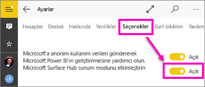

# Raporları Surface Hub'da ve Windows 10'da sunu modunda görüntüleme - Power BI
Windows 10 cihazlarında raporları Surface Hub sunu modunda açabilirsiniz. Ayrıca panoları, raporları ve kutucukları tam ekran modunda görüntüleyebilirsiniz. 

Sunu ve tam ekran modları Power BI içeriğini toplantılarda, konferanslarda ya da ofisteki projektörde görüntülemek veya küçük ekranlarda daha fazla alan kullanmak için kullanışlıdır. 

Power BI mobil uygulamasını tam ekran moduna aldığınızda sayfa sekmeleri ve raporlardaki filtre bölmesi haricindeki gezinti ve menü çubukları gibi "kenarlıklar" kaldırılır.

Bir raporu Surface Hub'da sunu modunda görüntülediğinizde sayfalar üzerinde farklı renklerde çizimler yapabilir ve raporunuzun sayfaları arasında gezinebilirsiniz.

Ayrıca web üzerindeki [Power BI hizmetindeki panoları ve raporları tam ekran modunda görüntüleyebilirsiniz](../../service-fullscreen-mode.md).

> [!NOTE]
> Sunu modu, [kutucukların odak modundan](mobile-tiles-in-the-mobile-apps.md) farklıdır.
> 
> 

## Panoları, raporları ve kutucukları tam ekran modunda görüntüleme
1. Power BI mobil uygulamasında bir pano, rapor veya kutucuk üzerindeki **Tam ekran** simgesine  dokunarak tam ekran moduna geçebilirsiniz.
2. Sonu modunda raporu filtreleyebilir veya diğer panolar ve raporlar için arama yapabilirsiniz.
   
    Filtreleri ayarlamak veya kaldırmak için Filtreler bölmesini genişletin.
   
    
   
     Diğer panoları aramak için Arama simgesine  dokunun.
   
    
3. Tam ekran modundan çıkmak için araç çubuğunda üzerinde içeri doğru iki ok bulunan simgeye  dokunun veya yukarıdan aşağı doğru kaydırıp üzerinde içeri doğru iki ok bulunan simgeye dokunun.

## Surface Hub için sunu modunu açma
Sunu modu varsayılan olarak Surface Hub'da açıktır ancak kapalıysa tekrar açabilirsiniz.

1. Sol gezinti çubuğu altındaki Ayarlar simgesine  dokunun.
2. **Seçenekler**'e dokunun ve ardından **Microsoft Surface Hub sunum modunu etkinleştirin** kaydırıcısını **Açık** konuma getirin.
   
    

## Surface Hub'da raporları görüntüleme ve üzerinde çizim yapma
1. Surface Hub sunu moduna geçmek için herhangi bir rapor açıkken **Tam ekran** simgesine  dokunun.
   
    Ekranın iki tarafında da daraltılabilir eylem çubuğu göreceksiniz. 
   
   * Açmak için içeri doğru kaydırın veya tutamaca dokunun.
   * Kapatmak için dışarı doğru kaydırın veya en üstteki X simgesine dokunun.
2. Kalem ile yazma desteği sunan cihazlarda doğrudan yazmaya başlayabilirsiniz. 
3. Mürekkep rengini değiştirmek için sol veya sağ eylem çubuğundaki kalem simgesine dokunun.
   
    
4. Çizimin bir kısmını veya tamamını silmek için silgiye veya geri al okuna dokunun.
5. Raporun içeriğini yenilemek için yuvarlak ok işaretine dokunun.
6. Raporun diğer sayfalarına gitmek için yön oklarına dokunun.
   
    
7. Tam ekran modundan çıkmak için yukarıdan aşağı doğru kaydırıp üzerinde içeri doğru iki ok bulunan simgeye  dokunun.

## Sonraki adımlar
* [Power BI hizmetindeki panoları ve raporları tam ekran modunda görüntüleme](../../service-fullscreen-mode.md)
* Sorularınız mı var? [Power BI Topluluğu'na sorun](http://community.powerbi.com/)

