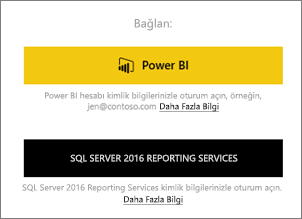
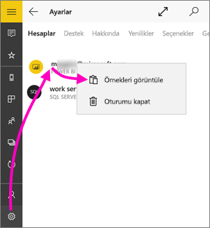
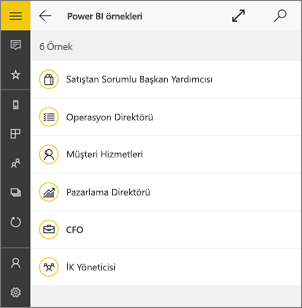
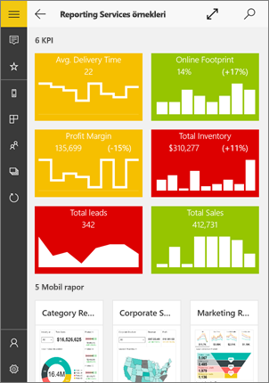
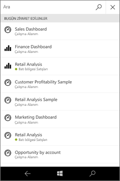
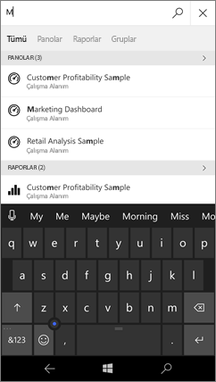
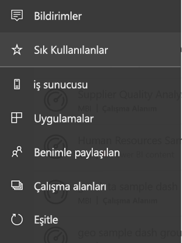
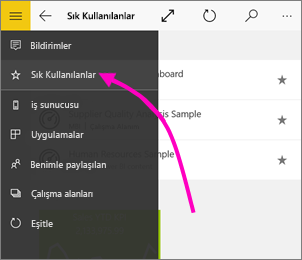

# Windows 10 için Power BI mobil uygulamasını kullanmaya başlama
Windows 10 için Power BI mobil uygulaması, Power BI’ı tabletinize veya telefonunuza getirir. İş bilgilerinize güncel, dokunmatik özellikli mobil erişim elde edersiniz. [Windows Başlangıç ekranından](mobile-pin-dashboard-start-screen-windows-10-phone-app.md) şirket panolarınızı dilediğiniz yerde görüntüleyip etkileşime geçin.

Verilerinizi kullanarak [Power BI hizmetinde pano ve rapor oluşturabilirsiniz](../../fundamentals/service-get-started.md). 

Ardından Windows 10 için Power BI mobil uygulamasını kullanarak pano ve raporlarınızla etkileşim kurabilir, verileri araştırabilir ve paylaşabilirsiniz.

## İlk yapılacaklar
* Windows Mağazası'ndan [**Windows 10 için Power BI mobil uygulamasını indirin**](https://go.microsoft.com/fwlink/?LinkID=526478).
  
  Cihazınızın Windows 10 çalıştırması gerekir. Uygulama, en az 3 GB RAM ve 8 GB iç depolama alanına sahip olan cihazlarda çalışabilir.

  >[!NOTE]
  >**Windows 10 Mobile kullanan telefonlar** için Power BI mobil uygulama desteği, 16 Mart 2021’de sona erecektir. [Daha fazla bilgi](/legal/powerbi/powerbi-mobile/power-bi-mobile-app-end-of-support-for-windows-phones)
   
* [Power BI mobil uygulamalarındaki yenilikleri](mobile-whats-new-in-the-mobile-apps.md) öğrenin.

## Web üzerinde Power BI hizmetine kaydolma
Henüz kaydolmadıysanız [Power BI hizmetine](https://powerbi.com/) gidin. Panolar ve raporlar oluşturup depolamak için kendi hesabınıza kaydolun ve verilerinizi bir araya getirin. Ardından, nerede olursanız olun Windows 10 cihazınızdan panolarınızı görebilmek için Power BI'da oturum açın.

1. Power BI hizmetinde bir Power BI hesabı oluşturmak için [Kaydol](https://go.microsoft.com/fwlink/?LinkID=513879) seçeneğine dokunun.
2. [Kendi panolarınızı ve raporlarınızı oluşturmaya](../../fundamentals/service-get-started.md) başlayın.

## Power BI uygulaması ile çalışmaya başlama
1. Windows 10 cihazınızın Başlangıç ekranında Power BI uygulamasını açın.
   
   
2. Power BI panolarınızı ve raporlarınızı görüntülemek için **Power BI**'a dokunun. Web'deki Power BI hesabınızın kimlik bilgilerini kullanarak oturum açın. 
   
   Reporting Services mobil raporlarınızı ve KPI'lerinizi görüntülemek için ise **SQL Server 2016 Reporting Services** seçeneğine dokunun. SQL Server Reporting Services kimlik bilgilerinizle oturum açın.
   
   
3. Kendi panolarınızı görüntülemek için **Keşfetmeye başlayın**'a dokunun.

## Power BI ve Reporting Services örneklerini deneme
Kaydolmadan bile Power BI ve Reporting Services örnekleriyle deneme yapabilirsiniz. Uygulamayı indirdikten sonra örnekleri görüntüleyebilir veya çalışmaya başlayabilirsiniz. Panoların bulunduğu giriş sayfasından dilediğiniz zaman örneklere geri dönebilirsiniz.

### Power BI örnekleri
Power BI pano örneklerini görüntüleyebilir ve bunlarla etkileşimde bulunabilirsiniz. Ancak bu örneklerle yapamayacağınız birkaç şey vardır. Panolarla bağlantılı raporlar açamaz, örnekleri başkalarıyla paylaşamaz veya sık kullanılanlara ekleyemezsiniz.

1. Sol üst köşede bulunan genel gezinti düğmesine  dokunun.
2. **Ayarlar** simgesine  dokunun, adınıza dokunun ve ardından **Örnekleri görüntüle**'ye dokunun.
   
   
3. Bir rol seçin ve bu role yönelik örnek panoyu araştırın.  
   
   

### Reporting Services mobil rapor örnekleri
1. Sol üst köşede bulunan genel gezinti düğmesine  dokunun.
2. **Ayarlar** simgesine  dokunun, **Sunucuya bağlan** seçeneğine sağ tıklayın veya bu seçeneği basılı tutun, ardından **Örnekleri görüntüle**'ye dokunun.
   
   
3. Retail Reports veya Sales Reports klasörünü açarak ilgili KPI'leri ve mobil raporları keşfedin.
   
   

## Pano, rapor ve uygulama arama
Her zaman uygulamanın en üstünde yer alan arama kutusunu kullanarak panolarınızı, raporlarınızı ve uygulamalarınızı hızlıca bulabilirsiniz.

1. Sağ üst köşedeki arama simgesine dokunun.
   
   
   
   Power BI en yeni panolarınızı, raporlarınızı ve uygulamalarınızı görüntüler.
   
   
2. Yazmaya başladığınızda Power BI ilgili sonuçları görüntüler.
   
   

## Power BI mobil uygulamalarında içeriklerinizi bulma
Panolarınız ve raporlarınız kaynaklarına bağlı olarak Power BI mobil uygulamalarında farklı konumlarda depolanır. [Mobil uygulamalarda içeriklerinizi bulma](mobile-apps-quickstart-view-dashboard-report.md) hakkında bilgi edinin. Ayrıca, Power BI mobil uygulamalarında sahip olduğunuz tüm içeriği dilediğiniz zaman arayabilirsiniz. 

## Sık kullandığınız panoları, KPI'leri ve raporları görüntüleme
Mobil uygulamalardaki Sık Kullanılanlar sayfasında, Reporting Services KPI'lerinin ve mobil raporların yanı sıra sık kullandığınız Power BI panolarınızı görüntüleyin. Power BI mobil uygulamasında bir panoyu *sık kullanılan* olarak belirlediğinizde, söz konusu panoya, tarayıcınızdan eriştiğiniz Power BI hizmeti de dahil olmak üzere tüm cihazlarınızdan erişebilirsiniz. 

* **Sık Kullanılanlar**'a dokunun.
  
   
  
   Power BI sık kullanılanlarınız ile birlikte Reporting Services web portalında sık kullanılanlara eklediğiniz öğelerin tümü bu sayfada bulunur.
  
   

[Power BI mobil uygulamalarındaki sık kullanılanlar](mobile-apps-favorites.md) hakkında daha fazla bilgi edinin.

## Sonraki adımlar
Windows 10 cihazlar için Power BI uygulamasını kullanarak Power BI'daki panolar ve raporların yanı sıra Reporting Services mobil raporları ve Reporting Services web portalındaki raporlar ve KPI'ler ile gerçekleştirebileceğiniz diğer işlemlerden bazıları aşağıda verilmiştir.

### Power BI panoları ve raporları
* [Uygulamalarınızı](../../collaborate-share/service-create-distribute-apps.md) görüntüleme.
* [Panolarınızı](mobile-apps-view-dashboard.md) görüntüleme.
* [Power BI kutucuklarını ve panolarını sabitleyerek](mobile-pin-dashboard-start-screen-windows-10-phone-app.md) cihazınızın Başlangıç ekranında canlı kutucuk olarak kullanma.
* [Kutucukları paylaşma](mobile-windows-10-phone-app-get-started.md).
* [Panoları](mobile-share-dashboard-from-the-mobile-apps.md) paylaşma.

### Reporting Services mobil raporları ve KPI'leri
* Windows 10 cihazlar için Power BI uygulamasında [Reporting Services mobil raporlarını ve KPI'lerini görüntüleme](mobile-app-windows-10-ssrs-kpis-mobile-reports.md).
* [Reporting Services web portalında KPI'ler](/sql/reporting-services/working-with-kpis-in-reporting-services) oluşturma.
* [SQL Server Mobil Rapor Yayımcısı ile kendi mobil raporlarınızı oluşturma](/sql/reporting-services/mobile-reports/create-mobile-reports-with-sql-server-mobile-report-publisher) ve bu raporları Reporting Services web portalında yayımlama.

## Sonraki adımlar
* Windows Mağazası'ndan [Power BI uygulamasını indirin](https://go.microsoft.com/fwlink/?LinkID=526478)  
* [Power BI nedir?](../../fundamentals/power-bi-overview.md)
* Sorularınız mı var? [Power BI Topluluğu'na sorun](https://community.powerbi.com/)