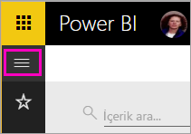
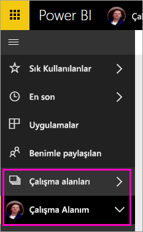
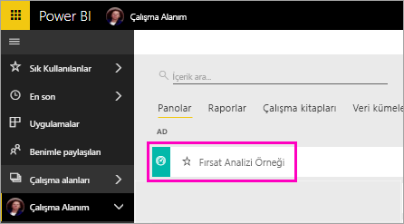
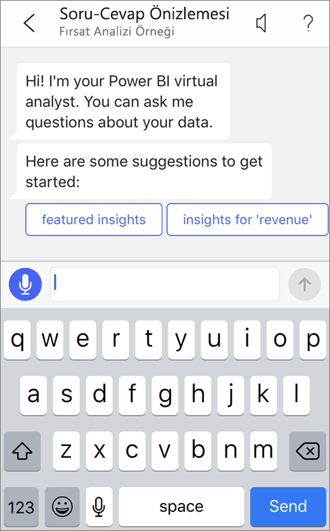
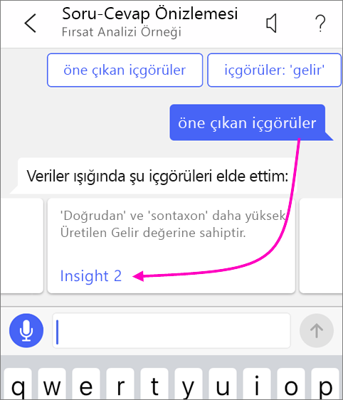
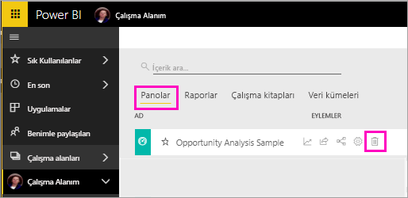

# Öğretici: Power BI iOS uygulamalarındaki Soru-Cevap sanal analistini kullanarak verileriniz hakkında sorular sorma

Verileriniz hakkında bilgi edinmenin en kolay yolu, bunlarla ilgili soruları kendi kelimelerinizle sormaktır. Bu öğreticide iPad, iPhone ve iPod Touch cihazınızda Microsoft Power BI mobil uygulamasındaki Soru-Cevap sanal çözümleyicisi ile örnek veriler hakkında sorular soracak ve öne çıkan içgörüleri görüntüleyeceksiniz. 

Aşağıdakiler cihazlar için geçerlidir:

|  |  |
|:--- |:--- |
| iPhone'lar |iPad'ler |

Soru-Cevap sanal çözümleyicisi, Power BI hizmetinde temel alınan Soru-Cevap verilerine erişen, konuşmaya dayalı bir BI deneyimidir [(https://powerbi.com)](https://powerbi.com). Veri içgörüleri önerir ve kendi sorularınızı yazarak ya da konuşarak sorabilirsiniz.

Bu öğreticide şunları yapacaksınız:

> [!div class="checklist"]
> * iOS için Power BI mobil uygulamasını yükleme
> * Bir Power BI örnek panosu ve raporu indirme
> * Mobil uygulamanın öne çıkan hangi içgörüleri önerdiğini görme

Power BI’ya kaydolmadıysanız başlamadan önce [ücretsiz deneme için kaydolun](https://app.powerbi.com/signupredirect?pbi_source=web).

## Önkoşullar

### iOS için Power BI uygulamasını yükleme
App Store'a giderek iPad, iPhone veya iPod Touch'ınıza [iOS uygulamasını indirin](https://go.microsoft.com/fwlink/?LinkId=522062 "iPhone uygulamasını indirin").

iOS için Power BI uygulamasını şu sürümler destekler:
- iOS 10 veya sonraki sürümünü çalıştıran iPad.
- iOS 10 veya sonraki sürümünü çalıştıran iPhone 5 ve üstü. 
- iOS 10 veya sonraki sürümünü çalıştıran iPod Touch.

### Fırsat Analizi örneğini indirme
Eğitimin ilk adımı, Power BI hizmetindeki Fırsat Analizi örneklerini indirmektir.

1. Tarayıcınızda Power BI hizmetini (app.powerbi.com) açın ve oturum açın.

1. Genel gezinti simgesini seçerek gezinti bölmesini açın.

    

2. Gezinti bölmesinde **Çalışma Alanları** > **Çalışma Alanım**'ı seçin.

    

3. Sol alt köşedeki **Veri Al** seçeneğini belirleyin.
   
    

3. Veri Al sayfasında **Örnekler** simgesini seçin.
   
   

4. **Fırsat Analizi örneğini** seçin.
 
    
 
8. **Bağlan**'ı seçin.  
  
   
   
5. Power BI, örneği içeri aktarır ve Çalışma Alanınıza yeni bir pano, rapor ve veri kümesi ekler.
   
   

Örneğiniz iOS cihazınızda görüntülenmeye hazırdır.

## Öne çıkan öngörüleri görüntüleme
1. iPhone veya iPad cihazınızda Power BI uygulamasını açın ve tarayıcıdaki Power BI hizmetinde kullandığınız Power BI hesabı kimlik bilgilerinizle oturum açın.

1.  Genel gezintü düğmesine  > **Çalışma Alanları** > **Çalışma Alanım** öğesine dokunun ve Fırsat Analizi Örneği panosunu açın.

2. Sayfanın altındaki eylem menüsünde bulunan Soru-Cevap sanal analisti simgesine  dokunun (iPad cihazında sayfanın üstünde).

     

     Power BI Soru-Cevap sanal analisti, başlamanız için bazı öneriler sunar.

     
3. **featured insights**'a dokunun.

     Soru-Cevap sanal analisti bazı öngörüler getirir.
4. Ekranı sağa kaydırın ve **Insight 2**'ye dokunun.

    

     Soru-Cevap sanal analisti, Insight 2'yi görüntüler.

    
5. Odak modunda açmak için grafiğe dokunun.

    
6. Soru-Cevap sanal analisti deneyimine geri dönmek için sol üst köşedeki oka dokunun.

## Kaynakları temizleme

Öğreticiyi tamamladığınızda Fırsat Analizi Örneği pano, rapor ve veri kümesini silebilirsiniz.

1. Power BI hizmeti (app.powerbi.com) sayfasına gidin ve oturum açın.

2. Gezinti bölmesinde **Çalışma Alanları** > **Çalışma Alanım**'ı seçin.

3. **Panolar** sekmesinde Fırsat Analizi panosunun yanında bulunan çöp kutusu biçimindeki **Sil** simgesini seçin.

    

4. **Raporlar** sekmesini seçin ve aynı işlemi Fırsat Analizi raporu için tekrarlayın.

5. **Veri Kümeleri** sekmesini seçin ve aynı işlemi Fırsat Analizi veri kümesi için tekrarlayın.

## Sonraki adımlar

iOS için Power BI mobil uygulamalarında Soru-Cevap sanal yardımcısını denediniz. Power BI hizmetinde Soru-Cevap hakkında daha fazla bilgi edinin.
> [!div class="nextstepaction"]
> [Q&A in the Power BI service (Power BI hizmetindeki Soru-Cevap özelliği)](../end-user-q-and-a.md)

