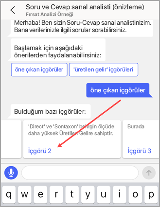
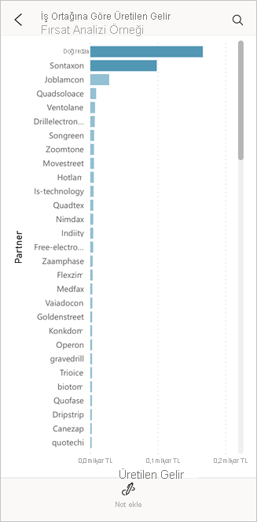

# Öğretici: Power BI iOS uygulamalarındaki Soru-Cevap sanal analistini kullanarak verileriniz hakkında sorular sorma

Verileriniz hakkında bilgi edinmenin en kolay yolu, bunlarla ilgili soruları kendi kelimelerinizle sormaktır. Bu öğreticide iPad veya iPhone'unuzda Microsoft Power BI mobil uygulamasındaki Soru-Cevap sanal çözümleyicisi ile örnek veriler hakkında sorular soracak ve öne çıkan içgörüleri görüntüleyeceksiniz. 

Aşağıdakiler cihazlar için geçerlidir:

|  |  |
|:--- |:--- |
| iPhone'lar |iPad'ler |

Soru-Cevap sanal analisti, [Power BI hizmetinde](https://powerbi.com) temel alınan Soru-Cevap verilerine erişen, konuşmaya dayalı bir BI deneyimidir. Veri içgörüleri önerir ve kendi sorularınızı yazarak ya da konuşarak sorabilirsiniz.

Bu öğreticide şunları yapacaksınız:

> [!div class="checklist"]
> * iOS için Power BI mobil uygulamasını yükleme
> * Bir Power BI örnek panosu ve raporu indirme
> * Mobil uygulamanın öne çıkan hangi içgörüleri önerdiğini görme

## Önkoşullar

* **Power BI'a kaydolma**: Power BI’ya kaydolmadıysanız başlamadan önce [ücretsiz deneme için kaydolun](https://app.powerbi.com/signupredirect?pbi_source=web).
* **iOS için Power BI uygulamasını yükleme**: Apple App Store'dan iPad, iPhone veya iPod Touch'ınıza [iOS uygulamasını indirin](https://apps.apple.com/app/microsoft-power-bi/id929738808). iOS için Power BI uygulamasını şu sürümler destekler:
  * iOS 11 veya sonraki sürümünü çalıştıran iPad.
  * iOS 11 veya sonraki sürümünü çalıştıran iPhone 5 ve üstü. 
  * iOS 11 veya sonraki sürümünü çalıştıran iPod Touch.
* **Örnek verileri indirme**: İlk adım, **Fırsat Analizi Örneği**'ni Power BI hizmetine indirmektir. Bunun nasıl yapılacağını gösteren yönergeler için bkz. [Örnekleri Power BI hizmetinde Çalışma alanım'a indirme](./mobile-apps-download-samples.md).

Önkoşulları tamamladıktan ve örnek verileri indirdikten sonra, örnekleri iOS cihazınızda görüntülemeye hazırsınız.

## Öne çıkan öngörüleri görüntüleme
1. iPhone veya iPad cihazınızda Power BI uygulamasını açın ve tarayıcıdaki Power BI hizmetinde kullandığınız Power BI hesabı kimlik bilgilerinizle oturum açın.

2. Giriş sayfası gezinti çubuğunda **Çalışma Alanları** simgesine dokunun.

    

3. Çalışma Alanları sayfası açıldığında **Çalışma Alanlarım**'a dokunun ve ardından **Fırsat Analizi Örneği** panosuna dokunarak panoyu açın.

3. Fırsat Analizi Örneği panosunda, eylem menüsündeki Soru-Cevap sanal analisti simgesine dokunun.

    

    Soru-Cevap sanal analisti, başlamanız için bazı öneriler sunar.

    

3. **featured insights**'a dokunun.

4. Soru-Cevap sanal analisti bazı öngörüler getirir. Ekranı sağa kaydırın ve **Insight 2**'ye dokunun.

    

   Soru-Cevap sanal analisti, Insight 2'yi görüntüler.

    

5. Odak modunda açmak için grafiğe dokunun.

    

6. Soru-Cevap sanal analisti deneyimine geri dönmek için sol üst köşedeki oka dokunun.

## Kaynakları temizleme

Öğreticiyi tamamladığınızda Fırsat Analizi Örneği pano, rapor ve veri kümesini silebilirsiniz.

1. Power BI hizmetine ([Power BI hizmeti](https://app.powerbi.com)) gidin ve oturum açın.

2. Gezinti bölmesinde **Çalışma Alanım**’ı seçin.

3. Panolar sekmesine tıklayın ve ardından Fırsat Analizi Örneği satırında çöp kutusuna tıklayın.

    

    Şimdi raporlar sekmesini seçin ve aynı işlemi yapın.

4. Veri kümeleri sekmesini seçin, **Diğer seçenekler** (...) öğesine tıklayın ve sonra **Sil**'i seçin.

    

## Sonraki adımlar

iOS için Power BI mobil uygulamalarında Soru-Cevap sanal yardımcısını denediniz. Power BI hizmetinde Soru-Cevap hakkında daha fazla bilgi edinin.
> [!div class="nextstepaction"]
> [Q&A in the Power BI service (Power BI hizmetindeki Soru-Cevap özelliği)](../end-user-q-and-a.md)