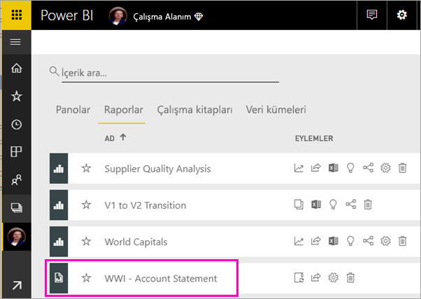
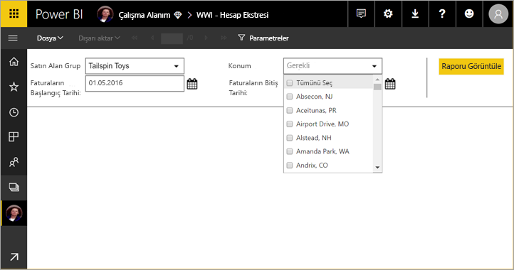
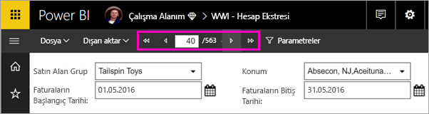
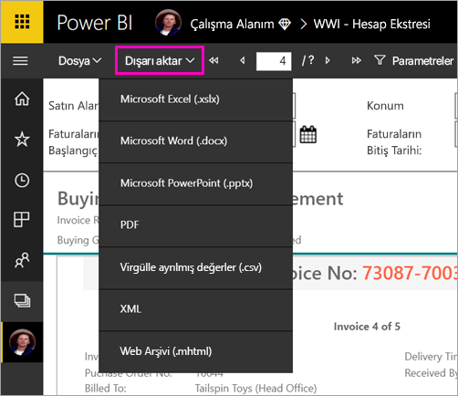

# Power BI hizmetinde sayfalandırılmış rapor görüntüleme

Bu makalede, Power BI hizmetinde sayfalandırılmış bir raporu görüntüleme hakkında bilgi edineceksiniz. Sayfalandırılmış raporlar, Rapor Oluşturucusu'nda oluşturulan ve Premium kapasitedeki herhangi bir çalışma alanına yüklenen raporlardır. Çalışma alanı adının yanında  elmas simgesini arayın. 

Sayfalandırılmış raporların kendi simgesi vardır dokunun.

Ayrıca, sayfalandırılmış raporları çeşitli biçimlerde dışarı aktarabilirsiniz: 

- Microsoft Excel
- Microsoft Word
- Microsoft PowerPoint
- PDF
- Virgülle ayrılmış değerler
- XML
- Web arşivi (.mhtml)

## Sayfalandırılmış rapor görüntüleme

1. Çalışma alanında sayfalandırılmış raporu seçin.

    

2. Raporun bu rapor gibi parametreleri varsa, raporu ilk açtığınızda göremeyebilirsiniz. Parametreleri seçin, ardından **Raporu Görüntüle**’yi seçin. 

     

    Ayrıca, parametreleri istediğiniz zaman değiştirebilirsiniz.

1. Sayfanın üstündeki okları seçerek veya kutuya bir sayfa numarası girerek rapor sayfaları arasında gezinin.
    
   

4. Sayfalandırılmış raporlarınızı dışarı aktaracak bir biçim bulmak için **Dışarı Aktar**’ı seçin.

    

## Sonraki adımlar

[Power BI hizmetinde sayfalandırılmış raporlar](end-user-paginated-report.md)
