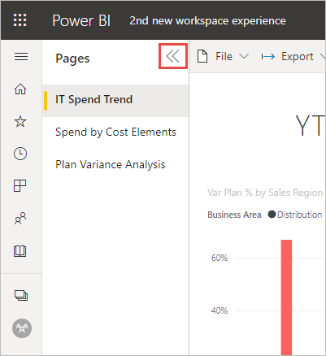
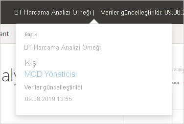

# Power BI hizmetinin 'yeni görünümü'

Power BI hizmeti (app.powerbi.com) raporları görüntülemeyi ve bunlarla etkileşim kurmayı kolaylaştıran yeni bir görünüme kavuştu. Daha basit olan yeni görünüm diğer Microsoft ürünlerine yönelik bilgilerinizi temel alır. Power BI hizmeti içinde, daha açık bir renk temasına geçerek ve simgeleri güncelleştirerek, rapor içeriğini ana odak noktası haline getirdik. 

**Power BI Desktop**’taki yeni görünüm hakkında bilgi mi arıyorsunuz? [Power BI Desktop’taki güncelleştirilmiş şeridi kullanma](../create-reports/desktop-ribbon.md) bölümüne bakın.

İşte yeni görünümde nelerin değiştiğine ilişkin genel bakış. Ayrıntılar için numaralandırılmış bölümlere bakın:

Belirli bir eylemi mi arıyorsunuz? [‘Yeni görünüm’: Eylemler nereye gitti?](service-new-look-where-actions.md) bölümüne bakın

## 1. Sayfaların dikey listesi 
Okuma görünümünde rapor sayfası adları dikey bölmedeki bir liste içinde görüntülenir. Bunlar göze çarpan konumlardadır, kaçırılması zordur ve Word ve PowerPoint'te gezinmeye benzer. Rapor alanının geri kalanını artırabilir veya azaltabilirsiniz: Dikey bölmeyi yeniden boyutlandırın veya çift oku seçerek tamamen kapatın.

Bir rapor için düzenleme izniniz varsa raporu sayfa adları Düzenleme görünümünde olduğu gibi alt tarafta olacak şekilde ayarlayabilirsiniz. Ayrıntılar için "Power BI raporlarıyla ilgili ayarları değiştirme" makalesinin [Sayfalar bölmesini ayarlama](../create-reports/power-bi-report-settings.md#set-the-pages-pane) bölümüne bakın.

## 2. Basitleştirilmiş eylem çubuğu 

En üstteki güncelleştirilmiş eylem çubuğu, rapor tüketicileri için en ilgili komutları önde ve ortada sunar. Dışarı aktarmak, paylaşmak, Teams'de sohbet etmek ve abone olmak artık daha kolay. 

## 3. Rapor komutları nerede?

Eski görünümden işlevlerden hiçbirini kaldırmadık. Diğer gelişmiş komutlar için **Diğer seçenekler (...)** menüsünü seçin. [‘Yeni görünüm’: Eylemler nereye gitti?](service-new-look-where-actions.md) bölümüne bakın.

## 4. Yeni filtre deneyimi

Yeni görünümde varsayılan olarak rapor için yeni Filtreler bölmesi görüntülenir. Bir görsele ait Filtre simgesinin üzerine gelerek o görseli etkileyen tüm filtreleri ve dilimleyicileri görebilirsiniz.

## Rapor ayrıntılarını görüntüleme 

Son yenileme tarihi ve iletişim bilgileri gibi ayrıntılara, en üstteki başlıkta hızlı bir şekilde bakın.  Raporla ilgili ek ayrıntıları görüntülemek için menüyü açın. Rapor sahibine e-posta da gönderebilirsiniz.

## Rapor düzenleme modunda değişiklik yapılmadı 

Yazma deneyimini Desktop’taki deneyime benzer şekilde bıraktık. Yeni görünüm değişiklikleri yalnızca okuma görünümü için geçerlidir.

## Panonun 'yeni görünüm' deneyimi 

Panoların eylem çubuğu sadeleştirildi. Tutarlı bir deneyim için raporlar ve uygulamalarla aynı yapıldı ancak farklı işlevler korundu. Bir panodaki eylemlere ilişkin bir adım adım kılavuz aşağıda verilmiştir.
 

## Sonraki adımlar

- [Power BI Desktop’taki güncelleştirilmiş şeridi kullanma](../create-reports/desktop-ribbon.md)
- [Çalışma alanının ‘yeni görünümünü’ kabul etme](../collaborate-share/service-workspaces-new-look.md)
- [Tüketiciler için Power BI](end-user-consumer.md)
