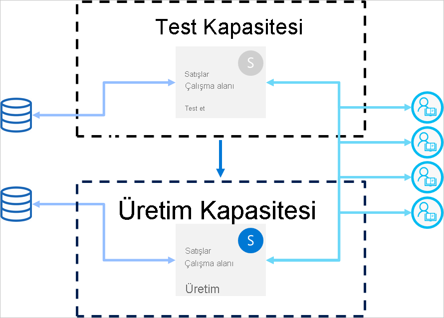

# Dağıtım işlem hatlarına yönelik en iyi uygulamalar

Bu makalede, yaşam döngüsü boyunca içeriklerini yöneten iş zekası oluşturucularına yönelik kılavuz sağlanır. İş zekası içeriği yaşam döngüsü yönetim aracı olarak dağıtım işlem hatlarından yararlanmaya ağırlık verilir.

Makale dört bölüme ayrılır:

* **İçerik hazırlama**: İçeriğinizi yaşam döngüsü yönetimine hazırlama.

* **Geliştirme**: Dağıtım işlem hatları geliştirme aşamasında içerik oluşturmanın en iyi yöntemleri hakkında bilgi edinme.

* **Test**: Ortamınızı test etmek için dağıtım işlem hatlarının test aşamasını kullanmayı anlama.

* **Üretim**: İçeriğinizi kullanıma hazır hale getirirken dağıtım işlem hatları üretim aşamasından yararlanma.

## İçerik hazırlama

İçeriğinizi yaşam döngüsü boyunca süren yönetim için hazırlayın. Aşağıdakilerden herhangi birini yapmadan önce bu bölümdeki bilgileri gözden geçirdiğinizden emin olun:

* İçeriğinizi üretime yayınlama

* Belirli bir çalışma alanı için dağıtım işlem hattı kullanmaya başlama

* Çalışmanızı yayımlama

### Her çalışma alanını eksiksiz bir analiz paketi olarak ele alma

İdeal olarak bir çalışma alanında, kuruluşunuzdaki bir boyutun (departman, iş birimi, proje veya dikey) eksiksiz görünümünün bulunması gerekir. Bu, farklı kullanıcılar için izinlerin yönetilmesini kolaylaştırır ve içeriği kullanıma sunan kişilerin planlanan bir zamanlamaya göre çalışma alanının tamamını denetlemesini sağlar.  

Kuruluş genelinde kullanılan [merkezi veri kümeleri](../connect-data/service-datasets-across-workspaces.md) kullanıyorsanız iki tür çalışma alanı oluşturmanızı öneririz:

* **Modelleme ve veri çalışma alanları**: Bu çalışma alanlarında tüm merkezi veri kümeleri bulunur

* **Raporlama çalışma alanları**: Bu çalışma alanlarında tüm bağımlı raporlar ve panolar bulunur

### İzin modelinizi planlama

Dağıtım işlem hattı, kendi [izinleri](deployment-pipelines-process.md#permissions) olan bir Power BI nesnesidir. İşlem hattında kendi izinleri olan çalışma alanları da yer alır.

Güvenli ve kolay bir iş akışı uygulamak için, işlem hattının her bir bölümüne erişebilecek kişileri planlayın. Dikkate alınması gereken bazı noktalar şunlardır:

* İşlem hattına kimler erişebilmelidir?

* İşlem hattına erişimi olan kullanıcılar her aşamada hangi işlemleri yapmalıdır?

* Test aşamasında içeriği kim gözden geçirir?

* Test aşamasında gözden geçirenlerin işlem hattına erişimi olmalı mıdır?

* Üretim aşamasına dağıtım kimin gözetiminde yapılmalıdır?

* Hangi çalışma alanını atıyorsunuz?

* Çalışma alanınızı hangi aşamaya atıyorsunuz?

* Atadığınız çalışma alanının izinlerinde değişiklik yapmanız gerekiyor mu?

### Farklı aşamaları farklı veritabanlarına bağlama

Üretim veritabanının her zaman kararlı ve kullanılabilir olması gerekir. İş zekası oluşturucularının veri kümelerini dağıtmak veya test etmek için oluşturduğu sorgularla üretim veritabanını aşırı yüklememek daha iyidir. Geliştirme ve test aşamaları için ayrı veritabanları oluşturun. Bu, üretim verilerinin korunmasına yardımcı olur ve dağıtım veritabanını üretim verilerinin hacminin tamamıyla aşırı yüklemez. Böylece işleriniz yavaşlamamış olur.

>[!NOTE]
>Kuruluşunuz [paylaşılan merkezi veri kümeleri](../connect-data/service-datasets-share.md) kullanıyorsa bu öneriyi atlayabilirsiniz.

### Modelinizde parametreler kullanma

Veri kümesi veri kaynakları Power BI hizmetinde düzenlenemeyeceğinden, örnek adları ve veritabanı adları gibi bağlantı ayrıntılarını depolamak için statik bağlantı dizesi yerine [parametrelerin](/power-query/power-query-query-parameters) kullanılmasını öneririz. Bu sayede, daha sonraki aşamalarda bağlantıları Power BI hizmeti web portalı üzerinden veya [API’leri kullanarak](/rest/api/power-bi/datasets/updateparametersingroup) yönetebilirsiniz.

Dağıtım işlem hatlarında dağıtım, test ve üretim aşamalarında belirli değerler ayarlamak için parametre kurallarını yapılandırabilirsiniz.

Bağlantı dizenizde parametre kullanmıyorsanız verilen bir veri kümesi için bağlantı dizesi belirtmek amacıyla veri kaynağı kuralları tanımlayabilirsiniz. Ancak bu, dağıtım işlem hatlarında tüm veri kaynakları için desteklenmez. Veri kaynaklarınıza yönelik kuralları yapılandırabildiğinizi doğrulamak için bkz. [veri kümesi kural sınırlamaları](deployment-pipelines-get-started.md#dataset-rule-limitations).

Sorgularda, filtrelerde ve raporda görüntülenen metinde değişiklik yapmak gibi başka kullanımlarda da parametrelerden yararlanabilirsiniz.

## Geliştirme

Bu bölümde, dağıtım işlem hatlarının dağıtım aşamasında çalışmaya ilişkin kılavuz sağlanır.

### Raporlarınızı ve veri kümelerinizi düzenlemek için Power BI Desktop kullanma

Power BI Desktop’ı yerel geliştirme ortamınız olarak düşünün. Power BI Desktop, raporlarınızda ve veri kümelerinizde güncelleştirmeleri denemenize, keşfetmenize ve gözden geçirmenize olanak verir. İşinizi tamamladıktan sonra yeni sürümünüzü dağıtım aşamasına yükleyebilirsiniz. Aşağıdaki nedenlerden dolayı .pbix dosyalarını Desktop’ta (Power BI hizmetinde değil) düzenlemeniz önerilir:

* Tüm değişiklikler aynı araçta yapıldığında diğer oluşturucularla aynı .pbix dosyası üzerinde işbirliği yapmak daha kolaydır.

 * Çevrimiçi değişiklikler yapma ve .pbix dosyasını indirip yeniden karşıya yükleme, raporların ve veri kümelerinin yinelemesini oluşturur.

* .pbix dosyalarınızın güncel kalmasını sağlamak için sürüm denetimini kullanabilirsiniz.

### .pbix dosyaları için sürüm denetimi

Raporlarınızın ve veri kümelerinizin sürüm geçmişini yönetmek istiyorsanız [Power BI’ın OneDrive ile otomatik eşitlemesini](../collaborate-share/service-connect-to-files-in-app-workspace-onedrive-for-business.md) kullanın. Bu, dosyalarınızın en son sürümle güncelleştirilmesini sağlar. Ayrıca, gerekirse eski sürümleri de almanıza olanak tanır.

>[!NOTE]
>OneDrive ile (veya başka bir depo ile) otomatik eşitleme özelliğini yalnızca dağıtım işlem hatlarının dağıtım aşamasındaki .pbix dosyalarıyla kullanın. .pbix dosyalarını dağıtım işlem hatlarının test ve üretim aşamalarına eşitlemeyin. Bu, içeriği işlem hattı genelinde dağıtmayla ilgili sorunlara neden olur.

### Rapor ve pano geliştirmeden ayrı modelleme geliştirmesi

Kurumsal ölçekteki dağıtımlarda veri kümesi dağıtımını ve raporlar ile panoların dağıtımını ayırmanız önerilir. Değişiklikleri yalnızca bir raporda veya veri kümesinde öne çıkarmak için dağıtım işlem hatlarının seçmeli dağıtım seçeneğini kullanın.  

Bu yaklaşımın, Power BI Desktop’ta veri kümeleri ve raporlar için ayrı .pbix dosyaları oluşturarak başlaması gerekir. Örneğin, bir veri kümesi .pbix dosyası oluşturup dağıtım aşamasına yükleyebilirsiniz. Daha sonra, rapor yazarlarınız yalnızca rapor için yeni bir .pbix dosyası oluşturabilir ve canlı bağlantı kullanarak bu raporu [yayımlanmış veri kümelerine bağlayabilir](../connect-data/service-datasets-discover-across-workspaces.md). Bu teknik, farklı oluşturucuların modelleme ve görselleştirmeler üzerinde ayrı ayrı çalışmalarına ve bunları bağımsız bir şekilde üretime dağıtmalarına olanak tanır.

[Paylaşılan veri kümeleri](../connect-data/service-datasets-share.md) sayesinde bu yöntemi çalışma alanları genelinde kullanabilirsiniz.

### XMLA okuma/yazma özelliklerini kullanarak modellerinizi yönetme

Modelleme dağıtımını rapor ve pano dağıtımlarından ayırmak kaynak denetimi, farklı değişiklikleri birleştirme ve otomatikleştirilmiş süreçler gibi gelişmiş özellikleri kullanmanızı sağlar. Son içeriğin test ve üretim aşamalarına dağıtılabilmesi için bu değişikliklerin dağıtım aşamasında yapılması gerekir. Böylece, değişikliklerin üretim aşamasında dağıtılmadan önce diğer bağımsız öğelerle birleştirilmiş bir sürece geçmesi sağlanır.

XMLA okuma/yazma özelliklerini kullanarak dış bir çalışma alanındaki [paylaşılan veri kümesini](../connect-data/service-datasets-share.md) yöneterek modelleme dağıtımlarını görselleştirmelerden ayırabilirsiniz. Paylaşılan veri kümesi, birden çok işlem hattında yönetilen çeşitli çalışma alanlarındaki birden çok rapora bağlanabilir.

## Test et

Bu bölümde, dağıtım işlem hatlarının test aşamasında çalışmaya ilişkin kılavuz sağlanır.

### Üretim ortamınızı simüle etme

Yeni raporların veya panoların düzgün göründüğünü doğrulamanın yanı sıra, bunların nasıl çalıştığını son kullanıcı perspektifinden görmek de önemlidir. Dağıtım işlem hatları test aşaması, test amacıyla gerçek bir üretim ortamını simüle etmenize olanak tanır.

Bu üç faktörün test ortamınızda ele alındığından emin olun:

* Veri hacmi

* Kullanım hacmi

* Üretimdekine benzer boyutta bir kapasite

Test sırasında, üretim aşamasındakiyle aynı boyuttaki kapasiteyi kullanabilirsiniz. Ancak bu, üretim aşamasının yük test etme sırasında kararsız olmasına neden olabilir. Kararsız üretimden kaçınmak için, üretim kapasitesindeki kaynaklara benzer başka bir kapasiteyi test amacıyla kullanın. Ek maliyetlerden kaçınmak amacıyla, yalnızca test etme süresini ödemek için [Azure A kapasitelerini](../developer/embedded/azure-pbie-create-capacity.md) kullanabilirsiniz.

### Veri kümesi kurallarını gerçek hayattaki bir veri kaynağıyla kullanma

Gerçek hayattaki veri kullanımını simüle etmek için test aşamasını kullanıyorsanız geliştirme ve test veri kaynaklarını ayırmanız önerilir. Dağıtım veritabanının göreli olarak küçük, test veritabanının ise üretim veritabanıyla mümkün olduğunca benzer olması gerekir. Test aşamasında veri kaynaklarını değiştirmek için [veri kaynağı kurallarını](deployment-pipelines-get-started.md#step-4---create-dataset-rules) kullanın.

Test aşamasında bir üretim veri kaynağı kullanıyorsanız veri kaynağınızdan içeri aktardığınız miktarı denetlemek yararlıdır. Bunu yapmak için, Power BI Desktop’ta veri kaynağı sorgunuza bir parametre ekleyin. İçeri aktarılan veri miktarını denetlemek için parametre kurallarını kullanın veya parametrenin değerini düzenleyin.
Ayrıca, kapasitenizi aşırı yüklemek istemiyorsanız bu yaklaşımı kullanabilirsiniz.

### Performansı ölçme

Bir üretim aşamasını simüle ederken [rapor yükünü ve etkileşimlerini denetleyerek](../guidance/monitor-report-performance.md) yaptığın değişikliklerin bunları etkileyip etkilemediğini öğrenin.

Üretime ulaşmadan önce aşırı yükleri yakalayabilmeniz için [kapasitedeki yük miktarını da izlemeniz](../admin/service-admin-premium-monitor-capacity.md) gerekir.  

>[!NOTE]
>Güncelleştirmeleri üretim aşamasına dağıttıktan sonra kapasite yüklerini yeniden izlemeniz önerilir.

### İlgili öğeleri denetleme

İlgili süreler, veri kümelerine veya raporlara yapılan değişikliklerden etkilenebilir. Test sırasında, değişikliklerinizin etkileyip etkilemediğini veya mevcut öğelerin performansını bozup bozmadığını doğrulayın. Bu, güncelleştirilmiş denetimlere bağlı olabilir.

Çalışma alanı [veri kökeni görünümünü](../collaborate-share/service-data-lineage.md) kullanarak ilgili öğeleri kolayca bulabilirsiniz.

### Uygulamanızı test etme

Son kullanıcılarınıza bir uygulama üzerinden içerik dağıtıyorsanız uygulamanın yeni sürümünü üretim aşamasına geçmeden önce gözden geçirin. Her dağıtım işlem hattı aşamasının kendi çalışma alanı olduğundan, uygulamaları geliştirme ve test aşamaları için kolayca yayımlayıp güncelleştirebilirsiniz. Bu sayede, uygulamayı bir son kullanıcının bakış açısıyla test edebilirsiniz.

>[!IMPORTANT]
>Dağıtım işlemi, uygulama içeriğinin veya ayarlarının güncelleştirilmesini içermez. İçerikte ve ayarlarda değişiklikler uygulamak için, uygulamayı gerekli işlem hattı aşamasında kendiniz güncelleştirmeniz gerekir.

## Üretim

Bu bölümde, dağıtım işlem hatlarının üretim aşamasına yönelik kılavuz sağlanır.

### Üretime kimlerin dağıtabileceğini yönetme

Üretime dağıtma aşamasının dikkatli bir şekilde ele alınması gerektiğinden, bu hassas işlemi yalnızca belirli kişilerin yönetmesine izin vermek iyi bir yöntemdir. Ancak, belirli bir çalışma alanındaki tüm iş zekası oluşturucularının işlem hattına erişebilmesini istersiniz. Bu, üretim [çalışma alanı izinlerini](deployment-pipelines-process.md#permissions) kullanarak yönetilebilir.  

Aşamalar arasında içerik dağıtmak için kullanıcıların her iki aşamada da üye veya yönetici izinlerine sahip olması gerekir. Yalnızca üretime dağıtmasını istediğiniz kişilerin üretim çalışma alanı izinleri olduğundan emin olun. Diğer kullanıcılar, üretim çalışma alanı katkıda bulunanı veya görüntüleyicisi rollerine sahip olabilir. İçeriği işlem hattından görebilirler ancak dağıtamazlar.

Bunun yanı sıra, işlem hattına erişimi yalnızca içerik oluşturma sürecinin parçası olan kullanıcılara işlem hattı izinleri vererek sınırlandırmalısınız.

### Üretim aşamasının kullanılabilirliğini sağlamak için kurallar ayarlama

[Veri kümesi kuralları](deployment-pipelines-get-started.md#step-4---create-dataset-rules), üretimdeki verilerin her zaman bağlı ve kullanıcılara açık olmasını sağlamanın güçlü bir yoludur. Veri kümesi kuralları uygulandıktan sonra, son kullanıcıların ilgili bilgileri sorunsuz bir şekilde gördüğünden emin olarak dağıtımları çalıştırabilirsiniz.

Veri kümesinde tanımlanmış veri kaynakları ve parametreler için üretim veri kümesi kurallarını ayarladığınızdan emin olun.

### Üretim uygulamasını güncelleştirme

İşlem hattında dağıtım, çalışma alanı içeriğini güncelleştirir ancak ilgili uygulamayı otomatik olarak güncelleştirmez. İçerik dağıtımı için bir uygulama kullanıyorsanız son kullanıcıların en güncel sürümü hemen kullanabilmesi amacıyla, üretime dağıttıktan sonra uygulamayı güncelleştirmeyi unutmayın.  

### İçerikte yapılan hızlı düzeltmeler

Üretimde hızlı düzeltme yapmanız gereken hatalar olduğunda, hemen üretim aşamasında doğrudan yeni bir .pbix sürümü yüklemeyi veya Power BI hizmetinde çevrimiçi değişiklik yapmayı düşünmeyin. Test ve geliştirme aşamalarında geriye dönük dağıtım yapmak, bu aşamalarda içerik varken mümkün değildir. Ayrıca, önce test etmeden bir düzeltmeyi dağıtmak iyi bir yöntem değildir. Bu nedenle, bu sorunu ele almanın doğru yolu düzeltmeyi dağıtım aşamasında uygulamak ve dağıtım işlem hattının kalan aşamalarına göndermektir. Böylece, üretime dağıtmadan önce düzeltmenin işe yarayıp yaramadığını denetleyebilirsiniz. İşlem hattı genelinde dağıtım yapmak yalnızca birkaç dakika sürer.

## Sonraki adımlar

>[!div class="nextstepaction"]
>[Dağıtım işlem hatlarına giriş](deployment-pipelines-overview.md)

>[!div class="nextstepaction"]
>[Dağıtım işlem hatlarını kullanmaya başlama](deployment-pipelines-get-started.md)

>[!div class="nextstepaction"]
>[Dağıtım işlem hattı sürecini anlama](deployment-pipelines-process.md)

>[!div class="nextstepaction"]
>[Dağıtım işlem hatlarıyla ilgili sorunları giderme](deployment-pipelines-troubleshooting.md)