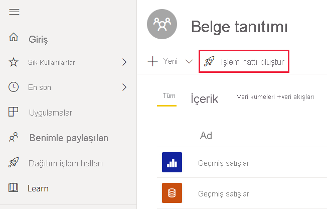
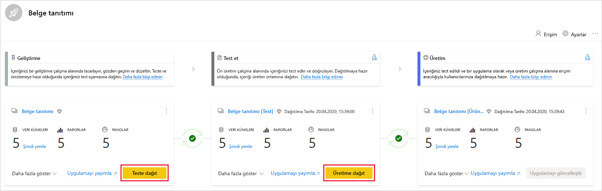
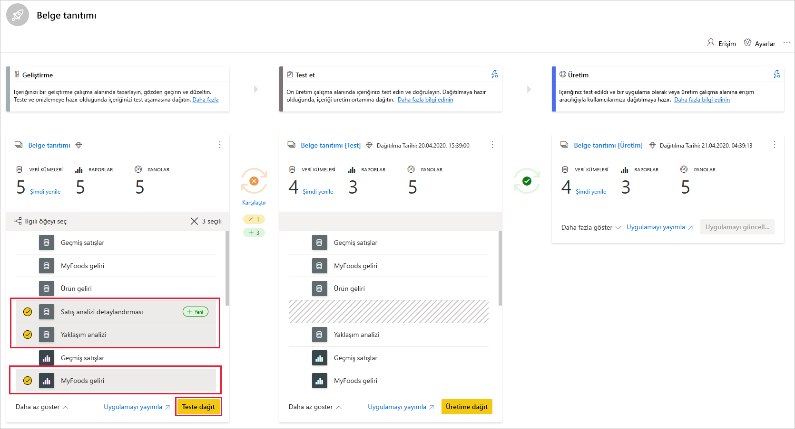
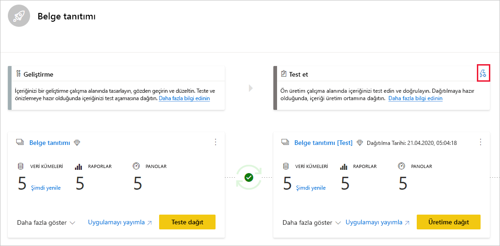
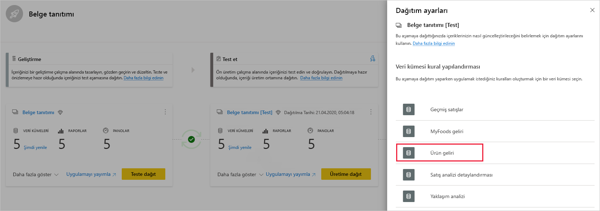
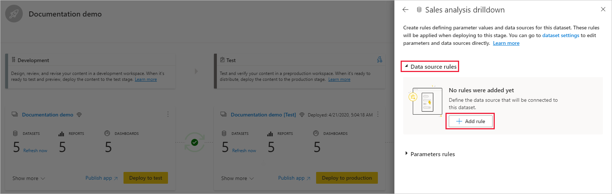
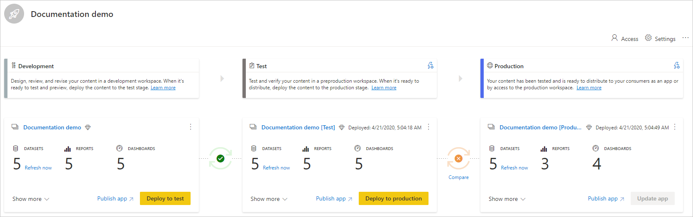
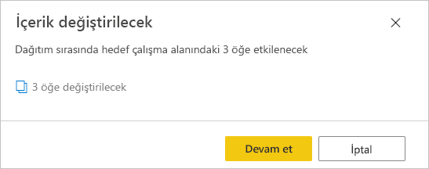

# Dağıtım işlem hatlarını kullanmaya başlama

Bu makalede, dağıtım işlem hatlarını kullanmak için gereken temel ayarlara ilişkin yollar gösterilir.

## Dağıtım işlem hatlarına erişme

Aşağıdaki koşullar sağlandığında dağıtım işlem hatları özelliğine erişebilirsiniz:

* Aşağıdakilerden Premium lisanslarından birine sahip olmanız:

    * Power BI [Pro kullanıcısı](../admin/service-admin-purchasing-power-bi-pro.md) olmanız ve Premium kapasiteye sahip bir kuruluşta çalışmanız.

    * [Kullanıcı Başına Premium (PPU)](../admin/service-premium-per-user-faq.md).

* [Yeni çalışma alanı deneyimi](../collaborate-share/service-create-the-new-workspaces.md) yöneticisi olmanız.

>[!NOTE]
> Önceden bir işlem hattı oluşturduysanız veya sizinle bir işlem hattı paylaşıldıysa da dağıtım işlem hatları düğmesini görebilirsiniz.

## 1\. Adım: Dağıtım işlem hattı oluşturma

Dağıtım işlem hatları sekmesinden veya bir çalışma alanından işlem hattı oluşturabilirsiniz.

İşlem hattını oluşturduktan sonra diğer kullanıcılarla paylaşabilir veya silebilirsiniz. İşlem hattını başkalarıyla paylaştığınızda, işlem hattını paylaştığınız kullanıcılara [işlem hattı erişimi](deployment-pipelines-process.md#user-with-pipeline-access) verilir. İşlem hattı erişimi kullanıcıların işlem hattını görüntülemesine, paylaşmasına, düzenlemesine ve silmesine olanak verir.

### Dağıtım işlem hatları sekmesinden işlem hattı oluşturma

Dağıtım işlem hatları sekmesinden işlem hattı oluşturmak için şunları yapın:

1. Power BI hizmetindeki gezinti bölmesinde **Dağıtım işlem hatları**’nı seçip **İşlem hattı oluştur** seçeneğini belirleyin.

2. *Dağıtım işlem hattı oluştur* iletişim kutusunda işlem hattı için bir ad ve açıklama girip **Oluştur**’u seçin.

### Çalışma alanından işlem hattı oluşturma

[Yeni çalışma alanı deneyiminde](../collaborate-share/service-create-the-new-workspaces.md) bir yönetici olduğunuz takdirde mevcut bir çalışma alanından işlem hattı oluşturabilirsiniz.

1. Çalışma alanından **İşlem hattı oluştur**’u seçin.

    > [!div class="mx-imgBorder"]
    > 

2. *Dağıtım işlem hattı oluştur* iletişim kutusunda işlem hattı için bir ad ve açıklama girip **Oluştur**’u seçin.

>[!NOTE]
>Çalışma alanı, kuruluşunuzun Premium kapasitesine veya sizin PPU kapasitenize atanmadıysa [kapasiteye atamanızı](../admin/service-admin-premium-manage.md#assign-a-workspace-to-a-capacity) söyleyen bir bildirim alırsınız.  

## 2\. Adım: Dağıtım işlem hattına çalışma alanı atama

İşlem hattını oluşturduktan sonra, işlem hattını yönetmek istediğiniz içeriği eklemeniz gerekir. İşlem hattına içerik eklemek, işlem hattı aşamasına çalışma alanı ekleyerek yapılır. Çalışma alanını herhangi bir aşamaya atayabilirsiniz. 

Dağıtım işlem hattına bir çalışma alanı atayabilirsiniz. Dağıtım işlem hatları, işlem hattının farklı aşamalarında kullanılmak üzere çalışma alanı içeriğinin kopyalarını oluşturur.

Dağıtım işlem hattına çalışma alanı atamak için şu adımları izleyin:

1. Yeni oluşturulan dağıtım işlem hattında **Çalışma alanı ata**’yı seçin.

2. *Çalışma alanı seç* açılan menüsünde işlem hattına atamak istediğiniz çalışma alanını seçin.

    >[!NOTE]
    >Çalışma alanından bir işlem hattı oluşturuyorsanız çalışma alanı zaten seçili olduğundan bu aşamayı atlayabilirsiniz.

3. Çalışma alanını atamak istediğiniz aşamayı seçin.

### Çalışma alanı atama sınırlamaları

* Çalışma alanının bir [yeni çalışma alanı deneyimi](../collaborate-share/service-create-the-new-workspaces.md) olması gerekir.

* Çalışma alanının yöneticisi olmanız gerekir.

* Çalışma alanının başka bir işlem hattına atanmamış olması gerekir.

* Çalışma alanının bir  [Premium kapasitede](../admin/service-premium-what-is.md) bulunması gerekir.

* [Power BI örnekleri](../create-reports/sample-datasets.md) içeren bir çalışma alanı, işlem hattı aşamasına atanamaz.

>[!NOTE]
>Seçim yapabileceğiniz çalışma alanları listesinde yalnızca dağıtım işlem hatlarıyla kullanılabilecek çalışma alanları görüntülenir.

## 3\. Adım: Boş bir aşamaya dağıtma

Kaynak çalışma alanında üye veya yönetici olan bir [Pro kullanıcı](../admin/service-admin-purchasing-power-bi-pro.md) içeriği boş bir aşamaya (içeriğe sahip olmayan bir aşama) dağıtabilir. Dağıtımın tamamlanması için çalışma alanının bir kapasite üzerinde bulunması gerekir.

İçerik boş bir aşamaya dağıtıldığında, öğeler arasındaki ilişkiler korunur. Örneğin, kaynak aşamasındaki bir veri kümesine bağlı olan bir rapor veri kümesiyle birlikte kopyalanır ve kopyalar benzer şekilde hedef çalışma alanına bağlı olur.

Dağıtım tamamlandıktan sonra veri kümesini yenileyin. Daha fazla bilgi için bkz. [boş bir aşamaya içerik dağıtma](deployment-pipelines-process.md#deploying-content-to-an-empty-stage).

### Tüm içeriği dağıtma

İçinden dağıtılacak aşamayı ve sonra dağıtım düğmesini seçin. Dağıtım işlemi, hedef aşamada yinelenen bir çalışma alanı oluşturur. Bu çalışma alanı, geçerli aşamada bulunan tüm içeriğe sahiptir.

### Seçmeli dağıtım

Yalnızca belirli öğeleri dağıtmak için **Daha fazla göster** bağlantısını, ardından dağıtmak istediğiniz öğeleri seçin. Dağıt düğmesine tıkladığınızda, sonraki aşamaya yalnızca seçili öğeler dağıtılır.

Pano, rapor ve veri kümeleri ilişkili olduğundan ve bağımlılıklara sahip olduğundan, bu öğelerin bağımlı olduğu tüm öğeleri işaretlemek için ilişkili seç düğmesini kullanabilirsiniz. Örneğin, bir rapor sonraki aşamaya dağıtmak isterseniz ilişkili seç düğmesine tıkladığınızda raporun bağlı olduğu veri kümesi işaretlenir, böylece her ikisi de tek seferde dağıtılır ve rapor kesintiye uğramaz.

>[!NOTE]
> * Bir raporun veya panonun bağımlı olduğu öğeler sonraki aşamada yoksa bu rapor veya pano sonraki aşamaya dağıtılamaz.
> * Bir raporu veya panoyu veri kümesi olmadan dağıtmayı seçerseniz beklenmedik sonuçlarla karşılaşabilirsiniz. Hedef aşamadaki veri kümesi değiştiğinde veya içinden dağıtım yaptığınız aşamadakiyle artık aynı olmadığında bu meydana gelebilir.

### Geriye dönük dağıtım

Örneğin, mevcut bir çalışma alanını üretim aşamasına dağıtıp daha sonra geriye dönük olarak önce test aşamasına, sonra geliştirme aşamasına dağıttığınız bir senaryoda olduğu gibi, önceki aşamaya dağıtmayı tercih edebilirsiniz.

Önceki bir aşamaya dağıtmak yalnızca önceki aşamanın boş olması durumunda işe yarar. Önceki aşamaya dağıtırken belirli öğeler seçilemez. Aşamadaki tüm içerik dağıtılır.

## 4\. Adım: Veri kümesi kuralları oluşturma

Dağıtım işlem hattında çalışırken farklı aşamaların farklı yapılandırmaları olabilir. Örneğin, her aşamada farklı veritabanları veya farklı sorgu parametreleri olabilir. Test ve üretim aşamaları tüm veritabanını sorgularken, geliştirme aşaması veritabanındaki örnek verileri sorgulayabilir.

İşlem hattı aşamaları arasında içerik dağıtırken veri kümesi kurallarını yapılandırmak, bazı ayarları korurken içerikte değişiklik yapmanıza olanak verir.

Veri kümesi kuralları, her bir veri kümesindeki veri kaynakları ve parametreler üzerinde tanımlanır. Bunlar, belirli bir veri kümesindeki veri kaynaklarının veya parametrelerin değerlerini belirler. Örneğin, üretim aşamasındaki bir veri kümesinin bir üretim veritabanına işaret etmesini isterseniz bunun için bir kural tanımlayabilirsiniz. Kural, üretim aşamasında uygun veri kümesi kapsamında tanımlanır. Kural tanımlandığında, testten üretime dağıtılan içerik veri kümesi kuralında tanımlandığı şekilde değeri alır, kural değiştirilmediği ve geçerli olduğu sürece uygulanır.

>[!NOTE]
> Veri kümesi kuralları, yalnızca kaynak ve hedef veri kaynağı aynı türden olduğunda çalışır.

### Veri kümesi kuralı oluşturma

Bir veri kümesi kuralı oluşturmak için bu bölümdeki adımları izleyin. İhtiyacınız olan tüm veri kümesi kurallarını oluşturduktan sonra, veri kümelerini kaynak aşamadaki yeni oluşturulan kurallarla kuralların oluşturulduğu hedef aşamasına dağıtın. Veri kümelerini kaynaktan hedef aşamasına dağıtana kadar kurallarınız uygulanmaz.

1. Veri kümesi kuralı oluşturmak istediğiniz işlem hattı aşamasında **Dağıtım ayarları**’nı seçin.

    

2. Dağıtım ayarları bölmesinden kural oluşturmak istediğiniz veri kümesini seçin.

    

3. Oluşturmak istediğiniz kural türünü seçin, listeyi genişletin ve sonra **Kural ekle** seçeneğini belirleyin.

     

### Veri kümesi kural türleri

İki tür kural oluşturabilirsiniz:

* **Veri kaynağı kuralları**: Veri kaynağı listesi, kaynak işlem hattı aşamasının veri kümesinden alınır. Veri kaynağı listesinden, değiştirilmesini istediğiniz veri kaynağını seçin. Kaynak aşamasındakiyle değiştirmek istediğiniz bir değeri seçmek için şu yöntemlerden birini kullanın:

    1. Listeden seçin.

    2. **Diğer**’i seçip yeni veri kaynağını el ile ekleyin. Yalnızca aynı türdeki bir veri kaynağıyla değiştirebilirsiniz.

* **Parametre kuralları**: Geçerli değerin gösterildiği parametre listesinden bir parametre seçin. Değeri, her dağıtımdan sonra geçerli olmasını istediğiniz değer olarak düzenleyin.

### Veri kümesi kuralı sınırlamaları

* Veri kümesi kuralı oluşturmak için veri kümesi sahibi olmanız gerekir.

* Veri kümesi kuralları dağıtım aşamasında oluşturulamaz.

* Bir öğe kaldırıldığında veya silindiğinde kuralları da silinir. Bu kurallar geri yüklenemez.

* Bir kuralda tanımlanan veri kaynağı veya parametreler değiştirilirse veya kaynak veri kümesinden kaldırılırsa kural geçerli olmaz ve dağıtım başarısız olur.

* Parametre kuralları, *Tümü* veya *İkili* türündeki parametreler için tanımlanamaz. Daha fazla bilgi için bkz. [Veri kümesi güncelleştirme parametresi kısıtlamaları](/rest/api/power-bi/datasets/updateparameters).

* Veri kaynağı kuralları, yalnızca şu veri kaynakları için tanımlanabilir:
    * Azure Analysis Services
    * Azure Synapse
    * SQL Server Analysis Services (SSAS)
    * Azure SQL Sunucusu
    * SQL sunucusu
    * Odata Akışı
    * Oracle
    * SapHana (doğrudan sorgu modu için değil, yalnızca içeri aktarma modu için desteklenir)
    * SharePoint
    * Teradata

    Diğer veri kaynakları için, [veri kaynağınızı yapılandırmaya yönelik parametreleri kullanmanızı](deployment-pipelines-best-practices.md#use-parameters-in-your-model) öneririz.

## 5\. Adım: Bir aşamadan diğerine içerik dağıtma

Bir işlem hattı aşamasında içeriğe sahip olduğunuzda bu içeriği sonraki aşamaya dağıtabilirsiniz. Başka bir aşamaya içerik dağıtmak genellikle işlem hattında bazı eylemler gerçekleştirdikten sonra yapılır. Örneğin, dağıtım aşamasında içeriğinizde değişiklik yapılması veya test aşamasında içeriğinizin test edilmesi. İçeriği bir aşamadan diğerine taşımaya ilişkin tipik bir iş akışı geliştirmeden teste ve sonra testten üretime şeklinde gerçekleşir. [Mevcut bir çalışma alanına içerik dağıtma](deployment-pipelines-process.md#deploy-content-to-an-existing-workspace) bölümünde bu süreç hakkında daha fazla bilgi edinebilirsiniz.

Dağıtım işlem hattındaki sonraki aşamaya içerik dağıtmak için, aşamanın alt kısmındaki dağıt düğmesini seçin.

Test ve üretim aşaması kartlarını gözden geçirirken son dağıtım zamanını görebilirsiniz. Bu, içeriğin aşamaya son dağıtıldığı zamanı belirtir.

Dağıtım zamanı, bir aşamayı son güncelleştirildiği zamana göre oluşturmak bakımından yararlıdır. Test ve üretim dağıtımları arasındaki süreyi izlemek için de yararlı olabilir.

## Aşamaları karşılaştırma

Ardışık iki aşamada içerik bulunduğunda bu içerik, içerik öğeleri meta verileri temel alınarak karşılaştırılır. Bu karşılaştırma, verileri karşılaştırmayı veya aşamalar arasındaki zamanı yenilemeyi kapsamaz.

 

İki ardışık aşama arasındaki farklara yönelik hızlı bir görsel içgörü elde etmek için bunlar arasında bir karşılaştırma simgesi göstergesi görünür. Karşılaştırma göstergesinin iki durumu vardır:

* **Yeşil gösterge**: Her iki aşamadaki içeriğe ait meta veriler aynıdır.

* **Turuncu gösterge**: Şu koşullardan biri sağlandığında görünür:
    * Her aşamadaki içerik öğelerinin bazıları değiştirildiğinde veya güncelleştirildiğinde (farklı meta verilere sahip olduğunda).
    * Aşamalar arasındaki öğe sayısında farklılık olduğunda.

İki ardışık aşama aynı olmadığında, turuncu karşılaştırma simgesinin altında bir **karşılaştırma** bağlantısı görünür. Bu bağlantıya tıkladığınızda iki aşamadaki öğe listesi de Karşılaştırma görünümünde açılır. Karşılaştırma görünümü, her işlem hattı aşamasındaki öğeler arasındaki değişiklikleri veya farkları izlemenize yardımcı olur. Değiştirilen öğeler aşağıdaki etiketlerden birini alır:

* **Yeni**: Kaynak aşamadaki yeni bir öğe. Bu, hedef aşamada bulunmayan bir öğedir. Dağıtımdan sonra bu öğe hedef aşamaya kopyalanır.

* **Farklı**: Hem kaynak hem de hedef aşamada yer alan, ancak son dağıtımdan sonra bu iki sürümden birinin değiştirildiği öğedir. Dağıtımdan sonra, değişikliğin nerede gerçekleştiği fark etmeksizin kaynak aşamadaki öğe hedef aşamadaki öğenin üzerine yazılır.

    Yapılandırılmış veri kümesi kuralları olan veri kümeleri aynı zamanda *farklı* olarak işaretlenir. Bunun nedeni, veri kümeleri kaynak aşamasından yapılandırılmış kuralları içeren hedef aşamasına dağıtılana kadar veri kümesi kurallarının uygulanmamasından kaynaklanır.

* **Şurada eksik**: Bu etiket, bir öğenin hedef aşamada olduğunu ancak kaynak aşamada olmadığını gösterir.

    >[!NOTE]
    >Dağıtım, *şurada eksik* olan öğeleri etkilemez.

 

## İçeriği geçersiz kılma

Kaynak aşamadaki içerikte değişiklikler yaptıktan sonra dağıttığınızda, hedef aşamada değiştirdiğiniz içeriğin üzerine yazılır. *Dağıt*’a tıkladıktan sonra, üzerine yazılacak öğelerin sayısını içeren bir uyarı listesi alırsınız.

[Dağıtım sürecini anlama](deployment-pipelines-process.md) bölümünde, [sonraki aşamaya kopyalanan öğeler](deployment-pipelines-process.md#deployed-items) ve [kopyalanmayan öğeler](deployment-pipelines-process.md#unsupported-items) hakkında daha fazla bilgi edinebilirsiniz.

## Sonraki adımlar

>[!div class="nextstepaction"]
>[Dağıtım işlem hatlarına giriş](deployment-pipelines-overview.md)

>[!div class="nextstepaction"]
>[Dağıtım işlem hattı sürecini anlama](deployment-pipelines-process.md)

>[!div class="nextstepaction"]
>[Dağıtım işlem hatlarıyla ilgili sorunları giderme](deployment-pipelines-troubleshooting.md)

>[!div class="nextstepaction"]
>[Dağıtım işlem hatlarına yönelik en iyi yöntemler](deployment-pipelines-best-practices.md)