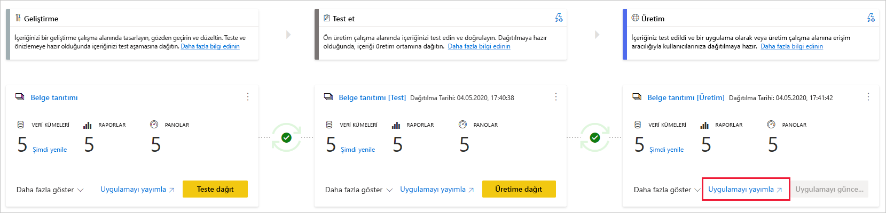
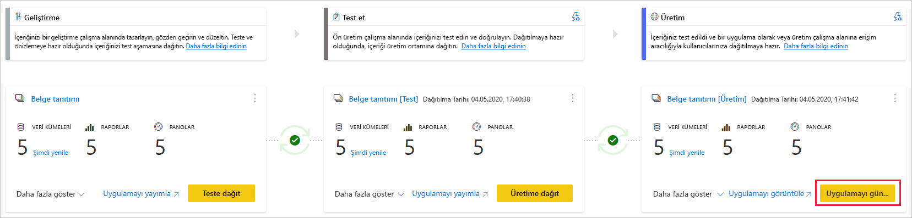

# Dağıtım işlemini anlama

Dağıtım süreci, içeriği işlem hattındaki bir aşamadan diğerine (genellikle geliştirmeden teste ve testten üretime) kopyalamanıza olanak verir.

Dağıtım sırasında Power BI, içeriği geçerli aşamadan hedef aşamaya kopyalar. Kopyalanan öğeler arasındaki bağlantılar kopyalama işlemi sırasında korunur. Ayrıca Power BI, hedef aşamadaki güncelleştirilmiş içeriğe yapılandırılmış veri kümesi kuralları uygular. İçeriği dağıtmak, dağıtılacak öğe sayısına bağlı olarak biraz zaman alabilir. Bu süre boyunca, Power BI portalındaki diğer sayfalarda gezinebilirsiniz ancak hedef aşamadaki içeriği kullanamazsınız.

## Boş bir aşamaya içerik dağıtma

İçeriği boş bir aşamaya dağıttığınızda, çalışma alanındaki raporların, panoların ve veri kümelerinin meta verileri dağıtım yapılan aşamaya kopyalanır. Dağıtım yaptığınız aşamaya yönelik yeni çalışma alanı bir Premium kapasitede oluşturulur.

Bir aşamadan diğerine içerik dağıtmanın iki yolu vardır. İçeriğin tamamını dağıtabilirsiniz veya [dağıtılacak içerik öğelerini seçebilirsiniz](deployment-pipelines-get-started.md#selective-deployment).

Ayrıca içeriği, dağıtım işlem hattındaki sonraki bir aşamadan önceki bir aşamaya geriye dönük olarak dağıtabilirsiniz.

Dağıtım tamamlandıktan sonra, yeni kopyalanmış içeriği kullanabilmek için veri kümelerini yenileyin. Veriler bir aşamadan diğerine kopyalanmadığından, veri kümesini yenilemek gerekir. Dağıtım sürecinde hangi öğe özelliklerinin kopyalandığını ve hangilerinin kopyalanmadığını anlamak için [dağıtım sırasında kopyalanan öğe özellikleri](#item-properties-copied-during-deployment) bölümünü gözden geçirin.

### Premium kapasite çalışma alanı oluşturma

İlk dağıtım sırasında, dağıtım işlem hatları Premium kapasite izinleriniz olup olmadığını denetler.  

Kapasite izinleriniz varsa çalışma alanının içeriği dağıtım yaptığınız aşamaya kopyalanır ve Premium kapasitede bu aşamaya yönelik yeni bir çalışma alanı oluşturulur.

Kapasite izinleriniz yoksa çalışma alanı oluşturulur ancak içerik kopyalanmaz. Bir kapasite yöneticisinin çalışma alanınızı kapasiteye eklemesini veya size kapasite için atama izinleri vermesini isteyebilirsiniz. Daha sonra, çalışma alanı kapasiteye atandığında içeriği bu çalışma alanına dağıtabilirsiniz.

[Kullanıcı Başına Premium (PPU)](../admin/service-premium-per-user-faq.md) kullanıyorsanız çalışma alanınız, PPU’nuz ile ilişkili kapasitede otomatik olarak oluşturulur. Böyle durumlarda kapasite izinleri gerekmez. Ancak, bir PPU kullanıcısı tarafından oluşturulan çalışma alanlarına yalnızca diğer PPU kullanıcıları erişebilir. Buna ek olarak, bu tür çalışma alanlarında oluşturulan içerikleri yalnızca PPU kullanıcıları tüketebilir.

### Çalışma alanı ve içerik sahipliği

Dağıtım yapan kullanıcı otomatik olarak, kopyalanan veri kümelerinin veri kümesi sahibi ve çalışma alanının tek yöneticisi olur.

## İçeriği mevcut bir çalışma alanına dağıtma

Çalışan bir üretim işlem hattındaki içeriği, mevcut bir çalışma alanına sahip olan bir aşamaya dağıtma sürecine aşağıdakiler dahildir:

* Yeni içerik, zaten başka içeriğe sahip olan bir aşamaya ek olarak dağıtılır.

* Yeni içerik, çalışmakta olan geçerli aşamadaki eski içerikle değiştirilmek üzere dağıtılır.

### Dağıtım süreci

Geçerli aşamadaki içerik, hedef aşamaya kopyalanır. Power BI, hedef aşamadaki mevcut içeriği tanımlar ve bu içeriğin üzerine yazar. Dağıtım işlem hatları, üzerine yazılması gereken içerik öğelerini belirlemek için üst öğe ve bu öğenin kopyaları arasındaki bağlantıyı kullanır. Yeni bir içerik oluşturulduğunda bu bağlantı korunur. Üzerine yazma işlemi, yalnızca öğenin içeriğinin üzerine yazar. Öğenin kimliği, URL’si ve izinleri değişmeden kalır.

Hedef aşamada [öğe özellikleri kopyalanmadan](deployment-pipelines-process.md#item-properties-that-are-not-copied), dağıtım öncesindeki haliyle aynı şekilde kalır. Yeni içerik ve yeni öğeler, geçerli aşamadan hedef aşamaya kopyalanır.

### Veri kümesini yenileme

Hedef veri kümesindeki veriler, mümkün olduğunda korunur. Veri kümesinde değişiklik yoksa veriler dağıtım öncesindeki haliyle korunur.

Tablo veya ölçüler ekleme gibi küçük değişiklikler olduğunda Power BI özgün verileri korur, yenileme işlemi yalnızca gerekli öğeleri yenilemek üzere iyileştirilir. Yeni şema değişikliklerinde veya veri kaynağı bağlantısındaki değişikliklerde, tam yenileme gereklidir.

### Mevcut bir çalışma alanına sahip olan bir aşamaya dağıtım gereksinimleri

Dağıtılan içerik bir [premium kapasitede](../admin/service-premium-what-is.md) olduğu sürece, aşağıdaki koşulları karşılayan bir kullanıcı mevcut çalışma alanına sahip bir aşamaya dağıtabilir:

* Hem kaynak hem de hedef dağıtım aşamalarındaki çalışma alanlarının her ikisine de üye olan, [Pro lisansına](../admin/service-admin-purchasing-power-bi-pro.md) sahip bir kullanıcı veya bir [PPU kullanıcısı](../admin/service-premium-per-user-faq.md).

* Dağıtım yapılmak üzere olan hedef çalışma alanındaki tüm veri kümelerinin sahibi.

Daha fazla bilgi edinmek için [izinler](#permissions) bölümünü gözden geçirin.

## Dağıtılan öğeler

Bir işlem hattından diğerine içerik dağıttığınızda, kopyalanan içerikte şu Power BI öğeleri yer alır:

* Veri kümeleri

* Raporlar

* Panolar

### Desteklenmeyen öğeler

Dağıtım işlem hatları aşağıdaki öğeleri desteklemez:

* Bir PBIX dosyasından oluşturulmayan veri kümeleri

* Desteklenmeyen veri kümelerini temel alan raporlar

* [Şablon uygulaması çalışma alanları](../connect-data/service-template-apps-create.md#create-the-template-workspace)

* Sayfalandırılmış raporlar

* Veri akışları

* PUSH veri kümeleri

* Çalışma kitapları

## Dağıtım sırasında kopyalanmış öğe özellikleri

Dağıtım sırasında, aşağıdaki öğe özellikleri kopyalanır ve hedef aşamadaki öğe özelliklerinin üzerine yazılır:

* Veri kaynakları ([veri kümesi kuralları](deployment-pipelines-get-started.md#step-4---create-dataset-rules) desteklenir)

* Parametreler ([veri kümesi kuralları](deployment-pipelines-get-started.md#step-4---create-dataset-rules) desteklenir)

* Rapor görselleri

* Rapor sayfaları

* Pano kutucukları

* Model meta verileri

* Veri ilişkileri

### Kopyalanamayan öğe özellikleri

Dağıtım sırasında şu öğe özellikleri kopyalanmaz:

* Veri: Veriler kopyalanmaz, yalnızca meta veriler kopyalanır

* URL

* ID

* İzinler: Bir çalışma alanı veya belirli bir öğe için

* Çalışma alanı ayarları: Her aşamanın kendi çalışma alanı vardır

* Uygulama içeriği ve ayarlar: Uygulamalarınızı dağıtmak için bkz. [Power BI uygulamalarını dağıtma](#deploying-power-bi-apps)

Dağıtım sırasında şu veri kümesi özellikleri de kopyalanmaz:

* Rol ataması

* Yenileme zamanlaması

* Veri kaynağı kimlik bilgileri

* Sorgu önbelleğe alma ayarları (kapasiteden alınabilir)

* Onay ayarları

## Artımlı yenileme

Dağıtım işlem hatları, daha düşük tüketimle büyük veri kümelerinin daha hızlı ve güvenilir yenilemeler yapmasına olanak sağlayan [artımlı yenileme](../admin/service-premium-incremental-refresh.md) özelliğini destekler.

Dağıtım işlem hatları sayesinde, hem verileri hem de bölümleri korurken artımlı yenileme ile veri kümesinde güncelleştirmeler yapabilirsiniz. Veri kümesini dağıttığınızda ilke de birlikte kopyalanır.

### İşlem hattında artımlı yenilemeyi etkinleştirme

Artımlı yenilemeyi etkinleştirmek için [Power BI Desktop’ta açın](../admin/service-premium-incremental-refresh.md#configure-incremental-refresh) ve sonra veri kümenizi yayımlayın. Yayımladıktan sonra, artımlı yenileme ilkesi işlem hattı genelinde benzerdir ve yalnızca Power BI Desktop’ta yazılabilir.

İşlem hattınız artımlı yenilemeyle yapılandırıldığında, aşağıdaki akışı kullanmanızı öneririz:

1. Power BI Desktop’taki PBIX dosyanızda değişiklikler yapın. Uzun bekleme sürelerini önlemek için, verilerinizin bir örneğini kullanarak değişiklik yapabilirsiniz.

2. PBIX dosyasını *geliştirme* aşamasına yükleyin.

3. İçeriğinizi *test* aşamasına dağıtın. Dağıtımın ardından, yaptığınız değişiklikler kullanmakta olduğunuz veri kümesinin tamamına uygulanır.

4. *Test* aşamasında yaptığınız değişiklikleri gözden geçirin ve bunları doğruladıktan sonra *üretim* aşamasına dağıtın.

### Kullanım örnekleri

Artımlı yenilemeyi dağıtım işlem hatlarıyla nasıl tümleştirebileceğinizi gösteren birkaç örnek aşağıda verilmiştir.

* [Yeni bir işlem hattı](deployment-pipelines-get-started.md#step-1---create-a-deployment-pipeline) oluşturun ve artımlı yenileme özelliği etkinleştirilmiş veri kümesi içeren bir çalışma alanına bu işlem hattını bağlayın.

* Zaten *geliştirme* çalışma alanında olan bir veri kümesinde artımlı yenilemeyi etkinleştirin.  

* Artımlı yenileme kullanan veri kümesi içeren bir üretim çalışma alanından işlem hattı oluşturun. Bu işlem, çalışma alanı yeni işlem hattının *üretim* aşamasına atanarak, önce *test* aşamasına dağıtmak için [geriye dönük dağıtım](deployment-pipelines-get-started.md#backwards-deployment) kullanılarak ve sonra *geliştirme* aşamasına dağıtılarak yapılır.

* Artımlı yenileme kullanan bir veri kümesini, mevcut bir işlem hattının bir parçası olan çalışma alanında yayımlayın.

### Sınırlamalar ve önemli noktalar

Artımlı yenileme için, dağıtım işlem hatları yalnızca [gelişmiş veri kümesi meta verilerini](../connect-data/desktop-enhanced-dataset-metadata.md) kullanan veri kümelerini destekler. Power BI Desktop’ın Eylül 2020 sürümünden itibaren, Power BI Desktop ile oluşturulan veya değiştirilen tüm veri kümeleri otomatik olarak gelişmiş veri kümesi meta verilerini uygular.

Artımlı yenilemenin etkin olduğu bir veri kümesi, etkin bir işlem hattında yeniden yayımlandığında veri kaybı olasılığı nedeniyle aşağıdaki değişiklikler dağıtım hatasına neden olur:

* Artımlı yenilemenin etkin olduğu bir veri kümesini değiştirmek için, artımlı yenilemenin etkin olmadığı bir veri kümesini yeniden yayımlama.

* Artımlı yenileme özelliği etkin olan bir tabloyu yeniden adlandırma.

* Artımlı yenilemenin etkin olduğu bir tabloda, hesaplanmamış sütunları yeniden adlandırma.

Sütun ekleme, kaldırma ve hesaplanmış bir sütunu yeniden adlandırma gibi diğer değişikliklere izin verilir. Ancak değişiklikler görüntüyü etkiliyorsa değişiklik görünür olmadan önce yenilemeniz gerekir.

## Power BI uygulamalarını dağıtma

[Power BI uygulamaları](../consumer/end-user-apps.md), ücretsiz Power BI kullanıcılarına içerik dağıtmak için önerilen yoldur. Uygulamanızın yaşam döngüsü söz konusu olduğunda daha fazla denetim ve esnekliğe sahip olabilmeniz için, dağıtım işlem hatlarını kullanarak dağıtım işlem hattındaki Power BI uygulamalarını yönetebilirsiniz.

Her dağıtım işlem hattı aşaması için bir uygulama oluşturun, böylece her uygulama güncelleştirmesini son kullanıcının bakış açısıyla test edebilirsiniz. Dağıtım işlem hattı, bu süreci kolayca yönetmenizi sağlar. Çalışma alanı kartındaki yayımla veya görüntüle düğmesini kullanarak uygulamayı yayımlayın veya belirli bir işlem hattı aşamasında görüntüleyin.

Üretim aşamasında, sağ alt köşedeki ana eylem düğmesi Power BI’da uygulama güncelleştirme sayfasını açar, böylece tüm içerik güncelleştirmeleri uygulama kullanıcılarının kullanımına sunulur.

>[!IMPORTANT]
>Dağıtım işlemi, uygulama içeriğinin veya ayarlarının güncelleştirilmesini içermez. İçerikte ve ayarlarda değişiklikler uygulamak için, uygulamayı gerekli işlem hattı aşamasında kendiniz güncelleştirmeniz gerekir.

## İzinler

İşlem hattı izinleri ve çalışma alanı izinleri ayrı ayrı sağlanıp yönetilir. Örneğin, çalışma alanı izinleri olmayan bir işlem hattına erişimi olan bir kullanıcı, işlem hattını görüntüleyip başkalarıyla paylaşabilir. Ancak, bu kullanıcıyı işlem hattındaki çalışma alanının veya çalışma alanı sayfasının içeriğini görüntüleyemez ve dağıtım gerçekleştiremez.

### İşlem hattı erişimi olan kullanıcı

İşlem hattı erişimi olan kullanıcılar aşağıdaki izinlere sahiptir:

* İşlem hattını görüntüleme

* İşlem hattını başkalarıyla paylaşma

* İşlem hattını düzenleme ve silme

>[!NOTE]
>İşlem hattı erişimi, çalışma alanı içeriği üzerinde görüntüleme veya işlem yapma izni sağlamaz.

### Çalışma Alanı Görüntüleyicisi

*İşlem hattı erişimi* olan çalışma alanı görüntüleyicileri şunları da yapabilir:

* İçerik tüketme

>[!NOTE]
>Çalışma alanı görüntüleyicileri veri kümesine erişemez veya çalışma alanı içeriğini düzenleyemez.

### Çalışma alanı katkıda bulunanı

*İşlem hattı erişimi* olan çalışma alanı katkıda bulunanları şunları da  yapabilir:

* İçerik tüketme

* Aşamaları karşılaştırma

* Veri kümelerini görüntüleme

### Çalışma alanı üyesi

*İşlem hattı erişimi* olan çalışma alanı üyeleri şunları da yapabilir:

* Çalışma alanı içeriğini görüntüleme

* Aşamaları karşılaştırma

* Raporları ve panoları dağıtma

* Çalışma alanlarını kaldırma

### Çalışma alanı yöneticisi

*İşlem hattı erişimi* olan çalışma alanı yöneticileri, *çalışma alanı üyesi* eylemlerini gerçekleştirmenin yanı sıra şunları da yapabilir:

* Çalışma alanları atama

* Çalışma alanlarını kaldırma

### Veri kümesi sahibi

Çalışma alanı üyesi veya yöneticisi olan veri kümesi sahipleri şunları da yapabilir:

* Veri kümelerini güncelleştirme

* Kuralları yapılandırma

>[!NOTE]
>Bu bölümde, dağıtım işlem hatlarındaki kullanıcı izinleri açıklanır. Bu bölümde listelenen izinler, diğer Power BI özelliklerindeki farklı uygulamalara sahip olabilir.

## Sınırlamalar

Bu bölümde, dağıtım işlem hatlarındaki sınırlamaların çoğu listelenir.

* Çalışma alanının bir  [premium kapasitede](../admin/service-premium-what-is.md) bulunması gerekir.

* Raporlar ve panolar gibi Power BI [duyarlılık etiketlerine](../admin/service-security-sensitivity-label-overview.md) sahip olan Power BI öğeleri dağıtılamaz.

* Tek bir dağıtımda en fazla 300 Power BI öğesi dağıtılabilir.

* PBIX dosyasını dağıtımdan sonra indirme işlemi desteklenmez.

* Çalışma alanı sınırlamalarının listesi için bkz. [çalışma alanı atama sınırlamaları](deployment-pipelines-get-started.md#workspace-assignment-limitations).

* Desteklenmeyen öğelerin listesi için bkz. [desteklenmeyen öğeler](#unsupported-items).

### Veri kümesi sınırlamaları

* Gerçek zamanlı veri bağlantısı kullanan veri kümeleri dağıtılamaz.

* Hedef veri kümesi dağıtım sırasında bir [canlı bağlantı](../connect-data/desktop-report-lifecycle-datasets.md)kullanıyorsa kaynak veri kümesinin de bu bağlantı modunu kullanması gerekir.

* Dağıtımdan sonra, bir veri kümesinin (dağıtıldığı aşamadan) indirilmesi desteklenmez.

* Veri kümesi kuralı sınırlamaları listesi için bkz. [veri kümesi kuralı sınırlamaları](deployment-pipelines-get-started.md#dataset-rule-limitations).

## Sonraki adımlar

>[!div class="nextstepaction"]
>[Dağıtım işlem hatlarına giriş](deployment-pipelines-overview.md)

>[!div class="nextstepaction"]
>[Dağıtım işlem hatlarına yönelik en iyi yöntemler](deployment-pipelines-best-practices.md)

>[!div class="nextstepaction"]
>[Dağıtım işlem hatlarını kullanmaya başlama](deployment-pipelines-get-started.md)

>[!div class="nextstepaction"]
>[Dağıtım işlem hatlarıyla ilgili sorunları giderme](deployment-pipelines-troubleshooting.md)
