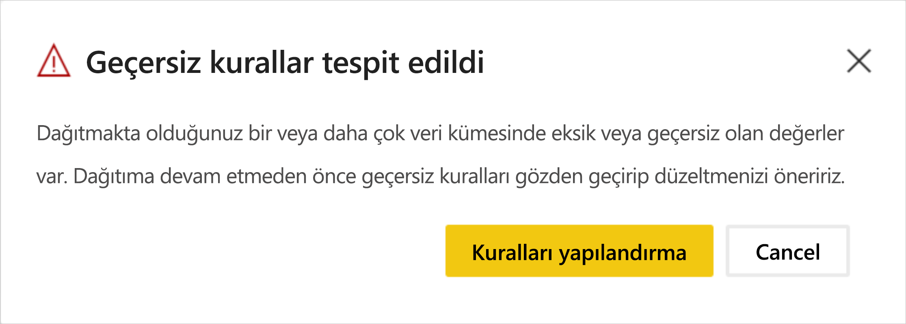

# Dağıtım işlem hatları sorunlarını giderme (önizleme)

Dağıtım işlem hatlarında sorunları gidermek için bu makaleyi kullanın.

## Genel

### Power BI’daki dağıtım işlem hatları nedir?

Power BI’daki dağıtım işlem hatlarını anlamak için [dağıtım işlem hatlarına ilişkin genel bakışa](deployment-pipelines-overview.md) göz atın.

### Dağıtım işlem hatlarını nasıl kullanmaya başlarım?

[Kullanmaya başlama yönergelerini](deployment-pipelines-get-started.md) kullanarak dağıtım işlem hatlarını kullanmaya başlayın.

### Dağıtım işlem hatları düğmesini neden göremiyorum?

Aşağıdaki koşullar karşılanmazsa dağıtım işlem hatları düğmesini görüntüleyemezsiniz.

* Power BI [Pro kullanıcısı](../admin/service-admin-purchasing-power-bi-pro.md) olma

* Premium kapasiteye sahip bir kuruluşta çalışma

* Çalışma alanı yalnızca tek bir işlem hattına atanabilir

* Yeni çalışma alanı yöneticisi olma

## Lisanslama

### Dağıtım işlem hatlarıyla çalışmak için hangi lisanslara sahip olmak gerekir?

Dağıtım işlem hatlarını kullanmak için [Premium kapasiteye](../admin/service-premium-what-is.md) sahip bir [Pro kullanıcı](../admin/service-admin-purchasing-power-bi-pro.md) olmanız gerekir. Daha fazla bilgi için bkz. [dağıtım işlem hatlarına erişme](deployment-pipelines-get-started.md#accessing-deployment-pipelines).

### Bir işlem hattındaki çalışma alanına hangi tür kapasiteyi atayabilirim?

Bir dağıtım işlem hattındaki tüm çalışma alanlarının, işlem hattının işlevsel olması için ayrılmış bir kapasitede yer alması gerekir. Ancak, bir işlem hattındaki farklı çalışma alanları için farklı kapasiteler kullanabilirsiniz. Aynı işlem hattındaki farklı çalışma alanları için farklı kapasite türleri de kullanabilirsiniz.

Geliştirme ve test için, her kullanıcıya yönelik bir Pro Power BI hesabının yanı sıra A veya EM kapasitesini kullanabilirsiniz.

Üretim çalışma alanları için bir P kapasitenizin olması gerekir. Ekli uygulamalar aracılığıyla içerik dağıtan bir ISV’yseniz üretim için A ve EM kapasitelerini de kullanabilirsiniz.

## Teknik

### Bir işlem hattına çalışma alanı atamaya çalıştığımda neden tüm çalışma alanlarımı göremiyorum?

Bir işlem hattına çalışma alanı atamak için aşağıdaki koşulların karşılanması gerekir:

* Çalışma alanının bir [yeni çalışma alanı deneyimi](../collaborate-share/service-create-the-new-workspaces.md) olması

* Çalışma alanının yöneticisi olmanız

* Çalışma alanının başka bir işlem hattına atanmamış olması

* Çalışma alanının [Premium kapasitede](../admin/service-premium-what-is.md) bulunması

Bu koşulları karşılamayan çalışma alanları, seçim yapmak için kullanabileceğiniz çalışma alanları listesinde gösterilmez.

### Çalışma alanlarını bir işlem hattındaki tüm aşamalara nasıl atayabilirim?

Dağıtım işlem hattı başına bir çalışma alanı atayabilirsiniz. Bir işlem hattına çalışma alanı atandıktan sonra, bunu sonraki işlem hattı aşamalarına dağıtabilirsiniz. İlk dağıtım sırasında, kaynak aşamasındaki öğelerin kopyalarını içeren yeni bir çalışma alanı oluşturulur. Kopyalanan öğelerin ilişkileri korunur. Daha fazla bilgi için bkz. [dağıtım işlem hattına çalışma alanı atama](deployment-pipelines-get-started.md#step-2---assign-a-workspace-to-a-deployment-pipeline).

### İlk dağıtımım neden başarısız oldu?

İlk dağıtımınız bazı nedenlerden dolayı başarısız olmuş olabilir. Bu nedenlerden bazıları aşağıdaki tabloda listelenmiştir.

|Hata  |Eylem  |
|---------|---------|
|[Premium kapasite izinleriniz](deployment-pipelines-process.md#creating-a-premium-capacity-workspace) yok.     |Premium kapasite izinleri almak için, bir kapasite yöneticisinin çalışma alanınızı kapasiteye eklemesini veya size kapasite için atama izinleri vermesini isteyin. Çalışma alanınızı bir kapasiteye ekledikten sonra yeniden dağıtın.        |
|Çalışma alanı izinleriniz yok.     |Dağıtmak için bir çalışma alanı üyesi olmanız gerekir. Çalışma alanı yöneticinizden size uygun izinleri vermesini isteyin.         |
|Power BI yöneticiniz çalışma alanlarının oluşturulmasını devre dışı bıraktı.     |Destek için Power BI yöneticinize başvurun.         |
|Çalışma alanınız bir [yeni çalışma alanı deneyimi](../collaborate-share/service-create-the-new-workspaces.md) değil.     |İçeriğinizi yeni çalışma alanı deneyiminde oluşturun. İçeriğiniz bir klasik çalışma alanındaysa bunu yeni çalışma alanı deneyimine [yükseltebilirsiniz](../collaborate-share/service-upgrade-workspaces.md).         |
|[Seçmeli dağıtım](deployment-pipelines-get-started.md#selective-deployment) kullanıyorsunuz ve içeriğinizin veri kümesini seçmiyorsunuz.     |Aşağıdakilerden birini yapın:   Veri kümenizle bağlantılı içeriğin seçimini kaldırın. Seçilmeyen içeriğiniz (raporlar veya panolar gibi) sonraki aşamaya kopyalanmaz.   Seçili içerikle bağlantılı veri kümesini seçin. Veri kümeniz sonraki aşamaya kopyalanır.         |

### Dağıtmaya çalıştığımda çalışma alanımda “desteklenmeyen yapıtların” olduğuna dair uyarı alıyorum. Hangi yapıtların desteklenmediğini nasıl anlayabilirim?

Dağıtım işlem hatlarında desteklenmeyen öğelerin ve yapıtların kapsamlı bir listesi için aşağıdaki bölümleri gözden geçirin:

* [Desteklenmeyen öğeler](deployment-pipelines-process.md#unsupported-items)

* [Kopyalanamayan öğe özellikleri](deployment-pipelines-process.md#item-properties-that-are-not-copied)

### Dağıtımım neden hatalı kurallardan dolayı başarısız oldu?

Veri kümesi kurallarını yapılandırmayla ilgili sorun yaşıyorsanız [veri kümesi kurallarını](deployment-pipelines-get-started.md#step-4---create-dataset-rules) ziyaret edin ve [veri kümesi kural sınırlamalarını](deployment-pipelines-get-started.md#dataset-rule-limitations) izlediğinizden emin olun.

Dağıtımınız daha önce başarılı olduysa ve hatalı kurallar nedeniyle bir anda başarısız oluyorsa bu, yeniden yayımlanmakta olan veri kümesinden kaynaklanabilir. Kaynak veri kümesinde yapılan aşağıdaki değişiklikler, başarısız bir dağıtımla sonuçlanır:

**Parametre kuralları**

* Kaldırılmış bir parametre

* Değiştirilmiş bir parametre adı

**Veri kaynağı kuralları**

Veri kümesi kurallarınızın değerleri eksik. Bu durum, veri kümenizin değişmesinden dolayı oluşabilir.

Önceden başarılı olan bir dağıtım hatalı bağlantılar nedeniyle başarısız olursa bir uyarı görüntülenir. Başarısız veri kümelerinin işaretlendiği dağıtım ayarları bölmesine gitmek için **Kuralları yapılandırma**’ya tıklayabilirsiniz. Veri kümesine tıkladığınızda hatalı kurallar işaretlenir.

Başarıyla dağıtmak için hatalı kuralları düzeltin veya kaldırın ve yeniden dağıtın.

### İşlem hattı aşamalarındaki veri kaynağını nasıl değiştirebilirim?

Power BI hizmetindeki veri kaynağı bağlantısını değiştiremezsiniz.

Test veya üretim aşamalarındaki veri kaynağını değiştirmek istiyorsanız [veri kümesi kurallarını](deployment-pipelines-get-started.md#step-4---create-dataset-rules) veya [API’leri](https://docs.microsoft.com/rest/api/power-bi/datasets/updateparametersingroup) kullanabilirsiniz. Veri kümesi kuralları, yalnızca sonraki dağıtımın ardından etkili olur.

### Üretimde bir hata düzelttim, ancak şimdi “önceki aşamaya dağıt” düğmesine tıklayamıyorum. Neden gri renkte?

Geriye dönük dağıtımı yalnızca boş bir aşamaya yapabilirsiniz. Test aşamasında içeriğiniz varsa üretimden geriye dönük dağıtım yapamazsınız.

İşlem hattını oluşturduktan sonra, içeriğinizi geliştirmek için geliştirme aşamasını, gözden geçirip test etmek için ise test aşamalarını kullanın. Bu aşamalarda hataları düzeltebilir ve sonra düzeltilmiş ortamı üretim aşamasına dağıtabilirsiniz.

>[!NOTE]
>Geriye doğru dağıtım yalnızca [tam dağıtımı](deployment-pipelines-get-started.md#deploying-all-content) destekler. [Seçmeli dağıtımı](deployment-pipelines-get-started.md#selective-deployment) desteklemez.

### Dağıtım işlem hatları çoklu coğrafi bölgeyi destekler mi?

Çoklu coğrafi bölge desteklenir. Farklı coğrafi bölgelerdeki aşamalar arasında içerik dağıtmak daha uzun sürebilir.

## İzinler

### Dağıtım işlem hatları izinler modeli nedir?

Dağıtım işlem hatları izinler modeli [izinler](deployment-pipelines-process.md#permissions) bölümünde açıklanır.

### Aşamalar arasında kimler içerik dağıtabilir?

İçerik boş bir aşamaya veya içeriğe sahip olan bir aşamaya dağıtılabilir. İçeriğin bir [premium kapasitede](../admin/service-premium-what-is.md) yer alması gerekir.

* **Boş bir aşamaya dağıtma**: Kaynak çalışma alanında üye veya yönetici olan herhangi bir [Pro kullanıcı](../admin/service-admin-purchasing-power-bi-pro.md).

* **İçeriğe sahip olan bir aşamaya dağıtma**: Hem hedef hem de kaynak dağıtım aşamalarındaki çalışma alanlarının her ikisinin de üyesi veya yöneticisi olan bir [Pro kullanıcı](../admin/service-admin-purchasing-power-bi-pro.md).

* **Bir veri kümesini geçersiz kılma**: Dağıtım, veri kümesi değişmese bile hedef aşamaya dahil olan her veri kümesini geçersiz kılar. Kullanıcının, dağıtımda belirtilen tüm hedef aşama veri kümelerinin sahibi olması gerekir.

### Veri kümesi kurallarını yapılandırmak için hangi izinlere sahip olmam gerekir?

Dağıtım işlem hatlarında veri kümesi kurallarını yapılandırmak için veri kümesi sahibi olmanız gerekir.

### İşlem hattındaki çalışma alanlarını neden göremiyorum?

İşlem hattı ve çalışma alanı izinleri ayrı ayrı yönetilir. İşlem hattı izinlerine sahip olup çalışma alanı izinlerine sahip olmayabilirsiniz. Daha fazla bilgi edinmek için [izinler](deployment-pipelines-process.md#permissions) bölümünü gözden geçirin.

## Sonraki adımlar

>[!div class="nextstepaction"]
>[Dağıtım işlem hatlarına giriş](deployment-pipelines-overview.md)

>[!div class="nextstepaction"]
>[Dağıtım işlem hatlarını kullanmaya başlama](deployment-pipelines-get-started.md)

>[!div class="nextstepaction"]
>[Dağıtım işlem hattı sürecini anlama](deployment-pipelines-process.md)

>[!div class="nextstepaction"]
>[Dağıtım işlem hatlarına yönelik en iyi yöntemler](deployment-pipelines-best-practices.md)