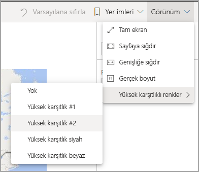
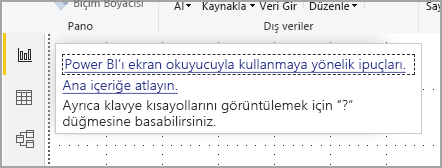
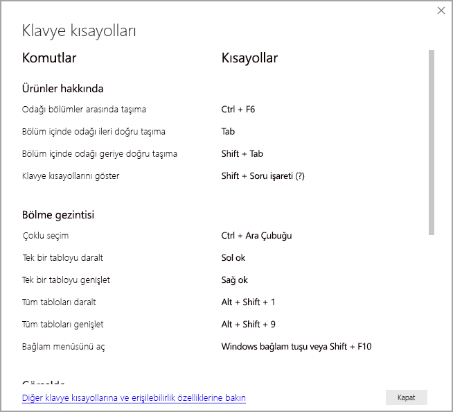
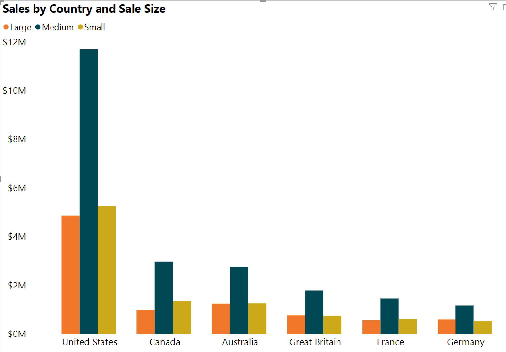
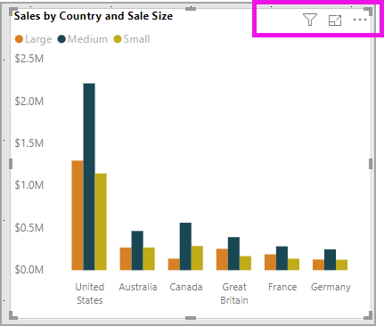

# Erişilebilirlik özelliklerinden faydalanarak Power BI raporlarını kullanma
Power BI'da, engelli kullanıcıların Power BI raporlarını daha kolay bir şekilde kullanmasına ve raporlarla etkileşime geçmesine yardımcı olan birçok özellik bulunur. Bu araçlar, kullanıcıların yardımcı teknoloji kullanmayan bir rapordan aynı bilgileri almasına yardımcı olur.

Bu makaleyi okurken bilinmesi gereken birkaç terim vardır:

* **Odak**, farenizin sayfada bulunduğu yerdir. Odak genellikle bir nesneyi çevreleyen mavi kenarlıkla belirtilir.
* **Tuval**, raporunuzun sayfa alanıdır.

Aşağıdaki bölümlerde, Power BI raporlarını kullanmaya yönelik erişilebilirlik araçları açıklanmıştır.

## Klavye ile gezinme

Power BI Desktop veya Power BI hizmetini başlattığınızda, **Tab** tuşuna basar basmaz sağ üst köşede bir araç ipucu görünür. **Ekran okuyucu ile Power BI kullanma ipuçları** başlıklı bağlantı size bu makaleye yönlendirir ve erişilebilirlik araçlarıyla bir raporu kullanma hakkında bilgiler verir. **Ana içeriğe atla** bağlantısına tıkladığınızda rapor tuvaline gidersiniz.

**?** düğmesine bastığınızda Power BI'da en sık kullanılan klavye kısayollarının bulunduğu bir iletişim kutusu açılır. Power BI’daki klavye kısayollarının tam listesini görmek için iletişim kutusunun altındaki bağlantıya giderek [klavye kısayolları](desktop-accessibility-keyboard-shortcuts.md) ile ilgili Power BI belgelerini görüntüleyebilirsiniz.

**Ctrl + F6** tuşlarını kullanarak bir rapordaki rapor sayfası sekmeleri veya nesneler arasında odağı değiştirebilirsiniz. Odak yüklenmiş rapor sayfası üzerindeyken odağı sayfadaki nesnelerin (tüm metin kutuları, resimler, şekiller ve grafikler dahil) her birine kaydırmak için **Sekme** tuşunu kullanın. 

Genel olarak, yazmak veya girmek için **Enter** tuşu, çıkmak için **Esc** tuşu Power BI’daki yaygın komutlardır.

### Görseller için klavye gezintisi

Birçok Power BI rapor oluşturucusu çok fazla veri içeren raporlar oluşturmaktadır. Bir görselde gezinirken görseldeki her öğe arasında sekmeyle gezmek can sıkıcı olabilir. Görsellerde klavye gezintisi, üç düzeyli bir hiyerarşi olarak tasarlanmıştır. Bu üç düzey aşağıdaki paragraflarda açıklanmıştır.

İlk düzeyde gezinmek için, bir görsele gittiğinizde **Ctrl + sağ ok** tuşlarına basarak görsele girebilirsiniz. Görsele girdikten sonra **Tab** tuşuna basarak görselin ana alanlarında gezinebilirsiniz. Gezinebileceğiniz ana alanlar veri çizim alanı, eksen kategorileri (görsel için geçerliyse) ve göstergedir (görselde varsa).

Aşağıdaki .gif dosyasında, görselin birinci düzeyinde bir kullanıcının nasıl gezindiği gösterilmektedir:

Hiyerarşinin ikinci düzeyi, görselin ana alanlarından birine (veri çizim alanı, x ekseni kategorileri, gösterge) girmektir. Bir raporu kullanırken bu ana alanlardan birine geçebilir ve görselin ilgili bölümündeki veri noktaları veya kategoriler arasında gezinebilirsiniz. Daha fazla araştırmak istediğiniz alana karar verdikten sonra **Enter** tuşuna basarak ilgili alanda gezinebilirsiniz.

Bir serideki tüm veri noktalarını seçmek istiyorsanız göstergeye gidip **Enter** tuşuna basın. Göstergeye girdikten sonra **Tab** tuşuna basarak farklı kategorilerde gezinebilirsiniz. Belirli bir seriyi seçmek için **Enter** tuşuna basın.

Belirli veri noktalarını seçmek istiyorsanız göstergeye gidip **Enter** tuşuna basın. Veri çizimi alanına girdikten sonra **Tab** tuşuna basarak veri noktaları arasında gezinebilirsiniz. Görselinizde birden çok seri varsa, farklı bir serideki veri noktalarına atlamak için **Yukarı ok** veya **Aşağı ok** tuşuna basabilirsiniz.

Bir kategori eksenindeki tüm veri noktalarını seçmek istiyorsanız eksen etiketlerine gidip **Enter** tuşuna basın. Eksen etiketlerine girdikten sonra **Tab** tuşuna basarak etiket adları arasında gezinebilirsiniz. Etiket adı seçmek için **Enter** tuşuna basın.

Bir katmana gittiyseniz **Esc** tuşuna basarak o katmandan ayrılabilirsiniz. Aşağıdaki .gif görüntüsünde bir kullanıcının görsel düzeylerine nasıl girip çıkabileceği ve veri noktalarını, x ekseni kategori etiketlerini nasıl seçebileceği, farklı bir seriye nasıl atlayabileceği ve bir serideki tüm veri noktalarını nasıl seçebileceği gösterilmektedir.

Klavye kullanırken bir nesnede veya görsel gezinemiyorsanız, bunun nedeni rapor yazarının o nesneyi sekme sırasından gizlemeye karar vermesi olabilir. Rapor yazarları genellikle dekoratif nesneleri sekme sırasından gizler. Bir raporda mantıksal bir şekilde gezinemiyorsanız rapor yazarıyla iletişime geçmeniz gerekir. Rapor yazarları nesneler ve görseller için sekme sırasını ayarlayabilir.

### Dilimleyiciler için klavye gezintisi

Dilimleyicilerde de yerleşik olarak erişilebilirlik işlevleri bulunur. Dilimleyici seçtiğinizde, dilimleyicinin değerini ayarlamak için **Ctrl + Sağ ok** tuşlarını kullanarak dilimleyici içindeki çeşitli denetimler arasında ilerleyin. Örneğin başlangıçta **Ctrl + Sağ ok** tuşlarına bastığınızda odak silginin üzerindedir. Ardından **ara çubuğuna** basmak, dilimleyicideki tüm değerleri silen silgi düğmesine tıklamakla eşdeğerdir.

**Sekme** tuşuna basarak dilimleyicideki denetimler arasında ilerleyebilirsiniz. Silgideyken **Sekme** tuşuna basıldığında, aşağı açılan liste düğmesine geçilir. Bir kez daha **Sekme** tuşuna basıldığında ilk dilimleyici değerine gidilir (dilimleyicide birden çok değer, örneğin bir aralık varsa).

### Sayfaları değiştirme

Odak rapor sayfası sekmeleri üzerindeyken, odağı bir rapor sayfasından sonraki rapor sayfasına geçirmek için **Sekme** veya **Ok** tuşlarını kullanın. Ekran okuyucu rapor sayfasının başlığını okur ve sayfanın seçili olup olmadığı söyler. Şu anda odakta olan rapor sayfasını yüklemek için **Enter** tuşunu ve **ara çubuğunu** kullanın.

### Görsel başlığına erişme
Görseller arasında ilerlerken **Alt + Shift + F10** tuşlarına basarak odağı görsel üst bilgisine taşıyabilirsiniz. Gösrsel üst bilgisi sıralama, grafiğin arkasındaki verileri dışarı aktarma ve Odak modu gibi çeşitli seçenekler içerir. Görsel başlığında gördüğünüz simgeler, rapor yazarının göstermeye karar verdiği seçeneklere bağlıdır.

## Ekran okuyucu

Bir raporu görüntülerken tarama modundan çıkmak en iyisidir. Power BI, belgeden çok bir uygulama gibi kabul edilmelidir. Bu nedenle, gezinmeyi kolaylaştırmak üzere özel gezinti özelliğiyle donatılmıştır. Power BI Desktop ile ekran okuyucu kullanırken, Power BI Desktop’ı açmadan önce ekran okuyucunuzun açık olduğundan da emin olmanız gerekir.

Nesneler arasında gezinirken ekran okuyucu nesnenin türünü ve nesnenin başlığını (varsa) okur. Rapor yazarı tarafından sağlanmışsa, ekran okuyucu söz konusu nesnenin (alternatif metin) açıklamasını da okur.

### Verileri göster
**Verileri göster** penceresinin erişilebilir bir sürümünün gösterilmesi için **Alt + Shift + F11** tuşlarına basabilirsiniz. Bu pencere, görselde kullanılan verileri ekran okuyucunuzda her zaman kullandığınız klavye kısayollarını kullanarak bir HTML tablosunda incelemenizi sağlar.

**Verileri göster** özelliği, ekran okuyucunun yalnızca bu klavye kısayolu aracılığıyla erişebildiği bir HTML tablosudur. Görsel başlığındaki seçenekten **Verileri göster**’i açarsanız, ekran okuyucu ile uyumlu *olmayan* bir tablo gösterilir.  Klavye kısayolları aracılığıyla **Verileri göster** özelliğini kullanırken, ekran okuyucunuzun sağladığı tüm kısayol tuşlarından yararlanmak için tarama modunu açın.

**Verileri Göster** görünümünden çıkıp bir rapora dönmek için **Esc** tuşuna basın.

## Yüksek karşıtlık modları

Power BI hizmeti Windows tarafından seçilen yüksek karşıtlık ayarlarını algılamayı dener. Bu algılama denemesinin etkili ve doğru olması, Power BI hizmetinin gösterildiği tarayıcıya bağlıdır. Power BI hizmetinde temayı el ile ayarlamak isterseniz, **Görünüm > Yüksek karşıtlık renkleri**’ni ve sonra rapora uygulamak istediğiniz temayı seçebilirsiniz.

## Sonraki adımlar

Power BI erişilebilirliği ile ilgili makale koleksiyonu aşağıda verilmiştir:

* [Power BI’da erişilebilirliğe genel bakış](desktop-accessibility-overview.md) 
* [Erişilebilir Power BI raporları oluşturma](desktop-accessibility-creating-reports.md) 
* [Power BI raporlarını erişilebilirlik araçlarıyla oluşturma](desktop-accessibility-creating-tools.md)
* [Power BI raporlarına yönelik erişilebilirlik klavye kısayolları](desktop-accessibility-keyboard-shortcuts.md)
* [Rapor erişilebilirliği denetim listesi](desktop-accessibility-creating-reports.md#report-accessibility-checklist)
