# Power BI’da erişilebilirlik araçlarını kullanarak rapor oluşturma

Rapor oluşturmak için erişilebilirlik araçlarını kullanan rapor oluşturucuları Power BI’da işleme yardımcı olabilen çok sayıda yerleşik özellik bulunur.

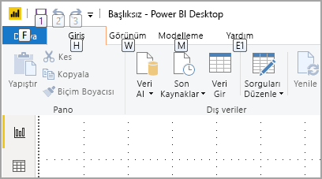

Bu makalede, Power BI Desktop’ta rapor oluşturucularının kullanabileceği birçok türdeki erişilebilirlik araçları açıklanmaktadır.

## Uygulama düzeyinde gezinti
Power BI Desktop’ta gezinirken **Ctrl + F6** tuşlarına basarak uygulamanın ana bölümlerine odaklanabilirsiniz. Power BI Desktop ana bölümünde odak noktasını değiştirme işlemi aşağıdaki sırayla ilerler:

1. Tuvaldeki nesneler
2. Sayfa sekmeleri
3. Bölmeler (her biri ayrı ayrı, açık olanlar için soldan sağa)
4. Görünüm gezgini
5. Alt bilgi
6. Oturum aç
7. Sarı uyarı/hata/güncelleştirme çubuğu

Çoğu durumda, **Enter** tuşunu kullanarak bir alan seçmek veya alana girmek ve sonra **Esc** tuşunu kullanarak çıkış yapmak Power BI’daki yaygın yordamlardır.

## Şeritte gezinti

Şeridin geçerli görünümünde mevcut olan her bir komutun üzerinde *Tuş İpuçları* adlı küçük kutuları görmek için **Alt** tuşuna basın. Ardından, kullanmak istediğiniz komutun üzerine gelen *Tuş İpucu* içinde gösterilen harfe basabilirsiniz. 

Örneğin, aşağıdaki görüntüde erişilebilir komutların harflerini içeren Tuş İpuçlarını görüntülemek üzere **Alt** tuşuna basılmıştır. Bundan sonra **M** tuşuna basıldığında şeritteki **Modelleme** sekmesi açılır.

Bastığınız harfe bağlı olarak ek Tuş İpuçları görebilirsiniz. Örneğin, **Giriş** sekmesi etkinse ve **W** tuşuna basarsanız, **Görünüm** sekmesi ile birlikte **Görünüm** şerit sekmesindeki gruplara ait Tuş İpuçları gösterilir. Kullanmak istediğiniz belirli komutun harfine gelene kadar Tuş İpuçlarında gösterilen harflere basmaya devam edebilirsiniz. Bir önceki Tuş İpuçları kümesine geçmek için **Esc** tuşuna basın. Yaptığınız işlemi iptal edip Tuş İpuçlarını gizlemek için **Alt** tuşuna basın.

## Görsel bölme gezintisi

**Görselleştirmeler** bölmesinde gezinmek için, bölmeye ulaşana kadar **Ctrl + F6** tuşlarına basarak öncelikle bölmeye odaklandığınızdan emin olun. Bir kullanıcı görselleştirmeler bölmesinde gezindiğinde odak ilk olarak üst bilgiye geçer. En üstten başlayarak sekme sırası aşağıdaki gibidir ve aşağıdaki görüntüde gösterilmiştir:

1. Üst bilgi başlığı
2. Genişlet/daralt simgesi
3. İlk görsel simgesi

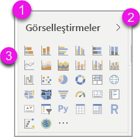

Görsellere geldiğinizde, belirli bir görsele gitmek için ok tuşlarını kullanabilir ve **Enter** tuşuna basarak görseli seçebilirsiniz. Ekran okuyucu kullanıyorsanız, yeni bir grafik oluşturup ne türde olduğunu söylediyseniz bunu okur veya belirli bir türdeki grafiği başka bir türdeki grafikle değiştirdiğinizi söyler. 

Bölmenin görseller bölümünden sonra odak sırası, aşağıdaki görüntüde gösterildiği gibi bölme özetlerine kayar.

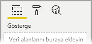

Odak bölme özetlerindeyken, sekme yalnızca seçili bölmenin simgesine gelir. Diğer bölmelere geçiş yapmak için ok tuşlarını kullanın.

## Alan yuvası

Odak bölme özetlerinde olduğunda, önceki bölümde açıklandığı gibi Tab tuşuna tekrar basılması durumunda odak **Alan Yuvası**’na ilerler. 

**Alan yuvası**’nda odak sırası şuralara taşınır:

* her yuvanın başlığı (ilk olarak)
* sonra her yuvadaki belirli bir alan (daha sonra)
* alan menüsünü açmak için açılır menü düğmesi (ondan sonra)
* sonra kaldırma düğmesi (son olarak)

Aşağıdaki görüntüde bu odak ilerleme sıralaması gösterilmektedir.

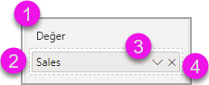

Ekran okuyucu, yuvanın adını ve araç ipucunu okur. Ekran okuyucu, bir yuvadaki her alan için alan adını ve araç ipucunu okur. Bir yuva boşsa odak tüm boş yuvaya ilerlemelidir. Ekran okuyucu yuva adını, araç ipucunu ve yuvanın boş olduğunu okumalıdır.

Alan menüsü açıkken **Tab** veya **Shift + Tab** tuşlarını ya da **Yukarı** / **Aşağı** ok tuşlarını kullanarak taşıyabilirsiniz. Ekran okuyucu seçenek adlarını okur.

Alan yuvasındaki bir alanı bir demetten başka bir demete taşımak istiyorsanız klavyenizi kullanabilir ve aşağıdaki görüntüde gösterildiği gibi alan yuvası menüsündeki **Şuraya taşı** seçeneğini kullanabilirsiniz.

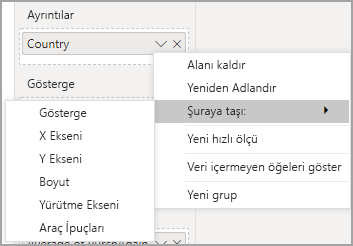

## Biçimlendirme bölmesi

**Biçimlendirme** bölmesi için odak sırası, kart sırasıyla en üstten aşağıya doğru ilerler. Odak kart adının etrafındadır, sonra varsa iki durumlu **Açık/Kapalı** düğmesine geçer. Odak kart adında olduğunda, ekran okuyucu kartın adını ve kartın genişletilmiş veya daraltılmış olduğunu okur. Kartı genişletmek veya daraltmak için **Enter** tuşuna basabilirsiniz. **Enter** tuşu, iki durumlu düğmeyi **Açık** veya **Kapalı** duruma getirmeye de yarar.

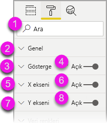

Bir kart açıksa **Tab** tuşu bir sonraki karta geçmeden önce karttaki denetimler arasından ilerler. Bir karttaki denetimler için ekran okuyucu başlık, geçerli değer ve denetim türünü okur.  

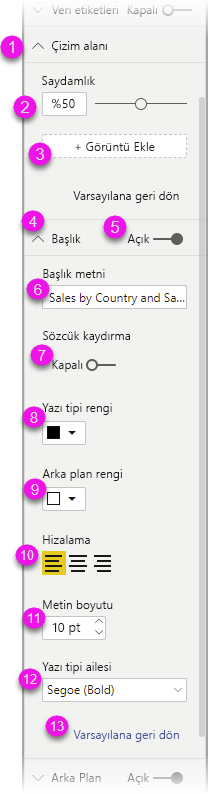

## Alanlar listesinde gezinti

**Alanlar** listesinde gezinmek için **Tab** tuşuna basabilirsiniz. Biçimlendirme bölmesine benzer şekilde, tablolar daraltılmış durumdaysa odak sırası aşağıdaki sırayla ilerler:

1. **Alanlar** liste üst bilgisi
2. Arama çubuğu
3. Her tablo adı

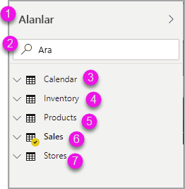

**Alanlar** yuvasındaki tüm tabloları genişletmek için **Alt + Shift + 9** tuşlarına basın. Tüm tabloları daraltmak için **Alt + Shift + 1** tuşlarına basın. Tek bir tabloyu genişletmek için **Sağ ok** tuşuna basın. Tek bir tabloyu daraltmak için **Sol ok** tuşuna basın. Biçimlendirme bölmesine benzer şekilde, bir tablo genişletilmişse, sekmeyle gezinirken ve alanlar listesinde gezinirken gösterilen alanlar dahil edilir. Ekran okuyucu, bir tabloyu genişlettiğinizi veya daralttığınızı haber verir.

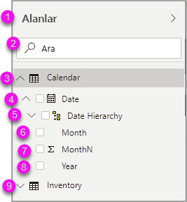

İstediğiniz alana gidip **Enter** tuşuna basarak bir alana onay işareti koyabilirsiniz.   Ekran okuyucu, odağın bulunduğu alanı ve alanın işaretlenmiş veya işaretlenmemiş olduğunu okur.

Fare kullanıcıları genellikle alanları tuvale veya istedikleri ilgili filtre demetlerine sürükleyip bırakırlar. Klavyenizi kullanmak istiyorsanız, bir alanı filtre demetine eklemek için **SHIFT + F10** tuşlarıyla alanın bağlam menüsünü girin, ok tuşlarını kullanarak **Filtrelere ekle**’ye gidin ve sonra alana eklemek istediğiniz filtre türünde **Enter** tuşuna basın.

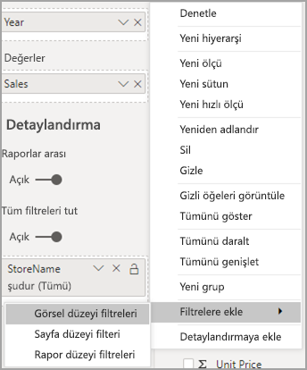

## Seçim bölmesinde gezinti
**Seçim** bölmesinde odak sırası aşağıdaki gibi ilerler:

1. Üst bilgi başlığı
2. Çıkış düğmesi
3. Katman/sekme sırası değiştiricisi
4. Katmanda yukarı taşı düğmesi
5. Katmanda aşağı taşı düğmesi
6. Göster düğmesi
7. Gizli düğmesi
8. Nesneler

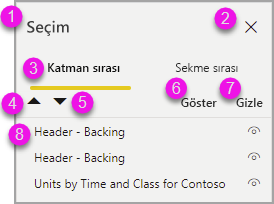

Odak sırasında sekmeyle gezinebilir ve **Enter** tuşuna basarak ilgilendiğiniz öğeyi seçebilirsiniz.  

Katman/sekme sırası değiştiricisine geldiğinizde, katman sırası ve sekme sırası arasında geçiş yapmak için sol ve sağ ok tuşlarını kullanın.

**Seçim** bölmesindeki nesnelere geldiğinizde **Seçim** bölmesini etkinleştirmek **F6** tuşuna basın. **Seçim** bölmesini etkinleştirdikten sonra yukarı/aşağı ok tuşlarını kullanarak **Seçim** bölmesindeki farklı nesnelere gidebilirsiniz.
İlgilendiğiniz bir nesneye gittikten sonra gerçekleştirebileceğiniz birkaç farklı işlem vardır:

* Nesneyi gizlemek/göstermek için **Ctrl + Shift + S** tuşlarına basın
* Nesneyi katman sırasında yukarı taşımak için **Ctrl + Shift + F** tuşlarına basın
* Nesneyi katman sırasında aşağı taşımak için **Ctrl + Shift + B** tuşlarına basın
* Nesneleri çoklu seçmek için **Ctrl + Ara Çubuğu** tuşlarına basın

## Power BI Desktop iletişim kutuları

Power BI Desktop içindeki tüm iletişim kutularına klavye gezintisi ile erişilebilir ve tüm iletişim kutuları ekran okuyucularla çalışır.

Power BI Desktop’taki iletişim kutuları şunlardır:

* Hızlı Ölçüler iletişim kutusu
* Koşullu Biçimlendirme ve veri çubukları iletişim kutusu
* Soru-Cevap Gezgini iletişim kutusu
* Başlarken iletişim kutusu
* Dosya menüsü ve Hakkında iletişim kutusu
* Uyarı çubuğu
* Dosya Geri Yükleme iletişim kutusu
* Kaş Çatmalar iletişim kutusu

## Yüksek karşıtlık desteği

Windows’ta yüksek karşıtlık modlarını kullandığınızda, seçtiğini ayarlar ve palet aynı zamanda Power BI Desktop’taki raporlara uygulanır.

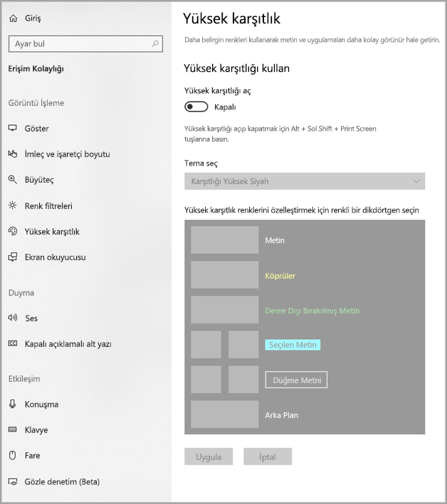

Power BI Desktop, Windows’un hangi yüksek karşıtlık temasını kullandığını otomatik olarak algılar ve bu ayarları raporlarınıza uygular. Bu yüksek karşıtlık renkleri, Power BI hizmetinde veya başka bir yerde yayımlandığında raporu izler.

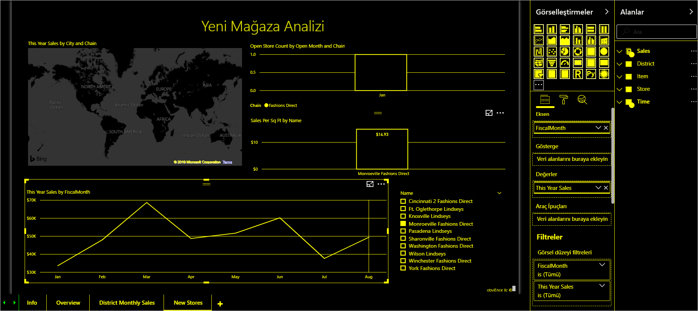

## Sonraki adımlar

Power BI erişilebilirliği ile ilgili makale koleksiyonu aşağıda verilmiştir:

* [Power BI’da erişilebilirliğe genel bakış](desktop-accessibility-overview.md) 
* [Erişilebilir Power BI raporları oluşturma](desktop-accessibility-creating-reports.md) 
* [Power BI’da raporları erişilebilirlik araçlarıyla kullanma](desktop-accessibility-consuming-tools.md)
* [Power BI raporlarına yönelik erişilebilirlik klavye kısayolları](desktop-accessibility-keyboard-shortcuts.md)
* [Rapor erişilebilirliği denetim listesi](desktop-accessibility-creating-reports.md#report-accessibility-checklist)

