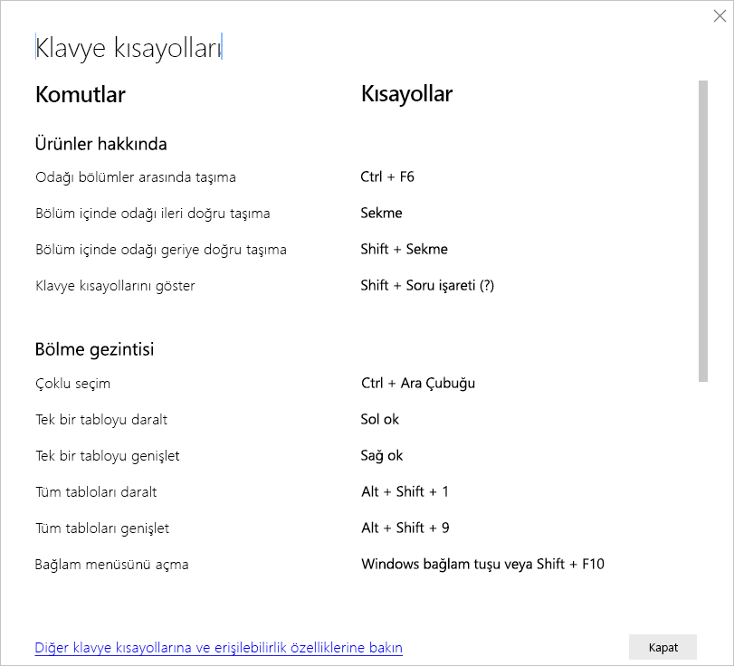

# Power BI Desktop klavye kısayolları

Power BI raporları arasında klavyeyle dolaşırken klavye kısayolları yararlı olur. Bu makaledeki tablolarda, bir Power BI raporunda kullanılabilen kısayollar açıklanmıştır. 

Power BI Desktop kullanırken **SHIFT + ?** tuşlarına basarak aşağıdaki görüntüde gösterildiği gibi klavye kısayollarını görüntüleyebilirsiniz.

Bu klavye kısayollarını, **Power BI Desktop**’ın yanı sıra şu deneyimlerde de kullanabilirsiniz:

* **Soru-Cevap Gezgini** iletişim kutusu
* **Başlarken** iletişim kutusu
* **Dosya** menüsü ve **Hakkında** iletişim kutusu
* **Uyarı** çubuğu
* **Dosya Geri Yükleme** iletişim kutusu
* **Kaş Çatmalar** iletişim kutusu

Erişilebilirliği geliştirmek için devam eden çalışmalarımız kapsamında, listelenen önceki deneyimler ekran okuyucu ve yüksek karşıtlık ayarlarını da destekler.

## Sık kullanılan kısayollar
| Bu eylemi gerçekleştirmek için           | Buna basın                |
| :------------------- | :------------------- |
| Odağı bölümler arasında taşıma  | **Ctrl + F6** |
| Bölüm içinde odağı ileri doğru taşıma | **Sekme**         |
| Bölüm içinde odağı geriye doğru taşıma | **Shift + Sekme** |
| Nesneyi seçme veya seçimi temizleme | **Enter** veya **ara çubuğu** |
| Nesneleri çoklu seçme | **Ctrl + ara çubuğu** |

## Görselde
| Bu eylemi gerçekleştirmek için           | Buna basın                |
| :------------------- | :------------------- |
| Odağı görsel menüye taşıma | **Alt + Shift + F10** |
| Verileri göster | **Alt + Shift + F11**  |
| Görsel girin | **Ctrl + Sağ ok** |
| Katman girin | **Enter** |
| Katman veya görselden çıkın | **Esc** |
| Veri noktasını seçme veya seçimi temizleme | **Enter** veya **ara çubuğu** |
| Çoklu seçim | **Ctrl + Enter** veya **Ctrl + ara çubuğu** |
| Sağ tıklama | <ul><li>Windows klavyesi: **Windows bağlam tuşu + F10**. Windows bağlam tuşu, Sol Alt tuşuyla Sol Ok tuşunun arasındadır</li><li>Başka klavye: **Shift + F10**</li></ul> |
| Seçimi temizle | **Ctrl + Shift + C** |
| Araç ipucunu göster veya gizle | **Ctrl + H** |

## Tablo ve matris gezintisi
| Bu eylemi gerçekleştirmek için          | Buna basın                |
| :------------------- | :------------------- |
| Odağı bir hücre yukarı / aşağı taşıma (tüm alanlardaki tüm hücreler arasında)  | **Yukarı ok tuşu** / **Aşağı ok tuşu** |
| Odağı bir hücre sola / sağa taşıma (tüm alanlardaki tüm hücreler arasında)  | **Sol ok tuşu** / **Sağ ok tuşu** |

## Bölme gezintisi
| Bu eylemi gerçekleştirmek için           | Buna basın                |
| :------------------- | :------------------- |
| Çoklu seçim | **Ctrl + ara çubuğu** |
| Tek bir tabloyu daralt | **Sol ok tuşu** |
| Tek bir tabloyu genişlet | **Sağ ok tuşu** |
| Tüm tabloları daralt | **Alt + Shift + 1** |
| Tüm tabloları genişlet | **Alt + Shift + 9** |
| Bağlam menüsünü aç | <ul><li>Windows klavyesi: **Windows bağlam tuşu + F10**.  Windows bağlam tuşu, Sol Alt tuşuyla Sol Ok tuşunun arasındadır</li><li>Başka klavye: **Shift + F10**</li></ul> |

## Dilimleyici
| Bu eylemi gerçekleştirmek için         | Buna basın                |
| :------------------- | :------------------- |
| Dilimleyiciyle etkileşim kurma | **Ctrl + Sağ ok tuşu** |

## Seçim bölmesi
| Bu eylemi gerçekleştirmek için           | Buna basın                |
| :------------------- | :------------------- |
| Seçim bölmesini etkinleştirme | **F6** |
| Nesneyi katman içinde yukarı taşıma | **Ctrl + Shift + F** |
| Nesneyi katman içinde aşağı taşıma | **Ctrl + Shift + B** |
| Nesneyi gizleme / gösterme (iki durumlu) | **Ctrl + Shift + S** |

## DAX Editor
| Bu eylemi gerçekleştirmek için          | Buna basın                |
| :------------------- | :------------------- |
| Satırı yukarı / aşağı taşıma | **Alt + Yukarı ok tuşu** / **Aşağı ok tuşu** |
| Üstteki /alttaki satırı kopyalama | **Shift + Alt + Yukarı ok tuşu** / **Aşağı ok tuşu** |
| Altına satır ekle | **Ctrl + Enter** |
| Üstüne satır ekle | **Ctrl + Shift + Enter** |
| Eşleşen köşeli ayraca atla | **Ctrl + Shift +**  \ |
| Satırı girintileme / Satırı kenar boşluğuna genişletme | **Ctrl + ]**  /  **[** |
| İmleç ekle | **Alt + Tıklama** |
| Geçerli satırı seç | **Ctrl + I** |
| Geçerli seçimin tüm oluşumlarını seç | **Ctrl + Shift + L** |
| Kelimenin tüm oluşumlarını seç | **Ctrl + F2** |

## Veri girme
| Bu eylemi gerçekleştirmek için           | Buna basın                |
| :------------------- | :------------------- |
| Düzenlenebilir kılavuzdan çıkış | **Ctrl + Sekme** |

## Önemli noktalar ve sınırlamalar
Erişilebilirlik özelliklerine ilişkin sınırlamalar ve bilinen birkaç sorun vardır. Aşağıdaki listede bu sorunların ve sınırlamaların açıklamaları verilmiştir:

* **Power BI Desktop** ile ekran okuyucuları kullanırken en iyi deneyimi elde etmek için, **Power BI Desktop**'ta dosya açmadan önce ekran okuyucuyu başlatın.
* Ekran Okuyucusu uygulamasını kullanıyorsanız, **Verileri göster** seçeneğiyle ulaştığınız HTML tablosunda gezinme konusunda belirli sınırlamalarla karşılaşabilirsiniz.

## Sonraki adımlar

Power BI erişilebilirliği ile ilgili makale koleksiyonu aşağıda verilmiştir:

* [Power BI’da erişilebilirliğe genel bakış](desktop-accessibility-overview.md) 
* [Erişilebilir Power BI raporları oluşturma](desktop-accessibility-creating-reports.md) 
* [Power BI’da raporları erişilebilirlik araçlarıyla kullanma](desktop-accessibility-consuming-tools.md)
* [Power BI raporlarını erişilebilirlik araçlarıyla oluşturma](desktop-accessibility-creating-tools.md)
* [Rapor erişilebilirliği denetim listesi](desktop-accessibility-creating-reports.md#report-accessibility-checklist)

Aşağıdaki makaleler de ilginizi çekebilir:

* [Power BI Desktop'ta Rapor Temalarını Kullanma](desktop-report-themes.md)

