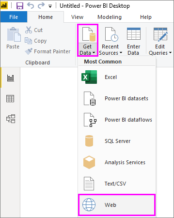
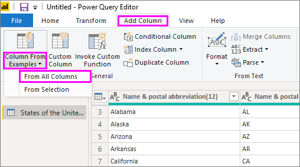
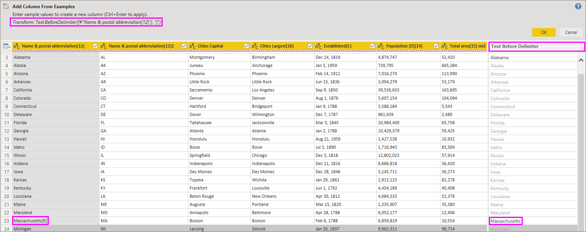

# Power BI Desktop'ta örneklerden sütun ekleme
Power Query Düzenleyicisi'nde *örneklerden sütun ekleme* ile, yalnızca yeni sütunlar için bir veya birden fazla örnek değer sağlayarak veri modelinize yeni sütunlar ekleyebilirsiniz. Bir seçimden yeni sütun örnekleri oluşturabileceğiniz gibi, tablodaki tüm mevcut sütunları temel alarak giriş de sağlayabilirsiniz.

*Örnekten sütun ekleme* yöntemini kullanmak hızlı ve kolay bir şekilde yeni sütunlar oluşturmanıza olanak tanır ve ayrıca aşağıdaki durumlar için harikadır:

- Yeni sütununuzda hangi verileri elde etmek istediğinizi biliyorsunuz ancak hangi dönüştürme işleminin veya dönüştürme işlemi koleksiyonunun sizi bu sonuca götüreceğinden emin değilsiniz.
- İhtiyacınız olan dönüştürme işlemlerini zaten biliyorsunuz ama bunları gerçekleştirmek için kullanıcı arabiriminde neleri seçeceğinizden emin değilsiniz.
- *M* dilinde *Özel Sütun* ifadesi kullanarak yapabileceğiniz dönüştürme işlemlerine tümüyle hakimsiniz ama söz konusu ifadelerden biri veya daha fazlası kullanıcı arabiriminde yok.

Örnekten sütun eklemek kolay ve sorunsuz bir işlemdir. Sonraki bölümlerde bunun ne kadar kolay olduğu gösterilmektedir.

## Örneklerden yeni sütun ekleme

Wikipedia'dan örnek veriler almak için Power BI Desktop şeridinin **Giriş** sekmesinde **Veri Al** > **Web**'i seçin. 

Görüntülenen iletişim kutusuna aşağıdaki URL'yi yapıştırın ve **Tamam**'ı seçin: 

*https:\//wikipedia.org/wiki/List_of_states_and_territories_of_the_United_States*

**Gezgin** iletişim kutusunda **States of the United States of America** (Amerika Birleşik Devletleri'nin Eyaletleri) tablosunu ve sonra da **Veri Dönüştürme**'yi seçin. Tablo Power Query Düzenleyicisi'nde açılır.

İsterseniz, Power BI Desktop'tan önceden yüklenmiş olan verileri açmak için şeridin **Giriş** sekmesinde **Sorguları Düzenle**'yi de seçebilirsiniz. Veriler Power Query Düzenleyicisi'nde açılır. 

Power Query Düzenleyicisi'nde örnek veriler açıldıktan sonra şeritteki **Sütun Ekle** sekmesini ve sonra da **Örneklerden Sütun**'u seçin. Sütunu tüm mevcut sütunlardan oluşturmak için **Örneklerden Sütun** simgesinin kendisini seçebilir veya aşağı açılan oku seçerek **Tüm Sütunlardan** ile **Seçimden** arasında bir seçim yapabilirsiniz. Burada izlenen yol için **Tüm Sütunlardan** öğesini seçin.

## Örneklerden Sütun Ekle bölmesi
**Sütun Ekle** > **Örneklerden**'i seçtiğinizde tablonun üst kısmında **Örneklerden Sütun Ekle** bölmesi açılır. Mevcut sütunların sağ tarafında yeni **Sütun 1** görüntülenir (hepsini görmek için ekranı kaydırmanız gerekebilir). Örnek değerlerinizi **Sütun 1**'in boş hücrelerine girdiğinizde, Power BI örneklerinizle eşleşecek kurallar ve dönüştürmeler oluşturur; bunları kullanarak sütunun kalanını doldurur.

**Örneklerden Sütun** seçeneğinin **Sorgu Ayarları** bölmesinde **Uygulanan Adım** olarak da gösterildiğine dikkat edin. Power Query Düzenleyicisi her zamanki gibi dönüştürme adımlarınızı kaydeder ve sırasıyla bunları sorguya uygular.

Örneğinizi yeni sütuna yazdığınız sırada, Power BI oluşturduğu dönüştürmeleri temel alarak sütunun kalan bölümünün nasıl görüneceğine ilişkin bir önizleme gösterir. Örneğin, tablonun ilk sütunundaki **Alabama** değerine karşılık olarak ilk satıra *Alabama* yazdınız. Siz Enter tuşuna basar basmaz Power BI ilk sütun değerini temel alarak yeni sütunun kalan bölümünü doldurur ve sütunu **Ad ve posta kısaltması[12] - Kopya** olarak adlandırır.

Şimdi yeni sütunun **Massachusetts[E]** satırına gidin ve dizenin **[E]** bölümün silin. Power BI değişikliği algılar ve örneği kullanarak bir dönüşüm oluşturur. Power BI, **Örneklerden Sütun Ekle** bölmesinde dönüştürmeleri açıklar ve sütunu **Sınırlandırıcıdan Önce Gelen Metin** olarak yeniden adlandırır. 

Siz örnek sağlamaya devam ettikçe Power Query Düzenleyicisi dönüştürmelere ekleme yapar. Memnun kaldığınızda, **Tamam**'ı seçip değişikliklerinizi kaydedin. 

Sütun başlığına çift tıklayıp **Yeniden Adlandır**'ı seçerek yeni sütunu istediğiniz gibi yeniden adlandırabilirsiniz. 

Örnek veri kaynağını kullanarak **Örneklerden Sütun Ekle** işleminin nasıl çalıştığını görmek için bu videoyu izleyin: 

[Power BI Desktop: Örneklerden Sütun Ekle](https://www.youtube.com/watch?v=-ykbVW9wQfw). 

## Desteklenen dönüştürmeler listesi
**Örneklerden Sütun Ekle** kullanılırken dönüştürmelerin hepsi değilse bile birçoğu kullanılabilir. Aşağıdaki listede desteklenen dönüştürmeler gösterilir:

**Genel**

- Koşullu Sütun

**Başvuru**
  
- Kırpma, temizleme ve büyük/küçük harf dönüştürmeleri gibi, belirli bir sütuna yönelik başvuru

**Metin dönüştürmeleri**

- Birleştir (hazır dize ve tam sütun değerlerinin birleştirilmesini destekler)
- Değiştir
- Uzunluk
- Ayıkla   
  - İlk Karakterler
  - Son Karakterler
  - Aralık
  - Sınırlandırıcıdan Önce Gelen Metin
  - Sınırlandırıcıdan Sonra Gelen Metin
  - Sınırlandırıcılar Arasındaki Metin
  - Uzunluk
  - Karakterleri Kaldır
  - Karakterleri Tut

> [!NOTE]
> Tüm *Metin* dönüştürmeleri, sütun değerinin kırpılması, temizlenmesi veya sütun değerine büyük/küçük harf dönüştürmesi uygulanması gerekebileceğini hesaba katar.

**Tarih dönüştürmeleri**

- Gün
- Haftanın Günü
- Haftanın Günü Adı
- Yılın Günü
- Ay
- Ay Adı
- Yılın Çeyreği
- Ayın Haftası
- Yılın Haftası
- Yıl
- Yaş
- Yıl Başı
- Yıl Sonu
- Ay Başı
- Ay Sonu
- Çeyrek Başı
- Ayın Günleri
- Çeyrek Sonu
- Hafta Başı
- Hafta Sonu
- Ayın Günü
- Günün Başlangıcı
- Gün Sonu

**Saat dönüştürmeleri**

- Hour
- Dakika
- Second  
- Yerel Saat Olarak

> [!NOTE]
> Tüm *Tarih* ve *Saat* dönüştürmeleri, sütun değerinin *Tarih*, *Saat* veya *Tarih/Saat* olarak dönüştürülmesi gerekebileceğini hesaba katar.

**Sayı dönüştürmeleri** 

- Mutlak Değer
- Arkkosinüs
- Arksinüs
- Arktanjant
- Sayıya Dönüştür
- Kosinüs
- Küp
- Böl
- Üs
- Faktöriyel
- Tam Sayı-Böl
- Çifttir
- Tektir
- Ln
- 10 Tabanında Logaritma
- Mod
- Çarp
- Aşağı Yuvarla
- Yukarı Yuvarla
- İşaret
- Sinüs
- Karekök
- Kare
- Çıkar
- Toplam
- Tanjant
- Gruplandırma/Aralıklar

