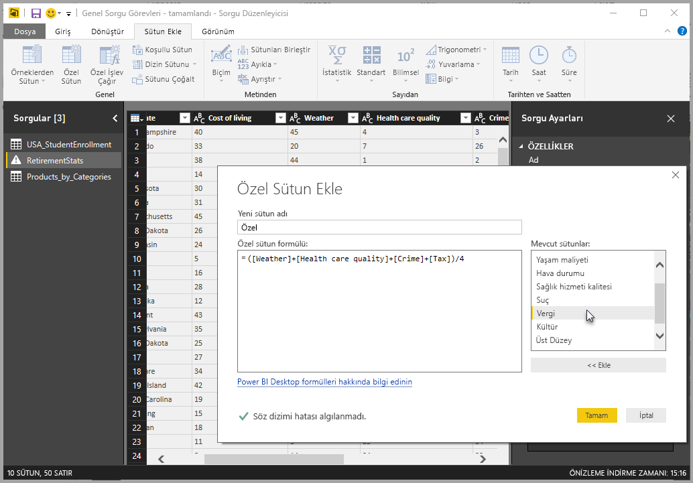
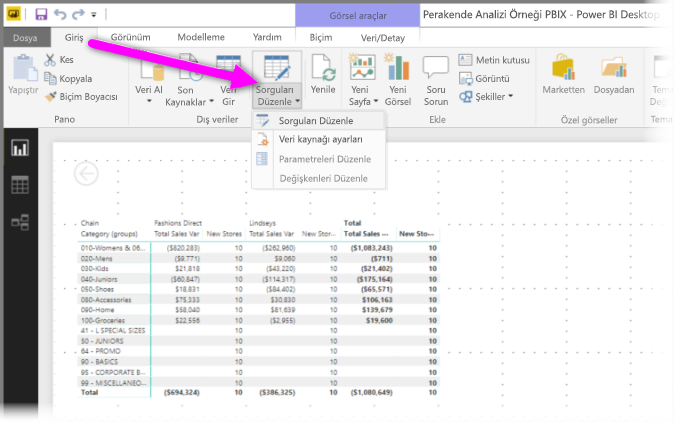
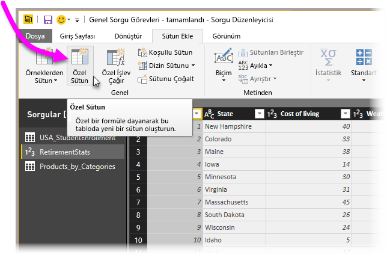
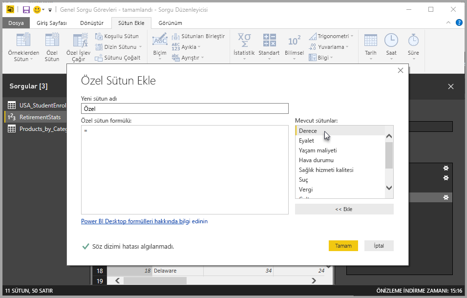
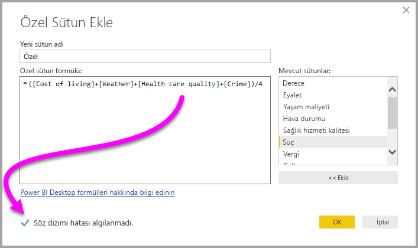
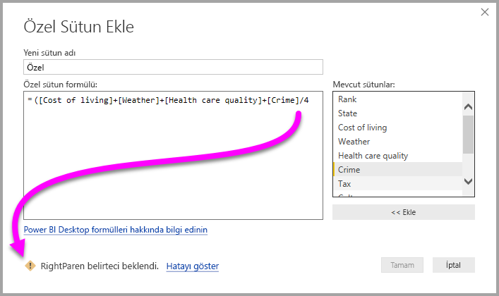
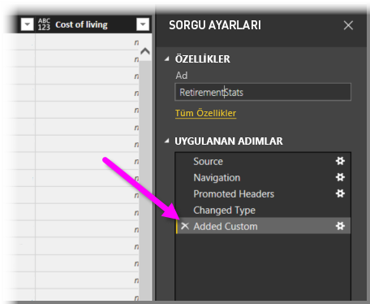
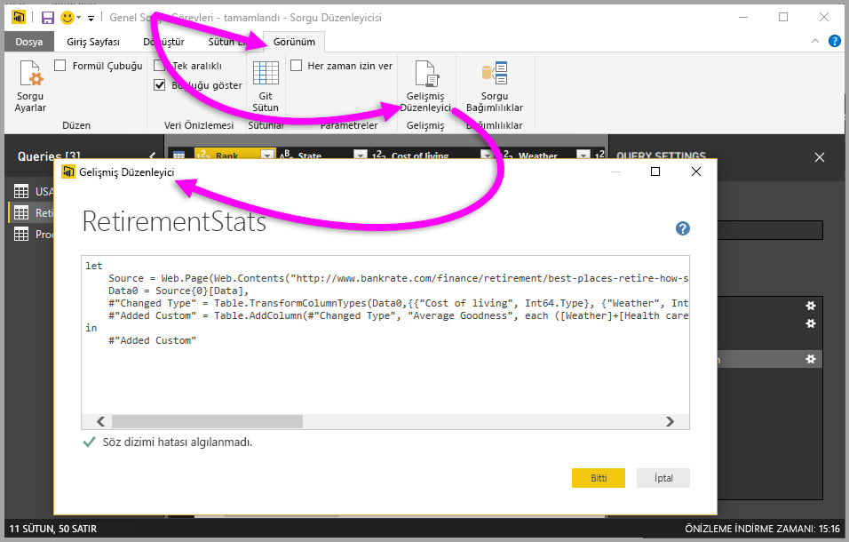

# Power BI Desktop'ta özel sütun ekleme

Power BI Desktop'ta Sorgu Düzenleyicisi'ni kullanarak modelinize veri içeren yeni bir özel sütunu kolayca ekleyebilirsiniz. Sorgu Düzenleyicisi ile özel sütununuzu oluşturup yeniden adlandırarak, özel sütununuzu tanımlamak için [PowerQuery M formül sorguları](/powerquery-m/quick-tour-of-the-power-query-m-formula-language) oluşturun. PowerQuery M formül sorguları [kapsamlı bir işlev başvurusu içerik kümesine](/powerquery-m/power-query-m-function-reference) sahiptir. 

Sorgu Düzenleyicisi'nde özel bir sütun oluşturduğunuzda Power BI Desktop bu sütunu sorgunun **Sorgu Ayarları**’nda **Uygulanan Adım** olarak ekler. Her zaman değiştirilebilir, taşınabilir veya üzerinde değişiklik yapılabilir.

## Özel sütun eklemek için Sorgu Düzenleyicisi'ni kullanma

Özel bir sütun oluşturmaya başlamak için şu adımları izleyin:

1. Power BI Desktop’ı başlatın ve bazı verileri yükleyin.

2. Şeritteki **Giriş** sekmesinden **Sorguları Düzenle**'yi ve sonra menüden **Sorguları Düzenle**'yi seçin.

   

   **Sorgu Düzenleyicisi** penceresi görüntülenir. 

2. Şeritteki **Sütun Ekle** sekmesinden **Özel Sütun**’u seçin.

   

   **Özel Sütun Ekle** penceresi görüntülenir.

## Özel Sütun Ekle penceresi

**Özel Sütun Ekle** penceresi aşağıdaki özellikleri içerir: 
- Sağ taraftaki **Kullanılabilir sütunlar** listesinde kullanılabilir sütunların listesi.

- **Yeni sütun adı** kutusunda özel sütununuzun ilk adı. Bu sütunu yeniden adlandırabilirsiniz.

- [Özel sütun formülü](/powerquery-m/power-query-m-function-reference) kutusunda **PowerQuery M formülü sorguları**. Bu sorguları, yeni özel sütununuzun tanımlandığı formülü oluşturarak oluşturursunuz. 

   

## Özel sütununuz için formül oluşturma

1. Sağ taraftaki **Kullanılabilir sütunlar** listesinden bir sütun seçin ve sonra listenin altındaki **<< Ekle** düğmesini seçerek sütunu özel sütun formülüne ekleyin. Ayrıca, listede çift tıklayarak da bir sütun ekleyebilirsiniz.

2. Formülü girip sütununuzu oluştururken **Özel Sütun Ekle** penceresinin altındaki göstergeyi not edin. 

   Hata yoksa, yeşil bir onay işareti ile birlikte *Söz dizimi hatası algılanmadı* iletisini görürsünüz.

   

   Söz dizimi hatası varsa, sarı bir uyarı simgesi ile birlikte hatanın formülünüzdeki yerinin bağlantısını görürsünüz.

   

3. **Tamam**’ı seçin. 

   Power BI Desktop, özel sütununuzu modele ekler ve **Özel Eklendi** adımını **Sorgu Ayarları**’nda sorgunuzun **Uygulanan Adımlar** listesine ekler.

   

4. Özel sütununuzu değiştirmek için **Uygulanan Adımlar** listesindeki **Özel Eklendi** adımına çift tıklayın. 

   **Özel Sütun Ekle** penceresi, oluşturduğunuz özel sütun formülüyle birlikte görüntülenir.

## Özel sütunlar için Gelişmiş Düzenleyici'yi kullanma

Sorgunuzu oluşturduktan sonra, sorgunuzun herhangi bir adımını değiştirmek için **Gelişmiş Düzenleyici**’yi de kullanabilirsiniz. Bunu yapmak için aşağıdaki adımları izleyin:

1. **Sorgu Düzenleyicisi** penceresinde şeritteki **Görünüm** sekmesini seçin. 

2. **Gelişmiş Düzenleyici** seçeneğini belirleyin.

   Sorgunuz üzerinde tam denetime sahip olmanızı sağlayan **Gelişmiş Düzenleyici** sayfası görüntülenir. 

   

   
## Sonraki adımlar

- Sorgu Düzenleyicisi'ne sunduğunuz örnekleri temel alan bir sütun oluşturma gibi diğer yöntemlerle özel bir sütun oluşturabilirsiniz. Daha fazla bilgi için bkz. [Power BI Desktop'ta örnekten sütun ekleme](desktop-add-column-from-example.md).

- Power Query M başvuru bilgileri için bkz. [Power Query M işlev başvurusu](/powerquery-m/power-query-m-function-reference).