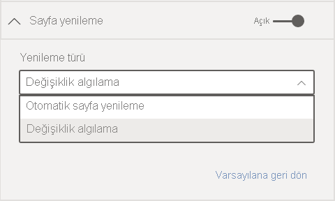
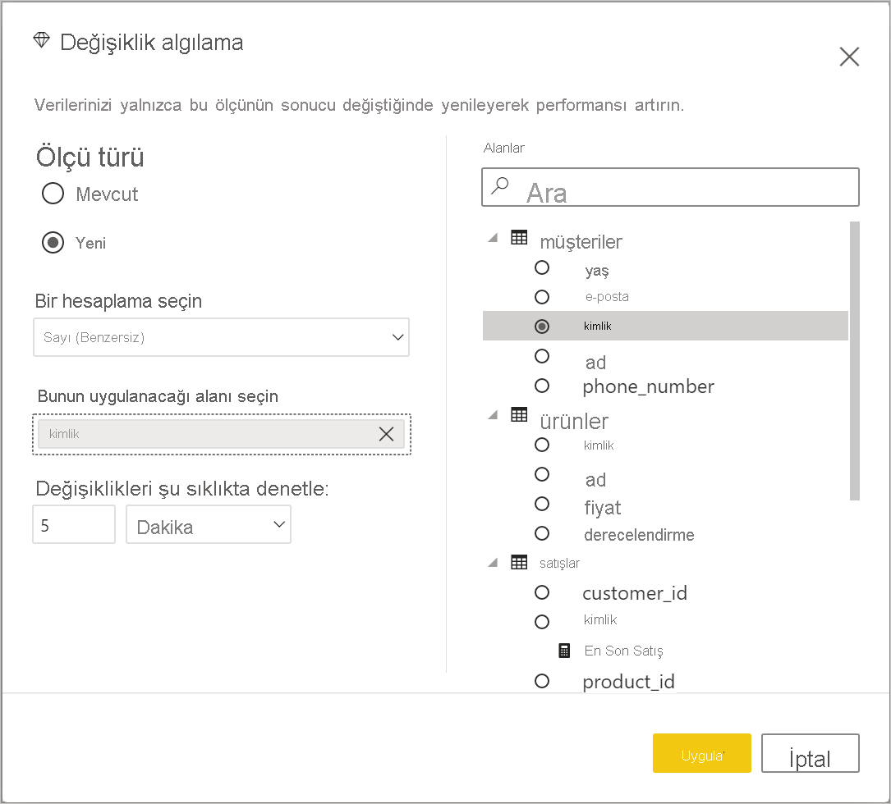

# Power BI’da otomatik sayfa yenileme

Kritik olayları izlerken, kaynak veriler güncelleştirildiği anda verilerin yenilenmesi önemlidir. Örneğin, üretim sektöründe bir makinenin hatalı çalıştığını veya hatalı çalışmak üzere olduğunu bilmeniz kritik önem taşır. Sosyal medya yaklaşımı gibi sinyalleri izliyorsanız ani değişiklikleri gerçekleştikleri anda bilmek istersiniz.

Power BI’daki otomatik sayfa yenileme, etkin rapor sayfanızın [DirectQuery kaynakları](../connect-data/desktop-directquery-about.md) için önceden tanımlanmış bir tempoda yeni verileri sorgulamasını sağlar.

## Yenileme türleri

Otomatik sayfa yenilemeyi kullanırken, sabit aralık ve değişiklik algılama olmak üzere iki tür yenileme vardır.

### Sabit aralık

Bu yenileme türü, bir rapor sayfasındaki tüm görselleri bir saniye veya beş dakika gibi sabit bir aralığa göre güncelleştirmenize olanak verir. Bu belirli aralığa ulaşıldığında, söz konusu sayfadaki tüm görseller veri kaynağına bir güncelleştirme sorgusu gönderir ve uygun şekilde güncelleştirilirler.

### Değişiklik algılama

Bu yenileme türü, belirli bir aralık yerine verilerdeki değişiklikleri algılayarak sayfadaki görselleri yenilemenize olanak verir. Ayrıntılı ifade etmek gerekirse bu ölçüm, [DirectQuery kaynağınıza](../connect-data/desktop-directquery-about.md) yapılan değişikleri yoklar. Ölçüyü tanımlamanın yanı sıra, Power BI Desktop’ın değişiklikleri denetleme sıklığını da seçmeniz gerekir. Hizmette yayımladığınızda, bu yenileme türü yalnızca bir Premium kapasitenin parçası olan çalışma alanlarında desteklenir. Analysis Services ve Power BI veri kümeleri gibi LiveConnect kaynakları desteklenmez.

## Power BI Desktop’ta otomatik sayfa yenileme ile rapor yazma

Otomatik sayfa yenileme [DirectQuery sorguları](../connect-data/desktop-directquery-about.md) ve bazı LiveConnect senaryolarında kullanılabileceğinden, yalnızca desteklenen bir veri kaynağına bağlandığınızda kullanılabilir duruma gelir. Bu kısıtlama, her iki otomatik sayfa yenileme türü için de geçerlidir.

Power BI Desktop’ta otomatik sayfa yenilemeyi kullanmak için, otomatik sayfa yenilemeyi etkinleştirmek istediğiniz rapor sayfasını seçin. **Görsel Öğeler** bölmesinde **Biçimlendirme** düğmesini (boya rulosu) seçin ve bölmenin alt kısmından **Sayfa yenileme** bölümünü bulun.

1. Sayfa yenilemeyi açar veya kapatır.
2. Yenileme türü
3. Girişler ve bilgiler (yenileme türüne bağlı olarak)

**Sayfa yenileme** kartı yalnızca bir [DirectQuery kaynağına](../connect-data/desktop-directquery-about.md) bağlıysanız kullanılabilir. Otomatik sayfa yenilemeyi etkinleştirmek için geçişin Açık konumda olması gerekir. Gereken girişler ve sağlanan bilgiler, seçilen yenileme türüne bağlıdır.

### Sabit aralık kurulumu

Yenileme türü olarak **Otomatik sayfa yenilemeyi** seçtiğinizde, istenen yenileme aralığını sağlamanız gerekir. Varsayılan değer 30 dakikadır. (En az yenileme aralığı bir saniyedir.) Raporunuz, belirlediğiniz aralıkta yenilemeye başlar.

Ayrıntıları göster seçeneğine tıkladığınızda, Power BI şununla ilgili daha fazla bilgi sağlayacaktır:

- Özellik yöneticiniz tarafından etkinleştirildiyse (yalnızca Power BI hesabınızda oturum açıldığında)
- Yöneticiniz tarafından izin verilen en kısa aralık (yalnızca Power BI hesabınızda oturum açıldığında)
- Gerçek yenileme oranı (genellikle seçtiğiniz aralıktan daha uzundur)
- Son yenileme zamanı

### Değişiklik algılama kurulumu

Yenileme türü olarak **Değişiklik algılama** seçildiğinde **Değişiklik algılama ekle** bağlantısıyla karşılaşırsınız. **Değişiklik algılama** penceresinde şeritteki Modelleme sekmesinden de erişebilirsiniz. Daha sonra, **Sayfa yenileme** bölümündeki **Değişiklik algılama** simgesine tıklayın. Son olarak, Değerler kutusundaki herhangi bir değere sağ tıklayıp veya bu değerin yanındaki açılan oku seçip menüden **Değişiklik algılama** seçeneğini belirleyebilirsiniz.

Pencere açıldığında, mevcut bir ölçüyü seçebileceğiniz veya sıfırdan yeni bir ölçü oluşturabileceğiniz **Ölçü türü** seçeneğiyle karşılaşırsınız. Mevcut bir ölçüyü seçtiğinizde, alanlar listesinden istediğiniz ölçüyü seçmeniz veya ölçüyü **Mevcut ölçüyü seç** bölümüne sürükleyip bırakmanız yeterlidir. Yeni bir ölçü oluştururken say, farklı say, minimum, maksimum ve toplam arasından bir ölçüm için **Hesaplamayı seçebilirsiniz**. Örneğin, müşteri kimliklerini saymak için farklı say seçeneğini kullanabilir ve yalnızca listeye yeni bir müşteri eklendiğinde yenilemeyi tercih edebilirsiniz. Bir ölçüyü seçtiğinizde, Power BI’ın **değişiklikleri ne sıklıkta denetleyeceğini** belirlemeniz gerekir. Bu, Power BI’ın ölçü ve yoklama değişikliklerini hesaplama sıklığındaki aralığı ifade eder. Uygula’ya tıkladığınızda, değişiklik algılama simgesine sahip yeni bir ölçü alan listenizde görünür.

Daha sonra sayfa yenileme bölümüne döndüğünüzde, değişiklik algılama için kullanılmakta olan ölçüme ilişkin bilgileri ve başvurabilmeniz için tanımlı aralığı görürsünüz.

> [!NOTE]
> Her model için yalnızca bir değişiklik algılama ölçüsüne izin verilir.

## Yenileme aralığını belirleme

Otomatik sayfa yenileme etkinleştirildiğinde Power BI Desktop, DirectQuery kaynağınıza sürekli olarak sorgu gönderir. Sorgunun gönderilmesi ile verilerin döndürülmesi arasında bir gecikme olur. Bu nedenle kısa yenileme aralıkları için sorguların sorgulanan verileri yapılandırılan aralık içinde başarıyla döndürdüğünü onaylamanız gerekir. Veriler aralık içinde döndürülmezse görseller yapılandırılandan daha az sıklıkta güncelleştirilir.

Bu konular hem sabit aralık hem de değişiklik algılama olmak üzere her iki yenileme türü için de geçerlidir. Aralarındaki asıl fark, değişiklik algılama için kaynağa sabit bir aralıkla geri dönen yalnızca bir sorgu olması ve görsellerin yenilemesinin yalnızca değişiklik algılama ölçüsünün değeri değiştiğinde tetiklenmesidir.

En iyi uygulama olarak yenileme aralığı en azından beklenen yeni veri alım hızıyla eşleşmelidir:

* Yeni veriler her 20 dakikada bir kaynağa ulaşırsa yenileme aralığınız 20 dakikadan kısa olamaz.
* Her saniye yeni veriler alınıyorsa aralığı bir saniye olarak ayarlayın.

Bir saniye gibi düşük yenileme aralıkları için aşağıdakiler gibi faktörleri göz önünde bulundurun:

- DirectQuery veri kaynağının türü
- Sorgularınızın üzerinde oluşturduğu yük
- Rapor görüntüleyicilerinizin kapasitenin veri merkezine uzaklığı

Power BI Desktop’taki [Performans Analizi](desktop-performance-analyzer.md)’ni kullanarak dönüş sürelerini tahmin edebilir ve sabit aralıklı yenileme türü için sayfa yenileme bölümündeki ayrıntılar menüsünü gösterebilirsiniz. Performans Analizi, her görsel sorgunun kaynaktan sonuçlarla dönmek için yeterli süresi olup olmadığını denetlemenize olanak verir. Ayrıca, zamanın harcandığı yeri belirlemenizi sağlar. Performans Analizi’nin sonuçlarına göre, veri kaynağını ayarlayabilir veya raporunuzdaki diğer görseller ve ölçülerle deneme yapabilirsiniz.

Aşağıdaki resimde, Performans Analizi’ndeki DirectQuery kaynağının sonuçları gösterilmektedir:

Bu veri kaynağıyla ilgili bazı diğer özellikleri ele alalım:

- Veriler 2 saniyelik hızla ulaşır
- Performans Analizi, yaklaşık 4,9 saniyelik (4,688 milisaniyelik) maksimum sorgu + görüntüleme süresini gösterir
- Veri kaynağı, saniyede yaklaşık 1,000 eşzamanlı sorguyu işleyecek şekilde yapılandırılmıştır
- Yaklaşık 10 kullanıcının raporu eşzamanlı olarak görüntülemesini beklersiniz

Böylece aşağıdaki denklemdekiler oluşur:

- **5 görsel x 10 kullanıcı = yaklaşık 50 sorgu**

Bu hesaplamanın sonucu, veri kaynağının destekleyebileceğinden çok daha fazla yüke sahip olduğunu gösterir. Veriler iki saniyelik hızla ulaşır ve bu da sizin yenileme hızınız olmalıdır. Ancak sorgunun tamamlanması yaklaşık beş saniye sürdüğünden bunu beş saniyeden uzun bir süreye ayarlamanız gerekir.

Ayrıca, raporunuzu hizmette yayımladığınızda bu sürenin değişebileceğini unutmayın. Rapor, bulutta barındırılan Azure Analysis Services örneğini kullandığı için bu fark oluşur. Yenileme hızınızı uygun şekilde ayarlamanız faydalı olabilir.

Sorguları ve yenileme zamanlamasını hesaba katmak için Power BI yalnızca kalan tüm yenileme sorguları tamamlandığında bir sonraki yenileme sorgusunu çalıştırır. Bu nedenle, yenileme aralığınız, sorgularınızın işlenme süresinden kısa olursa Power BI yalnızca kalan sorgular tamamlandıktan sonra tekrar yenileme yapar.

Değişiklik algılama yenileme türü söz konusu olduğunda bu konular yine geçerlidir. [Performans Analizi](desktop-performance-analyzer.md), raporunuzdaki hiçbir görselle eşleşmese dahi değişiklik algılama ölçü sorgusuna yönelik sonuçları size gösterir. Önceden bahsettiğimiz kılavuzun aynısını izleyen bu özel ölçü türünde sorun giderebilmeniz için bu özelliği size sunuyoruz. Bu yenileme türündeki asıl fark, tüm görsellerdeki tüm sorgular yerine yalnızca bir sorgunun veri kaynağına gitmesidir. Raporu birden çok kullanıcı görüntülediğinde de durum aynıdır.

Önceden ele aldığımız senaryonun aynısı için:

- **5 görsele yönelik 1 değişiklik algılama ölçü sorgusu, görüntüleyici sayısından bağımsız olarak tek bir sorgu oluşturur**

- **Değişiklik algılama ölçüsü, 5 görsel x 10 kullanıcı = yaklaşık 50 sorgu olan aynı senaryoyu varsayarak bir güncelleştirmeyi tetiklediğinde**

Özetlemek gerekirse, değişiklik algılama kullanılırken bir değişiklik algılanana kadar veri kaynağına yalnızca bir sorgu gönderilir. Bu durum oluştuğunda, sabit aralıklı yenileme türü için kullanılan mantığın aynısı tüm kullanıcılar için tüm görseller güncelleştirilirken aynı sayıda sorgu oluşturur. Bu yaklaşımın, uzun vadede daha verimli olması beklenir.

Şimdi de kapasite yöneticisi olarak performans sorunlarını nasıl algılayıp tanılayabileceğinize bakalım. Daha sonra bu makalenin ilerleyen bölümünde, performans ve sorun giderme ile ilgili diğer sorular ve yanıtlar için [Sık sorulan sorular](#frequently-asked-questions) bölümüne de göz atabilirsiniz.

## Power BI hizmetinde otomatik sayfa yenileme

Veri kaynağı [DirectQuery](../connect-data/desktop-directquery-about.md) olduğu sürece, Power BI hizmetinde yayımlanan raporlar için otomatik sayfa yenilemeyi ayarlayabilirsiniz.

Power BI hizmetindeki raporlar için otomatik sayfa yenilemeyi yapılandırma adımları Power BI Desktop’takine benzer. Power BI hizmetinde yapılandırıldığında, otomatik sayfa yenileme [eklenmiş Power BI](../developer/embedded/embedding.md) içeriğini de destekler. Bu resimde, Power BI hizmeti için **Sayfa yenileme** yapılandırması gösterilmektedir:

1. Sayfa yenilemeyi açar veya kapatır.
2. Yenileme türü
3. Girişler ve bilgiler (yenileme türüne bağlı olarak)

> [!NOTE]
> Power BI Desktop’tan otomatik sayfa yenileme özelliği etkin raporunuzu hizmette yayımlarken, veri kümesi ayarları menüsünde DirectQuery veri kaynağı için kimlik bilgilerini sağlamanız gerekir. Kaynaktaki güvenlik yapılandırmasını dikkate almak kaydıyla, rapor görüntüleyicilerinin bu veri kaynağına kendi kimlikleriyle erişebilmesi için kimlik bilgilerini ayarlayabilirsiniz. Değişiklik algılama ölçüsü durumunda, her zaman yazarın kimlik bilgileriyle değerlendirilir.

### Sayfa yenileme aralıkları

Power BI hizmetinde izin verilen sayfa yenileme türleri ve aralıkları, raporun çalışma alanı türünden etkilenir. Bu senaryolar için geçerlidir:

* Otomatik sayfa yenileme özelliği etkin olan bir çalışma alanında rapor yayımlama
* Bir çalışma alanında zaten bulunan bir sayfa yenileme aralığını düzenleme
* Doğrudan hizmette rapor oluşturma

Power BI Desktop’ın yenileme aralığı için bir kısıtlaması yoktur ve yenileme aralığı, bir saniye sıklığında bile olabilir. Ancak, raporlar Power BI hizmetinde yayımlandığında, aşağıdaki bölümlerde açıklanan belirli kısıtlamalar uygulanır.

### Yenileme aralıklarındaki kısıtlamalar

Power BI hizmetinde, otomatik sayfa yenileme kısıtlamaları raporun yayımlandığı çalışma alanına göre uygulanır. Premium hizmetleri veya Premium kapasitesi yönetici ayarlarını kullanmanız ve veri kaynağının türü bunu etkilemez.

Bu kısıtlamaların nasıl çalıştığını netleştirmek için kapasiteler ve çalışma alanıyla ilgili bazı arka plan bilgileriyle başlayalım.

*Kapasiteler*, Power BI’daki önemli kavramlardan biridir. Power BI içeriğini barındırmak ve sunmak için kullanılan bir dizi kaynağı (depolama, işlemci ve bellek) temsil eder. Kapasiteler paylaşımlı veya ayrılmıştır. *Paylaşılan kapasite* diğer Microsoft müşterileri ile paylaşılır. *Ayrılmış kapasite*, tamamen tek bir müşteriye ayrılır. Ayrılmış kapasitelere giriş için bkz. [Premium kapasiteleri yönetme](../admin/service-premium-capacity-manage.md).

Paylaşılan kapasitede iş yükleri, diğer müşterilerle paylaşılan hesaplama kaynaklarında çalışır. Kapasitenin kaynakları paylaşması gerektiğinden, *tarafsızlığı* sağlamak için maksimum model boyutu (1 GB) ve maksimum günlük yenileme sıklığı (günde sekiz defa) ayarlama gibi sınırlamalar uygulanır.

Power BI *çalışma alanları* kapasitelerin içinde yer alır. Bunlar güvenlik, işbirliği ve dağıtım kapsayıcılarını temsil eder. Her Power BI kullanıcısının **Çalışma Alanım** olarak bilinen kendi kişisel çalışma alanı vardır. İşbirliğine ve dağıtıma olanak sağlamak için ek çalışma alanları oluşturulabilir. Bunlar *çalışma alanları* olarak bilinir. Kişisel çalışma alanları da dahil olmak üzere çalışma alanları varsayılan olarak paylaşılan kapasitede oluşturulur.

Burada, iki çalışma alanı senaryosu için bazı ayrıntılara yer verilmiştir:

**Paylaşılan çalışma alanları**. Düzenli çalışma alanları (Premium kapasitenin parçası olmayan çalışma alanları) için otomatik sayfa yenileme minimum 30 dakikalık aralığa (izin verilen en düşük aralık) sahip olur. Değişiklik algılama yenileme türü, paylaşılan kapasitelerde kullanılamaz.

**Premium çalışma alanları**. Premium çalışma alanlarındaki otomatik sayfa yenileme kullanılabilirliği (hem sabit aralık hem de değişiklik algılama için), Premium yöneticinizin Power BI Premium kapasitesi için ayarladığı iş yükü ayarlarına bağlı olur. Otomatik sayfa yenilemeyi ayarlama yeteneğinizi etkileyebilecek iki değişken vardır:

 - **Özellik açık/kapalı**. Kapasite yöneticiniz özelliği devre dışı bıraktıysa yayımlanmış raporunuzda herhangi bir sayfa yenileme türü ayarlayamazsınız. Sabit aralık ve değişiklik algılama ayrı ayrı açılıp kapatılabilir.

 - **Minimum yenileme aralığı**. Sabit aralık için otomatik sayfa yenileme etkinleştirildiğinde, kapasite yöneticinizin bir en kısa yenileme aralığı (varsayılan değer beş dakikadır) ayarlaması gerekir. Zaman aralığınız minimumdan düşükse Power BI hizmeti, kapasite yöneticiniz tarafından ayarlanan minimum aralığa göre aralığınızı geçersiz kılar.

 - **En kısa yürütme aralığı**. Değişiklik algılama etkinleştirildiğinde, kapasite yöneticinizin bir en kısa yürütme aralığı (varsayılan değer beş saniyedir) ayarlaması gerekir. Zaman aralığınız minimumdan düşükse Power BI hizmeti, kapasite yöneticiniz tarafından ayarlanan minimum aralığa göre aralığınızı geçersiz kılar.

> [!WARNING]
> Veri kümenizde etkinleştirildiğinde değişiklik algılama ölçümü DirectQuery veri kaynağınıza bağlanarak ölçümü hesaplayıp değişiklikleri yoklar. Bu bağlantı, Power BI tarafından yapılan Düşük Öncelikli yenileme bağlantılarından farklıdır.

Bu tabloda, bu özelliğin nerede kullanılabildiğine dair daha fazla ayrıntı ve her bir kapasite türü ve [depolama moduna](../connect-data/service-dataset-modes-understand.md) ilişkin sınırlar açıklanmaktadır:

| Depolama modu                                  | Ayrılmış kapasite                                                                                     | Paylaşılan kapasite                                                                                       |
|-----------------------------------------------|--------------------------------------------------------------------------------------------------------|-------------------------------------------------------------------------------------------------------|
| DirectQuery                                   | **SA destekli**: Evet  **DA destekli**: Evet  **Minimum**: 1 saniye  **Yöneticiyi geçersiz kılma**: Evet  | **SA destekli**: Evet  **DA destekli**: Hayır  **Minimum**: 30 dakika  **Yöneticiyi geçersiz kılma**: Hayır |
| İçeri Aktar                                        | **SA destekli**: Hayır  **DA destekli**: Hayır  **Minimum**: YOK  **Yöneticiyi geçersiz kılma**: YOK         | **SA destekli**: Hayır  **DA destekli**: Hayır  **Minimum**: YOK  **Yöneticiyi geçersiz kılma**: YOK        |
| Karma mod (DirectQuery ve diğer veri kaynakları) | **SA destekli**: Evet  **DA destekli**: Evet  **Minimum**: 1 saniye  **Yöneticiyi geçersiz kılma**: Evet  | **SA destekli**: Evet  **DA destekli**: Hayır  **Minimum**: 30 dakika  **Yöneticiyi geçersiz kılma**: Hayır |
| Analysis Services (Azure ve Şirket İçi)     | **SA destekli**: Evet  **DA destekli**: Hayır  **Minimum**: 30 dakika  **Yöneticiyi geçersiz kılma**: Evet | **SA destekli**: Evet  **DA destekli**: Hayır  **Minimum**: 30 dakika  **Yöneticiyi geçersiz kılma**: Hayır |
| Power BI veri kümeleri (DirectQuery kaynağı ile)   | **SA destekli**: Evet  **DA destekli**: Hayır  **Minimum**: 1 saniye  **Yöneticiyi geçersiz kılma**: Evet  | **SA destekli**: Evet  **DA destekli**: Hayır  **Minimum**: 30 dakika  **Yöneticiyi geçersiz kılma**: Hayır |
| Power BI Push veri kümeleri                        | **SA destekli**: Evet  **DA destekli**: Hayır  **Minimum**: 30 dakika  **Yöneticiyi geçersiz kılma**: Evet | **SA destekli**: Evet  **DA destekli**: Hayır  **Minimum**: 30 dakika  **Yöneticiyi geçersiz kılma**: Hayır        |

*Tablo göstergesi:*
1. *SA: Sabit aralık*
2. *DA: Değişiklik algılama*

> [!WARNING]
> Power BI Desktop'tan Analysis Services veya Power BI veri kümelerine bağlandığınızda ve yenileme aralığı 30 dakika veya daha uzun olduğunda bilinen bir sorunumuz vardır. Rapor sayfasındaki görseller 30 dakika sonra bir hata gösterebilir.

## Önemli noktalar ve sınırlamalar

Power BI Desktop veya Power BI hizmetinde otomatik sayfa yenilemeyi kullanırken göz önünde bulundurulması gereken birkaç nokta vardır:

* İçeri aktarma depolama modu otomatik sayfa yenileme için desteklenmez.  
* En az bir DirectQuery veri kaynağı olan bileşik modeller desteklenir.
* Veri kümesi başına yalnızca bir değişiklik algılama ölçüsüne sahip olabilirsiniz.
* Bir Power BI kiracısında değişiklik algılama ölçüsüne sahip en fazla 10 model olabilir.

### Performans tanılamaları

Otomatik sayfa yenileme, senaryoları izlemek ve hızla değişen verileri keşfetmek için kullanışlıdır. Ancak bazen bu, kapasite veya veri kaynağı üzerinde gereksiz yük oluşturabilir.

Veri kaynaklarında gereksiz yük oluşmasını engellemek için Power BI şu korumaları içerir:

- Tüm otomatik sayfa yenileme sorguları, etkileşimli sorguların (sayfa yükleme ve görselleri çapraz filtreleme gibi) öncelikli olmasını sağlamak için daha düşük öncelikle çalıştırılır.
- Bir sonraki yenileme döngüsü geldiğinde sorgu tamamlanmadıysa Power BI, önceki sorgu tamamlanıncaya kadar yeni yenileme sorguları düzenlemez. Örneğin, bir saniyelik yenileme aralığınız varsa ve sorgularınız ortalama dört saniye sürüyorsa Power BI yalnızca dört saniyede bir etkili şekilde bir sorgu düzenler.

Performans sorunları yaşamaya devam edebileceğiniz iki yer vardır:

1. **Kapasite**. Sorgu ilk olarak Premium kapasiteye gelir; burada, rapor görselleştirmelerinden oluşturulan DAX sorgusu katlanır ve kaynak sorgulara değerlendirilir.
2. **DirectQuery veri kaynağı**. Önceki adımda yer alan çevrilmiş sorgular, kaynağa karşı çalıştırılır. Kaynak SQL Server örnekleriniz, SAP Hana kaynaklarınız vb. olabilir.

Yöneticilerin kullanımına sunulan [Premium Capacity Metrics uygulamasını](../admin/service-admin-premium-monitor-capacity.md) kullanarak, düşük öncelikli sorgular tarafından kapasitenin ne kadarının kullanılmakta olduğunu görselleştirebilirsiniz.

Düşük öncelikli sorgular, otomatik sayfa yenileme sorgularından ve model yenileme sorgularından oluşur. Şu anda, otomatik sayfa yenileme ve model yenileme sorgularından gelen yükü ayırt etmenin bir yolu yoktur.

Kapasitenizin düşük öncelikli sorgularla aşırı yüklendiğini fark ederseniz uygulayabileceğiniz birkaç eylem vardır:

- Daha büyük bir premium SKU isteyin.
- Rapor sahibinden yenileme aralığını azaltmasını isteme.
- Kapasite yönetici portalında şunları yapabilirsiniz:
   - Bu kapasite için otomatik sayfa yenilemeyi kapatma.
   - Minimum yenileme aralığını yükseltebilirsiniz; bu, söz konusu kapasitedeki tüm raporları etkiler.

### Sık sorulan sorular

**Ben bir rapor yazarıyım. Rapor yenileme aralığını Power BI Desktop’ta bir saniye olacak şekilde tanımladım, ancak yayımlandıktan sonra raporum hizmette yenilenmiyor.**

* Sayfa için otomatik sayfa yenilemenin açık olduğundan emin olun. Bu ayar sayfa başına olduğundan, raporda yenilemek istediğiniz her bir sayfa için bunun açık olduğundan emin olmanız gerekir.
* Ekli Premium kapasiteye sahip bir çalışma alanına yükleyip yüklemediğinizi kontrol edin. Henüz yapmadıysanız yenileme aralığınız sabit aralık için 30 dakikada kilitlenir ve değişiklik algılama için kullanılamaz.
* Raporunuz bir Premium çalışma alanındaysa bu özelliğin ekli kapasite için etkin olup olmadığını yöneticinize sorun. Ayrıca, kapasite için minimum yenileme aralığının raporunuzla aynı veya raporunuzdan daha düşük olduğundan da emin olun. Bu hem sabit aralık hem de değişiklik algılama için ayrı ayrı geçerlidir

**Ben bir kapasite yöneticisiyim. Otomatik sayfa yenileme aralığım için ayarları değiştirdim, ancak değişiklikler yansıtılmadı. Başka bir deyişle, raporlar halen olmaması gereken bir hızda yenileniyor veya otomatik sayfa yenileme ayarını açtığım halde yenilenmiyor.**

* Kapasite yöneticisi kullanıcı arabiriminde yapılan otomatik sayfa yenileme ayarı değişikliklerinin raporlara yayılması 5 dakika kadar sürebilir.
* Otomatik sayfa yenileme özelliğini hem kapasite için açmanız hem de bir raporun bunu etkinleştirmek istediğiniz sayfaları için açmanız gerekir.
* Her iki yenileme türü de, etkinleştirmekte olduğunuz yenileme türünün açıldığından emin olmak amacıyla ayrı ayrı yönetilir.

**Raporum karma modda çalışıyor. (Karma mod, raporun hem DirectQuery bağlantısına hem de İçeri aktarma veri kaynağına sahip olduğu anlamına gelir.) Bazı görseller yenilenmiyor.**

- Görselleriniz İçeri Aktarma tablolarına başvuruyorsa bu davranış, beklenen bir durumdur. İçeri Aktarma için otomatik sayfa yenileme desteklenmez.
- Bu bölümdeki ilk soruya bakın.

**Raporum hizmette düzgün şekilde yenileniyordu, ancak daha sonra aniden durdu.**

* Sorunun kendi kendine çözülüp çözülmediğini görmek için sayfayı yenilemeyi deneyin.
* Kapasite yöneticinizle görüşün. Yönetici, özelliği kapatmış veya en düşük yenileme aralığını artırmış olabilir. (Bu bölümdeki ikinci soruya bakın.)

**Ben bir rapor yazarıyım. Görsellerim, belirttiğim tempoda yenilenmiyor. Daha yavaş hızda yenileniyor.**

* Sorgularınızın çalışması daha uzun sürüyorsa yenileme aralığı gecikir. Otomatik sayfa yenileme, yeni sorgular çalıştırmadan önce tüm sorguların sona ermesini bekler.
* Kapasite yöneticiniz, raporunuzda ayarlamış olduğunuzdan daha yüksek bir minimum yenileme aralığı ayarlamış olabilir. Kapasite yöneticinizden en düşük yenileme aralığını azaltmasını isteyin.

**Otomatik sayfa yenileme sorguları, önbellekten sunulur mu?**

* Hayır. Tüm otomatik sayfa yenileme sorguları, önbelleğe alınmış verileri atlar.

**Değişiklik algılama ölçüm güncelleştirmeleri tetiklemiyor**

* Değişiklik algılamanın sayfa için açık olduğundan emin olun. Bu ayar sayfa başına olduğundan, raporda yenilemek istediğiniz her bir sayfa için bunun açık olduğundan emin olmanız gerekir.
* Ekli Premium kapasiteye sahip bir çalışma alanına yükleyip yüklemediğinizi kontrol edin. Bunu yapmadıysanız değişiklik algılama çalışmayacaktır.
* Raporunuz bir Premium çalışma alanındaysa bu özelliğin ekli kapasite için etkin olup olmadığını yöneticinize sorun. Ayrıca, kapasite için minimum yürütme aralığının raporunuzla aynı veya raporunuzdan daha düşük olduğundan da emin olun.
* Önceden bahsedilen tüm öğeleri denetlediyseniz ölçünün değişip değişmediğini görmek için Power BI Desktop’ta veya Düzenleme modunda denetleyin. Bunu yapmak için ölçüyü tuvale sürükleyin ve değerin değişip değişmediğini denetleyin. Değer değişmezse ölçü veri kaynağı değişikliklerini yoklamak için iyi bir tercih olmayabilir.

**Analysis Services'e bağlanırken APR düğmesini göremiyorum**

* Analysis Services modelinizin [Direct Query modunda](https://docs.microsoft.com/analysis-services/tabular-models/directquery-mode-ssas-tabular) olduğundan emin olun.

## Sonraki adımlar

Daha fazla bilgi için şu makalelere bakın:

* [Power BI'da DirectQuery kullanma](../connect-data/desktop-directquery-about.md)
* [Power BI Desktop’ta bileşik modeller kullanma](../transform-model/desktop-composite-models.md)
* [Rapor öğesi performansını incelemek için Performans Analizi’ni kullanma](desktop-performance-analyzer.md)
* [Power BI Premium kapasitelerini dağıtma ve yönetme](../guidance/whitepaper-powerbi-premium-deployment.md)
* [Power BI Desktop'ta veri kaynakları](../connect-data/desktop-data-sources.md)
* [Power BI Desktop'ta verileri şekillendirme ve birleştirme](../connect-data/desktop-shape-and-combine-data.md)
* [Power BI Desktop'ta Excel çalışma kitaplarına bağlanma](../connect-data/desktop-connect-excel.md)   
* [Verileri doğrudan Power BI Desktop'a girme](../connect-data/desktop-enter-data-directly-into-desktop.md)   
