# Power BI Desktop'ta içgörüleri paylaşmak ve hikayeler oluşturmak için yer işareti oluşturma
Power BI Desktop'ta *yer işaretleriyle* filtreler ve görsellerin durumu da dahil olmak üzere rapor sayfasının mevcut yapılandırılmış görünümünü yakalarsınız. Daha sonra, kaydedilen yer işaretini seçerek söz konusu duruma geri dönebilirsiniz. 

Ayrıca bir yer işareti koleksiyonu oluşturabilir, bu yer işaretlerinin sırasını istediğiniz gibi düzenleyebilir ve daha sonra bir içgörü dizisini veya görselleriniz ve raporlarınız ile anlatmak istediğiniz hikayeyi vurgulamak için yer işaretleri üzerinden ilerleyebilirsiniz. 

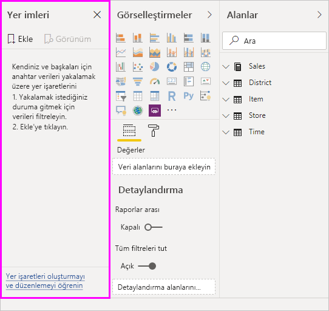

Yer işaretlemesine yönelik birçok kullanım vardır. Örneğin yer işaretlerini, rapor oluşturma konusundaki ilerleyişinizi izlemek için kullanabilirsiniz (yer işaretleri kolayca eklenebilir, silinebilir ve yeniden adlandırılabilir) ve yer işaretleri üzerinden sırayla ilerleyen PowerPoint benzeri bir sunum oluşturarak raporunuzla bir hikaye anlatmak için yer işaretlerinden yararlanabilirsiniz. 

> [!TIP]
> Power BI hizmetinde kişisel yer işaretlerini kullanma hakkında bilgi edinmek için bkz. [Power BI hizmetinde kişisel yer işaretleri duyurusu](https://powerbi.microsoft.com/blog/announcing-personal-bookmarks-in-the-power-bi-service/). 

## Yer işaretlerini kullanma
Yer işaretlerini kullanmak için Power BI Desktop şeridinde **Görünüm** sekmesini ve ardından **Yer İşaretleri Bölmesi**'ni seçin. 

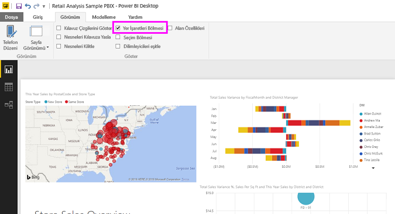

Bir yer işareti oluşturduğunuzda aşağıdaki öğeler, bu yer işareti ile birlikte kaydedilir:

* Geçerli sayfa
* Filtreler
* Dilimleyici türü (açılan menü veya liste) ve dilimleyici durumu dahil olmak üzere dilimleyiciler
* Görsel seçim durumu (çapraz vurgulama filtreleri gibi)
* Sıralama düzeni
* Detay konumu
* Nesnenin görünürlüğü (**Seçim** bölmesi kullanılarak)
* Herhangi bir görünür nesnenin odak veya **Spotlight** modları

Rapor sayfasını yer işaretinde görünmesini istediğiniz şekilde yapılandırın. Rapor sayfanızı ve görsellerinizi istediğiniz şekilde düzenledikten sonra yer işareti eklemek için **Yer İşaretleri** bölmesinden **Ekle**'yi seçin. 

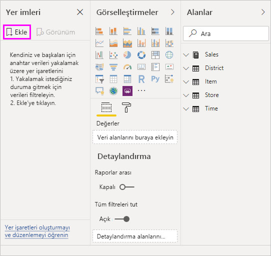

Power BI Desktop, bir yer işareti oluşturur ve yer işaretine genel bir ad verir. Bir yer işaretini, yer işareti adının yanındaki üç nokta simgesini seçip görüntülenen menüden bir eylem seçerek kolayca **Yeniden Adlandırabilir**, **Silebilir** veya **Güncelleştirebilirsiniz**.

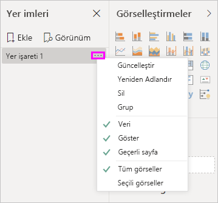

Yer işaretini oluşturduktan sonra **Yer İşaretleri** bölmesinde seçerek görüntüleyin. 

Ayrıca her yer işaretinin, filtreler ve dilimleyiciler gibi **Veri** özelliklerini, öne çıkanlar ve görünürlüğü gibi **Görüntüleme** özelliklerini ve yer işareti eklendiğinde görünür olan sayfayı sunan **Geçerli sayfa** değişikliklerini uygulayıp uygulamayacağını seçebilirsiniz. Bu özellikler, rapor görünümleriyle görsel seçimleri arasında geçiş yapmak için yer işaretlerini kullanırken faydalıdır. Ancak bu durumda, kullanıcılar görünümler arasında geçiş yaptıkça filtrelerin sıfırlanmaması için veri özelliklerini kapatmak isteyebilirsiniz. 

Bunun gibi değişiklikler yapmak için yer işaretinin adının yanında bulunan üç noktayı seçin, ardından **Veriler**, **Görüntü** ve diğer denetimlerin yanındaki onay işaretlerini seçin ya da seçimini kaldırın. 

## Yer işaretlerini düzenleme
Yer işaretleri oluşturdukça bunları oluşturduğunuz sıranın hedef kitlenize sunmak istediğiniz sırayla farklı olduğunu görebilirsiniz. Sorun değil, yer işaretlerinin sırasını kolayca yeniden düzenleyebilirsiniz.

- **Yer İşaretleri** bölmesinde yer işaretlerini sürükleyip bırakarak sıralarını değiştirin. 

   Yer işaretleri arasındaki sarı çubuk, sürüklenen yer işaretinin nereye yerleştirileceğini belirtir.

   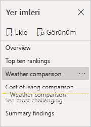

Yer işaretlerinizin sırası, sonraki bölümde açıklandığı gibi yer işaretlerinin **Görünüm** özelliği kullanılırken önemli olabilir.

## Slayt gösterisi olarak yer işaretleri
Sırasıyla sunmak istediğiniz bir yer işareti koleksiyonunuz olduğunda, bir slayt gösterisi başlatmak için **Yer İşaretleri** bölmesindeki **Görünüm** seçeneğini belirleyebilirsiniz.

**Görünüm** modunda dikkat edilmesi gereken bazı özellikler vardır.

   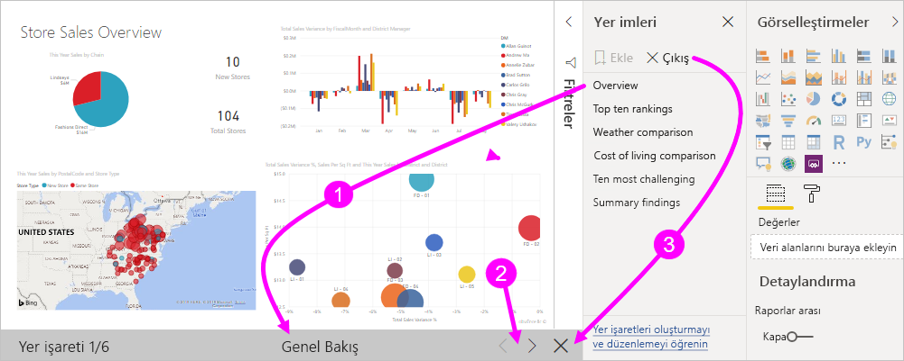

1. Yer işaretinin adı, tuvalin alt tarafında görüntülenen yer işareti başlık çubuğunda görünür.

2. Yer işareti başlık çubuğu, önceki ve sonraki yer işaretine gitmenize olanak sağlayan oklar içerir.

3. **Görünüm** modundan çıkmak için **Yer İşaretleri** bölmesindeki **Çıkış**’ı veya yer işareti başlık çubuğundaki **X** işaretini seçebilirsiniz. 

**Görünüm** modundayken sunumunuz için daha fazla alan sağlamak üzere **Yer İşaretleri** bölmesindeki **X** işaretine tıklayarak bu bölmeyi kapatabilirsiniz. **Görünüm** modundayken tüm görseller etkileşimlidir ve normalde bunlarla doğrudan etkileşim kurduğunuzda olduğu gibi çapraz vurgulama için kullanılabilir. 

## Görünürlük: Seçim bölmesini kullanma
**Yer İşaretleri** bölmesiyle ilişkili olarak **Seçim** bölmesi geçerli sayfadaki tüm nesnelerin listesini sunar ve bir nesne seçip görünür olup olmayacağını belirtmenize olanak sağlar. 

**Seçim** bölmesinde bir nesne seçer ve nesnenin sağındaki göz simgesini kullanarak nesnenin şu anda görünür olmasıyla olmaması arasında geçiş yapabilirsiniz. 

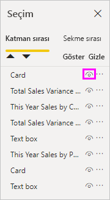

Yer işareti eklediğinizde her nesnenin görünürlük durumu da **Seçim** bölmesindeki ayarına göre kaydedilir. 

Dilimleyicilerin, görünür olup olmadıklarından bağımsız olarak rapor sayfalarını filtrelemeye devam ettiğini unutmayın. Bu nedenle, farklı dilimleyici ayarlarına sahip birçok farklı yer işareti oluşturabilir ve tek bir rapor sayfasının çeşitli yer işaretlerinde farklı görünmesini (ve farklı içgörüleri vurgulamasını) sağlayabilirsiniz.

> [!NOTE]
> **Seçim** bölmesini yer işaretleriyle birlikte kullandığınızda seçim sonuçlarının görünürlüğünü değiştirirseniz görünürlük ayarı varsayılan ayara döner. Bu değişiklikleri yaptıktan sonra görünürlüğünü güncelleştirmek için yer işaretine sağ tıklayıp *Güncelleştir*'i seçebilirsiniz.

## Şekiller ve resimler için yer işaretleri
Yer işaretlerine şekil ve resim de bağlayabilirsiniz. Bu özellikle, bir nesneyi seçtiğinizde o nesneyle ilişkili yer işareti gösterilir. Bu özellik düğmelerle çalıştığınızda özellikle önemlidir. Daha fazla bilgi için bkz. [Power BI'da düğmeleri kullanma](desktop-buttons.md). 

Nesneye yer işareti atamak için: 

1. Rapor tuvalinde nesneyi seçin. Ardından görüntülenen **Şekli Biçimlendir** bölmesinde **Eylem** kaydırıcısını **Açık** konuma getirin.

2. **Eylem** bölümünü genişletin. **Tür**'ün altında **Yer İşareti**'ni seçin.

3. **Yer İşaretleri**'nin altında bir yer işareti seçin.

   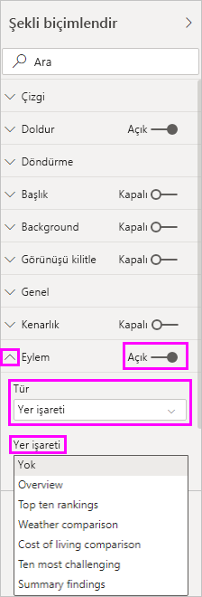

Nesne bağlantılı yer işaretlemesi ile pek çok ilgi çekici işlem yapabilirsiniz. Rapor sayfanızdaki görsellere ilişkin bir içindekiler tablosu oluşturabilir veya aynı bilgilerle farklı görünümler (görsel türleri gibi) sağlayabilirsiniz.

Düzenleme modundayken **Ctrl** tuşuna basın ve izlenecek bağlantıyı seçin. Düzenleme modunda değilseniz, bağlantıyı izlemek için nesneyi seçin. 

## Yer işareti grupları

Power BI Desktop uygulamasının Ağustos 2018 sürümünden itibaren yer işareti grupları oluşturabilir ve kullanabilirsiniz. Yer işareti grubu belirttiğiniz yer işaretlerinden oluşan ve grup halinde gösterilip düzenlenebilen bir koleksiyondur. 

Yer işareti grubu oluşturma: 
1. **Ctrl** tuşuna basın ve gruba eklemek istediğiniz yer işaretlerini seçin. 

2. Seçtiğiniz yer işaretlerinin yanındaki üç noktayı seçin ve sonra da görüntülenen menüde **Gruplandır**'ı seçin.

   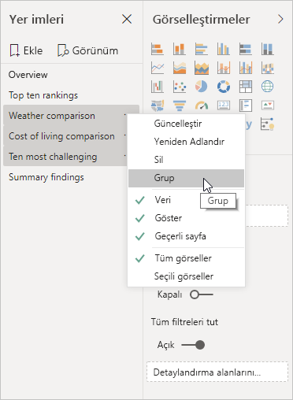

Power BI Desktop, gruba otomatik olarak *Grup 1* adını verir. Bu adın yanındaki üç noktayı ve sonra da **Yeniden Adlandır**'ı seçerek istediğiniz gibi yeniden adlandırabilirsiniz.

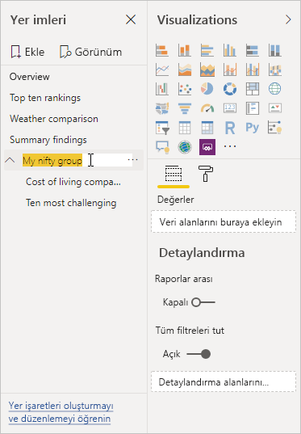

Herhangi bir yer işareti grubunda olduğu gibi, ye işaretinin adı genişletildiğinde yalnızca yer işaretleri grubu genişletilir veya daraltılır; bu tek bir yer işaretini temsil etmez. 

Yer işaretlerinin **Görüntüle** özelliğini kullandığınızda aşağıdaki ayrıntılar geçerli olur:

* Seçilen yer işareti bir grubun içindeyse **Görüntüle** seçeneğini belirlediğinizde görüntüleme oturumunda yalnızca *bu gruptaki* yer işaretleri gösterilir. 

* Seçilen yer işareti bir grup değilse veya en üst düzeydeyse (yer işareti grubunun adı gibi) gruptaki yer işaretleri dahil olmak üzere rapordaki tüm yer işaretleri oynatılır. 

Yer işaretleri grubunu çözmek için: 
1. Gruptaki yer işaretlerinden birini ve sonra da üç noktayı seçin. 

2. Görüntülenen menüden **Grubu Çöz**'ü seçin.

   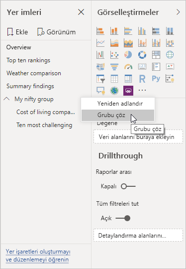

   Gruptaki herhangi bir yer işaretinden **Grubu Çöz**'ü seçtiğinizde tüm yer işaretleri gruptan kaldırılır; grup silinir, ama yer işaretlerinin kendileri silinmez. 

Gruptan tek bir yer işaretini kaldırmak için: 
1. Söz konusu grubun herhangi bir üyesinin **grubunu çözün**; bu işlem tüm gruplandırmayı siler. 

2. Yeni grupta yer almasını istediğiniz üyeleri belirlemek için **Ctrl** tuşuna basıp her yer işaretini seçin ve sonra da yeniden **Gruplandır**'ı seçin. 

## Spotlight'ı kullanma
Yer işaretleri ile gelen bir diğer özellik de *Spotlight* özelliğidir. Örneğin **Görünüm** modunda yer işaretlerinizin sunumunu yaparken, Spotlight özelliğiyle ilgiyi belirli bir grafiğe çekebilirsiniz.

Şimdi Spotlight ile odak modunu karşılaştıralım ve aralarındaki farkları görelim:

1. Odak moduyla, görselin **Odak modu** simgesini seçtiğinizde görsel tuvalin tamamını kaplar.

2. Spotlight'la, bir görseli özgün boyutunda vurgulamak üzere görselin üç nokta menüsünde **Öne Çıkanlar**'ı seçtiğinizde sayfadaki diğer tüm görseller saydamlığa yakın düzeyde soluklaşır. 

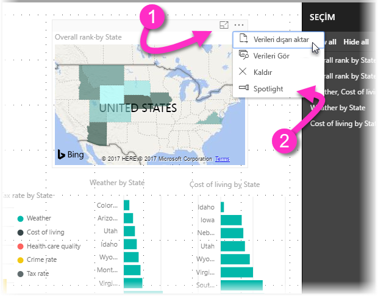

Önceki resimde görselin **Odak modu** simgesini seçtiğinizde sayfa aşağıdaki gibi görünür:

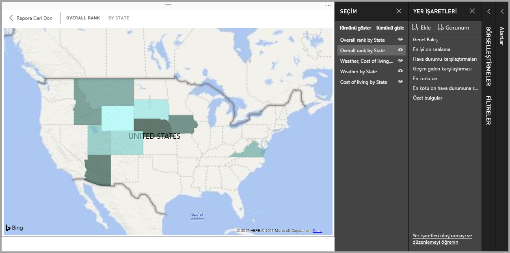

Buna karşılık görselin üç nokta menüsünden **Spotlight** seçildiğindeyse sayfa aşağıdaki gibi görünür:

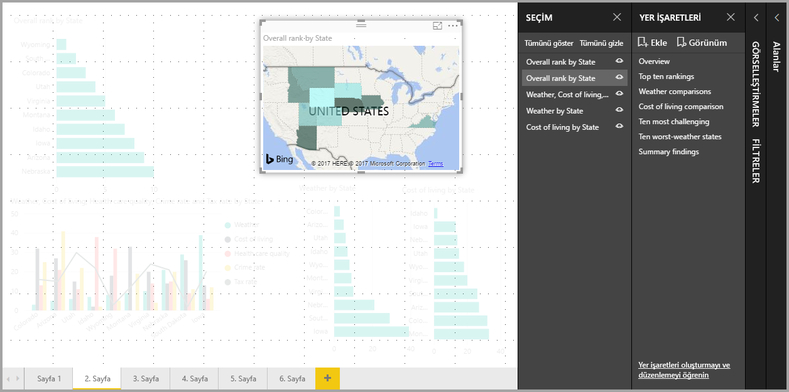

Yer işareti eklendiğinizde Spotlight veya odak modu seçili durumdaysa, bu mod yer işaretinde de korunur.

## Power BI hizmetinde yer işaretleri
Power BI hizmetinde en az bir yer işareti bulunan bir rapor yayımladığınızda, bu yer işaretlerini Power BI hizmetinde görüntüleyebilir ve yer işaretleriyle etkileşim kurabilirsiniz. Raporda yer işaretleri kullanılabilir olduğunda, **Görünüm** > **Seçim bölmesi**'ni veya **Görünüm** > **Yer İşaretleri bölmesi**'ni seçerek **Seçim** veya **Yer İşaretleri** bölmesini görüntülersiniz. 

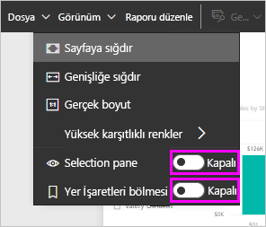

Power BI hizmetinde **Yer İşaretleri** bölmesi tıpkı Power BI Desktop'taki gibi çalışır. Yer işaretlerinizi bir slayt gösterisi gibi sırayla göstermek için **Görünüm** seçeneğini belirlemek de buna dahildir.

Yer işaretleri arasında gezinmek içni siyah oklar yerine gri yer işareti başlık çubuğunu kullanın. (Siyah oklar sizi yer işaretleri arasında değil rapor sayfaları arasında taşır.)

## Yer işaretleri önizlemesini (Mart 2018’den önceki sürümler) etkinleştirme
Power BI Desktop’ın Mart 2018 sürümünden itibaren, yer işaretleri genel kullanıma sunulmuştur. 

Her zaman en son sürüme yükseltmeniz önerilir. Ancak Power BI Desktop sürümünüz söz konusu sürümden eskiyse Power BI Desktop’ın Ekim 2017 sürümü itibarıyla, yer işaretleri özelliğini deneyebilirsiniz. Bu özellik, Power BI hizmetindeki yer işareti özellikli raporlar için de kullanılabilir. 

Önizleme yer işaretleri özelliğini etkinleştirmek için: 

1. **Dosya** > **Seçenekler ve Ayarlar** > **Seçenekler** > **Önizleme Özellikleri**'ni seçin ve sonra da **Yer İşaretleri**'ni seçin. 

   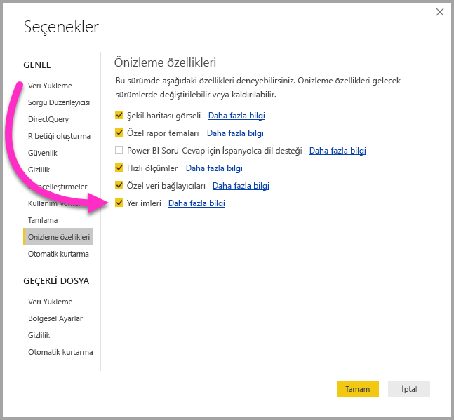

2. Yer işaretlerinin önizleme sürümünü etkinleştirmek için Power BI Desktop'ı yeniden başlatın.

## Sınırlamalar ve önemli noktalar
Yer işareti özelliklerinin bu sürümünde dikkat etmeniz gereken bazı sınırlamalar ve önemli noktalar bulunmaktadır.

* Çoğu Power BI görselinin yer işareti eklemeyle iyi çalışması gerekir. Öte yandan yer işareti eklemeyle ve özel görselle ilgili olarak sorunlarla karşılaşırsanız, bu özel görseli oluşturan kişiye başvurun ve görseline yer işareti desteği eklemesini isteyin. 
* Yer işareti oluşturduktan sonra rapor sayfasına bir görsel eklerseniz bu görsel, varsayılan durumunda görüntülenir. Diğer bir deyişle, önceden yer işaretleri oluşturduğunuz bir sayfaya dilimleyici eklediğinizde dilimleyici varsayılan durumuna göre davranır.
* Yer işareti oluşturulduktan sonra gerçekleştirdiğiniz görsel taşıma işlemleri otomatik olarak yer işaretine yansıtılır. 

## Sonraki adımlar
Yer işaretlerine benzeyen veya yer işaretleriyle etkileşim kuran özellikler hakkında daha fazla bilgi için aşağıdaki makalelere bakın:

* [Power BI Desktop'ta detaylandırma özelliğini kullanma](desktop-drillthrough.md)
* [Bir pano kutucuğunu veya rapor görselini odak modunda görüntüleme](../consumer/end-user-focus.md)
