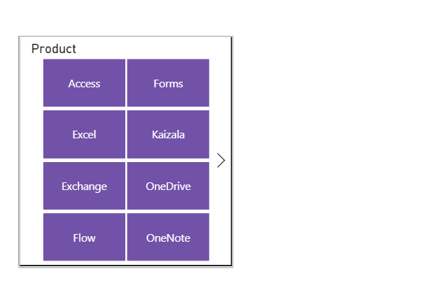
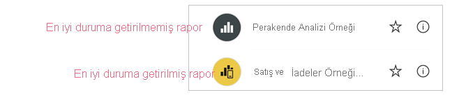
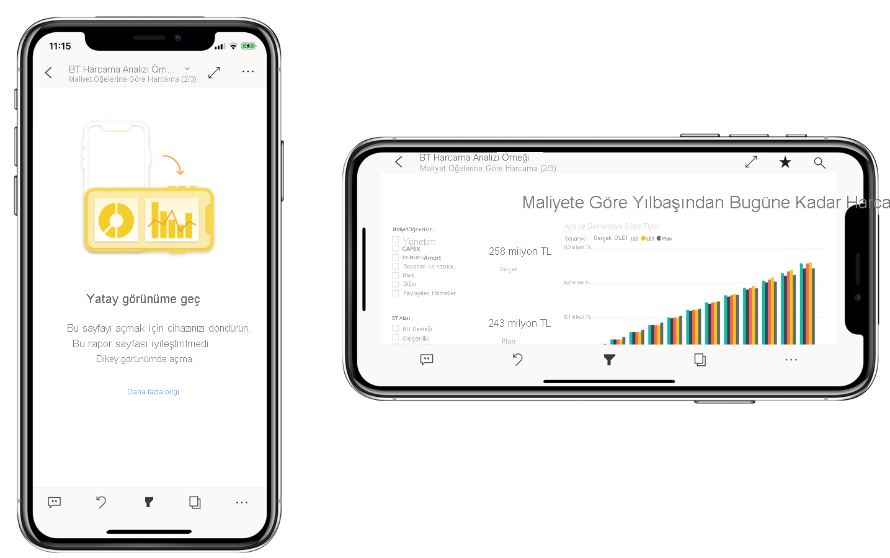

# Power BI raporlarını mobil uygulama için iyileştirme
Mobil kullanıcılar bir Power BI rapor sayfasını yatay yönlendirmede görüntüleyebilir. Ancak rapor yazarları, mobil cihazlar için iyileştirilmiş ek bir görünüm oluşturabilir ve dikey yönlendirmede görüntüleyebilirler. Hem Power BI Desktop’ta hem de Power BI hizmetinde kullanılabilir olan bu tasarım seçeneği, yazarların yalnızca hareket halindeki mobil kullanıcılar için anlamlı olan bu görselleri seçip yeniden düzenlemesine olanak verir.

.

Power BI, raporlarınızın mobil cihazlar için iyileştirilmiş sürümlerini oluşturmanıza yardımcı olacak çok sayıda özellik sağlar:
* Görselleri bir telefon öykünücüsü tuvaline sürükleyip bırakarak mobil cihazlar için iyileştirilmiş raporunuzu oluşturabileceğiniz bir mobil düzen görünümü.
* Küçük, mobil ekranlarda kullanım için iyileştirilebilen görseller ve dilimleyiciler.

Bu özellikler mobil cihazlar için iyileştirilmiş, ilgi çekici ve etkileşimli raporlar tasarlayıp oluşturmanıza olanak verir.

## Bir rapor sayfasının mobil cihazlar için iyileştirilmiş dikey sürümünü oluşturma

İlk adım, raporu normal web görünümünde tasarlayıp oluşturmaktır. Raporu oluşturduktan sonra, telefonlar ve tabletler için iyileştirebilirsiniz.

Mobil cihazlar için iyileştirilmiş görünümü oluşturmak için mobil düzen görünümünü açın:
   * Power BI Desktop’ta **Görünüm** şeridini ve sonra **Mobil düzen**’i seçin.
   * Power BI hizmetinde **Diğer seçenekler (...) > Raporu düzenle > Mobil Düzen**’i seçin.

   Telefon şekline sahip kaydırılabilir bir tuval ve özgün rapor sayfasında yer alan tüm görsellerin listelendiği bir **Görselleştirme** sekmesi görürsünüz.

   .

* **Görselleştirmeler** bölmesindeki her görsel, kolayca tanımlayabilmek amacıyla için adıyla birlikte görünür.
* Her görselde bir görünürlük göstergesi vardır. Bir görselin görünürlük göstergesi, web raporu görünümünün geçerli halindeki görselin durumuna bağlı olarak değişir. Görünürlük göstergesi, yer işaretleriyle çalışırken kullanışlıdır.

## Mobil düzen tuvaline görseller ekleme
Mobil düzene eklemek istediğiniz görselleri **Görsel Öğeler** bölmesinden telefon tuvaline sürükleyin. Görseli tuvale sürüklediğinizde kılavuza yaslanır. Alternatif olarak, görselleştirme bölmesindeki görsele çift tıklayarak görselin tuvale eklenmesini sağlayabilirsiniz.

Web raporu sayfasındaki görsellerin bazılarını veya tümünü mobil cihazlar için iyileştirilmiş rapor sayfasına ekleyebilirsiniz. Her görseli bir kez ekleyebilirsiniz, tüm görselleri eklemek zorunda değilsiniz.

>[!NOTE]
> Gizli görselleri tuvale sürükleyip bırakabilirsiniz. Bunlar yerleştirilir, ancak geçerli web raporu görünümündeki görünürlük durumları değişmediği sürece gösterilmez.

Görseller yer işaretleri kullanılarak etkileşimli raporlar oluşturmak amacıyla birbirinin üzerine katmanlanabilir veya görseller resimlerin üzerine katmanlanarak ilgi çekici raporlar oluşturulabilir.

Tuvale bir görsel yerleştirdikten sonra, görseli seçtiğinizde kenarlarında görünen tutamaçları sürükleyerek yeniden boyutlandırabilirsiniz. Yeniden boyutlandırma sırasında görselin boyut oranını korumak için, yeniden boyutlandırma tutamaçlarını sürüklerken **Shift** tuşuna basın.

Aşağıdaki resimde, hem **Görselleştirmeler** bölmesindeki görselleri tuvale sürükleyip bırakma hem de bu görsellerden bazılarını yeniden boyutlandırıp katmanlandırma işlemi gösterilmektedir.

   

Telefon raporu kılavuzu farklı boyutlardaki telefonlara göre değişir. Bu sayede raporunuz hem küçük hem de büyük ekranlı telefonlarda güzel görünür.

## Mobil düzen tuvalindeki görselleri kaldırma
Bir görseli mobil düzenden kaldırmak için, telefon tuvalinde yer alan görselin sağ üst köşesindeki **X**‘e tıklayın veya görseli seçip **Sil**’e basın.

**Görselleştirme** bölmesindeki silgiye tıklayarak tüm görselleştirmeleri tuvalden kaldırabilirsiniz.

Mobil düzen tuvalinden görselleri kaldırmak, bunları yalnızca tuvalden kaldırır. Görseller, görselleştirme bölmesinde görünmeye devam eder ve özgün rapor etkilenmez.

## Görselleri ve dilimleyicileri mobil cihazlar için iyileştirilmiş raporlarda kullanılacak şekilde yapılandırma

### Görseller

Varsayılan olarak pek çok görsel, özellikle grafik türündeki görseller duyarlıdır.  Yani ekran boyutu ne olursa olsun maksimum sayıda veri ve içgörü görüntüleyecek şekilde dinamik olarak değişirler.

Görsel boyut değiştirdikçe, Power BI verilere öncelik verir. Örneğin, görselin küçülse dahi bilgilendirici olması için otomatik olarak boşluğu kaldırabilir ve açıklamayı görselin üst tarafına taşıyabilir.

 
Herhangi bir sebepten dolayı duyarlılığı kapatmak isterseniz bunu görselin biçim ayarlarındaki **Genel** bölümünden yapabilirsiniz.

### Dilimleyiciler

Dilimleyiciler, rapor verilerinizin tuval üzerinde filtrelenmesini sağlar. Dilimleyicileri normal rapor oluşturma modunda tasarlarken mobil cihazlar için iyileştirilmiş raporlarda daha kullanışlı hale getirmek amacıyla bazı dilimleyici ayarlarını değiştirebilirsiniz:
* Rapor okuyucularının yalnızca bir öğeyi veya birden çok öğeyi seçmelerine izin verme kararını verebilirsiniz.
* Dilimleyiciyi dikey, yatay veya duyarlı (duyarlı dilimleyicilerin yatay olması gerekir) hale getirebilirsiniz.

Dilimleyiciyi esnek hale getirirseniz boyutunu veya şeklini değiştirdiğinizde daha fazla ya da daha az seçenek görüntülenir. Dilimleyici uzun, kısa, geniş veya dar olabilir. Yeterince küçültürseniz rapor sayfasında bir filtre simgesine dönüşür.

 
[Esnek dilimleyiciler oluşturma](power-bi-slicer-filter-responsive.md) hakkında daha fazla bilgi edinin.

## Mobil cihazlar için iyileştirilmiş rapor yayımlama
Bir raporun mobil cihazlar için iyileştirilmiş sürümünü yayımlamak üzere [Power BI Desktop’taki ana raporu Power BI hizmetinde yayımlayın](desktop-upload-desktop-files.md). Bu, aynı zamanda mobil cihazlar için iyileştirilmiş sürümün de yayımlanmasını sağlar.

## İyileştirilmiş ve iyileştirilmemiş raporları telefonda veya tablette görüntüleme

Power BI mobil uygulamalarında, mobil cihazlar için iyileştirilmiş raporlar özel bir simgeyle gösterilir.

Telefonlarda, uygulama raporun mobil cihazlar için iyileştirilmiş olup olmadığını otomatik olarak algılar.
* Mobil cihazlar için iyileştirilmiş bir rapor varsa uygulama bu raporu otomatik olarak mobil cihazlar için iyileştirilmiş modda açar.
* Mobil cihazlar için iyileştirilmiş rapor yoksa bu rapor iyileştirilmemiş, yatay görünümde açılır.

Telefon yatay yönlendirmede tutmak, iyileştirilmiş olma durumundan bağımsız olarak raporun, özgün rapor düzeniyle ve iyileştirilmemiş görünümde açılmasını sağlar.

Yalnızca bazı sayfaları iyileştirirseniz iyileştirilmemiş bir sayfaya geldiklerinde okuyucuların yatay görünüme geçmeleri istenir. Telefonu veya tableti yan çevirmek, sayfayı yatay modda görmelerini sağlar. [Dikey mod için en iyi duruma getirilmiş Power BI raporlarıyla etkileşimli çalışma hakkında daha fazla bilgi edinin](../consumer/mobile/mobile-apps-view-phone-report.md).

## Mobil cihazlar için iyileştirilmiş düzenler oluşturulurken dikkat edilmesi gerekenler
* Çok sayfalı raporlarda tüm sayfaları veya yalnızca birkaç tanesini en iyi duruma getirebilirsiniz.
* Belirli bir rapor sayfası için arka plan rengi tanımladıysanız mobil cihazlar için iyileştirilmiş raporda da aynı arka plan rengi kullanılır.
* Biçim ayarları, yalnızca mobil cihazlar için iyileştirilmiş raporda değiştirilemez. Ana ve mobil düzenlerin biçimlendirme özellikleri ortaktır. Örneğin yazı tipi boyutları aynı olacaktır.
* Bir görselin biçimini, veri kümesini, filtrelerini veya diğer özniteliklerini değiştirmek için normal web’de rapor oluşturma moduna geçin.

## Sonraki adımlar
* [Power BI'da bir panonun telefon görünümünü oluşturma](service-create-dashboard-mobile-phone-view.md).
* [View Power BI reports optimized for your phone (Telefonunuz için en iyi duruma getirilmiş Power BI raporlarını görüntüleme)](../consumer/mobile/mobile-apps-view-phone-report.md).
* [Raporlar ve panolar oluşturmaya yönelik Power BI belgeleri](./index.yml).
* Başka bir sorunuz mu var? [Power BI Topluluğu'na sorun](https://community.powerbi.com/).