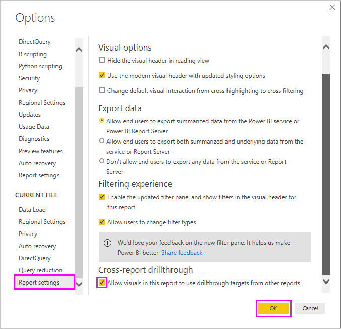
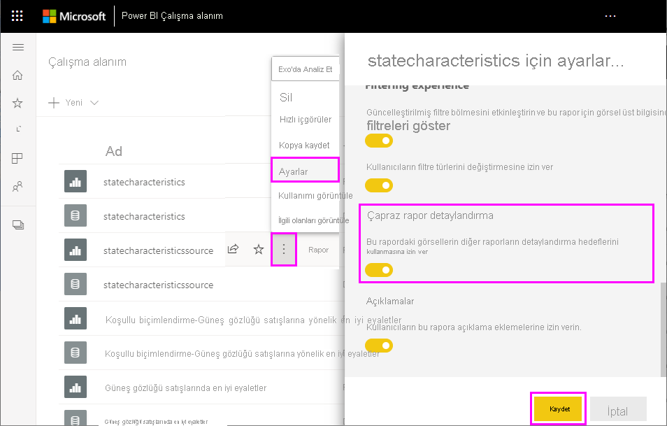
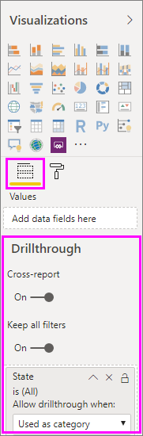

# Power BI’da çapraz rapor detaylandırma özelliğini kullanma

Power BI *çapraz rapor detaylandırma* özelliğini kullanarak aynı Power BI hizmeti çalışma alanı veya uygulamasında bir rapordan başka bir rapora bağlamsal olarak atlayabilirsiniz. İlgili içeriğe sahip iki veya daha fazla raporu bağlamak ve çapraz rapor bağlantısıyla birlikte filtre bağlamını iletmek için çapraz rapor detaylandırma özelliğini kullanabilirsiniz. 

Çapraz rapor detaylandırma özelliğini başlatmak için *kaynak raporun* *kaynak görselinde* bir veri noktası seçersiniz ve sonra da bağlam menüsünden çapraz rapor **Detaylandırma** hedefini seçersiniz. 

Detaylandırma eylemi *hedef raporda* *hedef sayfayı* açar. 

Bu makalede Power BI raporları için çapraz rapor detaylandırma özelliğini nasıl ayarlayacağınız ve kullanacağınız gösterilir.

> [!NOTE]
> Çapraz rapor detaylandırma özelliğini [Çalışma Alanım](../collaborate-share/service-share-dashboards.md#share-a-dashboard-or-report) içinde bireysel olarak paylaşılan **Benimle paylaşılan** raporlarda kullanamazsınız. Çapraz rapor detaylandırma özelliğini kullanmak için, raporlara paylaşıldıkları çalışma alanında erişmeniz gerekir.

## Çapraz rapor detaylandırmayı etkinleştirme

Çapraz rapor detaylandırma özelliğini etkinleştirmenin ilk adımı, kaynak ve hedef raporların veri modellerini doğrulamaktır. Her rapordaki şemaların aynı olması gerekmese de, geçirmek istediğiniz alanların her iki veri modelinde de mevcut olması gerekir. Alanların adları ve bunları barındıran tabloların adları özdeş olmalıdır. Dizeler eşleşmeli ve büyük/küçük harfe duyarlı olmalıdır.

Örneğin, **US States** tablosundaki **State** alanında bir filtreyi geçirmek istiyorsanız her iki modelin de **US States** tablosuna ve o tablo içinde bir **State** alanına sahip olması gerekir. Aksi takdirde, temel alınan modeldeki alan adını veya tablo adını güncelleştirmeniz gerekir. Alanların sadece görünen adını güncelleştirmek, çapraz rapor detaylandırması için işe yaramaz.

Modellerinizi doğruladıktan sonra kaynak raporun çapraz rapor detaylandırmayı kullanmasını etkinleştirin. 

1. Power BI Desktop'ta **Dosya** > **Seçenekler ve ayarlar** > **Seçenekler** bölümüne gidin. 
1. **Seçenekler** penceresinin sol gezintisindeki **Geçerli dosya** bölümünün altında **Rapor ayarları**'nı seçin. 
1. Sağ alt kısımdaki **Çapraz rapor detaylandırma**'nın altında **Bu rapordaki görsellerin diğer raporlardaki detaylandırma hedeflerini kullanmasına izin ver** onay kutusunu seçin. 
1. **Tamam**’ı seçin. 
   
   

Çapraz rapor detaylandırma özelliğini Power BI hizmetinden de etkinleştirebilirsiniz.
1. Power BI hizmetinde hedef ve kaynak raporlarınızı içeren çalışma alanını seçin.
1. Çalışma alanı listesindeki kaynak rapor adının yanında **Diğer seçenekler** simgesini ve sonra da **Ayarlar**'ı seçin. 
1. **Ayarlar** bölmesinin alt kısmındaki **Çapraz rapor detaylandırma**'nın altında **Bu rapordaki görsellerin diğer raporlardaki detaylandırma hedeflerini kullanmasına izin ver**'i ve ardından **Kaydet**'i seçin.
   
   

## Çapraz rapor detaylandırma hedefini ayarlama

Çapraz rapor detaylandırma için hedef sayfayı ayarlamak, bir rapor içinde detaylandırmayı ayarlama işlemine benzerdir. Hedef sayfada detaylandırmayı etkinleştirmek, diğer görsellerin detaylandırma için sayfayı hedef almasına olanak tanır. Tek bir rapor içinde detaylandırma oluşturmak için bkz. [Power BI Desktop’ta detaylandırma özelliğini kullanma](desktop-drillthrough.md).

Çapraz rapor detaylandırma özelliği için Power BI Desktop'ta veya Power BI hizmetinde hedefi ayarlayabilirsiniz. 
1. Hedef dosyayı düzenleyin ve hedef raporun hedef sayfasında, **Görsel Öğeler** bölmesinin **Alanlar** bölümünü seçin. 
1. **Detaylandırma**'nın altında **Çapraz rapor** düğmesini **Açık** konuma getirin. 
1. Detaylandırma hedefleri olarak kullanmak istediğiniz alanları **Detaylandırma alanlarını buraya ekleyin** metninin üzerine sürükleyin. Her alan için, alan bir kategori olarak kullanıldığında veya ölçü gibi özetlendiğinde detaylandırmaya izin vermek isteyip istemediğinizi seçin. 
1. Görsel için **Tüm filtreleri tutmak** isteyip istemediğinizi seçin. Kaynak görsele uygulanan filtreleri hedef görsele geçirmek istemiyorsanız **Kapalı**'yı seçin.
   
   
   
1. Sayfayı yalnızca çapraz rapor detaylandırma için kullanıyorsanız, tuvale otomatik olarak eklenen **Geri** düğmesini silin. **Geri** düğmesi yalnızca raporun içinde gezinmeye yarar. 
1. Hedef sayfayı yapılandırdıktan sonra, Power BI hizmetini kullanıyorsanız raporu kaydedin veya Power BI Desktop kullanıyorsanız raporu kaydedip yayımlayın.

İşte bu kadar. Raporlarınız çapraz rapor detaylandırmaya hazır. 

## Çapraz rapor detaylandırmayı kullanma

Çapraz rapor detaylandırma özelliğini kullanmak için Power BI hizmetinde kaynak raporu seçin ve ardından hedef sayfayı ayarlarken belirttiğiniz şekilde detaylandırma alanını kullanan bir görsel seçin. Veri noktasına sağ tıklayarak görsel bağlam menüsünü açın, **Detaylandırma**’yı ve sonra da detaylandırma hedefini seçin. Çapraz rapor detaylandırma hedefleri **Sayfa adı [Rapor adı]** olarak biçimlendirilir.

Sonuçları, hedefi oluştururken ayarladığınız gibi hedef çapraz rapor detaylandırma sayfasında görürsünüz. Sonuçlar detaylandırma ayarlarına göre filtrelenir.

> [!IMPORTANT]
> Power BI, çapraz rapor detaylandırma hedeflerini önbelleğe kaydeder. Değişiklik yaparsanız, detaylandırma hedeflerini beklenen şekilde görmemeniz durumunda tarayıcınızı yenilediğinizden emin olun. 

Hedef sayfayı ayarlarken **Tüm filtreleri tut** seçeneğini **Açık** olarak ayarladıysanız, kaynak görselden filtre bağlamı aşağıdakileri içerebilir: 

- Kaynak görseli etkileyen rapor, sayfa ve görsel düzeyi filtreleri 
- Kaynak görseli etkileyen çapraz filtre ve çapraz vurgulama 
- Sayfa üzerindeki dilimleyiciler ve eşitleme dilimleyicileri
- URL parametreleri

Detaylandırma için hedef rapora girdiğinizde, Power BI alan adı ve tablo adı için yalnızca tam dize eşleşmeleri içeren alanlara filtre uygular. 

Power BI hedef rapordan yapışkan filtreleri uygulamaz ama varsayılan kişisel yer işaretinizi (varsa) uygular. Örneğin, varsayılan kişisel yer işaretiniz *Ülke = ABD* için bir rapor düzeyi filtresi içeriyorsa, kaynak görselden filtre bağlamını uygulamadan önce Power BI bu filtreyi uygular. 

Çapraz rapor detaylandırma için Power BI, filtre bağlamını hedef rapordaki standart sayfalara geçirir. Araç ipucu sayfaları araç ipucunu çağıran kaynak görsele göre filtreleneceği için, Power BI araç ipucu sayfaları için filtre bağlamını geçirmez.

Çapraz rapor detaylandırma eyleminden sonra kaynak rapora dönmek isterseniz tarayıcının **Geri** düğmesini kullanın. 

## Sonraki adımlar

Aşağıdaki makaleler de ilginizi çekebilir:

- [Power BI'da dilimleyiciler](../visuals/power-bi-visualization-slicers.md)
- [Power BI Desktop'ta detaylandırma özelliğini kullanma](desktop-drillthrough.md)
