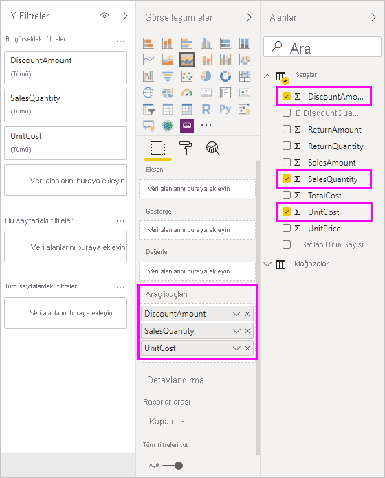
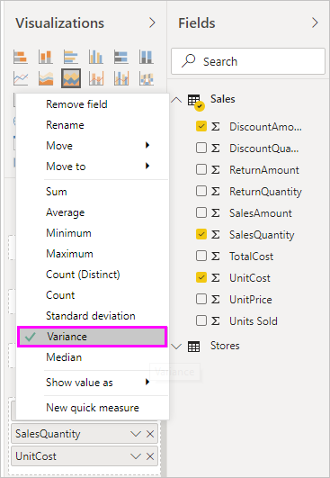

# Power BI Desktop'taki araç ipuçlarını özelleştirme

Araç ipuçları, görseller üzerinde daha fazla bağlamsal bilgi ve daha ayrıntılı veri noktaları sağlamak için kullanılan mükemmel bir yoldur. Aşağıdaki görüntüde, Power BI Desktop'taki bir grafiğe uygulanmış bir araç ipucu gösterilmektedir.

Bir görselleştirme oluşturulduğunda varsayılan araç ipucu, veri noktasının değerini ve kategorisini görüntüler. Birçok durumda araç ipucu bilgilerini özelleştirmek yararlı olur. Araç ipuçlarının özelleştirilmesi, görseli görüntüleyen kullanıcılara ek bağlam ve bilgi sağlar. Özel araç ipuçları, araç ipucunun bir parçası olarak görüntülenebilecek ek veri noktaları belirlemenize olanak sağlar.

## Araç ipuçlarını özelleştirme

Özelleştirilmiş bir araç ipucu oluşturmak için **Görsel Öğeler** bölmesinin **Alanlar** kutusunda, aşağıdaki resimde gösterildiği şekilde bir alanı **Araç ipuçları** demetine sürükleyin. Aşağıdaki resimde **Araç ipuçları** demetine üç alan yerleştirilmiş olarak gösterilmektedir.

Araç ipuçları **Araç İpuçları** kutusuna eklendikten sonra görselleştirmedeki bir veri noktasının üzerine gelindiğinde o alanlara yönelik değerler görüntülenir.

## Toplama veya hızlı ölçülerle araç ipuçlarını özelleştirme

Bir toplama işlevi veya *hızlı ölçü* seçerek araç ipucunu daha da özelleştirebilirsiniz. **Araç İpuçları** demetinde yer alan alanın yanındaki oku seçin. Ardından sağlanan seçenekler arasından seçim yapın.

Panolarınızı ve raporlarınızı görüntüleyen kullanıcılara hızlı bilgiler ve içgörüler sunmak için veri kümenizde sağlanan herhangi bir alanı kullanarak araç ipuçlarını özelleştirmenin pek çok yolu vardır.
