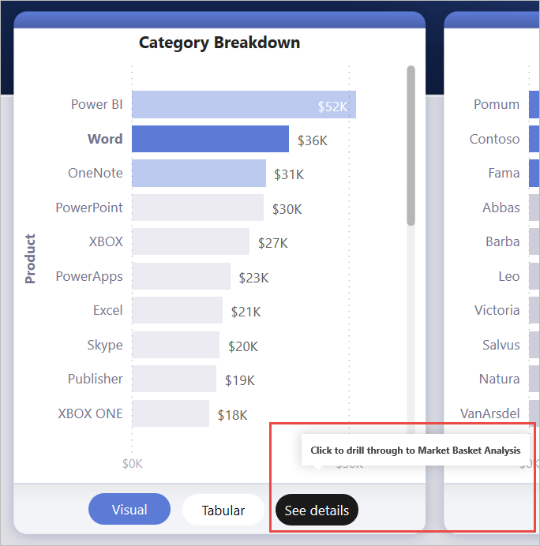

# <a name="create-a-drill-through-button-in-power-bi"></a>Power BI’da detaylandırma düğmesi oluşturma

Power BI’da, belirli bir bağlama göre filtrelenmiş ayrıntılarla bir sayfayı detaylandıran *detaylandırma* düğmesini oluşturabilirsiniz.

Bir raporda detaylandırma yollarından biri, görsele sağ tıklamaktır. Detaylandırma eyleminin daha belirgin olmasını istiyorsanız bunun yerine bir detaylandırma düğmesi oluşturabilirsiniz. Düğme, raporlarınızdaki önemli detaylandırma senaryolarının keşfedilebilirliğini artırabilir. Düğmenin görünme ve çalışma biçiminin büyük bir kısmını koşullu olarak belirleyebilirsiniz. Örneğin, belirli koşullar sağlanırsa bir düğme üzerinde farklı metin gösterebilirsiniz. Ayrıntılar için okumaya devam edin. 

Bu örnekte, siz grafikte Word çubuğunu seçtikten sonra **Ayrıntılara bakın** düğmesi etkinleştirilir.



**Ayrıntılara bakın** düğmesini seçtiğinizde, Pazar Sepeti Çözümlemesi sayfasını detaylandırırsınız. Soldaki görselde de görebileceğiniz gibi, detaylandırma sayfası şimdi Word için filtrelenmiştir.


## <a name="set-up-a-drill-through-button"></a>Detaylandırma düğmesi ayarlama

Detaylandırma düğmesi ayarlamak için önce raporunuzda [geçerli bir detaylandırma sayfası ayarlamanız](desktop-drillthrough.md) gerekir. Daha sonra eylem türü olarak **Detaylandırma** seçeneğini belirleyip bir düğme oluşturmanız ve **Hedef** olarak da detaylandırma sayfasını seçmeniz gerekir.

Detaylandırma düğmesinin iki durumu (etkin ve devre dışı) olduğundan, iki araç ipucu seçeneği görürsünüz.


Araç ipucu kutularını boş bırakırsanız Power BI otomatik olarak araç ipuçları oluşturur. Bu araç ipuçları, hedef ve detaylandırma alanlarını temel alır.

Aşağıda, düğme devre dışı olduğunda otomatik olarak oluşturulan bir araç ipucu örneği verilmiştir:

“Pazar Sepeti Çözümlemesi sayfasını [hedef sayfa] detaylandırmak için, Ürün’den [detaylandırma alanı] tek bir veri noktası seçin.”


Aşağıda, düğme etkin olduğunda otomatik olarak oluşturulan bir araç ipucu örneği verilmiştir:

“Pazar Sepeti Çözümlemesi sayfasını [hedef sayfa] detaylandırmak için tıklayın.”


Ancak özel araç ipuçları sağlamak isterseniz her zaman bir statik dize girebilirsiniz. [Araç ipuçlarına koşullu biçimlendirme](#set-formatting-for-tooltips-conditionally) de uygulayabilirsiniz.

## <a name="pass-filter-context"></a>Filtre bağlamını geçir

Düğme, normal detaylandırma gibi çalışır: Detaylandırma alanını içeren görselleri çapraz filtreleyerek ek alanlarda filtreler geçirebilirsiniz. Örneğin, seçimleriniz detaylandırma alanı olarak Ürün’ü içeren görseli çapraz filtrelediğinden, **Ctrl** + **tıklama** ve çapraz filtreleme yöntemini kullanarak Mağazadaki birden çok filtreyi detaylandırma sayfasına geçirebilirsiniz:


Detaylandırma düğmesini seçtikten sonra, hem Mağaza hem de Ürün üzerindeki filtrelerin hedef sayfaya geçirildiğini görürsünüz:


### <a name="ambiguous-filter-context"></a>Belirsiz filtre bağlamı

Detaylandırma düğmesi tek bir görsele bağlı olmadığından, seçiminiz belirsiz olursa düğme devre dışı bırakılır.

Bu örnekte, iki görsel de Ürün’de tek bir seçim içerdiğinden düğme devre dışı bırakılır. Detaylandırma eyleminin hangi görselden hangi veri noktasına bağlanacağı belirsizdir:


## <a name="customize-formatting-for-disabled-buttons"></a>Devre dışı düğmeler için biçimlendirmeyi özelleştirme
Detaylandırma düğmelerinin devre dışı bırakılma durumları için biçimlendirme seçeneklerini özelleştirebilirsiniz.


:::image type="content" source="media/desktop-drill-through-buttons/drill-through-customize-disabled-button.png" alt-text="Devre dışı bırakılan düğme biçimlendirmesini özelleştirme":::
 
Bu biçimlendirme seçenekleri arasında şunlar yer alır:
- **Düğme metin denetimleri**: metin, renk, doldurma, hizalama, boyut ve yazı tipi ailesi

    :::image type="content" source="media/desktop-drill-through-buttons/drill-through-disabled-button-text.png" alt-text="Devre dışı bırakılan düğme metnini biçimlendirme":::

- **Düğme dolgusu denetimleri**: renk, şeffaflık ve *yeni* dolgu görüntüsü (sonraki bölümde bununla ilgili daha fazla ayrıntı verilmiştir)

    :::image type="content" source="media/desktop-drill-through-buttons/drill-through-disabled-button-fill.png" alt-text="Devre dışı bırakılan düğme dolgusu":::

- **Simge denetimleri**: şekil, doldurma, hizalama, satır rengi, şeffaflık ve ağırlık

    :::image type="content" source="media/desktop-drill-through-buttons/drill-through-disabled-button-icon.png" alt-text="Devre dışı bırakılan düğme simgeleri":::

- **Ana hat denetimleri**: renk, şeffaflık, ağırlık, yuvarlak kenarlar

     :::image type="content" source="media/desktop-drill-through-buttons/drill-through-disabled-button-outline.png" alt-text="Devre dışı bırakılan düğme ana hat çizgisi":::

## <a name="set-formatting-for-button-text-conditionally"></a>Düğme metni biçimlendirmesini koşullu olarak ayarlama
Bir alanın seçilen değerine göre düğme metnini değiştirmek için koşullu biçimlendirmeyi kullanabilirsiniz. Bunu yapmak için, SELECTEDVALUE DAX işlevine göre istediğiniz dizeyi veren bir ölçü oluşturmanız gerekir.

Aşağıda, tek bir Ürün değeri seçili DEĞİLSE "Ürün ayrıntılarına bakın" değerini veren; seçiliyse "[the selected Product] ayrıntılarına bakın" değerini veren bir örnek ölçü verilmiştir:

```dax
String_for_button = If(SELECTEDVALUE('Product'[Product], 0) == 0, "See product details", "See details for " & SELECTEDVALUE('Product'[Product]))
```

Bu ölçüyü oluşturduktan sonra düğme metni için **Koşullu biçimlendirme** seçeneğini belirlersiniz:


Daha sonra düğme metni için oluşturduğunuz ölçüyü seçersiniz:


Tek bir ürün seçildiğinde düğme metninde şöyle yazar:

"Word ayrıntılarına bakın"


Herhangi bir ürün seçilmediğinde veya birden fazla ürün seçildiğinde düğme devre dışı bırakılır. Düğme metninde şöyle yazar:

"Ürün ayrıntılarına bakın"


## <a name="set-formatting-for-tooltips-conditionally"></a>Araç ipuçları biçimlendirmesini koşullu olarak ayarlama

Etkin veya devre dışı olduğunda detaylandırma düğmesinin araç ipucunu koşullu olarak biçimlendirebilirsiniz. Detaylandırma hedefini dinamik olarak ayarlamak için koşullu biçimlendirme kullandıysanız düğme durumu araç ipucunun son kullanıcınızın tercihine göre daha bilgilendirici olmasını isteyebilirsiniz. Aşağıda bazı örnekler verilmiştir:

- Devre dışı bırakılma durumu araç ipucunu, özel bir ölçüm kullanarak tek tek olay temelinde açıklayıcı olacak şekilde ayarlayabilirsiniz. Örneğin, kullanıcının Pazar Analizi sayfasını ayrıntılandırmadan önce tek bir ürün *ve* tek bir mağaza seçmesini istiyorsanız şu mantığa sahip bir ölçüm oluşturabilirsiniz:

    Kullanıcı tek bir ürün veya mağaza seçmediyse ölçüm şunu döndürür: “Tek bir ürün seçip beraberinde tek bir mağaza seçmek için Ctrl tuşunu basılı tutarak tıklayın.”

    Kullanıcı tek bir ürün seçmiş ancak mağaza seçmemişse ölçüm şunu döndürür: “Tek bir mağaza seçmek için Ctrl tuşunu basılı tutarak tıklayın.”

- Benzer şekilde, etkin durumdaki araç ipucunu kullanıcının tercihine göre belirlenecek şekilde ayarlayabilirsiniz. Örneğin, kullanıcının detaylandırma sayfasının hangi ürün ve mağazaya göre filtreleneceğini bilmesini istiyorsanız şunu döndüren bir ölçüm oluşturabilirsiniz:

    “[mağaza adı] mağazalarındaki [ürün adı] satışı hakkında diğer ayrıntıları görmek üzere [detaylandırılan sayfanın adı] sayfasını detaylandırmak için tıklayın.”


## <a name="set-the-drill-through-destination-conditionally"></a>Detaylandırma hedefini koşullu olarak ayarlama

Detaylandırma hedefini seçimin çıkışına göre ayarlamak için koşullu biçimlendirmeyi kullanabilirsiniz.

Detaylandırma hedefi düğmesinin koşullu olmasını tercih edebileceğiniz bazı senaryolar aşağıda verilmiştir:

- Sayfanın, yalnızca **birden çok koşul karşılandığında** detaylandırılmasını sağlamak istiyorsunuz. Aksi takdirde düğme devre dışı bırakılır.

    Örneğin, kullanıcıların Pazar ayrıntıları sayfasını detaylandırmadan önce tek bir ürün *ve* tek bir pazar seçmesini istiyorsunuz. Aksi takdirde düğme devre dışı bırakılır.

    :::image type="content" source="media/desktop-drill-through-buttons/drill-through-select-product-store.png" alt-text="Ürün ve mağaza seçme":::
 
- Düğmenin kullanıcı seçimlerine göre **birden çok detaylandırma hedefini desteklemesini** istiyorsunuz.

    Örneğin, kullanıcıların detaylandırabileceği birden çok hedefiniz (Pazar ayrıntıları ve Mağaza ayrıntıları) olduğunu varsayalım. Düğme, detaylandırma hedefi için etkinleştirilmeden önce kullanıcıların belirli bir detaylandırma hedefi seçmesini sağlayabilirsiniz.

    :::image type="content" source="media/desktop-drill-through-buttons/drill-through-select-product-destination.png" alt-text="Ürün ve hedef seçme":::
 
- Hem birden çok detaylandırma hedefini hem de düğmenin devre dışı olmasını isteyeceğiniz belirli koşulları destekleyecek ilginç **hibrit senaryo durumlarıyla** da karşılaşabilirsiniz. Bu üç seçenek hakkında ayrıntılı bilgi edinmek için okumaya devam edin.

### <a name="disable-the-button-until-multiple-conditions-are-met"></a>Birden çok koşul karşılanana kadar düğmeyi devre dışı durumda bırakma

Ek koşullar sağlanana kadar düğmeyi devre dışı durumda bırakmak istediğiniz ilk örnek olaya bakalım. Koşul sağlanmadıkça boş bir dize (“”) çıkışı üreten temel bir DAX ölçümü oluşturmanız gerekir. Koşul karşılandığında ise bu ölçüm, detaylandırma hedef sayfasının adını çıkış olarak alır.

Kullanıcının bir Üründen Mağazaya ayrıntı sayfasını detaylandırabilmesi için önce Mağaza’nın seçilmesini gerektiren örnek bir DAX ölçümü aşağıda verilmiştir:

```dax
Destination logic = If(SELECTEDVALUE(Store[Store], “”)==””, “”, “Store details”)
```

Ölçümü oluşturduktan sonra, düğme için **Hedef**’in yanındaki koşullu biçimlendirme (fx) düğmesini seçersiniz:

:::image type="content" source="media/desktop-drill-through-buttons/drill-through-select-formula.png" alt-text="Koşullu biçimlendirme düğmesini seçme":::
 
Son adımda, hedef için alan değeri olarak oluşturduğunuz DAX ölçümünü seçersiniz:

:::image type="content" source="media/desktop-drill-through-buttons/drill-through-based-formula.png" alt-text="Alana göre hedef"::: 

Ölçüm tek bir mağaza seçmenizi de gerektirdiğinden, artık tek bir ürün bile seçilmiş durumdaysa düğmenin devre dışı kaldığını görürsünüz:

:::image type="content" source="media/desktop-drill-through-buttons/drill-through-button-disabled.png" alt-text="Detaylandırma düğmesi devre dışı":::

### <a name="support-multiple-destinations"></a>Birden çok hedefi destekleme
 
Birden çok hedefi desteklemek istediğiniz diğer yaygın durumda, detaylandırma hedeflerinin adlarını içeren tek sütunlu bir tablo oluşturarak işe başlarsınız:

:::image type="content" source="media/desktop-drill-through-buttons/drill-through-create-table.png" alt-text="Tablo oluşturma":::

Power BI, detaylandırma hedefini ayarlamak için tam dize eşleşmesi kullandığından girilen değerlerin detaylandırma sayfa adlarıyla tam olarak uyumlu olduğunu iki kez kontrol edin.

Tabloyu oluşturduktan sonra tek seçimlik dilimleyici olarak sayfaya ekleyin:

:::image type="content" source="media/desktop-drill-through-buttons/drill-through-slicer.png" alt-text="Detaylandırma dilimleyicisi":::
 
Daha fazla dikey alana ihtiyacınız varsa dilimleyiciyi açılır menüye dönüştürün. Dilimleyici üst bilgisini kaldırın ve yanına başlık içeren bir metin kutusu ekleyin:

:::image type="content" source="media/desktop-drill-through-buttons/drill-through-drop-down-slicer.png" alt-text="Üst bilgi içermeyen detaylandırma dilimleyicisi":::
 
Alternatif olarak, dikey liste dilimleyicisi düzenini yatay olarak değiştirin:

:::image type="content" source="media/desktop-drill-through-buttons/drill-through-horizontal-slicer.png" alt-text="Yatay dilimleyici":::

Detaylandırma eylemine ilişkin hedef giriş için, düğmeye yönelik **Hedef**’in yanındaki koşullu biçimlendirme (fx) düğmesini seçin:

:::image type="content" source="media/desktop-drill-through-buttons/drill-through-select-formula.png" alt-text="Koşullu biçimlendirme düğmesini seçme":::
 
Oluşturduğunuz sütunun adını seçin. Şimdiki örnekte bu, **Bir hedef seçin** sütunudur:

:::image type="content" source="media/desktop-drill-through-buttons/drill-through-select-destination.png" alt-text="Bir hedef seçin":::
 
Şu anda detaylandırma düğmesinin yalnızca bir ürün *ve* hedef seçtiğinizde etkinleştirildiğini görüyorsunuz:

:::image type="content" source="media/desktop-drill-through-buttons/drill-through-select-product-destination.png" alt-text="Ürün ve hedef seçme":::
 
### <a name="hybrid-of-the-two-scenarios"></a>İki senaryonun karması

İki senaryonun karmasıyla ilgileniyorsanız hedef seçimine yönelik ek mantık eklemek için bir DAX ölçümü oluşturabilir ve bu ölçüme başvurabilirsiniz.

Kullanıcının, Üründen şu detaylandırma sayfalarından birini detaylandırmadan önce bir Mağaza seçmesini gerektiren örnek DAX ölçümü aşağıda verilmiştir:

```dax
Destination logic = If(SELECTEDVALUE(Store[Store], “”)==””, “”, SELECTEDVALUE(‘Table'[Select a destination]))
```

Ardından, hedef için alan değeri olarak oluşturduğunuz DAX ölçümünü seçersiniz.
Bu örnekte, detaylandırma düğmesi etkinleştirilmeden önce kullanıcının bir Ürün, Mağaza *ve* hedef sayfası seçmesi gerekir:

:::image type="content" source="media/desktop-drill-through-buttons/drill-through-product-store-destination.png" alt-text="Ürün, mağaza ve hedef seçme":::

## <a name="limitations"></a>Sınırlamalar

- Bu düğme, tek bir düğme kullanılarak birden çok hedefe gidilmesine izin vermez.
- Bu düğme yalnızca aynı raporda detaylandırmaları destekler; başka bir deyişle, raporlar arası detaylandırmayı desteklemez.
- Düğme için devre dışı durum biçimlendirmesi, rapor temanızdaki renk sınıflarına bağlıdır. [Renk sınıfları](desktop-report-themes.md#setting-structural-colors) hakkında daha fazla bilgi edinin.
- Detaylandırma eylemi, tüm yerleşik görseller için çalışır ve AppSource’tan içeri aktarılan *bazı* görsellerle çalışır. Ancak, AppSource’tan içeri aktarılan *tüm* görsellerle çalışma garantisi verilmez.

## <a name="next-steps"></a>Sonraki adımlar
Düğmelere benzeyen veya düğmelerle etkileşim kuran özellikler hakkında daha fazla bilgi için aşağıdaki makalelere göz atın:

* [Düğme oluşturma](desktop-buttons.md)
* [Power BI raporlarında detaylandırmayı kullanma](desktop-drillthrough.md)
* [Power BI’da içgörü paylaşmak ve hikayeler oluşturmak için yer işaretlerini kullanma](desktop-bookmarks.md)

