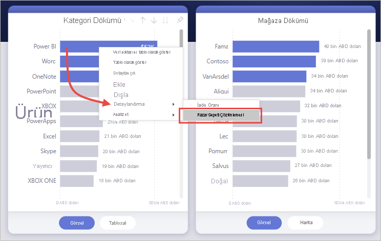

# Power BI raporlarında detaylandırmayı ayarlama
Power BI raporlarında *detaylandırma* özelliğini kullanarak raporunuzda tedarikçi, müşteri veya üretici gibi belirli bir varlığa odaklanan bir sayfa oluşturabilirsiniz. Rapor okuyucularınız detaylandırmayı kullandığında, diğer rapor sayfalarındaki bir veri noktasına sağ tıklar ve ilgili bağlama göre filtrelenmiş olan ayrıntılara ulaşmak için odaklanmış sayfayı detaylandırır. Tıklandığında [detaylandırma yapan bir düğme de oluşturabilirsiniz](desktop-drill-through-buttons.md).

Power BI Desktop’ta veya Power BI hizmetindeki raporlarınızda detaylandırmayı ayarlayabilirsiniz.

## Detaylandırma hedefi sayfasını ayarlama
1. Detaylandırmayı ayarlamak isterseniz detaylandırma yapacağınız varlık türü için görmek istediğiniz görsellere sahip olan bir rapor sayfası oluşturun. 

    Örneğin, üreticiler için detaylandırma yapmak istediğinizi düşünelim. Bu örnekte toplam satış, gönderilen toplam ürün sayısı, kategoriye göre satış rakamları, bölgeye göre satış rakamları gibi görsellere sahip bir detaylandırma sayfası oluşturabilirsiniz. Bu sayede ilgili sayfada detaylandırma gerçekleştirdiğinizde görseller seçtiğiniz üreticiye özgü hale gelir.

2. Ardından söz konusu detaylandırma sayfasındaki **Görsel Öğeler** bölmesinin **Alanlar** bölümünde, detaylandırmayı etkinleştirmek istediğiniz alanı **Detaylandırma filtreleri** kutusuna sürükleyin.

    

    **Detaylandırma filtreleri** kutusuna bir alan eklediğinizde Power BI otomatik olarak bir *geri* düğmesi görseli oluşturur. Bu görsel yayımlanmış raporlarda düğme haline gelir. Power BI hizmetinde raporunuzu inceleyen kullanıcılar daha önce bulundukları rapor sayfasına geri dönmek için bu düğmeyi kullanır.

    

> [!IMPORTANT]
> Aynı raporun bir sayfasına detaylandırma yapılandırabilir ve gerçekleştirebilirsiniz, ama farklı bir raporun sayfasında detaylandırma yapamazsınız.  

## Geri düğmesi için kendi görüntünüzü kullanma    
 Geri düğmesi bir görüntü olduğu için istediğiniz görüntüyle değiştirebilirsiniz. Raporunuzu inceleyen kullanıcıların geldikleri sayfaya geri dönebilmesi için geri düğmesi olarak çalışmaya devam eder. 

Geri düğmesi için kendi görüntünüzü kullanmak istiyorsanız şu adımları izleyin:

1. **Giriş** sekmesinde **Görüntü**'yü seçin. Ardından görüntünüzü bulun ve detaylandırma sayfasına yerleştirin.

2. Detaylandırma sayfasında yeni görüntünüzü seçin. **Resmi biçimlendir** bölmesinin altında **Eylem** kaydırıcısını **Açık** konuma getirin ve **Tür** olarak **Geri** seçeneğine ayarlayın. Görüntünüz artık geri düğmesi olarak işlev görür.

    

    
     Artık kullanıcılar raporunuzdaki bir veri noktasına sağ tıklayıp sayfayı detaylandırma seçeneği sunan bir bağlam menüsüne erişebilir. 

    

    Rapor kullanıcıları detaylandırmayı seçtiğinde, sayfa, tıkladıkları veri noktası hakkındaki bilgileri gösterecek şekilde filtrelenir. Örneğin kullanıcının bir üretici olan Contoso'yla ilgili bir veri noktasına sağ tıklayıp detaylandırma seçeneğini belirlediğini düşünelim. Açılan detaylandırma sayfası da Contoso için filtrelenmiş olur.

## Detaylandırmadaki tüm filtreleri geçirme

Uygulanan tüm filtreleri detaylandırma penceresine geçirebilirsiniz. Örneğin, söz konusu kategoriye filtrelenen görsellerin ve ürünlerin yalnızca belirli bir kategorisini seçebilir ve sonra detaylandırmayı seçebilirsiniz. Tüm bu filtreler uygulandığında detaylandırmanın nasıl göründüğünü merak edebilirsiniz.

Tüm uygulanan filtreleri tutmak için **Görsel Öğeler** bölmesinin **Detaylandırma** bölümünde **Tüm filtreleri tut** seçeneğini **Açık** olarak ayarlayın. 

Daha sonra bir görsel üzerinde detaylandırma yaptığınızda, kaynak görselde geçici filtrelerin uygulanması sonucunda hangi filtrelerin uygulandığını görebilirsiniz. **Görselleştirme** bölmesinin **Detaylandırma** bölümünde bu geçici filtreler italik olarak gösterilir. 

Araç ipuçları sayfalarında bunu kullanabilirsiniz ama araç ipucu düzgün çalışıyor gibi görünmeyeceğinden bu sorunlu bir deneyim olacaktır. Bu nedenle araç ipuçlarıyla bu işlemin gerçekleştirilmesi önerilmez.

## Detaylandırma için bir ölçü ekleme

Tüm filtreleri detaylandırma penceresine geçirmeye ek olarak detaylandırma alanına bir ölçü de (veya özetlenen sayısal sütun) ekleyebilirsiniz. Detaylandırma alanını **Detaylandırma** kartına sürükleyerek uygulayabilirsiniz. 

Bir ölçü veya özetlenen sayısal sütun eklediğinizde, alan bir görselin *Değer* alanında kullanılıyorsa sayfayı detaylandırabilirsiniz.

Raporlarınızda detaylandırma özelliğini kullanmak için yapmanız gerekenler bu kadardır. Bu, detaylandırma filtreniz için seçtiğiniz varlık bilgilerini genişletilmiş görünümde göstermek için idealdir.

## Sonraki adımlar

Aşağıdaki makaleler de ilginizi çekebilir:

* [Power BI raporlarında çapraz rapor detaylandırma özelliğini kullanma](desktop-cross-report-drill-through.md)
* [Power BI Desktop’ta dilimleyicileri kullanma](../visuals/power-bi-visualization-slicers.md)
