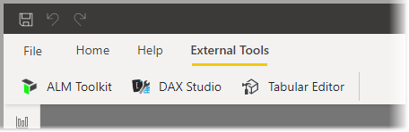

# <a name="using-external-tools-in-power-bi-desktop-preview"></a>Power BI Desktop'ta dış araçları kullanma (önizleme)

Power BI Desktop'ın Temmuz 2020 sürümünden itibaren dış araçları kullanarak Power BI Desktop'a ek işlevler ve daha fazla değer kazandırabilirsiniz. Dış araçlar için sunulan destek sayesinde DAX sorgusu/ifadesi iyileştirme ve yazma ile uygulama yaşam döngüsü yönetimi (ALM) gibi BI uzmanlarına yönelik Analysis Services topluluk araçlarından faydalanabilirsiniz.

Power BI Desktop'taki **Dış Araçlar** şeridinde makineye yüklenmiş ve Power BI Desktop'a kaydedilmiş olan dış araçlara ait düğmeler yer alır. Power BI Desktop'tan başlatılan dış araçlar, otomatik olarak Power BI Desktop'ın bir parçası olarak çalışan Analysis Services altyapısına bağlanarak kullanıcılar için sorunsuz bir deneyim sunar.



Bu öne çıkan dış araçlar, yükleme konumlarının bağlantılarıyla birlikte aşağıda verilmiştir. Her dış araç kendi araç yazarları tarafından desteklenir:

* [Tabular Editor](https://tabulareditor.com/)
* [DAX Studio](https://daxstudio.org)
* [ALM Araç Seti](http://alm-toolkit.com)


Aşağıdaki bölümlerde dış araçlar tarafından desteklenen işlemlere, Power BI Desktop'ta bulunan öne çıkan araçlara ve ek araçları kaydetme adımlarına yer verilmiştir.

## <a name="supported-write-operations"></a>Desteklenen yazma işlemleri

Dış araçlar, Power BI Desktop veri kümesine (Analysis Services modeli) bağlanarak aşağıdaki nesneleri düzenleyebilir. Power BI Desktop şablonu (PBIT) dosyalarını düzenleme desteği sunulmaz.

* Hesaplamalar için [ölçüler](/analysis-services/tabular-models/measures-ssas-tabular)
* Karmaşık modellerde hesaplama yeniden kullanılabilirliği için [hesaplama grupları](/analysis-services/tabular-models/calculation-groups)
* Veri kümesi meta verilerinin odaklanmış, iş alanına özgü görünümlerini tanımlamak için [perspektifler](/analysis-services/tabular-models/perspectives-ssas-tabular)

Dış araçların meta veri çevirisi yönetimi için kullanılması ileride mümkün olabilir ancak bu önizleme sürümünde desteklenmemektedir. Geçerli kullanıcının yerel ayarı çevrilmiş bir yerel ayar ise geçerli Power BI Desktop sürümü kullanıldığında alan listesindeki nesnelerin düzenlenmesi düzgün çalışmaz. 

Tüm [Tablolu Nesne Modeli](/analysis-services/tom/introduction-to-the-tabular-object-model-tom-in-analysis-services-amo) veri kümesi meta verilerine salt okunur olarak erişim sağlanabilir ancak [Tablolu Nesne Modeli](/analysis-services/tom/introduction-to-the-tabular-object-model-tom-in-analysis-services-amo) makalesinde yer alan listede bulunmayan nesneler için Power BI Desktop Analysis Services örneğinde düzenleme desteği sunulmaz.


## <a name="featured-external-tools"></a>Öne çıkan dış araçlar

Aşağıdaki açık kaynak topluluğu araçları Power BI Desktop'ta kullanılabilir. Bunlar ilgili araç yazarları tarafından desteklenir. Her aracın yükleyicisi, yükleme işleminin ardından aracı Power BI Desktop'a kaydeder:

* Tabular Editor
* DAX Studio
* ALM Araç Seti

Sırayla bu araçların hepsine bir göz atalım.

### <a name="tabular-editor"></a>Tabular Editor

[Tabular Editor](https://tabulareditor.com/) aracını şu bağlantıdan yükleyebilirsiniz: [Tabular Editor web sitesi](https://tabulareditor.com/)

Tabular Editor, iş zekası uzmanlarının sezgisel ve basit bir düzenleyici aracılığıyla tablosal modelleri kolayca oluşturmasını, bakımını yapmasını ve yönetmesini sağlar. Hiyerarşik görünüm, tablosal modelinizdeki tüm nesneleri görüntüleme klasörlerine göre düzenlenmiş şekilde gösterir ve çoklu seçim özellik düzenlemesi ile DAX söz dizimi vurgulaması için destek sunar.


Tabular Editor aracının kaynak koduna şu GitHub deposundan ulaşabilirsiniz: [Tabular Editor GitHub deposu](https://github.com/otykier/TabularEditor)

Tabular Editor aracının birincil yazarı [Daniel Otykier](https://www.linkedin.com/in/daniel-otykier-2231876)'dir.


### <a name="dax-studio"></a>DAX Studio

[DAX Studio](https://daxstudio.org) aracını şu bağlantıdan yükleyebilirsiniz: [DAX Studio web sitesi](https://daxstudio.org)

DAX Studio; DAX yazma, tanılama, performans ayarlama ve analiz etmeye yönelik tam kapsamlı bir araçtır. Özellikleri arasında nesnelere göz atma, tümleşik izleme, ayrıntılı istatistiklere sahip sorgu yürütme dökümleri, DAX söz dizimi vurgulama ve biçimlendirme yer alır. Aşağıda DAX Studio'dan alınmış bir ekran görüntüsü gösterilmektedir. 


DAX Studio aracının kaynak koduna şu GitHub deposundan ulaşabilirsiniz: [DAX Studio GitHub deposu](https://github.com/DaxStudio/DaxStudio)

DAX Studio aracının birincil yazarı [Darren Gosbell](https://www.linkedin.com/in/darrengosbell)'dir.

### <a name="alm-toolkit"></a>ALM Araç Seti

[ALM Toolkit](http://alm-toolkit.com) aracını şu bağlantıdan yükleyebilirsiniz: [ALM Toolkit web sitesi](http://alm-toolkit.com)

ALM Toolkit, uygulama yaşam döngüsü yönetimi (ALM) senaryolarında kullanılan, Power BI veri kümelerine yönelik bir şema karşılaştırma aracıdır. Bu araç sayesinde ortamlar arasında doğrudan dağıtım gerçekleştirebilir ve artımlı yenileme geçmiş verilerini koruyabilirsiniz. ALM Toolkit ile meta veri dosyalarını, dallarını ve depolarını ayırıp birleştirebilirsiniz. Ayrıca yaygın tanımları farklı veri kümelerinde yeniden kullanabilirsiniz.


ALM Toolkit aracının kaynak koduna şu GitHub deposundan ulaşabilirsiniz: [ALM Toolkit GitHub deposu](https://github.com/microsoft/analysis-services)

ALM Toolkit aracının birincil yazarı [Christian Wade](https://www.linkedin.com/in/christianwade1)'dir.


## <a name="how-to-register-external-tools"></a>Dış araçları kaydetme

Bunların dışındaki araçları Power BI Desktop'a kaydetmek için aşağıdakileri içeren bir JSON dosyası oluşturun:

```json
{
    "name": "<tool name>",
    "description": "<tool description>",
    "path": "<tool executable path>",
    "arguments": "<optional command line arguments>",
    "iconData": "image/png;base64,<encoded png icon data>"
}
```

JSON dosyasında aşağıdaki listede yer alan öğeler bulunmalıdır:
 
* **name:** Araç için bir ad girin. Bu ad, Power BI Desktop'ın Dış Araçlar şeridinde düğme yazısı olarak görünecektir.
* **description:** (isteğe bağlı) Power BI Desktop'ın Dış Araçlar şeridindeki düğmede araç ipucu olarak görünecek bir açıklama girin.
* **path:** Aracın yürütülebilir dosyasının tam nitelikli yolunu belirtin.
* **arguments:** (isteğe bağlı) Araç yürütülebilir dosyası başlatılırken kullanılacak komut satırı bağımsız değişkenlerinden oluşan bir dize girin. Aşağıdaki yer tutucuları kullanabilirsiniz:
    * **%server%:** İçeri aktarılan/DirectQuery veri modelleri için yerel Analysis Services Tablosal örneğinin sunucu adı ve bağlantı noktası numarasıyla değiştirilir.
    * **%database%:** İçeri aktarılan/DirectQuery veri modelleri için yerel Analysis Services Tablosal örneğinde barındırılan veritabanının adıyla değiştirilir.
* **iconData:** Power BI Desktop'ın Dış Araçlar şeridinde düğme simgesi olarak işlenecek görüntü verilerini girin. Dize, Veri URI'leri söz dizimine göre biçimlendirilmeli ve "data:" ön eki eklenmemelidir.
 
Dosyayı `"<tool name>.pbitool.json"` olarak adlandırın ve şu klasöre yerleştirin:

* `%commonprogramfiles%\Microsoft Shared\Power BI Desktop\External Tools`

64 bit ortamlar için dosyaları şu klasöre yerleştirin:

* **Program Files (x86)\Common Files\Microsoft Shared\Power BI Desktop\External Tools**

Belirtilen konumda yer alan **.pbitool.json** uzantılı dosyalar, Power BI Desktop başlatılırken yüklenir.

## <a name="disabling-external-tools-using-the-registry"></a>Kayıt defterini kullanarak dış araçları devre dışı bırakma

Dış Araçlar, **Grup İlkeleri** kullanılarak veya kayıt defteri düzenlenerek devre dışı bırakılabilir; bu, **Özel Görseller**'i devre dışı bırakma işlemine benzer.

* Kayıt defteri anahtarı: *Software\Policies\Microsoft\Power BI Desktop\\*

* Kayıt defteri değeri: *EnableExternalTools*

1 (ondalık) değeri Power BI’da dış araçların kullanımını etkinleştirir (bu varsayılan değerdir).

0 (ondalık) değeri Power BI'da dış araçların kullanımını devre dışı bırakır.


## <a name="next-steps"></a>Sonraki adımlar

Aşağıdaki makaleler de ilginizi çekebilir:

* [Power BI raporlarında çapraz rapor detaylandırma özelliğini kullanma](desktop-cross-report-drill-through.md)
* [Power BI Desktop’ta dilimleyicileri kullanma](../visuals/power-bi-visualization-slicers.md)