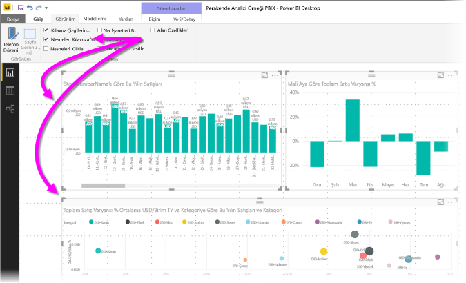
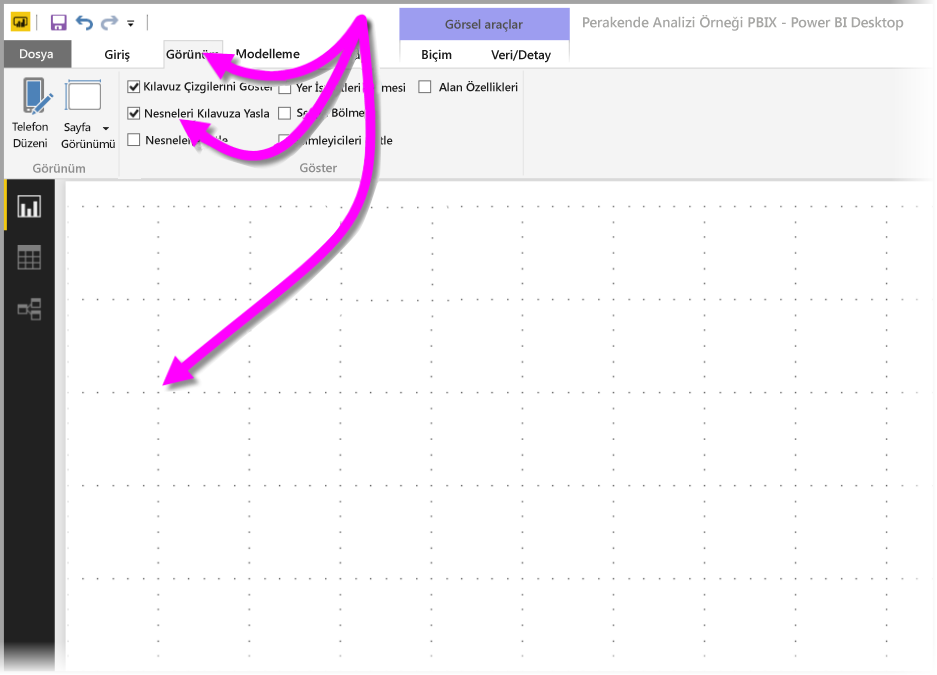
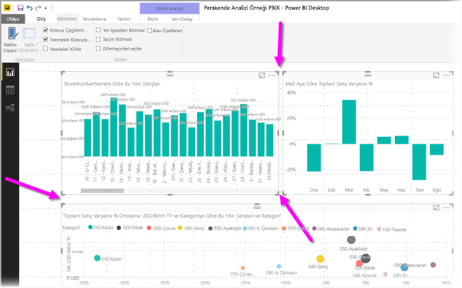
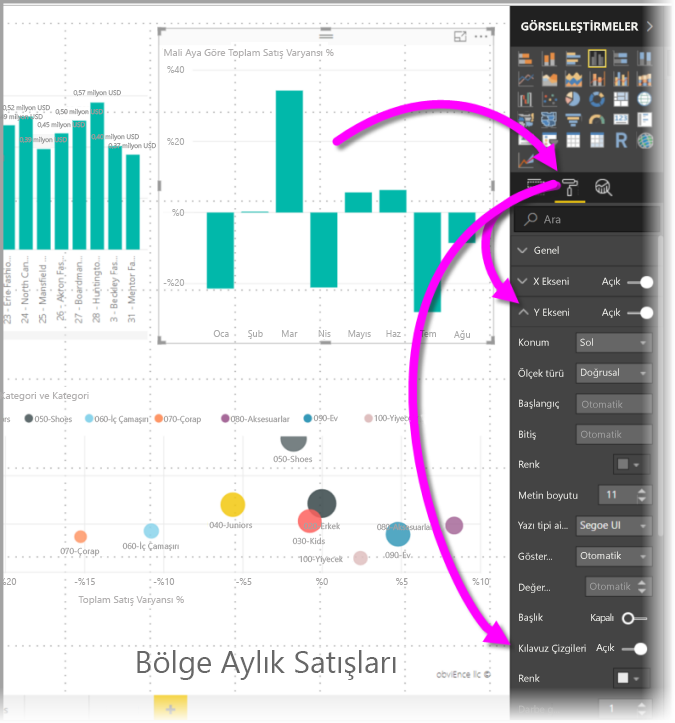
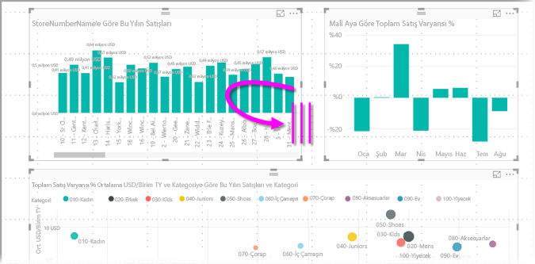
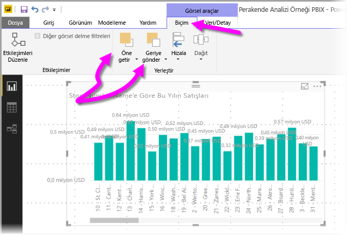
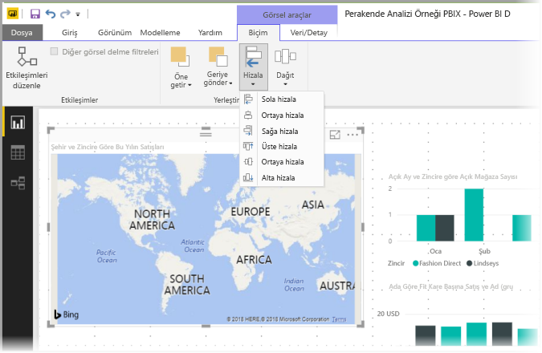
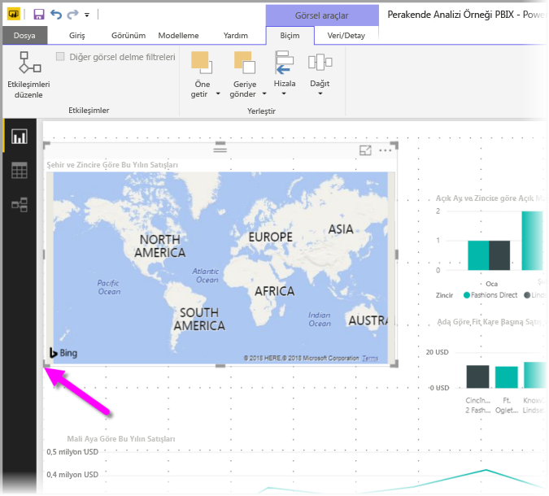
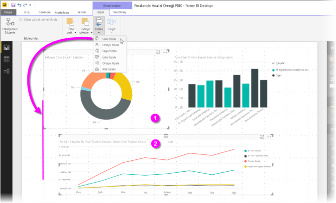
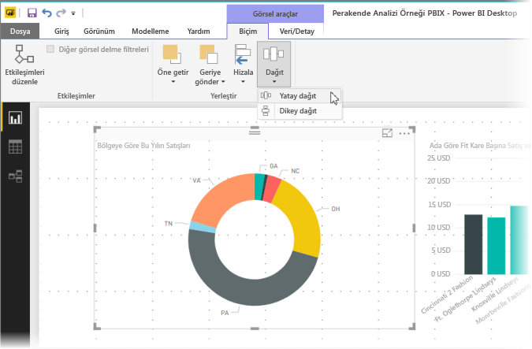

# Power BI Desktop raporlarında kılavuz çizgilerini ve kılavuza yaslama işlevini kullanma
**Power BI Desktop** rapor tuvali, görselleri rapor sayfasında düzgünce hizalamanızı sağlayan kılavuz çizgileri sunar ve raporunuzdaki görsellerin temiz, hizalı ve eşit aralıklı görünmesi için kılavuza yaslama özelliğini kullanır.

**Power BI Desktop**'ta bir rapordaki nesnelerin z düzenini ayarlayabilir (bir öne getirme, bir arkaya gönderme) ve tuvalde seçili görselleri hizalayabilir veya eşit bir şekilde dağıtabilirsiniz.

## Kılavuz çizgilerini ve kılavuza yaslama işlevini etkinleştirme
Kılavuz çizgileri ve kılavuza yaslama işlevini etkinleştirmek için **Görünüm** şeridini seçin, sonra **Kılavuz çizgilerini göster** ve **Nesneleri kılavuza yasla** onay kutularını etkinleştirin. Seçeneklerden birini veya ikisini belirleyebilirsiniz; bunlar birbirinden bağımsız olarak çalışır.

> [!NOTE]
> **Kılavuz çizgilerini göster** ve **Nesneleri kılavuza yasla** devre dışıysa herhangi bir veri kaynağına bağlandığınızda etkinleşirler.

## Kılavuz çizgilerini kullanma
Kılavuz çizgileri, görsellerinizi hizalamanıza yardımcı olan görünür kılavuzlardır. İki (veya daha fazla) görselin yatay ya da dikey hizalı olup olmadığını anlamak için kılavuz çizgilerini kullanarak kenarlıklarının hizalı olup olmadığını belirleyin.

CTRL tuşuna basıp tıklayarak birden fazla görseli aynı anda seçin. Böylece seçili tüm görsellerin kenarlıkları belirir ve görsellerin düzgün bir şekilde hizalı olup olmadığını gösterir.

### Kılavuz çizgileri görsellerin içinde kullanma
Power BI’da kılavuz çizgileri görsellerin içinde de görülebilir. Bunlar veri noktalarını ve değerleri karşılaştırmak için görsel kılavuzlar sağlar. **Power BI Desktop**'ın Eylül 2017 sürümünden itibaren **Görsel Öğeler** bölmesinin **Biçim** bölümündeki **X Ekseni** ve **Y Ekseni** kartlarını (görsel türüne göre) kullanarak görsellerin içindeki kılavuz çizgilerini yönetebilirsiniz. Bir görselin içindeki kılavuz çizgilerinin aşağıdaki öğelerini yönetebilirsiniz:

* Kılavuz çizgileri etkinleştirme veya devre dışı bırakma
* Kılavuz çizgilerinin rengini değiştirme
* Kılavuz çizgilerinin darbe genişliğini ayarlama
* Görseldeki kılavuz çizgilerinin stilini düz, kesik çizgili, veya noktalı olarak seçme

Kılavuz çizgilerinin belirli öğelerini değiştirmek, özellikle görsellerinde koyu renkli arka planlar olan raporlarda kullanışlıdır. Aşağıdaki görüntüde **Y Ekseni** kartındaki **Kılavuz çizgileri** bölümü gösterilmektedir.

## Kılavuza yaslama işlevini kullanma
**Nesneleri kılavuza yasla** etkinleştirildiğinde, **Power BI Desktop** tuvalinde taşıyacağınız (veya yeniden boyutlandıracağınız) tüm görseller otomatik olarak en yakındaki kılavuz eksenine hizalanır. Böylece iki ya da daha fazla görselin aynı yatay veya dikey konuma ya da aynı boyuta hizalandığından emin olmak çok daha kolaylaşır.

Raporlarınızdaki görsellerin düzgünce hizalandığından emin olmak üzere **kılavuz çizgileri** ve **kılavuza yaslama işlevini** kullanmak için tek yapmanız gereken budur.

## Z düzenini, hizalamayı ve dağıtımı kullanma
Bir rapordaki görsellerin önden arkaya sırasını yönetebilirsiniz. Buna genellikle öğelerin *z düzeni* denir. Bu özellik, görselleri istediğiniz biçimde üst üste getirmenize ve her görselin önden arkaya sırasını ayarlamanıza olanak tanır. **Biçim** şeridinin **Düzenle** bölümünde bulunan **Öne Getir** ve **Geriye Gönder** düğmelerini kullanarak görsellerinizin sırasını ayarlayabilirsiniz. **Biçim** şeridi, sayfada bir veya daha fazla görsel seçmenizle birlikte görünür.

**Biçim** şeridi, görsellerinizin en iyi şekilde görünüp çalışacağı hizalamada görünmesi için görsellerinizi birçok farklı şekilde hizalamanıza olanak tanır.

Aşağıdaki görüntüde görüldüğü gibi, **Hizala** düğmesi seçili görseli rapor tuvalinin kenarına (veya merkezine) hizalar.

İki veya daha fazla görsel seçildiğinde, zaten hizalı olan sınırlara göre birlikte hizalanır. Örneğin, iki görsel seçip **Sola Hizala** seçeneğini belirlerseniz, görseller tüm seçili görsellerin en soldaki sınırına hizalanır.

Ayrıca, görsellerinizi yatay veya dikey olarak rapor tuvaline eşit dağıtabilirsiniz. **Biçim** şeridindeki **Dağıt** düğmesine tıklamanız yeterlidir.

Bu kılavuz çizgisi, hizalama ve dağıtım araçlarında yapacağınız birkaç seçimle, raporlarınız tam olarak istediğiniz gibi görünecektir.

