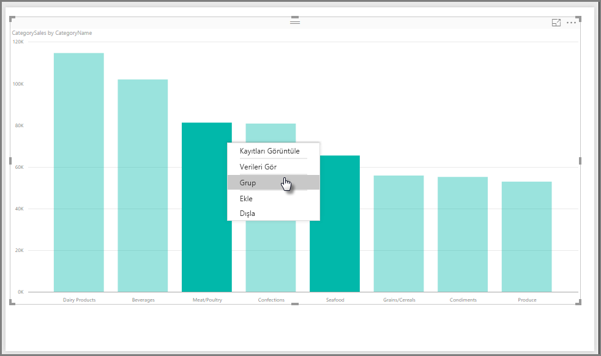
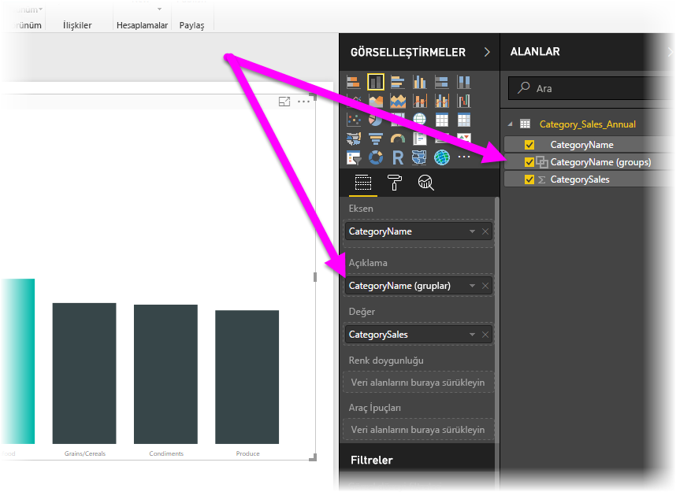
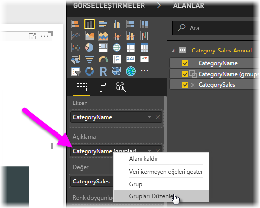
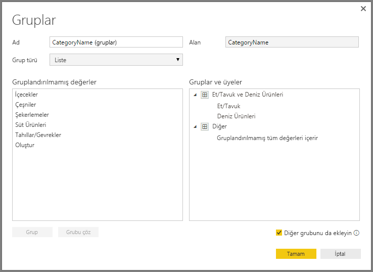
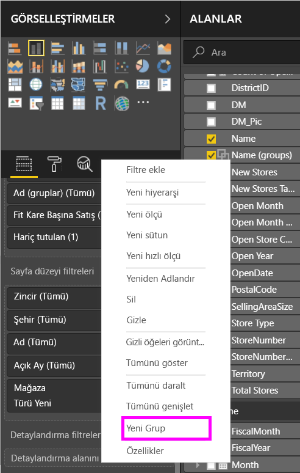
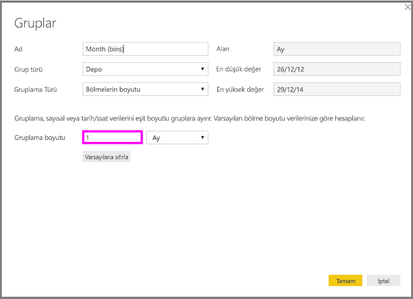
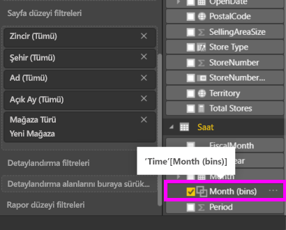

# Power BI Desktop'ta gruplandırma ve gruplama özelliklerini kullanma
Power BI Desktop görsel oluştururken, temel alınan verilerde bulunan değerlere bağlı olarak verilerinizi öbekler (veya gruplar) halinde toplar. Genellikle sorun çıkmaz ancak bu öbeklerin sunulma biçimini geliştirmek istediğiniz zamanlar olabilir. Örneğin, üç ürün kategorisini daha büyük bir kategoriye (bir *gruba*) yerleştirmek isteyebilirsiniz. Başka bir örnek vermek gerekirse, satış rakamlarını 923.983 dolarlık parçalar yerine 1.000.000 dolarlık gruplar halinde görmek isteyebilirsiniz.

Power BI Desktop'ta görsellerinizdeki verileri ve eğilimleri daha açık şekilde görüntülemek, çözümlemek ve araştırmak için veri noktalarını *gruplandırabilirsiniz*. Ayrıca, değerleri eşit boyutlu gruplara bölerek verileri anlamlı şekillerde görselleştirmenize olanak sağlayan *gruplama boyutunu* da tanımlayabilirsiniz. Bu eylem genellikle *gruplama* olarak adlandırılır.

## Gruplandırma özelliğini kullanma
Gruplandırma özelliğinden yararlanmak için, öğeleri çoklu olarak seçmek üzere Ctrl tuşunu basılı tutarak görsellerdeki bir veya daha fazla öğeye tıklayabilirsiniz. Ardından çoklu seçime dahil olan öğelerden birine sağ tıklayıp bağlam menüsünden **Grup**'u seçin.

Oluşturulan grup, görselin **Açıklama** demetine eklenir. Grup ayrıca **Alanlar** listesinde de görünür.

Oluşturduğunuz grubun üyelerini kolayca düzenleyebilirsiniz. **Açıklama** demetinde veya **Alanlar** listesinde alana sağ tıklayın ve **Grupları Düzenle**'yi seçin.

**Gruplar** iletişim kutusunda yeni grup oluşturabilir veya mevcut grupları değiştirebilirsiniz. Ayrıca grupları *yeniden adlandırabilirsiniz*. Tek yapmanız gereken **Gruplar ve üyeler** kutusundaki grup adına çift tıklayıp yeni bir ad girmektir.

Grupları kullanarak her türlü işlemi gerçekleştirebilirsiniz. **Gruplandırılmamış değerler** listesindeki öğeleri yeni bir gruba veya mevcut gruplardan birine ekleyebilirsiniz. Yeni bir grup oluşturmak için, **Gruplandırılmamış değerler** kutusundaki iki veya daha fazla öğeyi seçip (Ctrl tuşunu basılı tutup tıklayarak) bu kutunun altındaki **Grup** düğmesini seçin.

Gruplandırılmamış bir değeri mevcut bir gruba ekleyebilirsiniz: Bunun için **Gruplandırılmamış değerlerden** birini ve ardından bu değeri eklemek istediğiniz mevcut grubu seçip **Grup** düğmesini seçmeniz yeterlidir. Bir gruptan öğe kaldırmak için söz konusu öğeyi **Gruplar ve üyeler** kutusundan seçip **Grubu Çöz**'ü seçin. İsterseniz gruplandırılmamış kategorileri **Diğer** grubuna taşıyabilir veya gruplandırılmamış şekilde bırakabilirsiniz.

> [!NOTE]
> **Alanlar** kutusunda mevcut bir görselden çoklu seçim yapmak zorunda kalmadan herhangi bir alan için grup oluşturabilirsiniz. Yalnızca söz konusu alana sağ tıklayıp açılan menüden **Yeni Grup**'u seçin.

## Gruplamayı kullanma
**Power BI Desktop**'ta sayısal alanlar ve saat alanları için gruplama boyutunu ayarlayabilirsiniz. Hesaplanmış sütunlarınız için bölmeler oluşturabilirsiniz ancak bunu ölçüleriniz için yapamazsınız. Power BI Desktop'ın görüntülediği verileri düzgün bir şekilde boyutlandırmak için gruplama özelliğini kullanın.

Bir gruplama boyutu uygulamak için bir **Alan**'a sağ tıklayıp **Yeni Grup**’u seçin.

**Gruplar** iletişim kutusunda, **Gruplama boyutunu** istediğiniz boyuta ayarlayın.

**Tamam**'ı seçtiğinizde **Alanlar** bölmesinin **(bölmeler)** eklenmiş olarak görüntülendiğini fark edeceksiniz. Bu alanı tuvale sürükleyerek bölme boyutunu istediğiniz görselde kullanabilirsiniz.

*Gruplamayı* uygulamalı olarak görmek için bu [videoya](https://www.youtube.com/watch?v=BRvdZSfO0DY) göz atın.

Böylece, raporlarınızdaki görsellerin istediğiniz şekilde gösterilmesini sağlamak için *gruplandırma* ve *gruplama* özelliklerini kullanarak gerçekleştirebileceğiniz tüm işlemlere değinmiş olduk.
