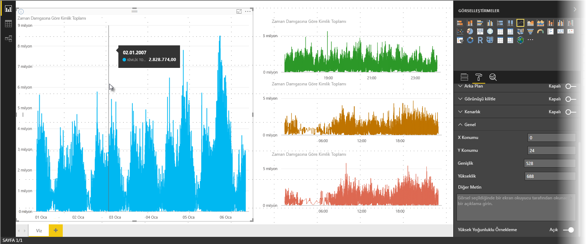
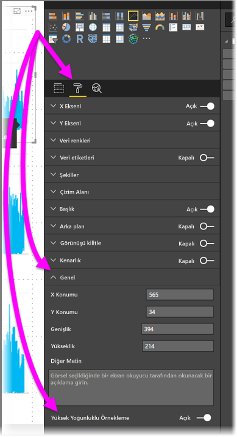

# Power BI'da yüksek yoğunluklu çizgi örnekleme
**Power BI Desktop**'ın Haziran 2017 sürümü ve **Power BI hizmetine** yönelik güncelleştirmeler itibarıyla, yüksek yoğunluklu verileri örnekleyen görselleri geliştiren yeni bir örnekleme algoritması kullanıma sunulmuştur. Örneğin, perakende mağazalarınızın satış sonuçlarından oluşan ve her mağazanın yılda on binden fazla satış makbuzuna sahip olduğu bir çizgi grafik oluşturabilirsiniz. Bu tür satış bilgilerini içeren bir çizgi grafik, her mağaza için alınan verileri (satışların zamana göre nasıl değiştiğini göstermek için ilgili verilerin anlamlı bir temsilini seçin) örnekler ve temel alınan verileri temsil eden çok serili bir çizgi grafik oluşturur. Bu, yüksek yoğunluklu verileri görselleştirmede sık kullanılan bir yöntemdir. Power BI Desktop, ayrıntıları bu makalede açıklanan yüksek yoğunluklu veri örnekleme özelliğini geliştirmiştir.

> [!NOTE]
> Bu makalede tanımlanan **Yüksek Yoğunluklu Örnekleme** algoritması, hem **Power BI Desktop** hem de **Power BI hizmeti** ile kullanılabilir.

## Yüksek yoğunluklu çizgi örnekleme nasıl çalışır?
**Power BI** daha önceden, belirleyici bir yaklaşım kullanarak, temel alınan verilerin tam aralığında bulunan bir örnek veri noktası koleksiyonu seçiyordu. Örneğin, bir takvim yılına yayılan yüksek yoğunluklu veriler için görselde görüntülenen 350 örnek veri noktası olabilirdi ve bunların her biri, verilerin tam aralığının (temel alınan verilerin genel serisi) görselde sunulacağı şekilde seçilirdi. Bunu daha iyi anlamanıza yardımcı olması için bir yıllık döneme ait hisse senedi fiyatı çizimi ve çizgi grafik görseli oluşturmak için 365 veri noktası (diğer bir deyişle, her gün için bir veri noktası) seçimi yaptığınızı hayal edin.

Bu durumda, her gün ait hisse senedi fiyatlarını belirten çok fazla değer olacaktır. Günlük yükselme ve düşüşler olsa da bu, borsanın açık olduğu günlerde her an gerçekleşebilecek bir durumdur. Yüksek yoğunluklu çizgi örnekleme için, temel alınan veri örneği her gün saat 10:30 ve 12:00'da alınırsa temel alınan verileri temsil eden (10:30 ve 12:00'daki fiyat) bir anlık görüntü elde edersiniz ancak söz konusu temsilci veri noktaları için hisse senedi fiyatının gerçek yükseliş ve düşüşünü (o güne ait) yakalayamayabilirsiniz. Bu gibi durumlarda; örnekleme, temel alınan verileri temsil etmektedir ancak bu örnekte verildiği üzere günlük hisse senedi fiyatı yükseliş ve düşüşleri gibi önemli noktaları her zaman yakalayamayabilir.

Tanımı gereği, makul oranda hızlı ve etkileşime duyarlı görselleştirmeler oluşturmak için yüksek yoğunluklu verilerin örneği oluşturulur. Bir görsel öğe üzerinde çok fazla veri noktasının olması, görsel öğeyi çıkmaza sokabilir ve eğilim görselleştirmelerinde değerini düşürebilir. Bu nedenle, en iyi görselleştirme deneyiminin sunulabilmesi için verilerin nasıl örneklendiği, örnekleme algoritmasının oluşturulmasına neden olan faktördür. Power BI Desktop'taki algoritma, her bir zaman dilimindeki önemli verilerin yanıtlama, temsil ve açık koruması konusunda en iyi kombinasyonu sağlayacak şekilde iyileştirilmiştir.

## Yeni çizgi örnekleme algoritması nasıl çalışır?
Yüksek yoğunluklu çizgi örneklemeye ilişkin yeni algoritma, kesintisiz bir x ekseni içeren alan grafiği ve çizgi grafik görselleri için kullanılabilir.

Bir yüksek yoğunluklu görsel için **Power BI**, verilerinizi yüksek çözünürlüklü öbeklere dilimler ve ardından her bir öbeği temsil edecek önemli noktaları toplar. Yüksek çözünürlüklü verileri dilimleme işlemi özellikle, sonuçta elde edilen grafiğin temel alınan tüm veri noktalarının işlenmesinden görsel olarak ayırt edilemeyecek ancak çok daha hızlı ve etkileşimli olmasını sağlayacak şekilde ayarlanmıştır.

### Yüksek yoğunluklu çizgi görselleri için minimum ve maksimum değerler
Tüm görselleştirmeler için aşağıdaki görsel sınırları geçerlidir:

* **3.500**, temel alınan veri noktalarından veya serilerinden bağımsız olarak (bkz. aşağıdaki madde işaretli listede yer alan *istisnalar*) çoğu görselde *görüntülenen* en yüksek veri noktası sayısıdır. Bu nedenle, her birinde 350 veri noktası bulunan 10 seriniz varsa görsel, maksimum toplam veri noktası sınırına ulaşmıştır. Bir seriniz varsa yeni algoritmanın temel alınan veriler için en iyi örneklemeyi uygun görmesi durumunda bu seri en fazla 3.500 veri noktası içerebilir.

* Herhangi bir görselde maksimum **60 seri** bulunabilir. 60'tan fazla seriniz varsa verileri bölün ve her biri 60 veya daha az seri içeren birden çok görsel oluşturun. Yalnızca veri segmentlerini (sadece belirli serileri) göstermek için bir **dilimleyici** kullanmak faydalı bir uygulamadır. Örneğin, açıklamadaki tüm alt kategorileri görüntülüyorsanız aynı rapor sayfasındaki toplam kategoriye göre filtreleme yapmak için bir dilimleyici kullanabilirsiniz.

En yüksek veri sınırı sayısı, aşağıdaki görsel türleri için daha yüksektir; ve bunlar 3.500 veri noktası sınırının *istisnalardır*.

* R görselleri için en yüksek **150.000** veri noktası.
* Power BI görselleri için **30.000** veri noktası.
* Dağılım grafikleri için **10.000** veri noktası (dağılım grafiklerinin varsayılanım 3.500’dür)
* Diğer tüm görseller için **3.500**

Bu parametreler, Power BI Desktop’taki görsellerin çok hızlı işleme yapmasını, kullanıcılarla etkileşime yanıt vermesini ve görseli işleyen bilgisayarda çok fazla hesaplama ek yüküne neden olmamasını sağlar.

### Yüksek yoğunluklu çizgi görselleri için temsilci veri noktalarını değerlendirme
Temel alınan veri noktası sayısı, görselde temsil edilebilecek en fazla veri noktası sayısını aştığında, temel alınan verileri *bölme* adlı gruplara bölen, ardından bu grupları yinelemeli olarak iyileştiren ve *gruplama* olarak adlandırılan bir işlem başlar.

Algoritma, görsel için en geniş ayrıntı düzeyini elde etmek üzere mümkün olduğu kadar çok bölme oluşturur. Algoritma, her bir bölmede önemli ve belirleyici değerlerin (örneğin, aykırı değerler) yakalanıp görselde görüntülenmesini sağlamak için minimum ve maksimum veri değerini bulur. Gruplama sonuçlarına ve ardından Power BI tarafından gerçekleştirilen değerlendirmeye göre görselin x ekseni için minimum çözünürlük, görsel için maksimum ayrıntı düzeyinin elde edileceği şekilde belirlenir.

Daha önce de bahsedildiği üzere, her bir seri için en az parçalı yapı 350, çoğu görsel için, önceki paragraflarda listelenen *istisnalarla* birlikte en fazla 3.500’dür.

Her bir bölme, iki veri noktasıyla temsil edilir ve bu veri noktaları, bölmenin görseldeki temsilci veri noktaları olur. Veri noktaları, ilgili bölmenin yüksek ve düşük değeridir. Gruplama işleminde, yüksek ve düşük değer seçilerek herhangi bir önemli yüksek değerin veya belirleyici düşük değerin yakalanması ve görselde işlenmesi sağlanır.

Geçici aykırı değerin yakalanmasını ve görselde düzgün şekilde görüntülenmesini sağlamak için çok fazla çözümleme yapılacağını düşünüyorsanız kesinlikle haklısınız. Ancak, yeni algoritma ve gruplama işleminin nedeni tam olarak budur.

## Araç ipuçları ve yüksek yoğunluklu çizgi örnekleme
Yakalanan ve görüntülenen belirli bir bölmedeki minimum ve maksimum değerin elde edildiği bu gruplama işleminin, veri noktalarının üzerine geldiğinizde çıkan araç ipuçlarının veri görüntüleme şeklini etkileyebileceğini unutmayın. Bunun nasıl ve neden olduğunu açıklamak için hisse senedi fiyatlarına ilişkin örneğimize geri dönelim.

Hisse senedi fiyatını temel alan bir görsel oluşturduğunuzu ve her ikisinde de **Yüksek Yoğunluklu Örnekleme** kullanılan iki farklı hisse senedini karşılaştırdığınızı düşünelim. Her bir seri için temel alınan verilerde çok fazla veri noktası bulunur. (Belki de günün her saniyesindeki hisse senedi fiyatlarını yakaladınız.) Yüksek yoğunluklu çizgi örnekleme algoritması, birbirinden bağımsız olarak her bir seri için gruplama işlemi gerçekleştirir.

Şimdi de birinci hisse senedi fiyatının saat 12:02'de yükseldiğini ve saniyeler sonra tekrar düştüğünü düşünelim. Bu, önemli bir veri noktasıdır. Bu hisse senedi için gruplama işlemi yapıldığında 12:02'deki yüksek değer, ilgili bölme için bir temsilci veri noktası olacaktır.

Ancak, ikinci hisse senedi için saat 12:02, bulunduğu bölme için herhangi bir yüksek veya düşük değer içermez. Belki de, saat 12:02’yi içeren bölme için yüksek ve düşük değerler üç dakika sonra oluşmuştur. Bu durumda, çizgi grafik oluşturulduğunda ve 12:02'nin üzerine geldiğinizde birinci hisse senedi için araç ipucunda bir değer görürsünüz (değer 12:02'de yükseldiği ve bölmenin yüksek veri noktası olarak seçildiği için) ancak ikinci hisse senedi için 12:02'deki araç ipucunda herhangi bir değer *görmezsiniz*. Bunun nedeni, ikinci hisse senedinin, saat 12:02'nin bulunduğu bölme için herhangi bir yüksek veya düşük değer içermemesidir. İkinci hisse senedi için 12:02'ye gelindiğinde gösterilecek bir veri olmadığından herhangi bir araç ipucu verisi görüntülenmez.

Araç ipuçlarıyla ilgili olarak bu durum sıklıkla gerçekleşir. Belirli bir bölmedeki yüksek ve düşük değerler, eşit bir şekilde ölçeklendirilen x ekseni değer noktalarıyla mükemmel eşleşme sağlamayabilir. Bu nedenle, araç ipucu, değeri görüntülemez.  

## Yüksek yoğunluklu çizgi örnekleme nasıl etkinleştirilir?
Varsayılan olarak, yeni algoritma **açık** ayarındadır. Bu ayarı değiştirmek için **Biçimlendirme** bölmesindeki **Genel** kartının alt kısmında bulunan **Yüksek Yoğunluklu Örnekleme** kaydırıcısını kullanabilirsiniz. Devre dışı bırakmak için kaydırıcıyı **Kapalı** duruma getirin.

## Önemli noktalar ve sınırlamalar
Yüksek yoğunluklu çizgi örnekleme için yeni algoritma, Power BI için önemli bir gelişmedir. Bununla birlikte, yüksek yoğunluklu değerler ve verilerle çalışırken göz önünde bulundurmanız gereken bazı önemli noktalar vardır.

* Artan ayrıntı düzeyi ve gruplama işlemi nedeniyle **Araç ipuçları** yalnızca, temsilci veriler imlecinizle hizalıysa bir değer gösterebilir. Daha fazla bilgi için bu makaledeki *Araç ipuçları ve yüksek yoğunluklu çizgi örnekleme* bölümüne bakın.
* Toplam veri kaynağı boyutu çok büyükse yeni algoritma, verileri içeri aktarmaya yönelik maksimum sınıra uyum sağlamak için serileri (açıklama öğeleri) kaldırır.
  
  * Bu durumda, yeni algoritma, açıklama serilerini alfabetik olarak sıralar ve alfabetik olarak sıralanmış bu açıklama öğelerini, maksimum sınıra ulaşana kadar içeri aktarmaya devam eder. Ek serileri ise içeri aktarmaz.
* Temel alınan bir veri kümesi 60'tan fazla seri (yukarıda da açıklandığı üzere maksimum seri sayısı) içeriyorsa yeni algoritma, serileri alfabetik olarak sıralar ve alfabetik sırada 60. olan seriden sonraki serileri kaldırır.
* Verilerdeki değerler *sayısal* veya *tarih/saat* türünde değilse Power BI, yeni algoritmayı kullanmaz ve önceki (yüksek yoğunluklu örnekleme olmayan) algoritmaya geri döner.
* **Veri içermeyen öğeleri göster** ayarı yeni algoritmada desteklenmemektedir.
* Yeni algoritma, SQL Server Analysis Sercives'de (2016 veya önceki bir sürümü) barındırılan bir modelle canlı bağlantı kullanımı için desteklenmemektedir. **Power BI** veya Azure Analysis Services'de barındırılan modellerde desteklenir.

## Sonraki adımlar
Dağılım grafiklerindeki yüksek yoğunluklu örnekleme işlemleri hakkında daha fazla bilgi için aşağıdaki makaleye göz atın.

* [Power BI dağılım grafiklerinde Yüksek Yoğunluklu Örnekleme](desktop-high-density-scatter-charts.md)

