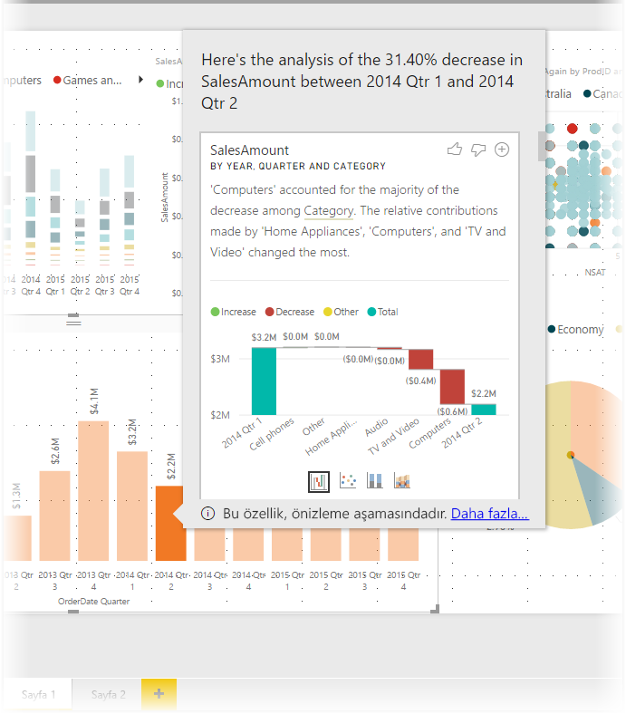
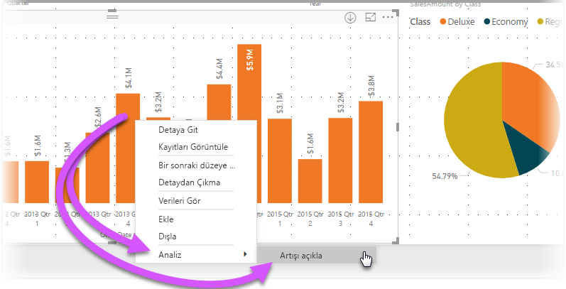
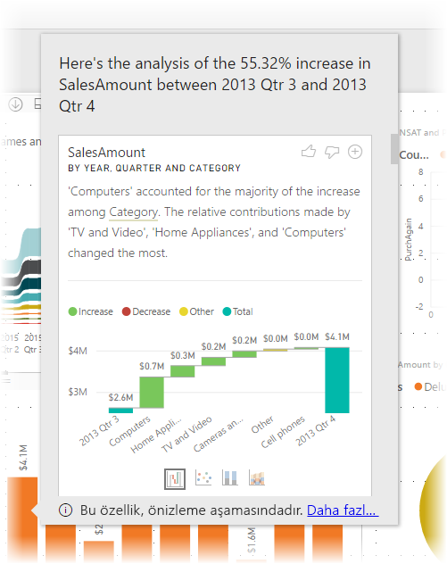
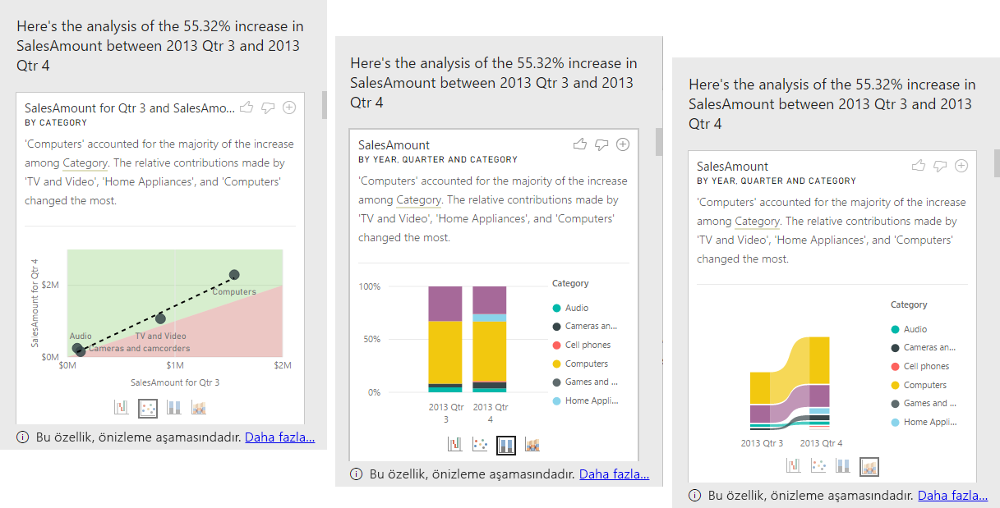

# Görsellerdeki dalgalanmaları açıklamak için Power BI Desktop'ta içgörüleri uygulama (önizleme)

Genellikle görsellerdeki değerlerde büyük bir artış ve ardından sert bir düşüş görürsünüz. Bu dalgalanmaların nedenini merak ediyor olabilirsiniz. **Power BI Desktop**'taki **içgörüler** sayesinde nedeni birkaç tıklamayla bulabilirsiniz.

Örneğin, aşağıdaki *Satış Tutarı* değerini *Yıl* ve *Çeyrek* ölçütlerine göre gösteren görseli ele alalım. 2014 yılında satışlarda büyük bir düşüş gerçekleşmiştir ve satış rakamları *1. Çeyrek* ile *2. Çeyrek* arasında sert bir düşüş yaşamıştır. Bu gibi durumlarda oluşan değişikliğin nedenini açıklamaya yardımcı olması için verileri keşfedebilirsiniz. 

**Power BI Desktop**'tan grafiklerdeki artışları veya düşüşleri açıklamasını, dağıtım faktörlerini grafikte görmeyi ve verileriniz hakkında hızlı, otomatik ve içgörü sunan analizler elde etmeyi isteyebilirsiniz. Tek yapmanız gereken bir veri noktasına sağ tıklayıp **Analiz > Düşüşü açıkla**'yı (veya önceki değer daha düşükse artışı) veya **Analiz > Bu dağıtımın nerede farklı olduğunu bul**'u seçmektir. İçgörü, kullanışlı bir pencerede gösterilir.

Öngörü özelliği bağlamsaldır ve bir önceki veri noktasını (bir önceki çubuk veya sütun gibi) temel alır.

> [!NOTE]
> Bu özellik önizleme sürümündedir ve değişikliğe tabidir. Öngörü özelliği **Power BI Desktop** uygulamasının Eylül 2017 sürümünden itibaren varsayılan olarak etkindir. (Etkinleştirmek için Önizleme kutusunu işaretlemenize gerek yoktur.)

## Öngörüleri kullanma
Grafiklerdeki artışları veya düşüşleri açıklama amacıyla içgörüleri kullanmak için, herhangi bir çubuk veya çizgi grafikteki veri noktalarından birine sağ tıklayıp **Analiz > Artışı açıkla** (veya *Düşüşü açıkla*, tüm içgörülerde önceki veri noktası temel alındığı için) seçeneğini belirlemeniz yeterlidir.

**Power BI Desktop** uygulaması verileri makine öğrenimi algoritmalarından geçirerek pencerede bir görselin yanı sıra artışa veya düşüşe en çok etki eden kategorileri belirten bir açıklama görüntüler. Öngörüler varsayılan olarak, aşağıdaki görüntüde gösterildiği gibi *şelale* görseli ile sunulur.

Şelale görselinin en altında bulunan küçük simgeleri seçerek öngörülerin dağılım grafiği, yığılmış sütun grafik veya şerit grafik şeklinde görüntülenmesini sağlayabilirsiniz.

Sayfanın en üstündeki *başparmak yukarı* ve *başparmak aşağı* simgelerini kullanarak görsel ve özellik hakkında geri bildirimde bulunabilirsiniz. Bunu yaparak geri bildirim sağlamış olursunuz ancak bu işlem, özelliği bir sonraki kullanımınızda döndürülen sonuçları etkilemek üzere algoritmayı eğitmez.

Daha da önemlisi, görselin en üstünde bulunan **+** düğmesini kullanarak görseli tıpkı kendi oluşturduğunuz bir görsel gibi raporunuza ekleyebilirsiniz. Ardından, raporunuzdaki diğer görsellerde olduğu gibi biçimlendirme ve ayarlama yapabilirsiniz. Seçtiğiniz öngörü görselini yalnızca **Power BI Desktop** uygulamasında rapor düzenleme sırasında ekleyebilirsiniz.

Öngörüleri, okuma veya görüntüleme modunda kullanabilir, bu sayede hem verileri çözümleyebilir hem de raporlarınıza kolayca ekleyebileceğiniz görseller oluşturabilirsiniz.

## Döndürülen sonuçların ayrıntıları

İçgörüler tarafından döndürülen ayrıntıların amacı, iki dönem arasındaki farkı vurgulayarak değişikliğin kaynağını anlamanıza yardımcı olmaktır.  

Örneğin *Satışlar* değerinin *3. üç aylık dönem* ile *4. üç aylık dönem* arasında %55 artması ve bu durumun ürünün tüm *Kategori* değerleri için geçerli olması (Bilgisayar, Ses ve diğer ürünler için satışlar %55 arttı) ve bunun tüm ülkeler ve tüm müşteri türleri için de geçerli olması halinde değişikliğin açıklanmasına yardımcı olmak için verilerden çıkarılabilecek çok az sonuç vardır. Ancak genellikle bu durum yaşanmaz ve değişikliğin gerçekleştiği yerleri bulabiliriz. Örneğin tüm kategoriler arasında *Bilgisayarlar* ve *Ev Aletleri* %63'ten fazla artış göstermişken *TV ve Ses* yalnızca %23 artmıştır ve bu nedenle *Bilgisayarlar* ve *Ev Aletleri* kategorilerinin *4. üç aylık dönem* için katkısı *3. üç aylık dönem* ile kıyasla daha fazladır.  Bu örneğe göre artışın mantıklı açıklaması şöyle olacaktır: *Bilgisayarlar ile TV ve Ses için kısmi yüksek satış rakamları*. 

Bu durumda algoritmanın yaptığı yalnızca en fazla değişen değerleri döndürmek değildir. Örneğin satışların çoğunluğu (%98) ABD'den geliyorsa satışlardaki artışın çoğunluğu da ABD'de olacaktır. Ancak ABD veya diğer ülkeler toplama katkısıyla orantılı önemli bir değişikliğe sahip olmadığı sürece *Ülke* ölçütü bu durumda ilgi çekici olarak kabul edilmez.  

Algoritmanın yaptığı işlemler en basit anlamıyla modeldeki diğer tüm sütunları alma ve zaman dönemi *öncesinde* ve *sonrasında* bu sütuna göre dökümü hesaplama, bu dökümde gerçekleşen değişiklik miktarını belirleme ve ardından en büyük değişikliğin olduğu sütunları döndürme olarak ifade edilebilir. Örneğin yukarıdaki örnekte *TV ve Video* katkısı %33'ten %26'ya inerek %7 düşüş gösterdiği ve *Ev Aletleri* tarafından sağlanan katkı sıfırdan %6'ya çıktığı için *Kategori* ölçütü seçilmiştir. 

Döndürülen her sütun için gösterilebilecek dört görsel vardır. Bu görsellerin üçü, dönemler arasındaki katkı değişikliğini vurgulamak için kullanılmıştır. Buna örnek olarak *2. üç aylık dönem* ile *3. üç aylık dönem* arasındaki artışın açıklaması verilebilir.

### Dağılım

Dağılım görseli, sütundaki (bu örnekte *Kategori*) her bir değer için ölçünün birinci dönemdeki değerini (x ekseni değeri) ölçünün ikinci dönemdeki değeriyle (y ekseni) karşılaştırır. Bu nedenle aşağıdaki görüntüde gösterildiği gibi değerin artması durumunda veri noktaları yeşil bölgede, azalması durumunda ise kırmızı bölgede olur. 

Kesik çizgi en iyi eşleşmeyi gösterir ve bu çizginin üzerindeki veri noktalarının genel eğilime göre daha fazla, altındakilerin ise daha az artmış olduğunu gösterir.  

Dönemlerden birinde boş değere sahip olan veri öğelerinin dağılımda görünmeyeceğini unutmayın (bu örnekte *Ev Aletleri*)

### %100 yığılmış sütun grafik

%100 yığılmış sütun grafik görseli, ölçünün önceki ve sonraki değerini seçilmiş sütuna göre sıralanmış %100 yığılmış sütun şeklinde gösterir. Bu da önceki ve sonraki katkı değerlerinin karşılaştırılmasını sağlar. Araç ipucu, seçilen değer için gerçek katkıyı gösterir.

### Şerit grafik

Şerit grafik görseli de ölçünün önceki ve sonraki değerini gösterir. Bu grafik özellikle katkıda bulunanların *sıralamasının* değişmesi (örneğin *Bilgisayarlar* kategorisinin bir numaradan üç numaraya inmesi) gibi durumlarda katkı durumundaki değişikliğin gösterilmesi açısından faydalıdır. 

### Şelale grafiği

Dördüncü görsel, dönemler arasındaki gerçek artışları veya düşüşleri gösteren bir şelale grafiğidir. Bu görsel, gerçek değişiklikleri net bir şekilde gösterir ancak tek başına sütunun neden ilgi çekici olarak seçildiğini vurgulayan katkı düzeyi değişikliklerini göstermez. 

Sütunların göreli katkılardaki farklara göre sıralanması durumunda aşağıdaki noktalar dikkate alınır: 

* Sütun kardinalitesi yüksek olduğunda farkın istatistiksel açısından daha az önemli ve daha az ilgi çekici olması nedeniyle kardinalite dikkate alınır. 

* Özgün değerlerin çok yüksek veya sıfıra yakın olduğu kategorilerin farkı diğerlerine göre daha yüksek olacak şekilde ağırlıklandırılır. Örneğin bir Kategori satışlara yalnızca %1 katkıda bulunurken bu değerin %6'ya çıkması durumu istatistiksel açıdan daha önemlidir ve bu nedenle katkısı %50'den %55'e çıkan bir Kategoriden daha ilgi çekici kabul edilir. 

* En mantıklı sonuçları seçmek için veriler arasındaki diğer ilişkilerin dikkate alınması gibi birçok farklı buluşsal yöntemlerden faydalanılır.
 
Farklı sütunlar incelendikten sonra göreli katkıda en yüksek değişikliği gösterenler seçilir ve çıkışa eklenir. Katkı açısından en önemli değişikliğe sahip olan değerler açıklamada vurgulanır. Ayrıca en büyük gerçek artış ve düşüşlerin olduğu değerler de vurgulanır.

## Önemli noktalar ve sınırlamalar
Bu içgörüler bir önceki veri noktasına göre gerçekleşen değişimi temel aldığından, görseldeki ilk veri noktasını seçtiğinizde bu özellik etkin değildir. 

**Artış/düşüş açıklamaları** için desteklenmeyen senaryoların listesi aşağıda verilmiştir:

* Üst N filtreleri
* Ekle/dışla filtreleri
* Ölçü filtreleri
* Sayısal olmayan ölçüler
* "Değeri farklı göster" özelliğinin kullanımı
* Filtrelenmiş ölçüler: Filtrelenmiş ölçüler, belirli bir filtrenin uygulanmış olduğu görsel düzeyinde hesaplamalardır (örneğin: *Fransa için Toplam Satış*) ve içgörüler özelliği tarafından oluşturulan bazı görsellerde kullanılır
* Skaler sıralama ölçütü tanımlamayan X ekseni üzerindeki kategorik sütunlar. Hiyerarşi kullanıyorsanız etkin hiyerarşideki tüm sütunların bu koşula uygun olması gerekir

Ayrıca aşağıdaki model türleri ve veri kaynakları da öngörüler için desteklenmemektedir:

* DirectQuery
* Canlı bağlantı
* Şirket içi Reporting Services
* Ekleme

## Sonraki adımlar
**Power BI Desktop** ve Power BI Desktop'la çalışmaya başlama hakkında daha fazla bilgi için aşağıdaki makalelere başvurun.

* [Power BI Desktop nedir?](../fundamentals/desktop-what-is-desktop.md)
* [Power BI Desktop ile Sorgulara Genel Bakış](../transform-model/desktop-query-overview.md)
* [Power BI Desktop'taki veri kaynakları](../connect-data/desktop-data-sources.md)
* [Power BI Desktop'taki Verilere Bağlanma](../connect-data/desktop-connect-to-data.md)
* [Power BI Desktop'ta Verileri Şekillendirme ve Birleştirme](../connect-data/desktop-shape-and-combine-data.md)
* [Power BI Desktop'taki Genel Sorgu Görevleri](../transform-model/desktop-common-query-tasks.md)   
