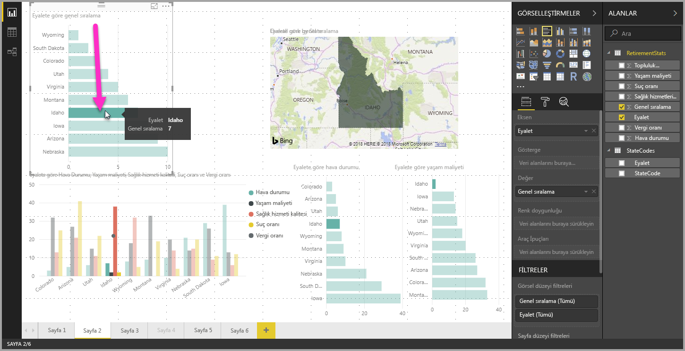
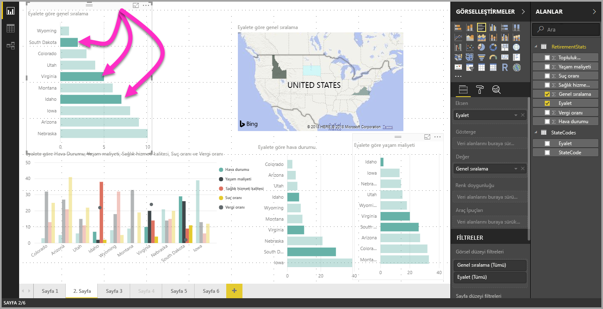

# Power BI Desktop'ta birden çok veri öğesini, veri noktasını ve görseli seçme

Power BI Desktop'ı kullanarak bir görselde birden çok veri öğesini, bir görselde birden çok veri noktasını veya bir rapordaki birden çok görseli seçebilirsiniz. Aşağıdaki bölümlerde bu seçenekler sırasıyla açıklanmıştır.

## Birden çok veri noktası seçme

Power BI Desktop’ta belirli bir görseldeki bir veri noktasını basitçe görselde veri noktasına tıklayarak vurgulu hale getirebilirsiniz. Örneğin, önemli bir çubuk veya grafik öğeniz varsa ve sayfadaki diğer görsellerin yaptığınız seçime göre verileri vurgulamasını istiyorsanız bir görselde veri öğesine tıklayabilir ve sonuçların sayfadaki diğer görsellerde yansıtıldığını görebilirsiniz. Bu, basit veya tekli seçim vurgulamadır. Aşağıdaki görüntüde basit bir vurgulama gösterilmektedir. 

Çoklu seçim ile artık **Power BI Desktop** rapor sayfanızda birden fazla veri noktası seçebilir ve sonucu sayfadaki tüm öğelerde vurgulayabilirsiniz. Bu, bir **ve** deyimine veya işlevine eşdeğerdir (örneğin, "Idaho **ve** Virginia için sonuçları vurgula"). Görsellerdeki veri noktalarına çoklu seçim uygulamak için **CTRL+Tıklama** ile birden çok veri noktasını seçin. Aşağıdaki resimde seçili olan **birden fazla veri noktası** (çoklu seçim) gösterilmiştir.

Bu basit bir özellik gibi görünse de rapor oluşturma, paylaşma ve raporlarla etkileşim kurma konusunda birçok yeni fırsat sağlar. 

## Dikdörtgen seçim aracını kullanarak birden çok öğe seçme (önizleme)

Dikdörtgen seçim aracını (*kement seçimi* olarak da adlandırılır) kullanarak bir görselde birden çok veri öğesini veya bir raporda birden çok görseli seçebilirsiniz. 

### Tuvalde birden çok görsel seçme

Tuvalin bir noktasına tıklayıp sürükleyerek dikdörtgen bir seçim çerçevesi oluşturarak birden çok görsel ve farklı rapor öğesi seçebilirsiniz. Tamamı seçim çerçevesinin içinde kalan tüm görseller seçilir. *Ctrl* veya *Shift* tuşuna basarsanız (görselleri Ctrl tuşuyla birlikte tıklayarak çoklu seçim yaptığınız gibi) geçerli çoklu seçime daha fazla görsel ekleyebilirsiniz. 

Seçili görsele *Ctrl* veya *Shift* tuşuyla birlikte tıklarsanız ilgili seçim kapatılır. Seçim çerçevesi, grupların içindeki görselleri ayrı ayrı seçmez ancak grubun tamamını kapsayarak seçebilir.

Tuval, dikdörtgen seçim aracıyla birlikte otomatik olarak kaydırılmaz. 

### Bir görselde birden çok veri noktası seçme

Aynı dikdörtgen seçim aracı adımlarını izleyerek bir görsel içinde bulunan birden çok veri noktasını seçebilirsiniz. Birden çok veri noktasını seçmek için *Ctrl* tuşunu basılı tutarak tıklayıp sürükleyin. Fare düğmesini bıraktığınızda seçim dikdörtgeniyle çakışan tüm noktalar seçilir ve daha önce yapılan seçimler korunur. Seçim çerçevesiyle seçim yaparken *Ctrl* tuşunu basılı tutarsanız daha önce seçilmiş olan veri noktalarının seçimi kaldırılır. Seçim çerçevesini kullanmak, her noktaya *Ctrl* tuşunu basılı tutarak tıklamakla aynı etkiye sahiptir. 

Çerçeveyle seçim yaparken *Shift* tuşunu kullanırsanız önceden yapılan seçimler korunur ve seçilmiş olan veri noktaları seçili halde kalır. Dolayısıyla seçim çerçevesini kullanırken *Shift* tuşuna basarsanız ilgili noktaların seçimi kaldırılmaz, bu noktalar seçime eklenir.

Klavyede herhangi bir tuşa basmadan çizim alanının boş bir noktasına tıklayarak geçerli seçimi iptal edebilirsiniz.

Bu özellik hakkında daha fazla bilgi için [bu özellikle ilgili blog gönderisini](https://powerbi.microsoft.com/blog/power-bi-desktop-august-2020-feature-summary/#_Data_point) inceleyin.

Bir görsel içinde birden çok veri noktası seçerken dikkat etmeniz gereken bazı noktalar ve sınırlamalar vardır:

* Çizgi, alan, dağılım grafiği, ağaç haritası ve haritalar seçim çerçevesini destekler
* Tek seferde en fazla 300 veri noktası seçebilirsiniz
* Power BI hizmetinde bir raporu görüntülerken dikdörtgen seçim yalnızca kement seçim özelliğinin raporun kaydedilmesi ve yayımlanması sırasında etkinleştirilmiş olması durumunda etkinleştirilir

## Sonraki adımlar

Aşağıdaki makaleler de ilginizi çekebilir:

* [Power BI Desktop raporlarında kılavuz çizgilerini ve kılavuza yaslama işlevini kullanma](desktop-gridlines-snap-to-grid.md)
* [Power BI raporlarındaki filtreler ve vurgulama hakkında](power-bi-reports-filters-and-highlighting.md)

