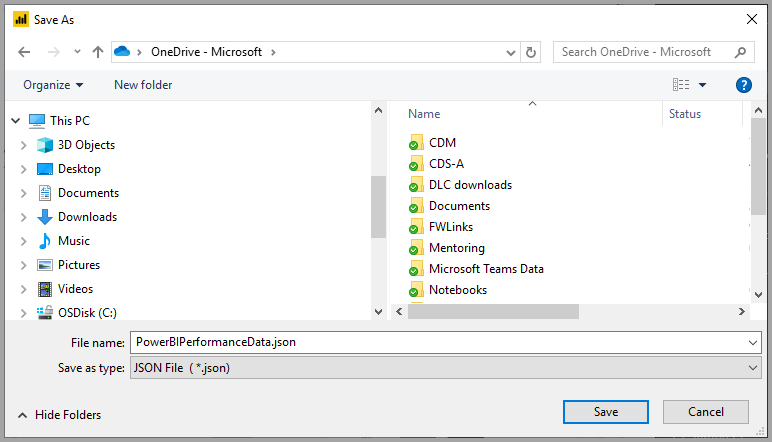

# Rapor öğesi performansını incelemek için Performans Analizi’ni kullanma

**Power BI Desktop**'ta görseller ve DAX formülleri gibi rapor öğelerinizin nasıl bir performans sergilediğini görebilirsiniz. **Performans Analizi**'ni kullanarak kullanıcılar etkileşim kurduğunda rapor öğelerinizin nasıl bir performans sergilediğini ve en çok (veya en az) kaynak kullanan performans özelliklerini gösteren günlükleri görebilir ve kaydedebilirsiniz.

Performans Analizi, kullanıcı etkileşimleriyle başlatılan tüm görsellerin güncelleştirilmesi veya yenilenmesi için gerekli olan süreyi inceleyip gösterir. Sunulan değerleri görüntüleyebilir, detaya gidebilir veya dışarı aktarabilirsiniz. Performans Analizi, raporlarınızın performansını etkileyen görselleri belirlemenize ve bu etkinin nedenini belirlemenize yardımcı olabilir.

## Performans Analizi bölmesini görüntüleme

**Power BI Desktop**'ta **Görünüm** şeridini seçin. **Görünüm** şeridinin **Göster** alanında **Performans Analizi**'nin yanındaki onay kutusunu seçerek Performans Analizi bölmesini görüntüleyebilirsiniz.

Performans Analizi seçildiğinde rapor tuvalinin sağ tarafında, kendi bölmesinde görüntülenir.

## Performans Analizi'ni kullanma

Performans Analizi, bir sorgu çalıştırılmasına neden olan kullanıcı etkileşimi ile başlatılan rapor öğelerinin güncelleştirilmesi için gereken işlem süresini (görsel oluşturmak veya güncelleştirmek için gerekli zaman dahil olmak üzere) ölçer. Örneğin bir dilimleyicinin ayarlanması için dilimleyici görselinin değiştirilmesi, veri modeline bir sorgu gönderilmesi ve ilgili görsellerin yeni ayarlara göre güncelleştirilmesi gerekir. 

Performans Analizi'nin kaydı başlatması için **Kaydı başlat**'ı seçmeniz yeterlidir.

Raporda gerçekleştirdiğiniz tüm eylemler, Power BI'ın görselleri yükleme sırasına göre Performans Analizi bölmesinde görüntülenir ve kaydedilir. Örneğin kullanıcıların yenileme süresinin uzun olduğunu belirttiği bir raporunuz olabilir. Ya da kaydırıcı ayarlandığında bir raporun içindeki belirli görsellerin görüntülenmesi uzun sürüyor olabilir. Performans Çözümleyici, sorunlu olan görseli bulmanıza ve görselin işlenmesi en uzun süren özelliklerini tanımlamanıza yardımcı olabilir. 

Kaydı başlattığınızda, **Kaydı başlat** düğmesi gri hale gelir (kaydı başlattığınız için devre dışı kalır) ve **Durdur** düğmesi etkinleştirilir. 

Performans Çözümleyici, performans ölçümü bilgilerini gerçek zamanlı olarak toplar ve görüntüler. Bu nedenle bir görsele tıkladığınızda, bir dilimleyiciyi hareket ettirdiğinizde veya farklı bir şekilde etkileşimde bulunduğunuzda ilgili performans sonuçları anında Performans Analizi bölmesinde görüntülenir.

Bölmede görüntülenemeyecek kadar çok bilgi varsa, ek bilgilere ulaşmanızı sağlayacak bir kaydırma çubuğu görünür.

Bölmedeki her etkileşim, günlük girişlerini başlatan eylemi tarif eden bir bölüm tanımlayıcısına sahiptir. Aşağıdaki görüntüde etkileşim, kullanıcıların bir dilimleyiciyi değiştirmesidir.

Her görselin günlük bilgileri, aşağıdaki görev kategorilerini tamamlamak için harcanan zamanı (süre) içerir:

* **DAX sorgusu**: Bir DAX sorgusuna ihtiyaç duyulması halinde bu değer görselin sorguyu göndermesi ile Analysis Services'ın sonuçları döndürmesi arasında geçen süredir.
* **Görsel görüntüleme**: Görselin ekranda çizilmesi için gereken süredir ve web görüntülerini getirme veya coğrafi kodlama için gereken süre de buna dahildir. 
* **Diğer**: Görselin sorguları hazırlamak, diğer görsellerin tamamlanmasını beklemek veya arka planda farklı işlemler yapmak için ihtiyaç duyduğu süredir.

**Süre (ms)** değerleri her işlem için *başlangıç* ve *bitiş* zaman damgası arasındaki farkı gösterir. Tuval ve görsel işlemlerinin çoğu, birden çok işlem tarafından paylaşılan tek bir Kullanıcı Arabirimi iş parçacığında sırayla yürütülür. Raporlanan süreler, diğer işlemlerin tamamlanması için kuyrukta bekleme süresini içerir. GitHub'daki [Performans Analizi örneğinde](https://github.com/microsoft/powerbi-desktop-samples/tree/master/Performance%20Analyzer) ve bununla ilişkili [belgelerde](https://github.com/microsoft/powerbi-desktop-samples/blob/master/Performance%20Analyzer/Power%20BI%20Performance%20Analyzer%20Export%20File%20Format.docx), görsellerin verileri nasıl kuyruğa aldığı ve nasıl işlediği konusundaki ayrıntılar sağlanır.

Performans Analizi'ni kullanarak ölçmek istediğiniz rapor öğeleriyle etkileşimde bulunduktan sonra **Durdur** düğmesini seçebilirsiniz. **Durdur**'u seçtikten sonra performans bilgileri analiz etmeniz için bölmede kalır.

Performans Analizi bölmesindeki bilgileri silmek için **Temizle**'yi seçin. **Temizle**'yi seçtiğinizde tüm bilgiler silinir ve kaydedilmez. Bilgileri günlük halinde kaydetmeyi öğrenmek için bir sonraki bölüme bakın. 

## Görselleri yenileme

Performans Analizi bölmesinde **Görselleri yenile**'yi seçerek raporun geçerli sayfasındaki tüm görselleri yenileyebilir ve Performans Analizi'nin tüm görseller hakkında bilgi toplamasını sağlayabilirsiniz.

Ayrıca yalnızca istediğiniz görselleri de yenileyebilirsiniz. Performans Analizi kayıtta olduğunda her bir görselin sağ üst köşesindeki **Bu görseli yenile** öğesini seçerek ilgili görseli yenileyebilir ve performans bilgilerini kaydedebilirsiniz.

## Performans bilgilerini kaydetme

**Dışarı Aktar** düğmesini seçerek Performans Analizi tarafından oluşturulan rapor bilgilerini kaydedebilirsiniz. **Dışarı Aktar**'ı seçtiğinizde Performans Analizi bölmesindeki bilgilerle bir .json dosyası oluşturulur. 

## Sonraki adımlar
**Power BI Desktop** ve Power BI Desktop'la çalışmaya başlama hakkında daha fazla bilgi için aşağıdaki makalelere başvurun.

* [Power BI Desktop nedir?](../fundamentals/desktop-what-is-desktop.md)
* [Power BI Desktop ile Sorgulara Genel Bakış](../transform-model/desktop-query-overview.md)
* [Power BI Desktop'taki veri kaynakları](../connect-data/desktop-data-sources.md)
* [Power BI Desktop'taki Verilere Bağlanma](../connect-data/desktop-connect-to-data.md)
* [Power BI Desktop'ta Verileri Şekillendirme ve Birleştirme](../connect-data/desktop-shape-and-combine-data.md)
* [Power BI Desktop'taki Genel Sorgu Görevleri](../transform-model/desktop-common-query-tasks.md)   

Performans Analizi örneği hakkında bilgi için aşağıdaki kaynakları gözden geçirin.

* [Performans Analizi örneği](https://github.com/microsoft/powerbi-desktop-samples/tree/master/Performance%20Analyzer)
* [Performans Analizi örneği belgeleri](https://github.com/microsoft/powerbi-desktop-samples/blob/master/Performance%20Analyzer/Power%20BI%20Performance%20Analyzer%20Export%20File%20Format.docx)
