# <a name="use-r-powered-power-bi-visuals-in-power-bi"></a>Power BI’da R destekli Power BI görsellerini kullanma

**Power BI Desktop**’ta ve **Power BI hizmetinde** herhangi bir R bilgisine sahip olmanıza ve R betiği oluşturmanıza gerek kalmadan R destekli Power BI görsellerini kullanabilirsiniz. Bu sayede, R hakkında bilgi sahibi olmadan veya kendiniz herhangi bir programlama yapmadan R görselleri ve R betiklerinin analitik ve görsel özelliklerinden yararlanabilirsiniz.

R destekli Power BI görsellerini kullanmak için önce Power BI’a yönelik [**AppSource**](https://appsource.microsoft.com/marketplace/apps?product=power-bi-visuals&page=1)**Power BI görsel** galerisinden işinize yarayacak R özel görselini seçip indirmeniz gerekir.

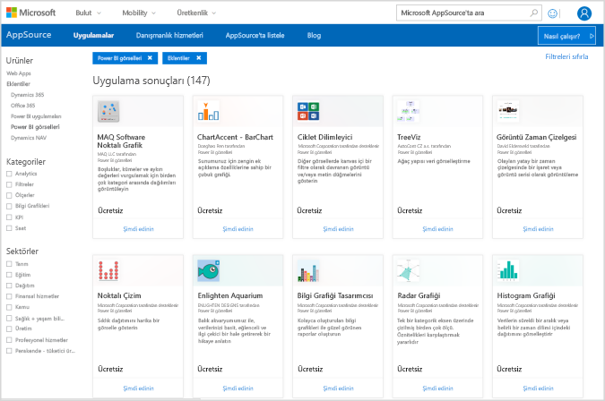

**Power BI Desktop**'ta R tabanlı görselleri seçme, yükleme ve kullanma işlemleri aşağıdaki bölümlerde açıklanmıştır.

## <a name="use-r-power-bi-visuals"></a>R Power BI görsellerini kullanma

R destekli Power BI görsellerini kullanmak için her bir görseli **Power BI görselleri** kitaplığından indirin. Daha sonra, ilgili görseli **Power BI Desktop**’taki tüm diğer görsel türleri gibi kullanın. Power BI görsellerini almak için izlenebilecek iki yol vardır: Çevrimiçi **AppSource** sitesinden indirebilir veya **Power BI Desktop**’tayken göz atıp edinebilirsiniz. 

### <a name="get-power-bi-visuals-from-appsource"></a>Power BI görsellerini AppSource’tan alma

Görselleri **AppSource** sitesinde bulup seçmeye yönelik adımlar aşağıda verilmiştir:

1. [https://appsource.microsoft.com](https://appsource.microsoft.com/) sayfasında bulunan Power BI görselleri kitaplığına gidin. *Ürüne göre daralt* bölümündeki *Power BI apps* onay kutusunu işaretleyin ve ardından **Tümünü gör** bağlantısını seçin.

   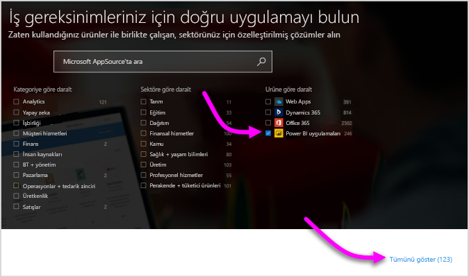

2. [Power BI görselleri](https://appsource.microsoft.com/marketplace/apps?product=power-bi-visuals&page=1) kitaplık sayfasında, sol bölmedeki Eklentiler listesinden **Power BI görselleri**’ni seçin.

   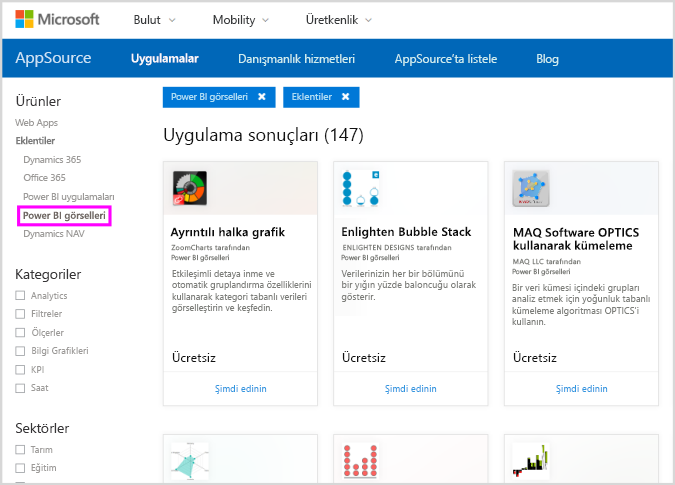

3. Galeriden işinize yarayacak **görseli** seçin, seçiminizin ardından görsel açıklamasının sunulduğu bir sayfaya yönlendirilirsiniz. İndirmek için **Şimdi edinin** seçeneğini belirleyin.

   > [!NOTE]
    > **Power BI Desktop**'ta yazmak için yerel makinenizde R yüklü olmalıdır. Ancak, kullanıcılar R tabanlı bir görseli **Power BI hizmetinde** görüntülemek isterse R'nin yerel makinede yüklü olmasına gerek yoktur.

   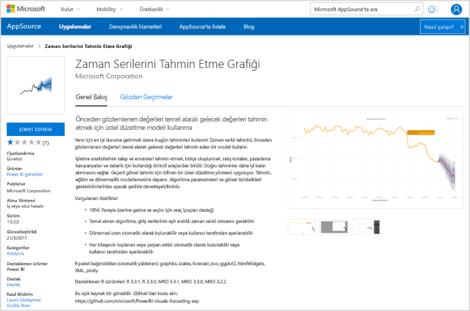

   R destekli Power BI görsellerini **Power BI hizmetinde** kullanmak için R’yi yüklemeniz gerekmez ancak R destekli Power BI görsellerini **Power BI Desktop**’ta kullanmak isterseniz yerel makinenize R’yi yüklemeniz *gerekir*. R'yi aşağıdaki konumlardan indirebilirsiniz:

   * [CRAN](https://cran.r-project.org/)
   * [MRO](https://mran.microsoft.com/)

4. Görseli indirdikten sonra (indirme işlemi tarayıcınızdan herhangi bir dosya indirmeye benzer) **Power BI Desktop**'a giderek **Görsel Öğeler** bölmesindeki **Diğer seçenekler** (...) düğmesine tıklayın ve **Dosyadan içeri aktar**'ı seçin.

   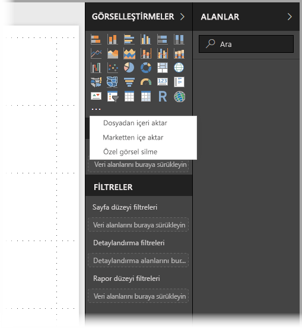
5. Aşağıdaki görüntüde gösterildiği gibi özel görseli içeri aktarırken dikkatli olmanız konusunda uyarı alırsınız:

   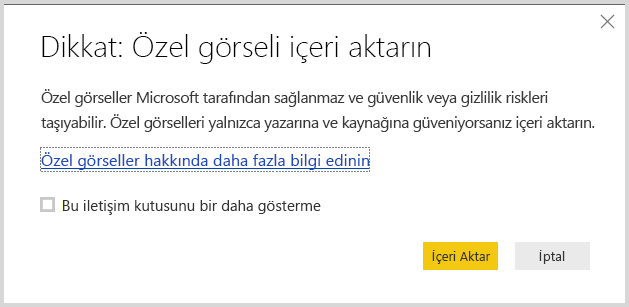
6. Görsel dosyasının kaydedildiği konuma gidin ve dosyayı seçin. **Power BI Desktop** özel görselleştirmeleri .pbiviz uzantılıdır.

   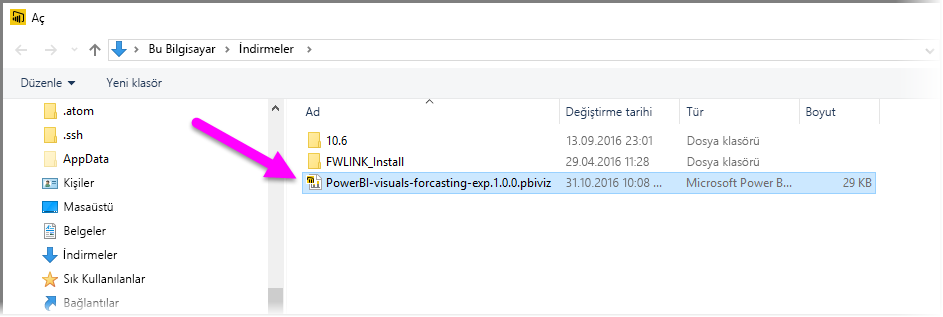
7. Power BI Desktop'a döndüğünüzde yeni görsel türünü **Görsel Öğeler** bölmesinde bulabilirsiniz.

   
8. Yeni görseli içeri aktardığınızda (veya R tabanlı özel görseli içeren bir raporu açtığınızda) **Power BI Desktop** gerekli R paketlerini yükler.

   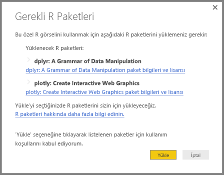

9. Tüm diğer **Power BI Desktop** görsellerinde yaptığınız gibi buradan görsele veri ekleyebilirsiniz. İşlemlerinizi tamamladığınızda, görselinizin son halini tuvalde görebilirsiniz. Aşağıdaki görselde, Birleşmiş Milletler (BM) doğum oranı tahminlerini (soldaki görsel) sunmak üzere R tabanlı **Forecasting** görseli kullanılmıştır.

    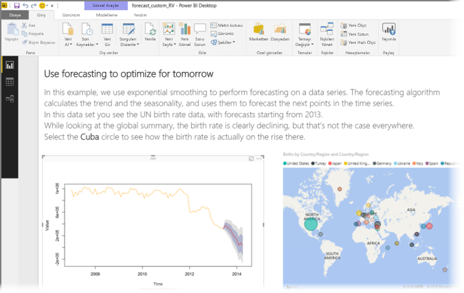

    Tüm diğer **Power BI Desktop** görsellerinde olduğu gibi R tabanlı görselleriyle birlikte bu raporu da **Power BI hizmetinde** yayımlayabilir ve başkalarıyla paylaşabilirsiniz.

    Her zaman yeni görseller eklendiği için kitaplığı sık sık ziyaret etmeyi unutmayın.

### <a name="get-power-bi-visuals-from-within-power-bi-desktop"></a>Power BI görsellerini **Power BI Desktop**’tan edinme

1. Power BI görsellerini **Power BI Desktop**’tan da edinebilirsiniz. **Power BI Desktop**'ta **Görsel Öğeler** bölmesindeki üç nokta (...) simgesine tıklayın ve **Market’ten al**'ı seçin.

   

2. Bu işlemin ardından, kullanılabilir Power BI görsellerine göz atarak aralarından seçim yapabileceğiniz **Power BI Görselleri** iletişim kutusu açılır. Ada göre arama yapabilir, kategori belirleyebilir veya kullanılabilir görsellere göz atabilirsiniz. Hazır olduğunuzda özel görseli **Power BI Desktop**'a eklemek için **Ekle** seçeneğini belirlemeniz yeterlidir.

   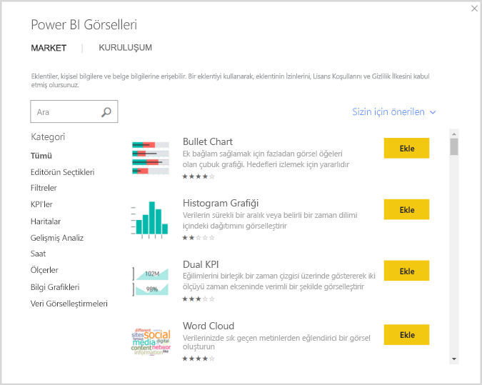

## <a name="contribute-r-powered-power-bi-visuals"></a>R destekli Power BI görselleri ile katkıda bulunma

Raporlarınızda kullanmak için kendi R görsellerinizi oluşturursanız, bunları **Power BI görsel galerisine** ekleyerek tüm dünyayla paylaşabilirsiniz. Katkılar, GitHub aracılığıyla yapılır ve katkıda bulunma işlemi, aşağıdaki konumda ana hatlarıyla açıklanmıştır:

* [R destekli Power BI görsel galerisine katkıda bulunma](https://github.com/Microsoft/PowerBI-visuals#building-r-powered-custom-visual-corrplot)

## <a name="troubleshoot-r-powered-power-bi-visuals"></a>R destekli Power BI görselleri ile ilgili sorun çözümü

R destekli Power BI görselleri, görsellerin düzgün şekilde çalışması için karşılanması gereken belirli bağımlılıklar içerir. R destekli Power BI görselleri düzgün şekilde çalıştırılamıyor veya yüklenemiyorsa sorun genellikle aşağıdakilerden biridir:

* R altyapısının eksik olması
* R betiğindeki görsel temelli hatalar
* R paketlerinin eksik olması veya güncel olmaması

Aşağıdaki bölümde, karşılaşabileceğiniz sorunları çözmenize yardımcı olacak sorun giderme adımları açıklanmaktadır.

### <a name="missing-or-outdated-r-packages"></a>Güncel olmayan veya eksik R paketleri

R tabanlı bir özel görseli yüklerken güncel olmayan veya eksik R paketlerine bağlı sorunlarla karşılaşabilirsiniz; bunun nedeni aşağıdakilerden biridir:

* R yüklemesinin R paketi ile uyumlu olmaması
* Güvenlik duvarının, virüsten koruma yazılımının veya ara sunucu ayarlarının, R'nin İnternet'e bağlanmasına engel olması
* İnternet bağlantısının yavaş olması veya bir İnternet bağlantısı sorununun bulunması

Power BI ekibi, siz henüz karşılaşmadan bu tür sorunları azaltmak için etkin bir şekilde çalışır ve sonraki Power BI Desktop sürümüne bu sorunları gidermeye yönelik güncelleştirmeler eklenir. Şimdilik bu sorunları gidermek için aşağıdaki adımlardan birini veya birkaçını uygulayabilirsiniz:

1. Özel görseli kaldırın ve tekrar yükleyin. Bu işlem, R paketlerini yeniden yükleme işlemini başlatır.
2. R yüklemeniz güncel değilse R yüklemenizi yükseltin, ardından önceki adımda açıklandığı gibi özel görseli kaldırın ve yeniden yükleyin.

   Desteklenen R sürümleri, aşağıdaki görüntüde gösterildiği gibi R tabanlı her bir özel görselin açıklamasında belirtilmiştir.

     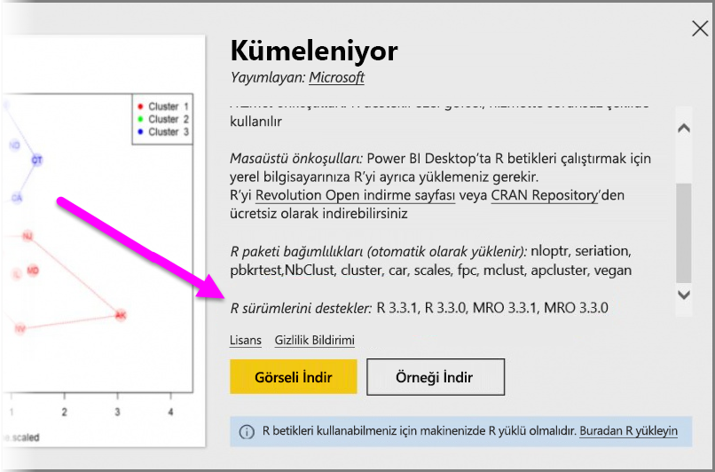
    > [!NOTE]
    > Özgün R yüklemesini koruyabilir ve Power BI Desktop'ı yalnızca yüklediğiniz güncel sürümle ilişkilendirebilirsiniz. **Dosya > Seçenekler ve ayarlar > Seçenekler > R betiği oluşturma** seçeneğine gidin.

3. R konsolunu kullanarak R paketlerini el ile yükleyin. Bu yaklaşıma ilişkin adımlar aşağıda açıklanmıştır:

   a. R tabanlı görselin yükleme betiğini indirin ve bu dosyayı yerel bir sürücüye kaydedin.

   b. R konsolunda aşağıdaki komutu çalıştırın:

      ```console
      source("C:/Users/david/Downloads/ScriptInstallPackagesForForecastWithWorkarounds.R")
      ```

   Genellikle, varsayılan yükleme konumları şunlardır:

   ```console
       c:\Program Files\R\R-3.3.x\bin\x64\Rterm.exe (for CRAN-R)
       c:\Program Files\R\R-3.3.x\bin\x64\Rgui.exe (for CRAN-R)
       c:\Program Files\R\R-3.3.x\bin\R.exe (for CRAN-R)
       c:\Program Files\Microsoft\MRO-3.3.x\bin\R.exe (for MRO)
       c:\Program Files\Microsoft\MRO-3.3.x\bin\x64\Rgui.exe (for MRO)
       c:\Program Files\RStudio\bin\rstudio.exe (for RStudio)
   ```

4. Önceki adımlar işe yaramazsa şunları deneyin:

   a. **R Studio**'yu kullanın ve yukarıdaki 3.b. maddesinde açıklanan adımı uygulayın. (Betik satırını R konsolunda çalıştırın.)

   b. Önceki adım işe yaramazsa **R Studio**'daki **Tools > Global Options > Packages** (Araçlar > Genel Seçenekler > Paketler) seçeneğini değiştirin ve **Use Internet Explorer library/proxy for HTTP** (HTTP için Internet Explorer kitaplığını/ara sunucuyu kullan) onay kutusunu etkinleştirip yukarıdaki adımlardan 3.b. adımını tekrarlayın.

## <a name="next-steps"></a>Sonraki adımlar

Power BI'daki R hakkında daha fazla bilgi edinmek için aşağıdaki ek kaynaklara göz atın.

* [Power BI görsel galerisi](https://app.powerbi.com/visuals/)
* [Power BI Desktop'ta R Betikleri çalıştırma](../connect-data/desktop-r-scripts.md)
* [Power BI Desktop'ta R görselleri oluşturma](desktop-r-visuals.md)
* [Power BI ile harici bir R IDE kullanma](../connect-data/desktop-r-ide.md)
