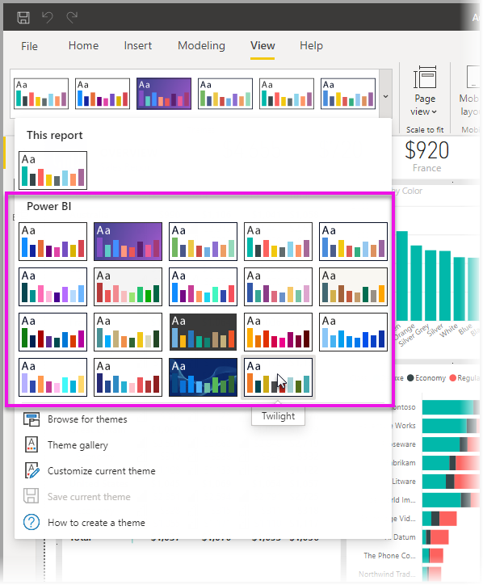
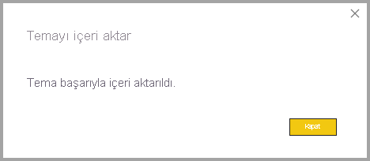
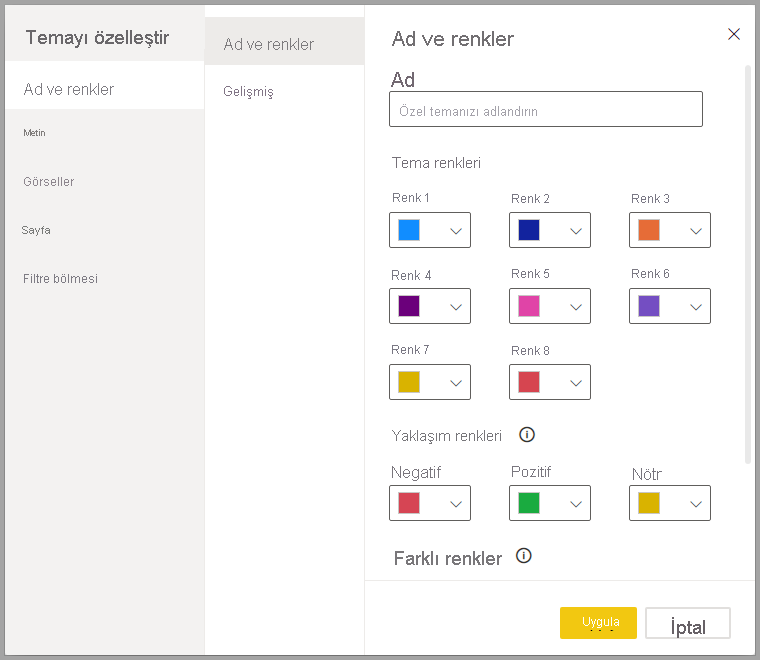
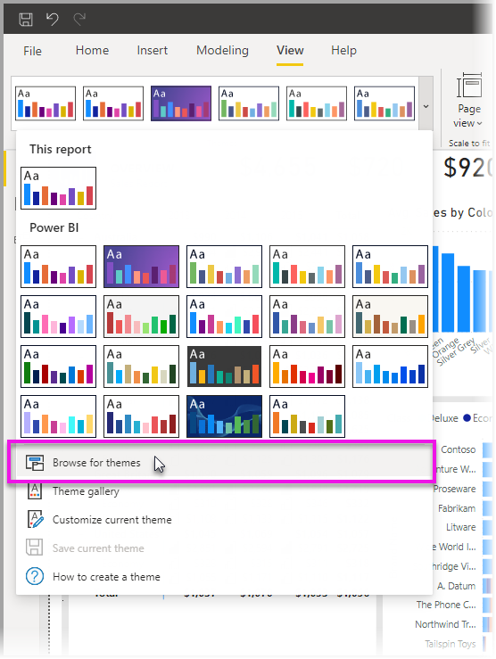
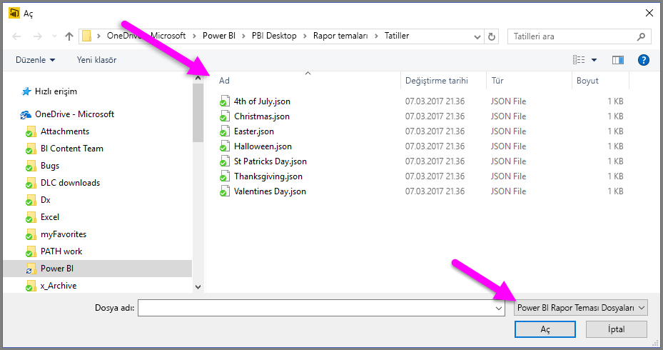
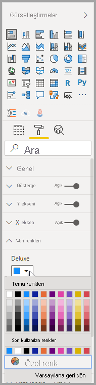
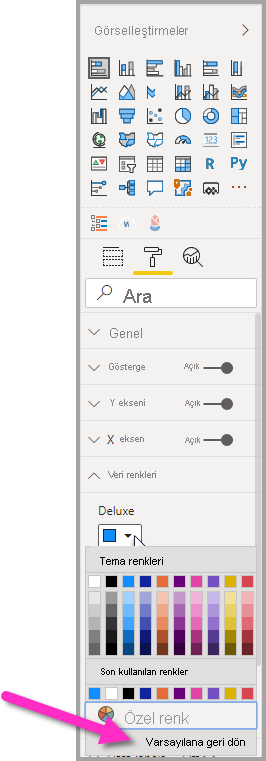

# <a name="use-report-themes-in-power-bi-desktop"></a>Power BI Desktop’ta rapor temalarını kullanma

Power BI Desktop *rapor temalarıyla* raporunuzun tamamında kurumsal renkler kullanma, simge kümelerini değiştirme veya yeni varsayılan görsel biçimlendirmeyi uygulama gibi tasarım değişiklikleri uygulayabilirsiniz. Rapor teması uyguladığınızda, raporunuzdaki tüm görsellerde varsayılan değerler olarak seçtiğiniz temanın renkleri ve biçimlendirmesi kullanılır. Bu makalenin devamında da açıklandığı gibi bazı özel durumlar uygulanır.

Rapor temaları, **Görünüm** şeridine gidip şeridin **Temalar** bölümündeki açılan ok düğmesini seçtikten sonra dilediğiniz temayı belirleyerek seçilebilir. Kullanılabilir temalar, Microsoft PowerPoint gibi diğer Microsoft ürünlerinde görülen temalara benzer.


Yerleşik rapor temaları ve özel rapor temaları olmak üzere iki tür rapor teması bulunur.

- **Yerleşik** rapor temaları, Power BI Desktop ile yüklenen, önceden tanımlanmış farklı türlerde renk şemaları sunar. Yerleşik rapor temaları, Power BI Desktop menüsünden doğrudan seçilir.

- **Özel** rapor temaları, geçerli bir temayı değiştirip özel bir tema olarak kaydederek veya bir JSON dosyası kullanıp kendi özelleştirilmiş temanızı oluşturarak yapılır. JSON dosyası, bu makalenin sonraki kısımlarında açıklandığı gibi, bir rapor temasının pek çok yönü üzerinde ayrıntılı denetim sağlar. 

Rapor temalarının nasıl çalıştığını konuştuktan sonra özelleştirilmiş rapor temaları oluşturma konusuna geçiş yapalım.


## <a name="how-report-themes-work"></a>Rapor temaları nasıl çalışır?

Bir Power BI Desktop raporuna rapor teması uygulamak için aşağıdaki seçeneklerden birini belirleyebilirsiniz:

* Power BI Desktop’ta yerleşik olan [kullanılabilir yerleşik rapor temaları](#built-in-report-themes) arasından seçim yapma
* **Temaları özelleştir** iletişim kutusunu kullanarak tema özelleştirme
* [Özel bir tema JSON dosyasını içeri aktarın](#import-custom-report-theme-files).

Bu seçeneklerin her birine sırayla göz atacağız.

> [!NOTE]
> Temalar yalnızca Power BI Desktop kullanılırken uygulanabilir. Power BI hizmetinde mevcut raporlara temaları uygulayamazsınız. 

### <a name="built-in-report-themes"></a>Yerleşik rapor temaları

Kullanılabilir rapor temalarından seçim yapmak için:

1. **Görünüm** şeridindeki **Temalar** açılır ok düğmesi **Tema Değiştir**’i seçin.

   

2. Karşınıza çıkan açılır menüdeki temalar arasından seçim yapın.

   

   Rapor temanız rapora uygulandı.

    Aşağıdaki tablo, kullanılabilir yerleşik rapor temalarını gösterir.
    
    | Yerleşik rapor teması | Varsayılan renk dizisi |
    |------ |---------- |
    | Varsayılan | |
    | Highrise | |
    | Yönetici | |
    | Sınır| |
    | Yenilik Yapın | |
    | Çiçek | |
    | Gelgit| |
    | Sıcaklık | |
    | Güneş| |
    | Çeşitli | |
    | Fırtına | |
    | Klasik | |
    | Şehir parkı | |
    | Sınıf | |
    | Renk körleri için | |
    | Elektrik | |
    | Yüksek karşıtlık | |
    | Gün batımı | |
    | Alacakaranlık | |
    
3. Temalar açılır menüsünden **Tema galerisini** seçerek Power BI Topluluğu’ndaki üyelerin oluşturduğu tema koleksiyonlarına da göz atabilirsiniz.

   

    Beğendiğiniz bir temayı galeriden seçebilir ve ilişkili JSON dosyasını indirebilirsiniz. 

    İndirilen dosyayı yüklemek için **Temalar** açılır menüsünden **Temalara göz at**’ı seçip JSON dosyasını indirdiğiniz konuma gidin ve temayı Power BI Desktop’a yeni tema olarak içeri aktarmak üzere seçin.

    İşlem başarıyla tamamlandığında Power BI, içeri aktarmanın başarılı olduğunu söyleyen bir iletişim kutusu görüntüler.

   

## <a name="customize-report-themes"></a>Rapor temalarını özelleştirme

Ayrıca, doğrudan Power BI Desktop’ta yapılan özelleştirmeler veya rapor temasının JSON dosyası aracılığıyla **Görselleştirme** bölmesinin **Biçim** bölümünde listelenen neredeyse tüm öğeleri özelleştirebilir veya standartlaştırabilirsiniz. Amaç, raporlarınızın varsayılan görünümünü ve yapısını en küçük ayrıntılarına kadar tamamen denetleyebilmenizi sağlamaktır.

Rapor temalarını aşağıdaki iki yöntemle özelleştirebilirsiniz:

- [Power BI Desktop’ta tema oluşturma ve özelleştirme](#create-and-customize-a-theme-in-power-bi-desktop)
- [Özel rapor teması JSON dosyası oluşturma ve özelleştirme](#introduction-to-report-theme-json-files)

Aşağıdaki bölümlerde, bu yaklaşımların her birine sırayla göz atalım.

### <a name="create-and-customize-a-theme-in-power-bi-desktop"></a>Power BI Desktop’ta tema oluşturma ve özelleştirme

Bir temayı doğrudan Power BI Desktop’ta özelleştirmek için beğendiğinize yakın bir tema seçip birkaç değişiklik yapabilirsiniz. İlk olarak, beğendiğinize yakın olan temayı seçin (veya herhangi bir temayla başlayıp buradan özelleştirin) ve şu adımları izleyin:

1. **Görünüm** şeridinden **Temalar** açılır düğmesini ve sonra **Geçerli temayı özelleştir**’i seçin.

   

2. Geçerli temada her türlü değişikliği yapabileceğiniz bir iletişim kutusu açılır ve sonra ayarlarınızı yeni bir tema olarak kaydedebilirsiniz.

   

Özelleştirilebilen tema ayarları aşağıdaki kategorilerde bulunur ve bunlar **Temayı özelleştir** penceresine gösterilir:

- **Ad ve renkler**: Tema adı ve renk seçenekleri [tema renklerini](#how-report-theme-colors-stick-with-your-reports), yaklaşım renklerini, farklı renkleri ve [yapısal renkleri (Gelişmiş)](#setting-structural-colors) içerir.
- **Metin**: Metin ayarları etiketler, başlıklar, kartlar, KPI’ler ve sekme üst bilgileri için [birincil metin sınıfı varsayılanlarını](#setting-formatted-text-defaults) ayarlayan yazı tipi ailesi, boyutu ve rengidir.
- **Görseller**: Görsel ayarlar arka planı, kenarlığı, üst bilgiyi ve araç ipuçlarını içerir.
- **Sayfa**: Sayfa öğesi ayarları duvar kağıdını ve arka planı içerir.
- **Filtre bölmesi**: Filtre bölmesi ayarları arka plan rengini, saydamlığı, yazı tipini, simge rengini, boyutu ve filtre kartlarını içerir.

Değişikliklerinizi yaptıktan sonra temanızı kaydetmek için **Uygula ve kaydet** seçeneğini belirleyin. Temanız artık geçerli raporunuzda kullanılabilir ve dışarı aktarılabilir.

Geçerli temanın bu şekilde özelleştirilmesi, temaları özelleştirmeyi hızlandırır ve kolaylaştırır. Ancak, temalarda daha ince ayarlamalar yapabilirsiniz. Bu işlem, temanın [JSON dosyasının](#report-theme-json-file-format) değiştirilmesini gerektirir.

> [!TIP]
> **Temayı özelleştir** iletişim kutusundaki denetimleri kullanarak en yaygın rapor teması seçeneklerini özelleştirebilirsiniz. Daha da fazla denetim elde etmek için, isteğe bağlı olarak temanın JSON dosyasını dışarı aktarabilir ve söz konusu dosyadaki ayarları değiştirerek kendiniz hassas ayarlamalar yapabilirsiniz. Hassas ayarlamaların yapıldığı JSON dosyasını yeniden adlandırabilir ve daha sonra bunu içeri aktarabilirsiniz.

### <a name="import-custom-report-theme-files"></a>Özel rapor teması dosyalarını içeri aktarma

Aşağıdaki adımları izleyerek özel bir rapor teması dosyasını da içeri aktarabilirsiniz:

1. **Görünüm** şeridini seçin ve sonra **Temalar** açılır düğmesinden **Temalara göz at**’ı seçin.

   

   JSON tema dosyasının konumuna göz atmanızı sağlayan bir pencere açılır.

2. Aşağıdaki görüntüde birkaç tatil tema dosyası bulunur. Mart ayı için bir tatil teması seçeceğiz (*Aziz Patrik Günü*).

   

   Tema dosyası başarıyla yüklendiğinde, Power BI Desktop işlemin başarılı olduğunu belirten bir ileti görüntüler.

   

## <a name="introduction-to-report-theme-json-files"></a>Rapor teması JSON dosyalarına giriş

 Önceki bölümde bahsedilen temel JSON dosyasını açtığınızda (Aziz Patrik Günü.json), bu dosya aşağıdaki gibi gözükür:

 ```json
    {
        "name": "St Patrick's Day",
        "dataColors": ["#568410", "#3A6108", "#70A322", "#915203", "#D79A12", "#bb7711", "#114400", "#aacc66"],
        "background":"#FFFFFF",
        "foreground": "#3A6108",
        "tableAccent": "#568410"
    }
```

Bu rapor teması JSON dosyasında aşağıdaki satırlar bulunur:

- **name**: Rapor teması adı. Bu alan, tek gerekli alandır.
- **dataColors**: Power BI Desktop görsellerindeki veriler için kullanılacak renklerin onaltılık kod listesi. Listede istediğiniz sayıda renk bulunabilir.
- **background**, **firstLevelElements** ve **tableAccent** (vb.): Renk sınıfları. Renk sınıfları, raporunuzda istediğiniz sayıda yapısal renk ayarlamanıza olanak tanır.

İçeri aktaracağınız kendi özel rapor teması dosyanızı oluşturmak için bu JSON dosyasını temel alabilirsiniz. Raporunuzda yalnızca temel renkleri değiştirmek istiyorsanız, dosyanızdaki adı ve onaltılık kodları değiştirin.

Rapor teması JSON dosyasında, yalnızca değiştirmek istediğiniz biçimlendirmeyi tanımlarsınız. JSON dosyasında belirtmediğiniz her şey, Power BI Desktop varsayılan ayarlarına geri döner.

JSON dosyası oluşturmanın çok sayıda avantajı vardır. Örneğin, tüm grafiklerde yazı tipi boyutunun 12 olacağını, bazı görsellerde belirli bir yazı tipi ailesinin kullanılacağını veya belirli grafik türleri için veri etiketlerinin devre dışı bırakılacağını belirtebilirsiniz. JSON dosyası kullanarak grafik ve raporlarınızı standart hale getiren ve kuruluş raporlarınızın tutarlı olmasını kolaylaştıran bir tema dosyası oluşturabilirsiniz.

JSON dosyası biçimi hakkında daha fazla bilgi edinmek için bkz. [Rapor teması JSON dosya biçimi](#report-theme-json-file-format).

> [!NOTE]
> Özel JSON rapor temasını [**Temayı özelleştir** iletişim kutusuyla](#create-and-customize-a-theme-in-power-bi-desktop) değiştirmek güvenli bir işlemdir.  İletişim kutusu denetleyemediği tema ayarlarını değiştirmez ve rapor temasında yapılan değişiklikleri yerinde güncelleştirir.

## <a name="how-report-theme-colors-stick-with-your-reports"></a>Rapor teması renkleri raporlarınıza nasıl eklenir?

Raporunuzu Power BI hizmetinde yayımladığınızda rapor teması renkleriniz de yayımlanır. **Biçim** bölmesindeki **Veri renkleri** bölümü rapor temanızı yansıtır.

Rapor temasında kullanılabilir olan renkleri görüntülemek için:

1. Bir görseli seçin.

2. **Görselleştirme** bölmesinin **Biçim** bölümünde **Veri renkleri** seçeneğini belirleyin.

3. Rapor temasının **Tema renkleri** bilgilerini görüntülemek için bir öğenin açılan öğesini seçin.

   

Örneğimizde, Aziz Patrik Günü rapor temasından çok sayıda kahverengi ve yeşil renk uyguladıktan sonra tema renklerini görüntüleyin. Tüm yeşil renkleri görüyor musunuz? Bunun nedeni, bu renklerin içeri aktarıp uyguladığımız rapor temasında yer almasıdır.

Renk paletindeki renkler geçerli temayla ilişkilidir. Örneğin, bir veri noktası için üst satırın üçüncü rengini seçtiğinizi varsayalım. Daha sonra, farklı bir temaya geçerseniz, Microsoft Office’in temasını değiştirdiğinizde olduğu gibi o veri noktasının rengi de otomatik olarak üst satırın üçüncü rengine güncelleştirilir.

Rapor temaları ayarlandığında, rapor genelinde görsellerde kullanılan varsayılan renkler değişir. Power BI, görsellerin raporda görüntülenecek birçok benzersiz renge sahip olmasını sağlamak için yüzlerce renkten oluşan bir liste bulundurur. Power BI bir görsel serisine renkler atarken, serinin renklerinin seçilmesinde önce gelen alır ilkesi geçerli olur. Bir temayı içeri aktardığınızda veri serileri için renk eşlemesi sıfırlanır. 

Power BI dinamik serinin rengini izler ve diğer görsellerde bir değer için aynı rengi kullanır. *Dinamik seride* görsellerde sunulan seri sayısı ölçülere, değerlere ve diğer özelliklere göre değişebilir. Örneğin bir raporda *Bölgeye Göre Kâr*'ı gösterirken satış bölgelerinizin sayısı beş olabilir veya dokuz olabilir. Bölge sayısı dinamiktir, bu nedenle dinamik seri olarak kabul edilir. 

Buna karşılık *statik serilerde* seri sayısı bilinir. Örneğin *Kâr* ve *Gelir* değerleri statik serilerdir. Statik serilerde Power BI tema paletlerindeki dizine göre renkleri atar. Biçimlendirme bölmesinde **Veri renkleri**’nin altından bir renk seçerek varsayılan renk atamasını geçersiz kılabilirsiniz. Tüm olası seri değerlerini görmek ve bunların renklerini de ayarlamak için dilimleyici seçimlerinizi değiştirebilirsiniz. **Özellikler** bölmesini kullanarak tek bir görsele açıkça bir renk ayarlarsanız, içeri aktarılan tema bu açıkça tanımlanmış renklerin hiçbirine uygulanmaz. 

Bu açıkça seçilmiş renklere temanın uygulanmasına izin vermek için, açıkça renk uygulamasını geri almak ve temanın uygulanmasına izin vermek üzere rengin açıkça ayarlandığı görselin **Veri Renkleri** bölümünde **Varsayılana geri dön**'ü kullanın.


### <a name="situations-when-report-theme-colors-wont-stick-to-your-reports"></a>Rapor teması renklerinin raporlarınıza eklenmediği durumlar

Renk seçicideki **Özel renk** seçeneğini kullanarak, görseldeki belirli bir veri noktasına özel bir renk kümesi (veya tek bir renk) uyguladığınızı varsayalım. Rapor teması uygulamanız özelleştirilmiş veri noktası rengini *geçersiz kılmaz*.

Veya, **tema renkleri** bölümünü kullanarak bir veri noktasının rengini kendiniz ayarlamak istediğinizi varsayalım. Yeni bir rapor teması uyguladığınızda bu renkler *güncelleştirilmez*. Yeni bir rapor teması uyguladığınızda güncelleştirilmelerini sağlamak amacıyla varsayılan renklerinize geri dönmek için **Varsayılana geri dön** seçeneğini belirleyin veya renk seçicinin **Tema renkleri** paletinden bir renk seçin.



Çoğu Power BI görseli, rapor temalarına uygulanmaz.

## <a name="custom-report-theme-files-you-can-use-right-now"></a>Şu anda kullanabileceğiniz özel rapor teması dosyaları

Rapor temalarını kullanmaya başlamak mı istiyorsunuz? [Tema galerisindeki](https://community.powerbi.com/t5/Themes-Gallery/bd-p/ThemesGallery) özel rapor temalarına göz atın veya indirip Power BI Desktop raporunuza aktarabileceğiniz şu hazır özel rapor teması JSON dosyalarını deneyin:

- [Dalga biçimi teması](https://community.powerbi.com/t5/Themes-Gallery/Waveform/m-p/140536). Bu rapor teması, rapor temalarının kullanıma sunulduğunu duyuran [blog gönderisinde](https://powerbi.microsoft.com/blog/power-bi-desktop-march-feature-summary/) tanıtıldı. [Waveform.json dosyasını indirin](https://go.microsoft.com/fwlink/?linkid=843924).

  

- [Renk körlerine uygun tema](https://community.powerbi.com/t5/Themes-Gallery/Color-Blind-Friendly/m-p/140597).
Bu rapor teması, görsel engelliler için okumayı kolaylaştırır. [ColorblindSafe-Longer.json dosyasını indirin](https://go.microsoft.com/fwlink/?linkid=843923).

  .

- Apothecary.json dosyasını içeren Power View temaları. [Power View temalarını zip dosyası olarak indirin](https://go.microsoft.com/fwlink/?linkid=843925).

  

- Sevgililer Günü teması.

  

  Sevgililer Günü JSON dosyasına yönelik kodu aşağıda bulabilirsiniz:

   ```json
       {
           "name": "Valentine's Day",
           "dataColors": ["#990011", "#cc1144", "#ee7799", "#eebbcc", "#cc4477", "#cc5555", "#882222", "#A30E33"],
           "background":"#FFFFFF",
           "foreground": "#ee7799",
           "tableAccent": "#990011"
       }
   ```

Başlangıçta kullanabileceğiniz birkaç rapor teması daha aşağıda bulunmaktadır:

- [Sunflower-twilight](https://community.powerbi.com/t5/Themes-Gallery/Sunflower-Twilight/m-p/140749)
- [Plum](https://community.powerbi.com/t5/Themes-Gallery/Plum/m-p/140711)
- [Autumn](https://community.powerbi.com/t5/Themes-Gallery/Autumn/m-p/140746)
- [High contrast](https://community.powerbi.com/t5/Themes-Gallery/Color-Blind-Friendly/m-p/140597)

Rapor temaları sizi, kuruluşunuzu ve hatta geçerli mevsimi veya tatili Power BI Desktop raporlarınızda renkli bir şekilde yansıtabilir.

## <a name="export-report-themes"></a>Rapor temalarını dışarı aktarma

Uygulanmış olan geçerli rapor temasını doğrudan Power BI Desktop’tan bir JSON dosyasına dışarı aktarabilirsiniz. Rapor temasını dışarı aktardıktan sonra bunu diğer raporlarda kullanabilirsiniz. Bu seçenek, yerleşik temaların çoğunu JSON dosyası olarak dışarı aktarmanıza olanak tanır. Tek özel durum, temel temalar olan Klasik ve Varsayılan’dır (diğer temalar içeri aktarıldıklarında bunları temel alır).

Geçerli temayı Power BI Desktop’tan dışarı aktarmak için:

1. **Dosya** > **Seçenekler ve ayarlar** > **Seçenekler**’i seçin.

2. **Önizleme özellikleri** bölümünde **Geçerli temayı özelleştir**’i seçip **Tamam** seçeneğini belirleyin.

   Önizleme özelliğinin etkinleştirilmesi için Power BI Desktop'ı yeniden başlatmanız istenebilir. Yeniden başlattıktan sonra, uygulanmış olan temayı dışarı aktarmaya başlayabilirsiniz.

3. **Giriş** şeridinde **Temayı değiştir** > **Geçerli temayı dışarı aktar** seçeneğini belirleyin.

4. **Farklı Kaydet** iletişim kutusunda JSON dosyalarının kaydedileceği dizine gidip **Kaydet** seçeneğini belirleyin.

## <a name="report-theme-json-file-format"></a>Rapor teması JSON dosya biçimi

En temel düzeyinde, tema JSON dosyasında yalnızca bir gerekli satır vardır: **name**.

```json
{
    "name": "Custom Theme"
}
```

**name** dışındaki her şey isteğe bağlıdır. Yani, tema dosyasına özellikle biçimlendirmek istediğiniz özellikleri ekleyebilir ve geri kalanı için Power BI’ın varsayılan özelliklerini kullanabilirsiniz.

### <a name="setting-theme-colors"></a>Tema renklerini ayarlama

**name** satırının altına, veri rengiyle ilgili aşağıdaki temel özellikleri ekleyebilirsiniz:

- **dataColors**: Power BI Desktop görsellerindeki verileri temsil eden şekilleri renklendirmek için kullanılacak renklerin onaltılık kod listesi. Listede istediğiniz sayıda renk bulunabilir. Bu listedeki tüm renkler kullanıldıktan sonra, görsel daha fazla renk gerekiyorsa Power BI’ın varsayılan renk paletini kullanmaya geri döner.
- **good**, **neutral**, **bad**: Bu özellikler şelale grafiği ve KPI görseli tarafından kullanılan durum renklerini ayarlar.
- **maximum**, **center**, **minimum**, **null**: Bu renkler koşullu biçimlendirme iletişim kutusundaki çeşitli gradyan renklerini ayarlar.

Bu renkleri tanımlayan temel bir tema aşağıdaki gibi görünebilir:

```json
{
    "name": "Custom Theme",
    "dataColors": [
        "#118DFF",
        "#12239E",
        "#E66C37",
        "#6B007B",
        "#E044A7",
        "#744EC2",
        "#D9B300",
        "#D64550",
        "#197278",
        "#1AAB40"
    ],
    "good": "#1AAB40",
    "neutral": "#D9B300",
    "bad": "#D64554",
    "maximum": "#118DFF",
    "center": "#D9B300",
    "minimum": "#DEEFFF",
    "null": "#FF7F48"
}
```

### <a name="setting-structural-colors"></a>Yapısal renkleri ayarlama

Ardından, **background** ve **firstLevelElements** gibi çeşitli renk sınıfları ekleyebilirsiniz. Bu renk sınıfları rapordaki öğelerin, örneğin eksen kılavuz çizgileri, vurgu renkleri ve görsel öğelerin arka plan renkleri gibi yapısal renklerini ayarlar.

Aşağıdaki tabloda, biçimlendirebileceğiniz altı renk sınıfını görebilirsiniz.  **Renk sınıfı** adları, [**Temayı özelleştir** iletişim kutusundaki](#create-and-customize-a-theme-in-power-bi-desktop) "Ad ve Renkler" bölümünün "Gelişmiş" alt bölümünde bulunan adlara karşılık gelir.

|Renk sınıfı  |Neyi biçimlendirir?  |
|---------|---------|
| **firstLevelElements** <br> **foreground**    (kullanım dışı) | Etiket arka plan rengi (veri noktaları dışında olduğunda) <br> Eğilim çizgisi rengi <br>  Metin kutusu varsayılan rengi <br> Tablo ve matris değerleri ve toplam yazı tipi renkleri Veri çubukları eksen rengi <br> Kart veri etiketleri <br> Ölçek açıklama balonu değeri rengi <br> KPI hedefi rengi <br>  KPI metin rengi <br> Dilimleyici öğe rengi (odak modundayken)  <br> Dilimleyici açılan öğe yazı tipi rengi <br> Dilimleyici sayısal giriş yazı tipi rengi <br> Dilimleyici üst bilgisi yazı tipi rengi <br> Dağılım grafiği oran çizgisi rengi <br> Çizgi grafik tahmin çizgisi rengi <br> Eşleme öncü çizgisi rengi <br> Filtre bölmesi ve kart metin rengi|
| **secondLevelElements** <br> **foregroundNeutralSecondary** (kullanım dışı) | "açık" [ikincil metin sınıfları](#setting-formatted-text-defaults) <br> Etiket renkleri  <br> Gösterge etiketi rengi <br> Eksen etiketi rengi <br> Tablo ve matris üst bilgisi yazı tipi rengi <br> Ölçek hedefi ve hedef öncü çizgisi rengi <br>  KPI eğilimi ekseni rengi <br> Dilimleyici kaydırıcısı rengi <br> Dilimleyici öğe yazı tipi rengi <br> Kaydırıcı ana hat rengi <br> Çizgi grafik üzerine gelme rengi <br> Çok satırlı kart başlığı rengi <br> Şerit grafik kontur rengi <br> Şekil eşlemi kenarlık rengi <br> Düğme metni yazı tipi rengi <br> Düğme simgesi çizgi rengi <br> Düğme ana hat çizgisi rengi |
| **thirdLevelElements** <br >**backgroundLight** (kullanım dışı) | Eksen kılavuz çizgisi rengi <br> Tablo ve matris kılavuz rengi <br> Dilimleyici üst bilgisi arka plan rengi (odak modundayken)  <br> Çok satırlı kart ana hat rengi  <br> Şekil dolgusu rengi <br> Ölçek yayı arka plan rengi <br> Uygulanan filtre kart arka planı rengi <br> Arka plan = FFFFFF olduğunda: <br> Devre dışı bırakılan düğme dolgusu rengi <br> Devre dışı bırakılan düğme ana hat çizgisi rengi <br> |
| **fourthLevelElements** <br> **foregroundNeutralTertiary** (kullanım dışı) | gösterge soluk rengi <br> Kart kategori etiketi rengi <br> Çok satırlı kart kategorisi etiketi rengi <br> Çok satırlı kart çubuk rengi <br> Huni grafiği dönüştürme oranı kontur rengi <br> Devre dışı bırakılan düğme metni yazı tipi rengi <br> Devre dışı bırakılan düğme simgesi çizgi rengi <br> |
| **background** | Etiket arka plan rengi (veri noktaları içinde olduğunda) <br> Dilimleyici açılan öğeleri arka plan rengi  <br> Halka grafik kontur rengi <br> Ağaç haritası kontur rengi <br> Birleşik harita arka plan rengi <br> Düğme dolgusu rengi <br> Filtre bölmesi ve kullanılabilir filtre kartı arka plan rengi |
| **secondaryBackground** <br> **backgroundNeutral** (kullanım dışı) | Tablo ve matris kılavuz ana hat rengi <br> Şekil eşlemi varsayılan rengi <br> Şerit grafik şeridi dolgu rengi (seri eşleştirme seçeneği kapalıyken) <br> Arka plan != FFFFFF olduğunda: <br> Devre dışı bırakılan düğme dolgusu rengi <br> Devre dışı bırakılan düğme ana hat çizgisi rengi <br> |
| **tableAccent** | Mevcut olduğunda tablo ve matris kılavuzu ana hat rengini geçersiz kılar |

Renk sınıflarını ayarlayan örnek tema aşağıda verilmiştir:

```json
{
    "name": "Custom Theme",
    "firstLevelElements": "#252423",
    "secondLevelElements": "#605E5C",
    "thirdLevelElements": "#F3F2F1",
    "fourthLevelElements": "#B3B0AD",
    "background": "#FFFFFF",
    "secondaryBackground": "#C8C6C4",
    "tableAccent": "#118DFF"
}
```

> [!TIP]
> Tipik "beyaz" **background** üzerinde "siyah"**firstLevelElements** stilinden farklı olan "koyu tema" stilinde yazıyorsanız, diğer yapısal renkler ve [birincil metin sınıfı renkleri](#setting-formatted-text-defaults) için de değerleri ayarladığınızdan emin olun.  Bu şekilde (örneğin) grafiklerdeki veri etiketlerinde etiket arka planının beklenen stille eşleştiğinden ve okunabilir olduğundan, ayrıca eksen kılavuz çizgilerinin göründüğünden emin olabilirsiniz.

### <a name="setting-formatted-text-defaults"></a>Biçimlendirilmiş metin varsayılan değerlerini ayarlama

Daha sonra, JSON dosyanıza metin sınıfları ekleyebilirsiniz. Metin sınıfları renk sınıflarına benzese de, bunlar yazı tipi boyutunu, rengini ve ailesini rapor genelindeki metin grupları için güncelleştirmenizi sağlamak için tasarlanmıştır.

12 metin sınıfı bulunur ancak raporunuzdaki metin biçimlendirmelerinin tümünü değiştirmek için yalnızca *birincil sınıflar* olarak adlandırılan dört sınıfı ayarlamanız yeterlidir.  Bu dört birincil sınıf [**Temayı özelleştir** iletişim kutusundaki](#create-and-customize-a-theme-in-power-bi-desktop) "Metin" bölümünün altında ayarlanabilir: "Genel" **label** öğesine, "Başlık" **title** öğesine, "Kartlar ve KPI'ler" **callout** öğesine ve "Sekme üst bilgileri" de **header** öğesine karşılık gelir.

*İkincil sınıflar* olarak kabul edilen diğer metin sınıfları ise özelliklerini ilişkili oldukları birincil sınıflardan otomatik olarak türetir. İkincil sınıf genelde birincil sınıfa kıyasla daha açık bir metin rengi gölgesi ya da daha büyük veya daha küçük bir metin boyutu yüzdesi seçer.

**Etiket** sınıfını örnek olarak alalım. **label** sınıfı için varsayılan biçimlendirme Segoe UI #252423 (koyu gri bir renk) ve 12 pt’dir. Tablo ve matristeki değerleri biçimlendirmek için bu sınıf kullanılır. Genelde, bir tablo veya matristeki toplamlar benzer bir biçimlendirmeye sahip olur ancak öne çıkmaları **bold label** sınıfıyla kalın yapılırlar. Ancak, tema JSON dosyasında bu sınıfı belirtmeniz gerekmez. Power BI bunu otomatik olarak yapar. Daha sonra, temanızda 14 pt yazı tipi olan etiketler belirtmeye karar verirseniz, metin biçimlendirmesini **label** sınıfından devraldığı için **bold label** sınıfını da güncelleştirmeniz gerekmez.

Aşağıdaki tabloda aşağıdaki bilgiler gösterilir:

- Dört birincil metin sınıfının her biri, neyi biçimlendirdiği ve varsayılan ayarları
- İkincil sınıfların her biri, neyi biçimlendirdiği ve birincil sınıfa kıyasla benzersiz olan varsayılan ayarı

|Birincil sınıf  |İkincil sınıflar  |JSON sınıfı adı  | Varsayılan ayarlar  |İlişkili görsel nesneler  |
|---------|---------|---------|---------|---------|
| Açıklama Balonu | YOK | açıklama balonu | DIN <br> #252423 <br> 45 pt |Kart veri etiketleri <br> KPI göstergeleri|
|Üst bilgi|YOK|üst bilgi|Segoe UI Semibold <br> #252423 <br> 12 pt |Ana etmenler üst bilgileri |
| Başlık || başlık |DIN <br> #252423 <br> 12 pt |Kategori ekseni başlığı <br> Değer ekseni başlığı <br> Çok satırlı kart başlığı * <br> Dilimleyici üst bilgisi|
|-| Büyük başlık | largeTitle |14 pt |Görsel başlık |
|Etiket ||etiket |Segoe UI<br>#252423<br>10 pt |Tablo ve matris sütun üst bilgileri <br> Matris satır üst bilgileri<br>Tablo ve matris kılavuzu<br>Tablo ve matris değerleri |
|-|Yarı kalın |semiboldLabel| Segoe UI Semibold | Ana etmenler profil metni
|-|Büyük |largeLabel |12 pt | Çok satırlı kart veri etiketleri |
|-|Küçük |smallLabel |9 pt |Başvuru çizgisi etiketleri * <br>Dilimleyici tarih aralığı etiketleri<br> Dilimleyici sayısal giriş metin stili<br>Dilimleyici arama kutusu<br>Ana etmenler etkileyici metni|
|-|Açık |lightLabel |#605E5C |Gösterge metni<br>Düğme metni<br>Kategori Ekseni etiketleri<br>Huni grafiği veri etiketleri<br>Huni grafiği dönüştürme oranı etiketleri<br>Ölçek hedefi<br>Dağılım grafiği kategori etiketi<br>Dilimleyici öğeleri|
|-|Kalın |boldLabel |Segoe UI Bold |Matris alt toplamları<br>Matris genel toplamları<br>Tablo toplamları |
|-|Büyük ve Hafif |largeLightLabel |#605E5C<br>12 pt |Kart kategori etiketleri<br>Ölçek etiketleri<br>Çok satırlı kart kategorisi etiketleri |
|-|Küçük ve Hafif |smallLightLabel |#605E5C<br>9 pt |Veri etiketleri<br>Değer ekseni etiketleri|

*\* Yıldızlı öğeler de rapor temasının ilk veri rengi temelinde renklendirilir.*

> [!TIP]
> Metin sınıflarının *açık* çeşitlemeleri açık renklerini yukarıda tanımlanan [yapısal renklerden](#setting-structural-colors) alır.  "Koyu tema" yazıyorsanız, aynı zamanda "firstLevelElements" (birincil metin rengiyle eşleşen), "secondLevelElements" (metin için beklenen "açık" renkle eşleşen) ve "background" (hem birinci hem de ikinci düzey öğe renkleriyle yeterli karşıtlıkta) renklerini de ayarladığınızdan emin olun.

Yalnızca birincil metin sınıflarını ayarlayan örnek bir tema aşağıda verilmiştir:

```json
{
    "name": "Custom Theme",
    "textClasses": {
        "callout": {
            "fontSize": 45,
            "fontFace": "DIN",
            "color": "#252423"
        },
        "title": {
            "fontSize": 12,
            "fontFace": "DIN",
            "color": "#252423"
        },
        "header": {
            "fontSize": 12,
            "fontFace": "Segoe UI Semibold",
            "color": "#252423"
        },
        "label": {
            "fontSize": 10,
            "fontFace": "Segoe UI",
            "color": "#252423"
        }
    }
}
```

Birincil sınıflardan devralındığı için tema dosyanızda ikincil sınıfları ayarlamanız gerekmez. Ancak, devralma kurallarını beğenmiyorsanız (örneğin, bir tabloda toplamlarınız için değerlerin kalın sürümünü görmek istemiyorsanız), tıpkı birincil sınıfları biçimlendirebileceğiniz gibi tema dosyasındaki ikincil sınıfları da açıkça biçimlendirebilirsiniz.

### <a name="setting-visual-property-defaults-visualstyles"></a>Görsel özellik varsayılanlarını ayarlama (`visualStyles`)

Son olarak, rapordaki tüm görsel biçimlendirmeye daha ayrıntılı denetim sağlayan genişletilmiş biçimli bir JSON dosyası oluşturmak için JSON dosyasına bir **visualStyles** bölümü ekleyip biçimlendirme özelliklerini iç içe yerleştirebilirsiniz. **visualStyles** bölümünün şablonlu bir örneği aşağıda verilmiştir:

```json
    "visualStyles": {
        "<visualName>": {
            "<styleName>": {
                "<cardName>": [{
                    "<propertyName>": <propertyValue>
                }]
            }
        }
    }
```

**visualName** ve **cardName** bölümlerinde belirli bir görsel ve kart adı kullanın. Şu anda **styleName** her zaman bir yıldız işareti (*) ile gösterilir ancak gelecek bir sürümde görselleriniz için farklı stiller oluşturma ve farklı adlar verme olanağı sunulacak (tablo ve matris stili özelliğine benzer şekilde). **propertyName** biçimlendirme seçeneğinin adıdır. **propertyValue** ise bu biçimlendirme seçeneğinin değeridir.

**visualName** ve **cardName** öğelerine yönelik bu ayarın belirli bir görsel için bir özellik içeren tüm görsellere ya da kartlara uygulanmasını istiyorsanız tırnak işareti içine alınmış bir yıldız işareti kullanabilirsiniz. Hem görsel hem de kart adı için yıldız işareti kullanırsanız, tüm görsellerdeki bütün metinlerde yazı tipi veya belirli bir yazı tipi ailesi kullanma gibi bir ayar raporunuzun geneline uygulanır.

Görsel stiller aracılığıyla birkaç özelliği ayarlayan bir örnek aşağıda verilmiştir:

```json
{
   "name":"Custom Theme",
   "visualStyles":{
      "*": {
         "*": {
            "*": [{
                "wordWrap": true
            }],
            "categoryAxis": [{
                "gridlineStyle": "dotted"
            }],
            "filterCard": [
              {
                "$id": "Applied",
                "foregroundColor": {"solid": {"color": "#252423" } }
              },
              {
                "$id":"Available",
                "border": true
              }
            ]
         }
      },
      "scatterChart": {
         "*": {
            "bubbles": [{
                  "bubbleSize": -10
            }]
         }
      }
   }
}
```

Bu örnek aşağıdaki ayarları yapar:

- Her yerde sözcük kaydırmayı açma
- Kategori ekseni olan tüm görseller için kılavuz çizgisi stilini noktalı olarak ayarlar
- Kullanılabilir ve uygulanmış filtre kartları için bazı biçimlendirmeleri ayarlar (filtre kartlarının farklı sürümlerini ayarlamak için "$id" kullanarak biçimi not edin)
- Dağılım grafikleri için kabarcık boyutunu -10 olarak ayarlar.

> [!NOTE]
> Yalnızca ayarlamak istediğiniz biçimlendirme öğelerini belirtmeniz gerekir. JSON dosyasında yer almayan biçimlendirme öğeleri varsayılan değerlere ve ayarlara geri döner.

### <a name="visualstyles-definition-list"></a>`visualStyles` tanım listesi

Bu bölümdeki tablolarda görsel adları (**visualName**), kart adları (**cardName**), özellik adları (**propertyName**) ve JSON dosyanızı oluşturmanız için gereken sabit listeleri tanımlanmaktadır.

| visualName değerleri |
| --- |
| areaChart |
| barChart |
| basicShape |
| card |
| clusteredBarChart |
| clusteredColumnChart |
| columnChart |
| comboChart |
| donutChart |
| filledMap |
| funnel |
| gauge |
| hundredPercentStackedBarChart |
| hundredPercentStackedColumnChart |
| image |
| kpi |
| lineChart |
| lineClusteredColumnComboChart |
| lineStackedColumnComboChart |
| map |
| multiRowCard |
| pieChart |
| pivotTable |
| ribbonChart |
| scatterChart |
| shapeMap |
| slicer |
| stackedAreaChart |
| tableEx |
| treemap |
| waterfallChart |

Aşağıdaki tabloda **cardName** değerleri tanımlanmaktadır. Her hücredeki ilk değer JSON dosyası terimidir. İkinci değer, Power BI Desktop kullanıcı arabiriminde görüldüğü gibi kartın adıdır.

| cardName değerleri |
| --- |
| axis: Ölçer ekseni |
| breakdown: Çözümleme |
| bubbles: Balonlar |
| calloutValue: Açıklama Balonu Değeri |
| card: Kart |
| cardTitle: Kart Başlığı |
| categoryAxis: X Ekseni |
| categoryLabels: Kategori etiketleri |
| columnFormatting: Alan biçimlendirme |
| columnHeaders: Sütun üst bilgileri |
| dataLabels: Veri etiketleri |
| fill: Doldur |
| fillPoint: Doldurma noktası |
| forecast: Tahmin |
| general: Genel |
| goals: Hedefler |
| grid: Kılavuz |
| header: Üst bilgi |
| imageScaling: Ölçeklendirme |
| indicator: Gösterge |
| items: Öğeleri |
| labels: Veri etiketleri |
| legend: Gösterge |
| lineStyles: Şekiller |
| mapControls: Eşleme denetimleri |
| mapStyles: Eşleme stilleri |
| numericInputStyle: Sayısal girişler |
| percentBarLabel: Dönüştürme Oranı Etiketi |
| plotArea: Çizim Alanı |
| plotAreaShading: Simetri gölgelendirme |
| ratioLine: Oran çizgisi |
| referenceLine: Sabit Çizgi |
| ribbonChart: Şeritler |
| rotation: Döndürme |
| rowHeaders: Satır başlıkları |
| selection: Seçim Denetimleri |
| sentimentColors: Yaklaşım renkleri |
| shape: Şekil |
| slider: Kaydırıcı |
| status: Renk kodlaması |
| subTotals: Alt toplamlar |
| target: Hedef |
| total: Genel toplam |
| trend: Eğilim Çizgisi |
| trendline: Eğilim ekseni |
| valueAxis: Y Ekseni |
| values: Değerler |
| wordWrap: Sözcük kaydırma |
| xAxisReferenceLine: X Ekseni Sabit Çizgisi |
| y1AxisReferenceLine: Sabit Çizgi |
| zoom: Yakınlaştır |

### <a name="properties-within-each-card"></a>Her bir karttaki özellikler

Aşağıdaki bölümde, her bir karttaki özellikler tanımlanmıştır. Kart adının ardından her özelliğin adı gelir. Her özellik için, biçimlendirme bölmesinin gösterilip gösterilmediğini, biçimlendirme seçeneğinin ne yaptığına ilişkin bir açıklamayı ve biçimlendirme seçeneğinin türünü görürsünüz. Bu yaklaşım, tema dosyanızda ne tür değerleri kullanabileceğinizi bilmenizi sağlar.

**dateTime** değerini kullandığınızda tarih, datetime başta olacak şekilde, tek tırnak işaretleri içinde ve ISO tarih biçiminde yazılmalıdır. Aşağıdaki örneğe bakın:

  "datetime'2011-10-05T14:48:00.000Z'"

Boole değerleri true veya false şeklindedir. Dizeler, "bu bir dizedir" örneğinde olduğu gibi çift tırnak işaretleri içinde olmalıdır. Sayılar tırnak içinde gösterilmez ve değerin kendisidir.

Renklerde, aşağıdaki biçim kullanılır. Buradaki örnekte "FFFFFF" yerine özel onaltılık kodunuz gelir:

    { "solid": { "color": "#FFFFFF" } }

En çok, açılan biçimlendirme seçenekleri için kullanılan bir sabit listesi, bölmede görülen seçeneklerden herhangi birine ayarlanabileceği anlamına gelir. Örneğin, gösterge konumu için “RightCenter” veya pasta veri etiketi için “Veri değeri, toplamın yüzdesi”. Numaralandırma seçenekleri, özellik listesinin altında gösterilir.

```json
{
      "general":{
        "responsive": {
          "type": [
            "bool"
          ],
          "displayName": [
            "(Preview) Responsive"
          ],
          "description": [
            "The visual will adapt to size changes"
          ]
        },
        "legend": {
        "show": {
          "type": [
            "bool"
          ],
          "displayName": [
            "Show"
          ]
        },
        "position": {
          "type": [
            "enumeration"
          ],
          "displayName": [
            "Position"
          ],
          "description": [
            "Select the location for the legend"
          ]
        },
        "showTitle": {
          "type": [
            "bool"
          ],
          "displayName": [
            "Title"
          ],
          "description": [
            "Display a title for legend symbols"
          ]
        },
        "labelColor": {
          "type": [
            "fill"
          ],
          "displayName": [
            "Color"
          ]
        },
        "fontFamily": {
          "type": [
            "formatting"
          ],
          "displayName": [
            "Font family"
          ]
        },
        "fontSize": {
          "type": [
            "formatting"
          ],
          "displayName": [
            "Text Size"
          ]
        }
      },
      "categoryAxis": {
        "show": {
          "type": [
            "bool"
          ],
          "displayName": [
            "Show"
          ]
        },
        "axisScale": {
          "type": [
            "enumeration"
          ],
          "displayName": [
            "Scale type"
          ]
        },
        "start": {
          "type": [
            "numeric",
            "dateTime"
          ],
          "displayName": [
            "Start"
          ],
          "description": [
            "Enter a starting value (optional)"
          ]
        },
        "end": {
          "type": [
            "numeric",
            "dateTime"
          ],
          "displayName": [
            "End"
          ],
          "description": [
            "Enter an ending value (optional)"
          ]
        },
        "axisType": {
          "type": [
            "enumeration"
          ],
          "displayName": [
            "Type"
          ]
        },
        "showAxisTitle": {
          "type": [
            "bool"
          ],
          "displayName": [
            "Title"
          ],
          "description": [
            "Title for the X-axis",
            "Title for the Y-axis"
          ]
        },
        "axisStyle": {
          "type": [
            "enumeration"
          ],
          "displayName": [
            "Style"
          ]
        },
        "labelColor": {
          "type": [
            "fill"
          ],
          "displayName": [
            "Color"
          ]
        },
        "fontFamily": {
          "type": [
            "formatting"
          ],
          "displayName": [
            "Font family"
          ]
        },
        "fontSize": {
          "type": [
            "formatting"
          ],
          "displayName": [
            "Text Size"
          ]
        },
        "labelDisplayUnits": {
          "type": [
            "formatting"
          ],
          "displayName": [
            "Display units"
          ],
          "description": [
            "Select the units (millions, billions, etc.)"
          ]
        },
        "labelPrecision": {
          "type": [
            "numeric"
          ],
          "displayName": [
            "Value decimal places"
          ],
          "description": [
            "Select the number of decimal places to display for the values"
          ]
        },
        "concatenateLabels": {
          "type": [
            "bool"
          ],
          "displayName": [
            "Concatenate labels"
          ],
          "description": [
            "Always concatenate levels of the hierarchy instead of drawing the hierarchy."
          ]
        },
        "preferredCategoryWidth": {
          "type": [
            "numeric"
          ],
          "displayName": [
            "Minimum category width"
          ]
        },
        "titleColor": {
          "type": [
            "fill"
          ],
          "displayName": [
            "Title color"
          ]
        },
        "titleFontFamily": {
          "type": [
            "formatting"
          ],
          "displayName": [
            "Font family"
          ]
        },
        "titleFontSize": {
          "type": [
            "formatting"
          ],
          "displayName": [
            "Title text size"
          ]
        },
        "position": {
          "type": [
            "enumeration"
          ],
          "displayName": [
            "Position"
          ],
          "description": [
            "Select left or right"
          ]
        },
        "color": {
          "type": [
            "fill"
          ],
          "displayName": [
            "Color"
          ],
          "description": [
            "Select color for data labels"
          ]
        },
        "duration": {
          "type": [
            "numeric"
          ]
        }
      },
      "valueAxis": {
        "show": {
          "type": [
            "bool"
          ],
          "displayName": [
            "Show"
          ]
        },
        "position": {
          "type": [
            "enumeration"
          ],
          "displayName": [
            "Position"
          ],
          "description": [
            "Select left or right"
          ]
        },
        "axisScale": {
          "type": [
            "enumeration"
          ],
          "displayName": [
            "Scale type"
          ]
        },
        "start": {
          "type": [
            "numeric",
            "dateTime"
          ],
          "displayName": [
            "Start"
          ],
          "description": [
            "Enter a starting value (optional)"
          ]
        },
        "end": {
          "type": [
            "numeric",
            "dateTime"
          ],
          "displayName": [
            "End"
          ],
          "description": [
            "Enter an ending value (optional)"
          ]
        },
        "showAxisTitle": {
          "type": [
            "bool"
          ],
          "displayName": [
            "Title"
          ],
          "description": [
            "Title for the Y-axis",
            "Title for the X-axis"
          ]
        },
        "axisStyle": {
          "type": [
            "enumeration"
          ],
          "displayName": [
            "Style"
          ]
        },
        "labelColor": {
          "type": [
            "fill"
          ],
          "displayName": [
            "Color"
          ]
        },
        "fontFamily": {
          "type": [
            "formatting"
          ],
          "displayName": [
            "Font family"
          ]
        },
        "fontSize": {
          "type": [
            "formatting"
          ],
          "displayName": [
            "Text Size"
          ]
        },
        "labelDisplayUnits": {
          "type": [
            "formatting"
          ],
          "displayName": [
            "Display units"
          ],
          "description": [
            "Select the units (millions, billions, etc.)"
          ]
        },
        "labelPrecision": {
          "type": [
            "numeric"
          ],
          "displayName": [
            "Value decimal places"
          ],
          "description": [
            "Select the number of decimal places to display for the values"
          ]
        },
        "titleColor": {
          "type": [
            "fill"
          ],
          "displayName": [
            "Title color"
          ]
        },
        "titleFontFamily": {
          "type": [
            "formatting"
          ],
          "displayName": [
            "Font family"
          ]
        },
        "titleFontSize": {
          "type": [
            "formatting"
          ],
          "displayName": [
            "Title text size"
          ]
        },
        "axisLabel": {
          "type": [
            "none"
          ],
          "displayName": [
            "Y-Axis (Column)"
          ]
        },
        "secShow": {
          "type": [
            "bool"
          ],
          "displayName": [
            "Show secondary"
          ]
        },
        "alignZeros": {
          "type": [
            "bool"
          ],
          "displayName": [
            "Align zeros"
          ],
          "description": [
            "Align the zero tick marks for both value axes"
          ]
        },
        "secAxisLabel": {
          "type": [
            "none"
          ],
          "displayName": [
            "Y-Axis (Line)"
          ]
        },
        "secPosition": {
          "type": [
            "enumeration"
          ],
          "displayName": [
            "Position"
          ],
          "description": [
            "Select left or right"
          ]
        },
        "secAxisScale": {
          "type": [
            "enumeration"
          ],
          "displayName": [
            "Scale type"
          ]
        },
        "secStart": {
          "type": [
            "numeric"
          ],
          "displayName": [
            "Start"
          ],
          "description": [
            "Enter a starting value (optional)"
          ]
        },
        "secEnd": {
          "type": [
            "numeric"
          ],
          "displayName": [
            "End"
          ],
          "description": [
            "Enter an ending value (optional)"
          ]
        },
        "secShowAxisTitle": {
          "type": [
            "bool"
          ],
          "displayName": [
            "Title"
          ],
          "description": [
            "Title for the Y-axis"
          ]
        },
        "secAxisStyle": {
          "type": [
            "enumeration"
          ],
          "displayName": [
            "Style"
          ]
        },
        "secLabelColor": {
          "type": [
            "fill"
          ],
          "displayName": [
            "Color"
          ]
        },
        "secFontFamily": {
          "type": [
            "formatting"
          ],
          "displayName": [
            "Font family"
          ]
        },
        "secFontSize": {
          "type": [
            "formatting"
          ],
          "displayName": [
            "Text Size"
          ]
        },
        "secLabelDisplayUnits": {
          "type": [
            "formatting"
          ],
          "displayName": [
            "Display units"
          ],
          "description": [
            "Select the units (millions, billions, etc.)"
          ]
        },
        "secLabelPrecision": {
          "type": [
            "numeric"
          ],
          "displayName": [
            "Value decimal places"
          ],
          "description": [
            "Select the number of decimal places to display for the values"
          ]
        },
        "secTitleColor": {
          "type": [
            "fill"
          ],
          "displayName": [
            "Title color"
          ]
        },
        "secTitleFontFamily": {
          "type": [
            "formatting"
          ],
          "displayName": [
            "Font family"
          ]
        },
        "secTitleFontSize": {
          "type": [
            "formatting"
          ],
          "displayName": [
            "Title text size"
          ]
        }
      },
      "dataPoint": {
        "defaultColor": {
          "type": [
            "fill"
          ],
          "displayName": [
            "Default color",
            "Default Column Color"
          ]
        },
        "fill": {
          "type": [
            "fill"
          ],
          "displayName": [
            "Fill"
          ]
        },
        "defaultCategoryColor": {
          "type": [
            "fill"
          ],
          "displayName": [
            "Default color",
            "Default Column Color"
          ]
        },
        "showAllDataPoints": {
          "type": [
            "bool"
          ],
          "displayName": [
            "Show all"
          ]
        }
      },
      "labels": {
        "show": {
          "type": [
            "bool"
          ],
          "displayName": [
            "Show"
          ]
        },
        "showSeries": {
          "type": [
            "bool"
          ],
          "displayName": [
            "Show"
          ]
        },
        "color": {
          "type": [
            "fill"
          ],
          "displayName": [
            "Color"
          ],
          "description": [
            "Select color for data labels"
          ]
        },
        "labelDisplayUnits": {
          "type": [
            "formatting"
          ],
          "displayName": [
            "Display units"
          ],
          "description": [
            "Select the units (millions, billions, etc.)"
          ]
        },
        "labelPrecision": {
          "type": [
            "numeric"
          ],
          "displayName": [
            "Value decimal places"
          ],
          "description": [
            "Select the number of decimal places to display for the values"
          ]
        },
        "showAll": {
          "type": [
            "bool"
          ],
          "displayName": [
            "Customize series"
          ]
        },
        "fontSize": {
          "type": [
            "formatting"
          ],
          "displayName": [
            "Text Size"
          ]
        },
        "fontFamily": {
          "type": [
            "formatting"
          ],
          "displayName": [
            "Font family"
          ]
        },
        "labelDensity": {
          "type": [
            "formatting"
          ],
          "displayName": [
            "Label density"
          ]
        },
        "labelOrientation": {
          "type": [
            "enumeration"
          ],
          "displayName": [
            "Orientation"
          ]
        },
        "labelPosition": {
          "type": [
            "enumeration"
          ],
          "displayName": [
            "Position"
          ]
        },
        "percentageLabelPrecision": {
          "type": [
            "numeric"
          ],
          "displayName": [
            "% decimal places"
          ],
          "description": [
            "Select the number of decimal places to display for the percentages"
          ]
        },
        "labelStyle": {
          "type": [
            "enumeration"
          ],
          "displayName": [
            "Label style"
          ]
        }
      },
      "lineStyles": {
        "strokeWidth": {
          "type": [
            "numeric"
          ],
          "displayName": [
            "Stroke width"
          ]
        },
        "strokeLineJoin": {
          "type": [
            "enumeration"
          ],
          "displayName": [
            "Join type"
          ]
        },
        "lineStyle": {
          "type": [
            "enumeration"
          ],
          "displayName": [
            "Line style"
          ]
        },
        "showMarker": {
          "type": [
            "bool"
          ],
          "displayName": [
            "Show marker"
          ]
        },
        "markerShape": {
          "type": [
            "enumeration"
          ],
          "displayName": [
            "Marker shape"
          ]
        },
        "markerSize": {
          "type": [
            "numeric"
          ],
          "displayName": [
            "Marker size"
          ]
        },
        "markerColor": {
          "type": [
            "fill"
          ],
          "displayName": [
            "Marker color"
          ]
        },
        "showSeries": {
          "type": [
            "bool"
          ],
          "displayName": [
            "Customize series",
            "Show"
          ]
        },
        "shadeArea": {
          "type": [
            "bool"
          ],
          "displayName": [
            "Shade area"
          ]
        }
      },
      "plotArea": {
        "transparency": {
          "type": [
            "numeric"
          ],
          "displayName": [
            "Transparency"
          ],
          "description": [
            "Set transparency for background color"
          ]
        }
      },
      "trend": {
        "show": {
          "type": [
            "bool"
          ],
          "displayName": [
            "Show"
          ]
        },
        "displayName": {
          "type": [
            "text"
          ],
          "displayName": [
            "Name"
          ],
          "description": [
            "Set trend line name"
          ]
        },
        "lineColor": {
          "type": [
            "fill"
          ],
          "displayName": [
            "Color"
          ],
          "description": [
            "Set trend line color"
          ]
        },
        "transparency": {
          "type": [
            "numeric"
          ],
          "displayName": [
            "Transparency"
          ],
          "description": [
            "Set transparency for trend line color"
          ]
        },
        "style": {
          "type": [
            "enumeration"
          ],
          "displayName": [
            "Style"
          ],
          "description": [
            "Set trend line style"
          ]
        },
        "combineSeries": {
          "type": [
            "bool"
          ],
          "displayName": [
            "Combine Series"
          ],
          "description": [
            "Show one trend line per series or combine"
          ]
        }
      },
      "y1AxisReferenceLine": {
        "show": {
          "type": [
            "bool"
          ],
          "displayName": [
            "Show"
          ]
        },
        "value": {
          "type": [
            "numeric"
          ],
          "displayName": [
            "Value"
          ],
          "description": [
            "Set reference line numeric value"
          ]
        },
        "lineColor": {
          "type": [
            "fill"
          ],
          "displayName": [
            "Color"
          ],
          "description": [
            "Set reference line color"
          ]
        },
        "transparency": {
          "type": [
            "numeric"
          ],
          "displayName": [
            "Transparency"
          ],
          "description": [
            "Set transparency for reference line color"
          ]
        },
        "style": {
          "type": [
            "enumeration"
          ],
          "displayName": [
            "Line style"
          ]
        },
        "position": {
          "type": [
            "enumeration"
          ],
          "displayName": [
            "Position"
          ],
          "description": [
            "Arrange relative to chart data points"
          ]
        },
        "dataLabelShow": {
          "type": [
            "bool"
          ],
          "displayName": [
            "Data label"
          ],
          "description": [
            "Display a data label for the reference line"
          ]
        },
        "dataLabelColor": {
          "type": [
            "fill"
          ],
          "displayName": [
            "Color"
          ],
          "description": [
            "Set the reference line data label color"
          ]
        },
        "dataLabelDecimalPoints": {
          "type": [
            "numeric"
          ],
          "displayName": [
            "Decimal Places"
          ]
        },
        "dataLabelHorizontalPosition": {
          "type": [
            "enumeration"
          ],
          "displayName": [
            "Horizontal Position"
          ],
          "description": [
            "Set the horizontal position for the reference line data label"
          ]
        },
        "dataLabelVerticalPosition": {
          "type": [
            "enumeration"
          ],
          "displayName": [
            "Vertical Position"
          ],
          "description": [
            "Set the vertical position for the reference line data label"
          ]
        },
        "dataLabelDisplayUnits": {
          "type": [
            "formatting"
          ],
          "displayName": [
            "Display units"
          ],
          "description": [
            "Select the units (millions, billions, etc.)"
          ]
        }
      },
      "referenceLine": {
        "show": {
          "type": [
            "bool"
          ],
          "displayName": [
            "Show"
          ]
        },
        "displayName": {
          "type": [
            "text"
          ],
          "displayName": [
            "Name"
          ],
          "description": [
            "Set reference line name"
          ]
        },
        "value": {
          "type": [
            "numeric"
          ],
          "displayName": [
            "Value"
          ],
          "description": [
            "Set reference line numeric value"
          ]
        },
        "lineColor": {
          "type": [
            "fill"
          ],
          "displayName": [
            "Color"
          ],
          "description": [
            "Set reference line color"
          ]
        },
        "transparency": {
          "type": [
            "numeric"
          ],
          "displayName": [
            "Transparency"
          ],
          "description": [
            "Set transparency for reference line color"
          ]
        },
        "style": {
          "type": [
            "enumeration"
          ],
          "displayName": [
            "Line style"
          ]
        },
        "position": {
          "type": [
            "enumeration"
          ],
          "displayName": [
            "Position"
          ],
          "description": [
            "Arrange relative to chart data points"
          ]
        },
        "dataLabelShow": {
          "type": [
            "bool"
          ],
          "displayName": [
            "Data label"
          ],
          "description": [
            "Display a data label for the reference line"
          ]
        },
        "dataLabelColor": {
          "type": [
            "fill"
          ],
          "displayName": [
            "Color"
          ],
          "description": [
            "Set the reference line data label color"
          ]
        },
        "dataLabelDecimalPoints": {
          "type": [
            "numeric"
          ],
          "displayName": [
            "Decimal Places"
          ]
        },
        "dataLabelHorizontalPosition": {
          "type": [
            "enumeration"
          ],
          "displayName": [
            "Horizontal Position"
          ],
          "description": [
            "Set the horizontal position for the reference line data label"
          ]
        },
        "dataLabelVerticalPosition": {
          "type": [
            "enumeration"
          ],
          "displayName": [
            "Vertical Position"
          ],
          "description": [
            "Set the vertical position for the reference line data label"
          ]
        },
        "dataLabelDisplayUnits": {
          "type": [
            "formatting"
          ],
          "displayName": [
            "Display units"
          ],
          "description": [
            "Select the units (millions, billions, etc.)"
          ]
        }
      },
      "line": {
        "lineColor": {
          "type": [
            "fill"
          ],
          "displayName": [
            "Line color"
          ]
        },
        "transparency": {
          "type": [
            "numeric"
          ],
          "displayName": [
            "Transparency"
          ],
          "description": [
            "Set transparency for background color"
          ]
        },
        "weight": {
          "type": [
            "numeric"
          ],
          "displayName": [
            "Weight"
          ]
        },
        "roundEdge": {
          "type": [
            "numeric"
          ],
          "displayName": [
            "Round edges"
          ]
        }
      },
      "fill": {
        "show": {
          "type": [
            "bool"
          ],
          "displayName": [
            "Show"
          ]
        },
        "fillColor": {
          "type": [
            "fill"
          ],
          "displayName": [
            "Fill color"
          ]
        },
        "transparency": {
          "type": [
            "numeric"
          ],
          "displayName": [
            "Transparency"
          ],
          "description": [
            "Set transparency for background color"
          ]
        }
      },
      "rotation": {
        "angle": {
          "type": [
            "numeric"
          ],
          "displayName": [
            "Rotation"
          ]
        }
      },
      "categoryLabels": {
        "show": {
          "type": [
            "bool"
          ],
          "displayName": [
            "Show"
          ]
        },
        "color": {
          "type": [
            "fill"
          ],
          "displayName": [
            "Color"
          ],
          "description": [
            "Select color for data labels"
          ]
        },
        "fontSize": {
          "type": [
            "formatting"
          ],
          "displayName": [
            "Text Size"
          ]
        },
        "fontFamily": {
          "type": [
            "formatting"
          ],
          "displayName": [
            "Font family"
          ]
        }
      },
      "wordWrap": {
        "show": {
          "type": [
            "bool"
          ],
          "displayName": [
            "Show"
          ]
        }
      },
      "dataLabels": {
        "color": {
          "type": [
            "fill"
          ],
          "displayName": [
            "Color"
          ],
          "description": [
            "Select color for data labels"
          ]
        },
        "fontSize": {
          "type": [
            "formatting"
          ],
          "displayName": [
            "Text Size"
          ]
        },
        "fontFamily": {
          "type": [
            "formatting"
          ],
          "displayName": [
            "Font family"
          ]
        }
      },
      "cardTitle": {
        "color": {
          "type": [
            "fill"
          ],
          "displayName": [
            "Color"
          ],
          "description": [
            "Select color for data labels"
          ]
        },
        "fontSize": {
          "type": [
            "formatting"
          ],
          "displayName": [
            "Text Size"
          ]
        },
        "fontFamily": {
          "type": [
            "formatting"
          ],
          "displayName": [
            "Font family"
          ]
        }
      },
      "card": {
        "outline": {
          "type": [
            "enumeration"
          ],
          "displayName": [
            "Outline"
          ]
        },
        "outlineColor": {
          "type": [
            "fill"
          ],
          "displayName": [
            "Outline color"
          ],
          "description": [
            "Color of the outline"
          ]
        },
        "outlineWeight": {
          "type": [
            "numeric"
          ],
          "displayName": [
            "Outline weight"
          ],
          "description": [
            "Thickness of the outline in pixels"
          ]
        },
        "barShow": {
          "type": [
            "bool"
          ],
          "displayName": [
            "Show bar"
          ],
          "description": [
            "Display a bar to the left side of the card as an accent"
          ]
        },
        "barColor": {
          "type": [
            "fill"
          ],
          "displayName": [
            "Bar color"
          ]
        },
        "barWeight": {
          "type": [
            "numeric"
          ],
          "displayName": [
            "Bar thickness"
          ],
          "description": [
            "Thickness of the bar in pixels"
          ]
        },
        "cardPadding": {
          "type": [
            "numeric"
          ],
          "displayName": [
            "Padding"
          ],
          "description": [
            "Background"
          ]
        },
        "cardBackground": {
          "type": [
            "fill"
          ],
          "displayName": [
            "Background"
          ]
        }
      },
      "percentBarLabel": {
        "show": {
          "type": [
            "bool"
          ],
          "displayName": [
            "Show"
          ]
        },
        "color": {
          "type": [
            "fill"
          ],
          "displayName": [
            "Color"
          ],
          "description": [
            "Select color for data labels"
          ]
        },
        "fontSize": {
          "type": [
            "formatting"
          ],
          "displayName": [
            "Text Size"
          ]
        },
        "fontFamily": {
          "type": [
            "formatting"
          ],
          "displayName": [
            "Font family"
          ]
        }
      },
      "axis": {
        "min": {
          "type": [
            "numeric"
          ],
          "displayName": [
            "Min"
          ]
        },
        "max": {
          "type": [
            "numeric"
          ],
          "displayName": [
            "Max"
          ]
        },
        "target": {
          "type": [
            "numeric"
          ],
          "displayName": [
            "Target"
          ]
        }
      },
      "target": {
        "show": {
          "type": [
            "bool"
          ],
          "displayName": [
            "Show"
          ]
        },
        "color": {
          "type": [
            "fill"
          ],
          "displayName": [
            "Color"
          ],
          "description": [
            "Select color for data labels"
          ]
        },
        "labelDisplayUnits": {
          "type": [
            "formatting"
          ],
          "displayName": [
            "Display units"
          ],
          "description": [
            "Select the units (millions, billions, etc.)"
          ]
        },
        "labelPrecision": {
          "type": [
            "numeric"
          ],
          "displayName": [
            "Value decimal places"
          ],
          "description": [
            "Select the number of decimal places to display for the values"
          ]
        },
        "fontSize": {
          "type": [
            "formatting"
          ],
          "displayName": [
            "Text Size"
          ]
        },
        "fontFamily": {
          "type": [
            "formatting"
          ],
          "displayName": [
            "Font family"
          ]
        }
      },
      "calloutValue": {
        "show": {
          "type": [
            "bool"
          ],
          "displayName": [
            "Show"
          ]
        },
        "color": {
          "type": [
            "fill"
          ],
          "displayName": [
            "Color"
          ],
          "description": [
            "Select color for data labels"
          ]
        },
        "labelDisplayUnits": {
          "type": [
            "formatting"
          ],
          "displayName": [
            "Display units"
          ],
          "description": [
            "Select the units (millions, billions, etc.)"
          ]
        },
        "labelPrecision": {
          "type": [
            "numeric"
          ],
          "displayName": [
            "Value decimal places"
          ],
          "description": [
            "Select the number of decimal places to display for the values"
          ]
        }
      },
      "forecast": {
        "show": {
          "type": [
            "bool"
          ],
          "displayName": [
            "Show"
          ]
        },
        "displayName": {
          "type": [
            "text"
          ],
          "displayName": [
            "Name"
          ],
          "description": [
            "Set forecast name"
          ]
        },
        "confidenceBandStyle": {
          "type": [
            "enumeration"
          ],
          "displayName": [
            "Confidence band style"
          ],
          "description": [
            "Set forecast confidence band style"
          ]
        },
        "lineColor": {
          "type": [
            "fill"
          ],
          "displayName": [
            "Color"
          ],
          "description": [
            "Set forecast line color"
          ]
        },
        "transparency": {
          "type": [
            "numeric"
          ],
          "displayName": [
            "Transparency"
          ],
          "description": [
            "Set transparency for background color"
          ]
        },
        "style": {
          "type": [
            "enumeration"
          ],
          "displayName": [
            "Line style"
          ]
        },
        "transform": {
          "type": [
            "queryTransform"
          ]
        }
      },
      "bubbles": {
        "bubbleSize": {
          "type": [
            "formatting"
          ],
          "displayName": [
            "Size"
          ]
        }
      },
      "mapControls": {
        "autoZoom": {
          "type": [
            "bool"
          ],
          "displayName": [
            "Auto zoom"
          ]
        },
        "zoomLevel": {
          "type": [
            "numeric"
          ]
        },
        "centerLatitude": {
          "type": [
            "numeric"
          ]
        },
        "centerLongitude": {
          "type": [
            "numeric"
          ]
        }
      },
      "mapStyles": {
        "mapTheme": {
          "type": [
            "enumeration"
          ],
          "displayName": [
            "Theme"
          ]
        }
      },
      "shape": {
        "map": {
          "type": [
            "geoJson"
          ]
        },
        "projectionEnum": {
          "type": [
            "enumeration"
          ],
          "displayName": [
            "Projection"
          ],
          "description": [
            "Projection"
          ]
        }
      },
      "zoom": {
        "autoZoom": {
          "type": [
            "bool"
          ],
          "displayName": [
            "Auto zoom"
          ],
          "description": [
            "Zoom in on shapes with available data"
          ]
        },
        "selectionZoom": {
          "type": [
            "bool"
          ],
          "displayName": [
            "Selection zoom"
          ],
          "description": [
            "Zoom in on selected shapes"
          ]
        },
        "manualZoom": {
          "type": [
            "bool"
          ],
          "displayName": [
            "Manual zoom"
          ],
          "description": [
            "Allow user to zoom and pan"
          ]
        }
      },
      "xAxisReferenceLine": {
        "show": {
          "type": [
            "bool"
          ],
          "displayName": [
            "Show"
          ]
        },
        "value": {
          "type": [
            "numeric"
          ],
          "displayName": [
            "Value"
          ],
          "description": [
            "Set reference line numeric value"
          ]
        },
        "lineColor": {
          "type": [
            "fill"
          ],
          "displayName": [
            "Color"
          ],
          "description": [
            "Set reference line color"
          ]
        },
        "transparency": {
          "type": [
            "numeric"
          ],
          "displayName": [
            "Transparency"
          ],
          "description": [
            "Set transparency for reference line color"
          ]
        },
        "style": {
          "type": [
            "enumeration"
          ],
          "displayName": [
            "Line style"
          ]
        },
        "position": {
          "type": [
            "enumeration"
          ],
          "displayName": [
            "Position"
          ],
          "description": [
            "Arrange relative to chart data points"
          ]
        },
        "dataLabelShow": {
          "type": [
            "bool"
          ],
          "displayName": [
            "Data label"
          ],
          "description": [
            "Display a data label for the reference line"
          ]
        },
        "dataLabelColor": {
          "type": [
            "fill"
          ],
          "displayName": [
            "Color"
          ],
          "description": [
            "Set the reference line data label color"
          ]
        },
        "dataLabelDecimalPoints": {
          "type": [
            "numeric"
          ],
          "displayName": [
            "Decimal Places"
          ]
        },
        "dataLabelHorizontalPosition": {
          "type": [
            "enumeration"
          ],
          "displayName": [
            "Horizontal Position"
          ],
          "description": [
            "Set the horizontal position for the reference line data label"
          ]
        },
        "dataLabelVerticalPosition": {
          "type": [
            "enumeration"
          ],
          "displayName": [
            "Vertical Position"
          ],
          "description": [
            "Set the vertical position for the reference line data label"
          ]
        },
        "dataLabelDisplayUnits": {
          "type": [
            "formatting"
          ],
          "displayName": [
            "Display units"
          ],
          "description": [
            "Select the units (millions, billions, etc.)"
          ]
        }
      },
      "fillPoint": {
        "show": {
          "type": [
            "bool"
          ],
          "displayName": [
            "Show"
          ]
        }
      },
      "colorByCategory": {
        "show": {
          "type": [
            "bool"
          ],
          "displayName": [
            "Show"
          ]
        }
      },
      "plotAreaShading": {
        "show": {
          "type": [
            "bool"
          ],
          "displayName": [
            "Show"
          ]
        },
        "upperShadingColor": {
          "type": [
            "fill"
          ],
          "displayName": [
            "Upper shading"
          ],
          "description": [
            "Shading color of the upper region"
          ]
        },
        "lowerShadingColor": {
          "type": [
            "fill"
          ],
          "displayName": [
            "Lower shading"
          ],
          "description": [
            "Shading color of the lower region"
          ]
        },
        "transparency": {
          "type": [
            "numeric"
          ],
          "displayName": [
            "Transparency"
          ],
          "description": [
            "Set transparency for background color"
          ]
        }
      },
      "ratioLine": {
        "show": {
          "type": [
            "bool"
          ],
          "displayName": [
            "Show"
          ]
        },
        "lineColor": {
          "type": [
            "fill"
          ],
          "displayName": [
            "Color"
          ],
          "description": [
            "Set reference line color"
          ]
        },
        "transparency": {
          "type": [
            "numeric"
          ],
          "displayName": [
            "Transparency"
          ],
          "description": [
            "Set transparency for line color"
          ]
        },
        "style": {
          "type": [
            "enumeration"
          ],
          "displayName": [
            "Line style"
          ]
        }
      },
      "grid": {
        "outlineColor": {
          "type": [
            "fill"
          ],
          "displayName": [
            "Outline color"
          ],
          "description": [
            "Color of the outline"
          ]
        },
        "outlineWeight": {
          "type": [
            "numeric"
          ],
          "displayName": [
            "Outline weight"
          ],
          "description": [
            "Thickness of the outline in pixels"
          ]
        },
        "gridVertical": {
          "type": [
            "bool"
          ],
          "displayName": [
            "Vert grid"
          ],
          "description": [
            "Show/Hide the vertical gridlines"
          ]
        },
        "gridVerticalColor": {
          "type": [
            "fill"
          ],
          "displayName": [
            "Vert grid color"
          ],
          "description": [
            "Color for the vertical gridlines"
          ]
        },
        "gridVerticalWeight": {
          "type": [
            "numeric"
          ],
          "displayName": [
            "Vert grid thickness"
          ],
          "description": [
            "Thickness of the vertical gridlines in pixels"
          ]
        },
        "gridHorizontal": {
          "type": [
            "bool"
          ],
          "displayName": [
            "Horiz grid"
          ],
          "description": [
            "Show/Hide the horizontal gridlines"
          ]
        },
        "gridHorizontalColor": {
          "type": [
            "fill"
          ],
          "displayName": [
            "Horiz grid color"
          ],
          "description": [
            "Color for the horizontal gridlines"
          ]
        },
        "gridHorizontalWeight": {
          "type": [
            "numeric"
          ],
          "displayName": [
            "Horiz grid thickness"
          ],
          "description": [
            "Thickness of the horizontal gridlines in pixels"
          ]
        },
        "rowPadding": {
          "type": [
            "numeric"
          ],
          "displayName": [
            "Row padding"
          ],
          "description": [
            "Padding in pixels applied to top and bottom of every row"
          ]
        },
        "imageHeight": {
          "type": [
            "numeric"
          ],
          "displayName": [
            "Image height"
          ],
          "description": [
            "The height of images in pixels"
          ]
        },
        "textSize": {
          "type": [
            "numeric"
          ],
          "displayName": [
            "Text Size"
          ]
        }
      },
      "columnHeaders": {
        "outline": {
          "type": [
            "enumeration"
          ],
          "displayName": [
            "Outline"
          ]
        },
        "fontColor": {
          "type": [
            "fill"
          ],
          "displayName": [
            "Font color"
          ],
          "description": [
            "Font color of the cells"
          ]
        },
        "backColor": {
          "type": [
            "fill"
          ],
          "displayName": [
            "Background color"
          ],
          "description": [
            "Background color of the cells"
          ]
        },
        "wordWrap": {
          "type": [
            "bool"
          ],
          "displayName": [
            "Word wrap"
          ]
        },
        "fontFamily": {
          "type": [
            "formatting"
          ],
          "displayName": [
            "Font family"
          ]
        },
        "fontSize": {
          "type": [
            "formatting"
          ],
          "displayName": [
            "Text Size"
          ]
        },
        "autoSizeColumnWidth": {
          "type": [
            "bool"
          ],
          "displayName": [
            "Auto-size column width"
          ]
        },
        "urlIcon": {
          "type": [
            "bool"
          ],
          "displayName": [
            "URL icon"
          ],
          "description": [
            "Show an icon instead of the full URL"
          ]
        }
      },
      "values": {
        "outline": {
          "type": [
            "enumeration"
          ],
          "displayName": [
            "Outline"
          ]
        },
        "backColor": {
          "type": [
            "fill"
          ],
          "displayName": [
            "Color scales"
          ]
        },
        "fontColorPrimary": {
          "type": [
            "fill"
          ],
          "displayName": [
            "Font color"
          ],
          "description": [
            "Font color of the odd rows"
          ]
        },
        "backColorPrimary": {
          "type": [
            "fill"
          ],
          "displayName": [
            "Background color"
          ],
          "description": [
            "Background color of the odd rows"
          ]
        },
        "fontColorSecondary": {
          "type": [
            "fill"
          ],
          "displayName": [
            "Alternate font color"
          ],
          "description": [
            "Font color of the even rows"
          ]
        },
        "backColorSecondary": {
          "type": [
            "fill"
          ],
          "displayName": [
            "Alternate background color"
          ],
          "description": [
            "Background color of the even rows"
          ]
        },
        "urlIcon": {
          "type": [
            "bool"
          ],
          "displayName": [
            "URL icon"
          ],
          "description": [
            "Show an icon instead of the full URL"
          ]
        },
        "fontFamily": {
          "type": [
            "formatting"
          ],
          "displayName": [
            "Font family"
          ]
        },
        "fontSize": {
          "type": [
            "formatting"
          ],
          "displayName": [
            "Text Size"
          ]
        },
        "wordWrap": {
          "type": [
            "bool"
          ],
          "displayName": [
            "Word wrap"
          ]
        },
        "bandedRowHeaders": {
          "type": [
            "bool"
          ],
          "displayName": [
            "Banded row style"
          ],
          "description": [
            "Apply banded row style to the last level of the row group headers, using the colors of the values."
          ]
        },
        "valuesOnRow": {
          "type": [
            "bool"
          ],
          "displayName": [
            "Show on rows"
          ],
          "description": [
            "Show values in row groups rather than columns"
          ]
        }
      },
      "total": {
        "outline": {
          "type": [
            "enumeration"
          ],
          "displayName": [
            "Outline"
          ]
        },
        "fontColor": {
          "type": [
            "fill"
          ],
          "displayName": [
            "Font color"
          ],
          "description": [
            "Font color of the cells"
          ]
        },
        "backColor": {
          "type": [
            "fill"
          ],
          "displayName": [
            "Background color"
          ],
          "description": [
            "Background color of the cells"
          ]
        },
        "applyToHeaders": {
          "type": [
            "bool"
          ],
          "displayName": [
            "Apply to labels"
          ]
        },
        "totals": {
          "type": [
            "bool"
          ],
          "displayName": [
            "Totals"
          ]
        },
        "fontFamily": {
          "type": [
            "formatting"
          ],
          "displayName": [
            "Font family"
          ]
        },
        "fontSize": {
          "type": [
            "formatting"
          ],
          "displayName": [
            "Text Size"
          ]
        }
      },
      "columnFormatting": {
        "fontColor": {
          "type": [
            "fill"
          ],
          "displayName": [
            "Font color"
          ],
          "description": [
            "Font color of the cells"
          ]
        },
        "backColor": {
          "type": [
            "fill"
          ],
          "displayName": [
            "Background color"
          ],
          "description": [
            "Background color of the cells"
          ]
        },
        "styleHeader": {
          "type": [
            "bool"
          ],
          "displayName": [
            "Color header"
          ]
        },
        "styleValues": {
          "type": [
            "bool"
          ],
          "displayName": [
            "Color values"
          ]
        },
        "styleTotal": {
          "type": [
            "bool"
          ],
          "displayName": [
            "Color total"
          ]
        },
        "styleSubtotals": {
          "type": [
            "bool"
          ],
          "displayName": [
            "Color subtotals"
          ]
        }
      },
      "rowHeaders": {
        "outline": {
          "type": [
            "enumeration"
          ],
          "displayName": [
            "Outline"
          ]
        },
        "fontColor": {
          "type": [
            "fill"
          ],
          "displayName": [
            "Font color"
          ],
          "description": [
            "Font color of the cells"
          ]
        },
        "backColor": {
          "type": [
            "fill"
          ],
          "displayName": [
            "Background color"
          ],
          "description": [
            "Background color of the cells"
          ]
        },
        "wordWrap": {
          "type": [
            "bool"
          ],
          "displayName": [
            "Word wrap"
          ]
        },
        "fontFamily": {
          "type": [
            "formatting"
          ],
          "displayName": [
            "Font family"
          ]
        },
        "fontSize": {
          "type": [
            "formatting"
          ],
          "displayName": [
            "Text Size"
          ]
        },
        "stepped": {
          "type": [
            "bool"
          ],
          "displayName": [
            "Stepped layout"
          ],
          "description": [
            "Render row headers with stepped layout"
          ]
        },
        "steppedLayoutIndentation": {
          "type": [
            "numeric"
          ],
          "displayName": [
            "Stepped layout indentation"
          ],
          "description": [
            "Set the indentation, in pixels, applied to row headers"
          ]
        },
        "urlIcon": {
          "type": [
            "bool"
          ],
          "displayName": [
            "URL icon"
          ],
          "description": [
            "Show an icon instead of the full URL"
          ]
        }
      },
      "subTotals": {
        "outline": {
          "type": [
            "enumeration"
          ],
          "displayName": [
            "Outline"
          ]
        },
        "fontColor": {
          "type": [
            "fill"
          ],
          "displayName": [
            "Font color"
          ],
          "description": [
            "Font color of the cells"
          ]
        },
        "backColor": {
          "type": [
            "fill"
          ],
          "displayName": [
            "Background color"
          ],
          "description": [
            "Background color of the cells"
          ]
        },
        "fontFamily": {
          "type": [
            "formatting"
          ],
          "displayName": [
            "Font family"
          ]
        },
        "fontSize": {
          "type": [
            "formatting"
          ],
          "displayName": [
            "Text Size"
          ]
        },
        "rowSubtotals": {
          "type": [
            "bool"
          ],
          "displayName": [
            "Total row"
          ]
        },
        "columnSubtotals": {
          "type": [
            "bool"
          ],
          "displayName": [
            "Total column"
          ]
        },
        "applyToHeaders": {
          "type": [
            "bool"
          ],
          "displayName": [
            "Apply to labels"
          ]
        }
      },
      "selection": {
        "selectAllCheckboxEnabled": {
          "type": [
            "bool"
          ],
          "displayName": [
            "Select All"
          ]
        },
        "singleSelect": {
          "type": [
            "bool"
          ],
          "displayName": [
            "Single Select"
          ]
        }
      },
      "header": {
        "show": {
          "type": [
            "bool"
          ],
          "displayName": [
            "Show"
          ]
        },
        "fontColor": {
          "type": [
            "fill"
          ],
          "displayName": [
            "Font color"
          ],
          "description": [
            "Font color of the cells"
          ]
        },
        "background": {
          "type": [
            "fill"
          ],
          "displayName": [
            "Background"
          ]
        },
        "outline": {
          "type": [
            "enumeration"
          ],
          "displayName": [
            "Outline"
          ]
        },
        "textSize": {
          "type": [
            "numeric"
          ],
          "displayName": [
            "Text Size"
          ]
        },
        "fontFamily": {
          "type": [
            "formatting"
          ],
          "displayName": [
            "Font family"
          ]
        }
      },
      "items": {
        "fontColor": {
          "type": [
            "fill"
          ],
          "displayName": [
            "Font color"
          ],
          "description": [
            "Font color of the cells"
          ]
        },
        "background": {
          "type": [
            "fill"
          ],
          "displayName": [
            "Background"
          ]
        },
        "outline": {
          "type": [
            "enumeration"
          ],
          "displayName": [
            "Outline"
          ]
        },
        "textSize": {
          "type": [
            "numeric"
          ],
          "displayName": [
            "Text Size"
          ]
        },
        "fontFamily": {
          "type": [
            "formatting"
          ],
          "displayName": [
            "Font family"
          ]
        }
      },
      "numericInputStyle": {
        "fontColor": {
          "type": [
            "fill"
          ],
          "displayName": [
            "Font color"
          ],
          "description": [
            "Font color of the cells"
          ]
        },
        "textSize": {
          "type": [
            "numeric"
          ],
          "displayName": [
            "Text Size"
          ]
        },
        "fontFamily": {
          "type": [
            "formatting"
          ],
          "displayName": [
            "Font family"
          ]
        },
        "background": {
          "type": [
            "fill"
          ],
          "displayName": [
            "Background"
          ]
        }
      },
      "slider": {
        "show": {
          "type": [
            "bool"
          ],
          "displayName": [
            "Show"
          ]
        },
        "color": {
          "type": [
            "fill"
          ],
          "displayName": [
            "Color"
          ]
        }
      },
      "dateRange": {
        "includeToday": {
          "type": [
            "bool"
          ],
          "displayName": [
            "Include today"
          ]
        }
      },
      "sentimentColors": {
        "increaseFill": {
          "type": [
            "fill"
          ],
          "displayName": [
            "Increase"
          ]
        },
        "decreaseFill": {
          "type": [
            "fill"
          ],
          "displayName": [
            "Decrease"
          ]
        },
        "totalFill": {
          "type": [
            "fill"
          ],
          "displayName": [
            "Total"
          ]
        },
        "otherFill": {
          "type": [
            "fill"
          ],
          "displayName": [
            "Other"
          ]
        }
      },
      "breakdown": {
        "maxBreakdowns": {
          "type": [
            "integer"
          ],
          "displayName": [
            "Max breakdowns"
          ],
          "description": [
            "The number of individual breakdowns to show (rest grouped into Other)"
          ]
        }
      },
      "indicator": {
        "indicatorDisplayUnits": {
          "type": [
            "formatting"
          ],
          "displayName": [
            "Display units"
          ],
          "description": [
            "Select the units (millions, billions, etc.)"
          ]
        },
        "indicatorPrecision": {
          "type": [
            "numeric"
          ],
          "displayName": [
            "Value decimal places"
          ],
          "description": [
            "Select the number of decimal places to display for the values"
          ]
        },
        "kpiFormat": {
          "type": [
            "text"
          ],
          "displayName": [
            "Format"
          ]
        }
      },
      "trendline": {
        "show": {
          "type": [
            "bool"
          ],
          "displayName": [
            "Show"
          ]
        }
      },
      "goals": {
        "showGoal": {
          "type": [
            "bool"
          ],
          "displayName": [
            "Goal"
          ]
        },
        "showDistance": {
          "type": [
            "bool"
          ],
          "displayName": [
            "Distance"
          ]
        }
      },
      "status": {
        "direction": {
          "type": [
            "enumeration"
          ],
          "displayName": [
            "Direction"
          ]
        },
        "goodColor": {
          "type": [
            "fill"
          ],
          "displayName": [
            "Good Color"
          ]
        },
        "neutralColor": {
          "type": [
            "fill"
          ],
          "displayName": [
            "Neutral Color"
          ]
        },
        "badColor": {
          "type": [
            "fill"
          ],
          "displayName": [
            "Bad Color"
          ]
        }
      }
```


### <a name="enumerations-in-the-json-file"></a>JSON dosyasındaki sabit listeleri
Aşağıdaki bölümde, JSON dosyasında kullanabileceğiniz sabit listeleri tanımlanmıştır.

```json
    {
        "legend": {
            "position": [
                {
                    "value": "Top",
                    "displayName": "Top"
                },
                {
                    "value": "Bottom",
                    "displayName": "Bottom"
                },
                {
                    "value": "Left",
                    "displayName": "Left"
                },
                {
                    "value": "Right",
                    "displayName": "Right"
                },
                {
                    "value": "TopCenter",
                    "displayName": "Top Center"
                },
                {
                    "value": "BottomCenter",
                    "displayName": "Bottom Center"
                },
                {
                    "value": "LeftCenter",
                    "displayName": "Left Center"
                },
                {
                    "value": "RightCenter",
                    "displayName": "Right center"
                }
            ],
            "legendMarkerRendering": [
                {
                    "value": "markerOnly",
                    "displayName": "Markers only"
                },
                {
                    "value": "lineAndMarker",
                    "displayName": "Line and markers"
                },
                {
                    "value": "lineOnly",
                    "displayName": "Line only"
                }
            ]
        },
        "categoryAxis": {
            "axisScale": [
                {
                    "value": "linear",
                    "displayName": "Linear"
                },
                {
                    "value": "log",
                    "displayName": "Log"
                }
            ],
            "axisType": [
                {
                    "value": "Scalar",
                    "displayName": "Continuous"
                },
                {
                    "value": "Categorical",
                    "displayName": "Categorical"
                }
            ],
            "axisStyle": [
                {
                    "value": "showTitleOnly",
                    "displayName": "Show title only"
                },
                {
                    "value": "showUnitOnly",
                    "displayName": "Show unit only"
                },
                {
                    "value": "showBoth",
                    "displayName": "Show both"
                }
            ],
            "gridlineStyle": [
                {
                    "value": "dashed",
                    "displayName": "Dashed"
                },
                {
                    "value": "solid",
                    "displayName": "Solid"
                },
                {
                    "value": "dotted",
                    "displayName": "Dotted"
                }
            ],
            "position": [
                {
                    "value": "Left",
                    "displayName": "Left"
                },
                {
                    "value": "Right",
                    "displayName": "Right"
                }
            ]
        },
        "valueAxis": {
            "position": [
                {
                    "value": "Left",
                    "displayName": "Left"
                },
                {
                    "value": "Right",
                    "displayName": "Right"
                }
            ],
            "axisScale": [
                {
                    "value": "linear",
                    "displayName": "Linear"
                },
                {
                    "value": "log",
                    "displayName": "Log"
                }
            ],
            "axisStyle": [
                {
                    "value": "showTitleOnly",
                    "displayName": "Show title only"
                },
                {
                    "value": "showUnitOnly",
                    "displayName": "Show unit only"
                },
                {
                    "value": "showBoth",
                    "displayName": "Show both"
                }
            ],
            "gridlineStyle": [
                {
                    "value": "dashed",
                    "displayName": "Dashed"
                },
                {
                    "value": "solid",
                    "displayName": "Solid"
                },
                {
                    "value": "dotted",
                    "displayName": "Dotted"
                }
            ],
            "secPosition": [
                {
                    "value": "Left",
                    "displayName": "Left"
                },
                {
                    "value": "Right",
                    "displayName": "Right"
                }
            ],
            "secAxisScale": [
                {
                    "value": "linear",
                    "displayName": "Linear"
                },
                {
                    "value": "log",
                    "displayName": "Log"
                }
            ],
            "secAxisStyle": [
                {
                    "value": "showTitleOnly",
                    "displayName": "Show title only"
                },
                {
                    "value": "showUnitOnly",
                    "displayName": "Show unit only"
                },
                {
                    "value": "showBoth",
                    "displayName": "Show both"
                }
            ]
        },
        "lineStyles": {
            "strokeLineJoin": [
                {
                    "value": "miter",
                    "displayName": "Miter"
                },
                {
                    "value": "round",
                    "displayName": "Round"
                },
                {
                    "value": "bevel",
                    "displayName": "Bevel"
                }
            ],
            "lineStyle": [
                {
                    "value": "dashed",
                    "displayName": "Dashed"
                },
                {
                    "value": "solid",
                    "displayName": "Solid"
                },
                {
                    "value": "dotted",
                    "displayName": "Dotted"
                }
            ],
            "markerShape": [
                {
                    "value": "circle",
                    "displayName": "●"
                },
                {
                    "value": "square",
                    "displayName": "■"
                },
                {
                    "value": "diamond",
                    "displayName": "◆"
                },
                {
                    "value": "triangle",
                    "displayName": "▲"
                },
                {
                    "value": "x",
                    "displayName": "☓"
                },
                {
                    "value": "shortDash",
                    "displayName": " -"
                },
                {
                    "value": "longDash",
                    "displayName": "—"
                },
                {
                    "value": "plus",
                    "displayName": "+"
                }
            ]
        },
        "trend": {
            "style": [
                {
                    "value": "dashed",
                    "displayName": "Dashed"
                },
                {
                    "value": "solid",
                    "displayName": "Solid"
                },
                {
                    "value": "dotted",
                    "displayName": "Dotted"
            }
        ]
    },
    "y1AxisReferenceLine": {
        "style": [
            {
                "value": "dashed",
                "displayName": "Dashed"
            },
            {
                "value": "solid",
                "displayName": "Solid"
            },
            {
                "value": "dotted",
                "displayName": "Dotted"
            }
        ],
        "position": [
            {
                "value": "back",
                "displayName": "Behind"
            },
            {
                "value": "front",
                "displayName": "In Front"
            }
        ],
        "dataLabelText": [
            {
                "value": "Value",
                "displayName": "Value"
            },
            {
                "value": "Name",
                "displayName": "Name"
            },
            {
                "value": "ValueAndName",
                "displayName": "Name and Value"
            }
        ],
        "dataLabelHorizontalPosition": [
            {
                "value": "left",
                "displayName": "Left"
            },
            {
                "value": "right",
                "displayName": "Right"
            }
        ],
        "dataLabelVerticalPosition": [
            {
                "value": "above",
                "displayName": "Above"
            },
            {
                "value": "under",
                "displayName": "Under"
            }
        ]
    },
    "referenceLine": {
        "style": [
            {
                "value": "dashed",
                "displayName": "Dashed"
            },
            {
                "value": "solid",
                "displayName": "Solid"
            },
            {
                "value": "dotted",
                "displayName": "Dotted"
            }
        ],
        "position": [
            {
                "value": "back",
                "displayName": "Behind"
            },
            {
                "value": "front",
                "displayName": "In Front"
            }
        ],
        "dataLabelText": [
      {
        "value": "Value",
        "displayName": "Value"
      },
      {
        "value": "Name",
        "displayName": "Name"
      },
      {
        "value": "ValueAndName",
        "displayName": "Name and Value"
      }
    ],
    "dataLabelHorizontalPosition": [
      {
        "value": "left",
        "displayName": "Left"
      },
      {
        "value": "right",
        "displayName": "Right"
      }
    ],
    "dataLabelVerticalPosition": [
      {
        "value": "above",
        "displayName": "Above"
      },
      {
        "value": "under",
        "displayName": "Under"
      }
    ]
    },
    "labels": {
    "labelOrientation": [
      {
        "value": "vertical",
        "displayName": "Vertical"
      },
      {
        "value": "horizontal",
        "displayName": "Horizontal"
      }
    ],
    "labelPosition": [
      {
        "value": "Auto",
        "displayName": "Auto"
      },
      {
        "value": "InsideEnd",
        "displayName": "Inside End"
      },
      {
        "value": "OutsideEnd",
        "displayName": "Outside End"
      },
      {
        "value": "InsideCenter",
        "displayName": "Inside Center"
      },
      {
        "value": "InsideBase",
        "displayName": "Inside Base"
      }
    ],
    "labelStyle": [
      {
        "value": "Category",
        "displayName": "Category"
      },
      {
        "value": "Data",
        "displayName": "Data value"
      },
      {
        "value": "Percent of total",
        "displayName": "Percent of total"
      },
      {
        "value": "Both",
        "displayName": "Category, data value"
      },
      {
        "value": "Category, percent of total",
        "displayName": "Category, percent of total"
      },
      {
        "value": "Data value, percent of total",
        "displayName": "Data value, percent of total"
      },
      {
        "value": "Category, data value, percent of total",
        "displayName": "All detail labels"
      }
     ]
    },
    "card": {
        "outline": [
          {
            "value": "None",
            "displayName": "None"
          },
          {
            "value": "BottomOnly",
            "displayName": "Bottom only"
          },
          {
            "value": "TopOnly",
            "displayName": "Top only"
          },
          {
            "value": "LeftOnly",
            "displayName": "Left only"
          },
          {
            "value": "RightOnly",
            "displayName": "Right only"
          },
          {
            "value": "TopBottom",
            "displayName": "Top + bottom"
          },
          {
            "value": "LeftRight",
            "displayName": "Left + right"
          },
          {
            "value": "Frame",
            "displayName": "Frame"
          }
         ]
    },
    "imageScaling": {
        "imageScalingType": [
          {
            "value": "Normal",
            "displayName": "Normal"
          },
          {
            "value": "Fit",
            "displayName": "Fit"
          },
          {
            "value": "Fill",
            "displayName": "Fill"
          }
        ]
    },
    "forecast": {
        "confidenceBandStyle": [
          {
            "value": "fill",
            "displayName": "Fill"
          },
          {
            "value": "line",
            "displayName": "Line"
          },
          {
            "value": "none",
            "displayName": "None"
          }
        ],
        "style": [
          {
            "value": "dashed",
            "displayName": "Dashed"
          },
          {
            "value": "solid",
            "displayName": "Solid"
          },
          {
            "value": "dotted",
            "displayName": "Dotted"
          }
        ]
        },
        "mapStyles": {
        "mapTheme": [
          {
            "value": "aerial",
            "displayName": "Aerial"
          },
          {
            "value": "canvasDark",
            "displayName": "Dark"
          },
          {
            "value": "canvasLight",
            "displayName": "Light"
          },
          {
            "value": "grayscale",
            "displayName": "Grayscale"
          },
          {
            "value": "road",
            "displayName": "Road"
          }
        ]
    },
    "shape": {
        "projectionEnum": [
          {
            "value": "albersUsa",
            "displayName": "Albers USA"
          },
          {
            "value": "equirectangular",
            "displayName": "Equirectangular"
          },
          {
            "value": "mercator",
            "displayName": "Mercator"
          },
          {
            "value": "orthographic",
            "displayName": "Orthographic"
          }
        ]
        },
        "xAxisReferenceLine": {
        "style": [
          {
            "value": "dashed",
            "displayName": "Dashed"
          },
          {
            "value": "solid",
            "displayName": "Solid"
          },
          {
            "value": "dotted",
            "displayName": "Dotted"
          }
        ],
        "position": [
          {
            "value": "back",
            "displayName": "Behind"
          },
          {
            "value": "front",
            "displayName": "In Front"
          }
        ],
        "dataLabelText": [
          {
            "value": "Value",
            "displayName": "Value"
          },
          {
            "value": "Name",
            "displayName": "Name"
          },
          {
            "value": "ValueAndName",
            "displayName": "Name and Value"
          }
        ],
        "dataLabelHorizontalPosition": [
          {
            "value": "left",
            "displayName": "Left"
          },
          {
            "value": "right",
            "displayName": "Right"
          }
        ],
        "dataLabelVerticalPosition": [
          {
            "value": "above",
            "displayName": "Above"
          },
          {
            "value": "under",
            "displayName": "Under"
          }
        ]
        },
        "ratioLine": {
        "style": [
          {
            "value": "dashed",
            "displayName": "Dashed"
          },
          {
            "value": "solid",
            "displayName": "Solid"
          },
          {
            "value": "dotted",
            "displayName": "Dotted"
          }
        ]
        },
        "columnHeaders": {
        "outline": [
          {
            "value": "None",
            "displayName": "None"
          },
          {
            "value": "BottomOnly",
            "displayName": "Bottom only"
          },
          {
            "value": "TopOnly",
            "displayName": "Top only"
          },
          {
            "value": "LeftOnly",
            "displayName": "Left only"
          },
          {
            "value": "RightOnly",
            "displayName": "Right only"
          },
          {
            "value": "TopBottom",
            "displayName": "Top + bottom"
          },
          {
            "value": "LeftRight",
            "displayName": "Left + right"
          },
          {
            "value": "Frame",
            "displayName": "Frame"
          }
        ]
        },
        "values": {
        "outline": [
          {
            "value": "None",
            "displayName": "None"
          },
          {
            "value": "BottomOnly",
            "displayName": "Bottom only"
          },
          {
            "value": "TopOnly",
            "displayName": "Top only"
          },
          {
            "value": "LeftOnly",
            "displayName": "Left only"
          },
          {
            "value": "RightOnly",
            "displayName": "Right only"
          },
          {
            "value": "TopBottom",
            "displayName": "Top + bottom"
          },
          {
            "value": "LeftRight",
            "displayName": "Left + right"
          },
          {
            "value": "Frame",
            "displayName": "Frame"
          }
        ]
        },
        "total": {
        "outline": [
          {
            "value": "None",
            "displayName": "None"
          },
          {
            "value": "BottomOnly",
            "displayName": "Bottom only"
          },
          {
            "value": "TopOnly",
            "displayName": "Top only"
          },
          {
            "value": "LeftOnly",
            "displayName": "Left only"
          },
          {
            "value": "RightOnly",
            "displayName": "Right only"
          },
          {
            "value": "TopBottom",
            "displayName": "Top + bottom"
          },
          {
            "value": "LeftRight",
            "displayName": "Left + right"
          },
          {
            "value": "Frame",
            "displayName": "Frame"
          }
        ]
        },
        "rowHeaders": {
        "outline": [
          {
            "value": "None",
            "displayName": "None"
          },
          {
            "value": "BottomOnly",
            "displayName": "Bottom only"
          },
          {
            "value": "TopOnly",
            "displayName": "Top only"
          },
          {
            "value": "LeftOnly",
            "displayName": "Left only"
          },
          {
            "value": "RightOnly",
            "displayName": "Right only"
          },
          {
            "value": "TopBottom",
            "displayName": "Top + bottom"
          },
          {
            "value": "LeftRight",
            "displayName": "Left + right"
          },
          {
            "value": "Frame",
            "displayName": "Frame"
          }
        ]
        },
        "subTotals": {
        "outline": [
          {
            "value": "None",
            "displayName": "None"
          },
          {
            "value": "BottomOnly",
            "displayName": "Bottom only"
          },
          {
            "value": "TopOnly",
            "displayName": "Top only"
          },
          {
            "value": "LeftOnly",
            "displayName": "Left only"
          },
          {
            "value": "RightOnly",
            "displayName": "Right only"
          },
          {
            "value": "TopBottom",
            "displayName": "Top + bottom"
          },
          {
            "value": "LeftRight",
            "displayName": "Left + right"
          },
          {
            "value": "Frame",
            "displayName": "Frame"
          }
        ],
        "rowSubtotalsPosition": [
          {
            "value": "Top",
            "displayName": "Top"
          },
          {
            "value": "Bottom",
            "displayName": "Bottom"
          }
        ]
        },
        "general": {
        "orientation": [
          {
            "value": "vertical",
            "displayName": "Vertical"
          },
          {
            "value": "horizontal",
            "displayName": "Horizontal"
          }
        ]
        },
        "data": {
        "relativeRange": [
          {
            "value": "Last",
            "displayName": "Last"
          },
          {
            "value": "Next",
            "displayName": "Next"
          },
          {
            "value": "This",
            "displayName": "This"
          }
        ],
        "relativePeriod": [
          {
            "value": "None",
            "displayName": "Select"
          },
          {
            "value": "Days",
            "displayName": "Days"
          },
          {
            "value": "Weeks",
            "displayName": "Weeks"
          },
          {
            "value": "Calendar Weeks",
            "displayName": "Weeks (Calendar)"
          },
          {
            "value": "Months",
            "displayName": "Months"
          },
          {
            "value": "Calendar Months",
            "displayName": "Months (Calendar)"
          },
          {
            "value": "Years",
            "displayName": "Years"
          },
          {
            "value": "Calendar Years",
            "displayName": "Years (Calendar)"
          }
        ],
        "mode": [
          {
            "value": "Between",
            "displayName": "Between"
          },
          {
            "value": "Before",
            "displayName": "Before"
          },
          {
            "value": "After",
            "displayName": "After"
          },
          {
            "value": "Basic",
            "displayName": "List"
          },
          {
            "value": "Dropdown",
            "displayName": "Dropdown"
          },
          {
            "value": "Relative",
            "displayName": "Relative"
          },
          {
            "value": "Single",
            "displayName": "Single Value"
          }
        ]
        },
        "header": {
        "outline": [
          {
            "value": "None",
            "displayName": "None"
          },
          {
            "value": "BottomOnly",
            "displayName": "Bottom only"
          },
          {
            "value": "TopOnly",
            "displayName": "Top only"
          },
          {
            "value": "LeftOnly",
            "displayName": "Left only"
          },
          {
            "value": "RightOnly",
            "displayName": "Right only"
          },
          {
            "value": "TopBottom",
            "displayName": "Top + bottom"
          },
          {
            "value": "LeftRight",
            "displayName": "Left + right"
          },
          {
            "value": "Frame",
            "displayName": "Frame"
          }
        ]
        },
        "items": {
        "outline": [
          {
            "value": "None",
            "displayName": "None"
          },
          {
            "value": "BottomOnly",
            "displayName": "Bottom only"
          },
          {
            "value": "TopOnly",
            "displayName": "Top only"
          },
          {
            "value": "LeftOnly",
            "displayName": "Left only"
          },
          {
            "value": "RightOnly",
            "displayName": "Right only"
          },
          {
            "value": "TopBottom",
            "displayName": "Top + bottom"
          },
          {
            "value": "LeftRight",
            "displayName": "Left + right"
          },
          {
            "value": "Frame",
            "displayName": "Frame"
          }
        ]
        },
        "status": {
        "direction": [
          {
            "value": "Positive",
            "displayName": "High is good"
          },
          {
            "value": "Negative",
            "displayName": "Low is good"
          }
         ]
       }
    }
  }
}
```

## <a name="limitations-and-considerations"></a>Sınırlamalar ve önemli noktalar

Özgün temalarımızdan birini, "Klasik" temasını veya bunlardan birinin üzerine içeri aktardığınız özel temayı kullanıyorsanız, tema iletişim kutusunun metin bölümü yapılandırma için kullanılamaz.

Bu sınırlamadan etkilenen yerleşik temalar aşağıda listelenmiştir:
* Klasik
* Şehir parkı
* Sınıf
* Renk körleri için
* Elektrik
* Yüksek karşıtlık
* Gün batımı
* Alacakaranlık

Etkilenen temalardan birini kullanıyorsanız ve metin ayarlarını değiştirmeniz gerekmiyorsa, iletişim kutusunun diğer sekmelerini hiç sorunla karşılaşmadan güvenle kullanabilirsiniz. Öte yandan etkilenen temalardan biriyle metin sınıflarını kullanmak istiyorsanız, birkaç seçeneğiniz vardır:

- Metin sınıflarını etkinleştirmenin en hızlı ve en kolay yolu Varsayılan tema seçeneklerini kullanmaktır.
- Geçerli özel temanızı korumak istiyorsanız, metin sekmesini etkinleştirmek için:
  1. Geçerli temanızı dışarı aktarın.
  1. Varsayılan temayı seçin.
  1. İlk adımda dışarı aktardığınız özel temayı içeri aktarın.

Raporunuzdaki metin farklı görünür ama tema iletişim kutusundaki metin sekmesine erişebileceksiniz.


