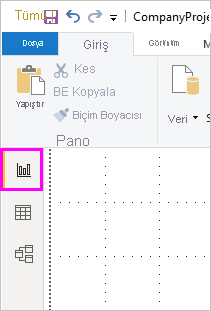
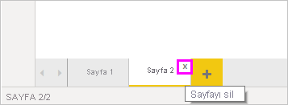
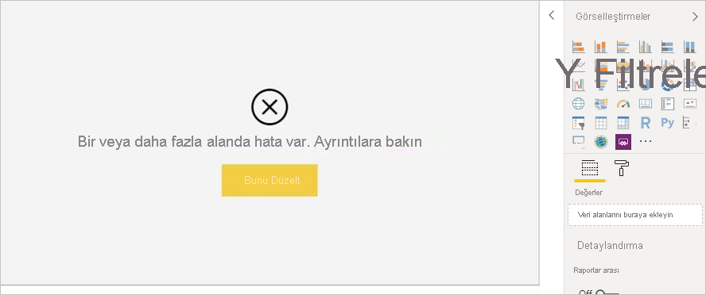
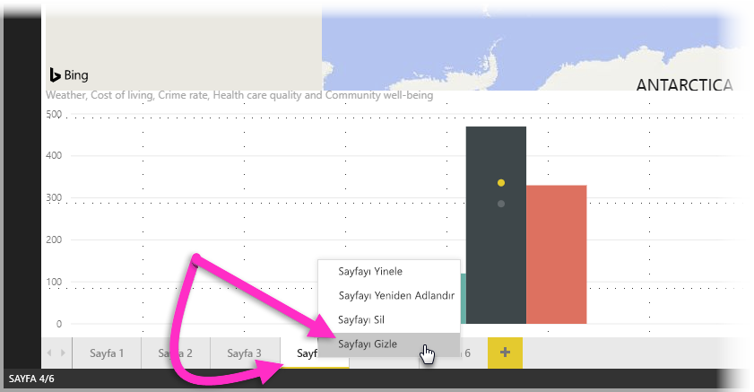
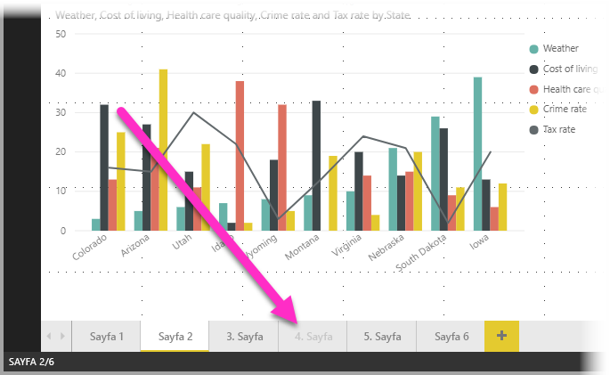

# Power BI Desktop'taki Rapor görünümüyle çalışma

Power BI'a aşinaysanız, verilerinize dinamik bakış açıları ve içgörüler kazandıran raporlar oluşturmanın ne kadar kolay olduğunu biliyorsunuz demektir. Power BI, Power BI Desktop'ta daha gelişmiş özelliklere de sahiptir. Power BI Desktop ile gelişmiş sorgular oluşturun, birden fazla kaynaktaki verileri birleştirin, tablolar arasında ilişkiler oluşturun ve daha fazlasını yapın.

Power BI Desktop, görselleştirmeler içeren istediğiniz sayıda rapor sayfası oluşturabildiğiniz bir *Rapor görünümü* içerir. Power BI Desktop’taki Rapor görünümü, *Power BI hizmetindeki* raporun düzenleme görünümüne benzer bir tasarım deneyimi sağlar. Görselleştirmeleri taşıma, kopyalayıp yapıştırma ve birleştirme gibi işlemler gerçekleştirebilirsiniz.

Aralarındaki fark şudur: Power BI Desktop'ı kullanırken sorgularla çalışabilir ve verilerinizin raporlarınızdaki en etkileyici öngörüleri desteklediğinden emin olmak için verilerinizi modelleyebilirsiniz. Ardından, Power BI Desktop dosyanızı dilediğiniz yere (ister yerel sürücünüze ister buluta) kaydedebilirsiniz.

## Şimdi bir göz atalım!

Power BI Desktop'a ilk veri yüklediğinizde boş bir tuval içeren Rapor görünümüyle karşılaşırsınız.

Sol taraftaki gezinti bölmesinde bulunan simgeleri seçerek **Rapor**, **Veri** ve **İlişki** görünümleri arasında geçiş yapabilirsiniz:

Veri ekledikten sonra tuvaldeki yeni bir görselleştirmeye alanlar ekleyebilirsiniz.

Görselleştirmenin türünü değiştirmek için tuvalde görselleştirmeyi seçtikten sonra **Görselleştirmeler**’de yeni bir tür seçebilirsiniz.

> [!TIP]
> Farklı görselleştirme türleriyle deneme yapmayı ihmal etmeyin. Görselleştirmenizin verilerinizdeki bilgileri açık bir şekilde ifade etmesi önemlidir.

Bir rapor başlangıç olarak en az bir boş sayfa içerir. Sayfalar, tuvalin solundaki gezinti bölmesinde görünür. Bir sayfaya istediğiniz türden görselleştirmeler ekleyebilirsiniz ancak aşırıya kaçmamakta yarar vardır. Bir sayfada çok fazla görselleştirmenin bulunması sayfanın karmaşık görünmesine ve aranan bilgilerin bulunmasının zorlaşmasına neden olur. Raporunuza yeni sayfalar ekleyebilirsiniz. Şeritteki **Yeni Sayfa**’ya tıklayın.

Sayfayı silmek için, Rapor görünümünün altındaki sayfanın sekmesinde bulunan **X** işaretini tıklayın.

> [!NOTE]
> Raporlar ve görselleştirmeler Power BI Desktop'tan bir panoya sabitlenemez. Bunu yapmak için, Power BI sitenizde yayımlamanız gerekir. Daha fazla bilgi için bkz. [Power BI Desktop'tan veri kümesi ve rapor yayımlama](desktop-upload-desktop-files.md).

## Raporlar arasında kopyalama ve yapıştırma

Bir Power BI Desktop raporundaki görseli kolayca alabilir ve başka bir rapora yapıştırabilirsiniz. Rapor görselinizi kopyalamak için Ctrl+C klavye kısayolunu kullanmak yeterli olur. Diğer Power BI Desktop raporunda Ctrl+V tuşlarını kullanarak görseli o rapora yapıştırın. Görselleri birer birer veya toplu olarak seçip kopyalayabilir ve hedef Power BI Desktop raporuna yapıştırabilirsiniz.

Görselleri kopyalayıp yapıştırabilme olanağı birden çok raporu sık sık derleyen ve güncelleştiren kişiler için kullanışlıdır. Dosyalar arasında kopyalarken; biçimlendirme bölmesinde açıkça ayarlanan ayarlar ve biçimlendirme iletilir. Öte yandan bir temayı veya varsayılan ayarları temel alan görsel öğeler, hedef raporun temasına uyacak şekilde otomatik olarak güncelleştirilir. Dolayısıyla görselin tam istediğiniz gibi biçimlendirilmesini ve görünmesini sağladığınızda, o görseli kopyalayıp yeni rapora yapıştırabilir ve tüm biçimlendirme çalışmasını koruyabilirsiniz.

Modelinizdeki alanlar farklıysa, görselde hata gösterilir ve hangi alanların mevcut olmadığına ilişkin bir uyarı görürsünüz. Hata, modelde görselin kullandığı bir alanı sildiğinizde karşılaştığınız deneyime benzer.

Hatayı düzeltmek için, bozuk alanları görseli yapıştırdığınız rapordaki modelin kullanmak istediğiniz alanlarıyla değiştirin. Özel bir görsel kullanıyorsanız bu özel görseli de hedef raporun içine aktarmalısınız.

## Rapor sayfalarını gizleme

Bir rapor oluştururken raporda belirli sayfaları gizleme imkanınız da vardır. Bu yaklaşım, raporun diğer sayfalarında kullanılan tablolar veya destekleyici görseller oluştururken olduğu gibi bir raporda temel veriler veya görseller oluşturmanızın gerektiği, ancak bu sayfaların başkaları tarafından görülmesini istemediğiniz durumlarda da kullanışlı olabilir. Bir rapor sayfası oluşturup yayımlamak istediğiniz rapordan gizli tutmak isteyebileceğiniz durumlar için başka birçok yaratıcı neden bulunabilir.

Bir rapor sayfasını gizlemek kolaydır. Basitçe rapor sayfasının sekmesine sağ tıklayın ve açılan menüden **Gizle**’yi seçin.

Rapor sayfası gizleme konusunda dikkat etmeniz gereken bazı noktalar vardır:

* Gizlenen bir rapor görünümünü başlığı gri olmasına rağmen Power BI Desktop’ta görmeye devam edersiniz. Aşağıdaki resimde, 4. sayfa gizlidir.

    

* Raporu Power BI hizmetinde görüntülerken gizli rapor sayfalarını *göremezsiniz*.

* Rapor sayfalarının gizlenmesi bir güvenlik önlemi *değildir*. Kullanıcıların sayfaya erişimi devam eder ve detaylandırma gibi yöntemler kullanılarak içeriğe erişilebilir.

* Bir sayfa gizliyse, Görünüm modunda görünüm modu gezinti okları gösterilmez.
