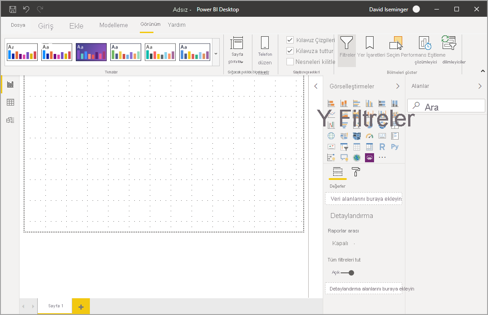
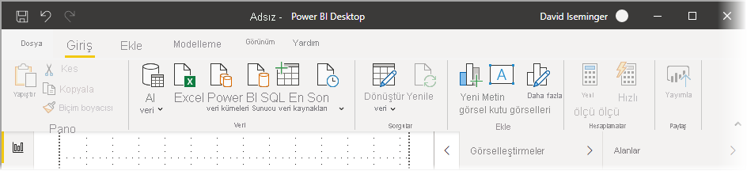
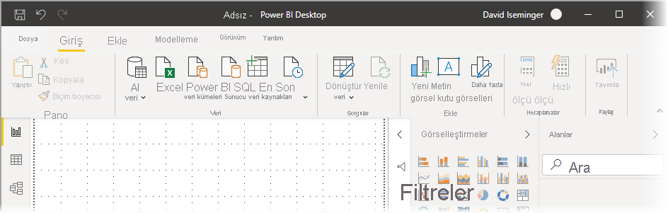
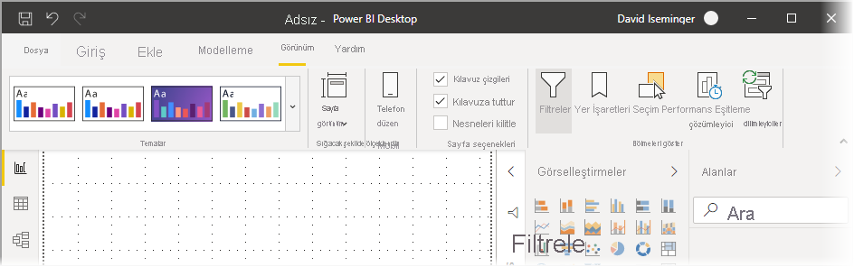
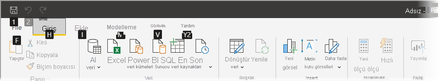
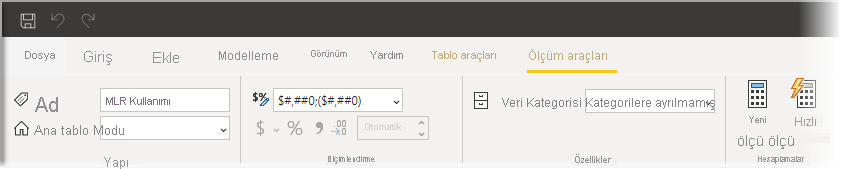

# Power BI Desktop’taki güncelleştirilmiş şeridi kullanma

Power BI Desktop görünümünü Microsoft Office gibi diğer Microsoft ürünleriyle daha uyumlu hale getirmek için şeridini düzeltti.

## Güncelleştirilmiş şeridi etkinleştirme

Güncelleştirilmiş şerit Power BI Desktop’ın Mayıs 2020 sürümünden başlayarak genel kullanıma sunuldu. Mart 2020 güncelleştirmesinden itibaren, güncelleştirilmiş şerit varsayılan olarak etkin olur. 

## Güncelleştirilmiş şeridin özellikleri

Şeridi güncelleştirmenin avantajlarında hem Power BI Desktop'ta hem de diğer Microsoft ürünlerinde deneyimi kolay ve tanıdık hale getirmek amaçlanmıştır. 

Bu avantajlar aşağıdaki kategorilere gruplandırılabilir:

* **Geliştirilmiş genel görünüm ve düzen** - güncelleştirilmiş Power BI Desktop şeridindeki simgeler ve işlevler, Office uygulamalarında bulunan şerit öğelerinin genel görünümüne ve düzenine uyarlanmıştır.

    

* **Sezgisel bir Temalar galerisi** - **Görünüm** şeridinde yer alan Temalar galerisi, PowerPoint temalar galerisinin tanıdık genel görünümüne sahiptir. Şöyle ki, şeritteki resimler renk bileşimleri ve yazı tipleri gibi tema değişikliklerinin raporunuza uygulandığında nasıl görüneceğini gösterir. 

    

* **Görünümünüzü temel alan dinamik şerit içeriği** - Power BI Desktop'ın mevcut şeridinde kullanılabilir olmayan simgeler veya komutlar yalnızca soluk gösterilir ve bu da en iyi deneyimi oluşturmaz. Güncelleştirilmiş şeritte simgeler dinamik olarak görüntülenir ve yerleştirilir, böylelikle bağlama göre size hangi seçeneklerin sağlandığını her zaman bilirsiniz.

* **Daraltıldığında tek satırlık bir şerit size yer kazandırır** - güncelleştirilmiş şeridin bir diğer avantajı da şeridi tek satıra daraltabilmek,bağlamınıza göre şerit öğelerini dinamik olarak görüntülemektir. 

    

* **Gezinmek ve düğme seçmek için tuş ipuçları**: Şeritte gezinmenize yardımcı olması için **Alt + Windows Tuşu** birleşimini kullanarak tuş ipuçlarını etkinleştirebilirsiniz. Etkinleştirdikten sonra klavyenizden gösterilen tuşlara basarak gezinebilirsiniz.

    

* **Özel biçim dizeleri**: Özel biçim dizelerini *Özellikler* bölmesine ek olarak şeritte de ayarlayabilirsiniz. Özelleştirmek istediğiniz ölçüyü veya sütunu seçtikten sonra seçiminize bağlı olarak **Ölçü araçları** veya **Sütun araçları** bağlam sekmesi açılır. İlgili sekmenin biçimlendirme bölümünde özel biçimlendirme dizenizi doğrudan açılan kutuya yazabilirsiniz.

    

* **Erişilebilirlik**: Başlık çubuğu, şerit ve Dosya menüsü tamamen erişilebilir durumdadır. Şerit bölümüne gitmek için CTRL + F6 tuşlarına basın. Sonrasında **Sekme** tuşunu kullanarak üst ve alt çubuklar arasında geçiş yapabilir, ok tuşlarıyla da öğeler arasında gezinebilirsiniz.

Bu görünür değişikliklere ek olarak, güncelleştirilmiş şerit Power BI Desktop'ta ve şeridinde gelecekte şöyle güncelleştirmeler yapmanıza da olanak tanır:

* Şeritte görsel galerisi gibi daha esnek ve sezgisel denetimler oluşturma
* Power BI Desktop'a *koyu* ve *koyu gri* Office temalarını ekleme
* Erişilebilirliği geliştirme

## Sonraki adımlar
Power BI Desktop'ı kullanarak çok çeşitli türlerdeki verilere bağlanabilirsiniz. Veri kaynakları hakkında daha fazla bilgi için aşağıdaki kaynaklara bakın:

* [Power BI Desktop nedir?](../fundamentals/desktop-what-is-desktop.md)
* [Power BI Desktop'ta Veri Kaynakları](../connect-data/desktop-data-sources.md)
* [Power BI Desktop'ta Verileri Şekillendirme ve Birleştirme](../connect-data/desktop-shape-and-combine-data.md)
* [Power BI Desktop'ta Excel çalışma kitaplarına bağlanma](../connect-data/desktop-connect-excel.md)   
* [Verileri doğrudan Power BI Desktop'a girme](../connect-data/desktop-enter-data-directly-into-desktop.md)   
