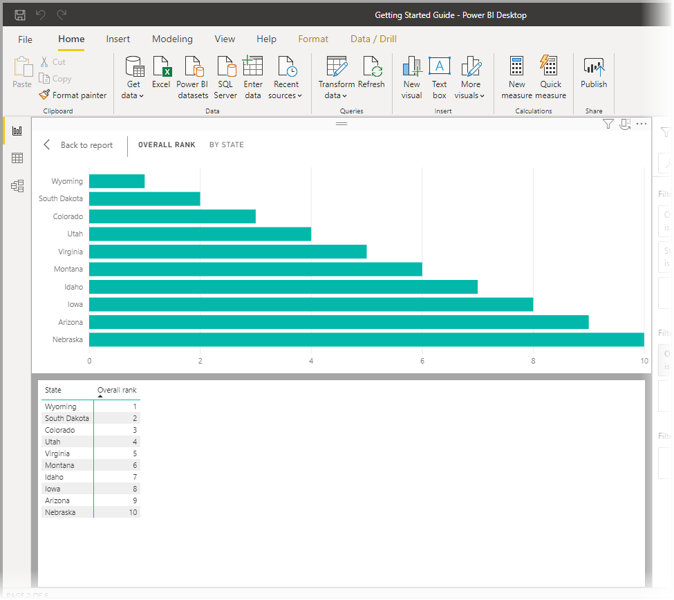
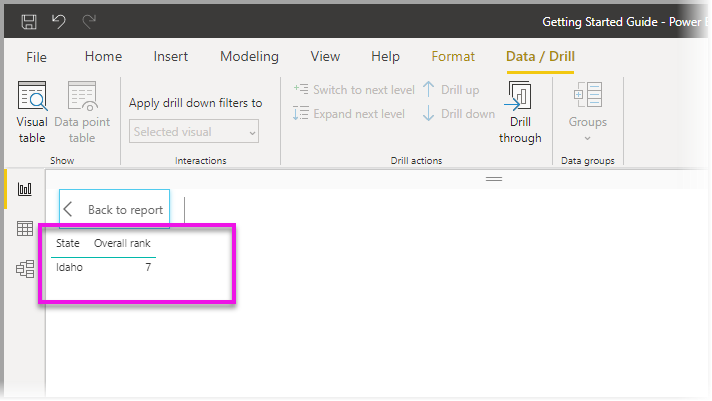

# Power BI Desktop’ta Görsel tablosu ve Veri noktası tablosu özelliklerini kullanma
**Power BI Desktop**'ta bir görselleştirmenin detayına gidebilir ve seçilen görsel için temel alınan verilerin metinsel temsilini veya tek tek veri öğelerini görebilirsiniz. Bu özellikler bazen *geçişli tıklama*, *detaylandırma* veya *ayrıntıları görüntüleme* olarak adlandırılır.

Görseldeki verileri bir tablo olarak görüntülemek için **Görsel tablosu** özelliğini veya tek bir veri noktasını hesaplamak için kullanılan verilerin tablosunu görüntülemek için **Veri noktası tablosu** özelliğini kullanabilirsiniz. 

>[!IMPORTANT]
>**Görsel tablosu** ve **Veri noktası tablosu** yalnızca aşağıdaki görselleştirme türlerini destekler:
>  - Çubuk Grafik
>  - Sütun grafiği
>  - Halka grafik
>  - Kartogram
>  - Huni
>  - Harita
>  - Pasta grafiği
>  - Treemap

## Power BI Desktop’ta Görsel tablosunu kullanma

**Görsel tablosu** bir görselleştirmede temel alınan verileri gösterir. **Görsel tablosu** seçeneği, bir görsel seçildiğinde şeridin **Veri/Detay** sekmesinin **Göster** bölümünde görünür.

Bir görselleştirmeye sağ tıkladıktan sonra görüntülenen menüden **Verileri Göster**’i seçerek veya bir görselleştirmenin sağ üst köşesindeki **Diğer seçenekler** (...) ve sonra **Tablo olarak göster**’i seçerek de verileri görebilirsiniz.

&nbsp;&nbsp;

> [!NOTE]
> Sağ tıklama menüsünün kullanılabilmesi için görseldeki bir veri noktasının üzerine gelmeniz gerekir.

**Görsel tablosu**’nu veya **Veri noktası tablosu**’nu seçtiğinizde Power BI Desktop tuvalinde verilerin hem görsel hem de metin gösterimi görüntülenir. *Yatay görünümde* görsel öğe tuvalin üst yarısında, veriler ise tuvalin alt yarısında görüntülenir. 

Tuvalin sağ üst köşesindeki simgeyi seçerek yatay görünüm ile *dikey görünüm* arasında geçiş yapabilirsiniz.

Rapora geri dönmek için tuvalin sol üst köşesindeki **< Rapora Geri Dön** öğesini seçin.

## Power BI Desktop’ta Veri noktası tablosunu kullanma

Ayrıca bir görselleştirmedeki tek bir veri kaydına odaklanıp bu öğenin temel aldığı verilerin de detayına gidebilirsiniz. **Veri noktası tablosu** özelliğini kullanmak için bir görselleştirme seçin, ardından şeridin **Veri/Detay** sekmesindeki **Görsel Araçlar** bölümünde bulunan **Veri noktası tablosu**’nu seçin ve ardından görselleştirme üzerinde bir veri noktası ya da satır seçin. 

> [!NOTE]
> Şeritteki **Veri noktası tablosu** düğmesinin devre dışı ve gri renkte olması, seçili görselleştirmenin **Veri noktası tablosu** özelliğini desteklemediği anlamına gelir.

Ayrıca bir veri öğesine sağ tıklayarak görüntülenen menüden **Veri noktası tablosu**’nu seçebilirsiniz.

Bir veri öğesi için **Veri noktası tablosu**’nu seçtiğinizde Power BI Desktop tuvali seçili öğeyle ilişkili tüm verileri gösterir. 

Rapora geri dönmek için tuvalin sol üst köşesindeki **< Rapora Geri Dön** öğesini seçin.

> [!NOTE]
>**Veri noktası tablosu** özelliği aşağıdaki sınırlamalara sahiptir:
> - **Veri noktası tablosu** görünümünde verileri değiştiremez ve rapora geri kaydedemezsiniz.
> - Görselinizdeki bir (çok boyutlu) ölçüm grubunda hesaplanmış ölçü kullanılıyorsa **Veri noktası tablosu** özelliğinden yararlanamazsınız.
> - Canlı bir çok boyutlu (MD) modele bağlıyken **Veri noktası tablosu** özelliğini kullanamazsınız.

## Sonraki adımlar
**Power BI Desktop**'ta çok çeşitli rapor biçimlendirme ve veri yönetim özellikleri bulunur. Bazı örnekler için aşağıdaki kaynaklara bakın:

* [Power BI Desktop'ta gruplandırmayı ve gruplamayı kullanma](desktop-grouping-and-binning.md)
* [Power BI Desktop raporlarında kılavuz çizgilerini, kılavuza yaslama işlevini, z düzenini, hizalamayı ve dağıtımı kullanma](desktop-gridlines-snap-to-grid.md)

