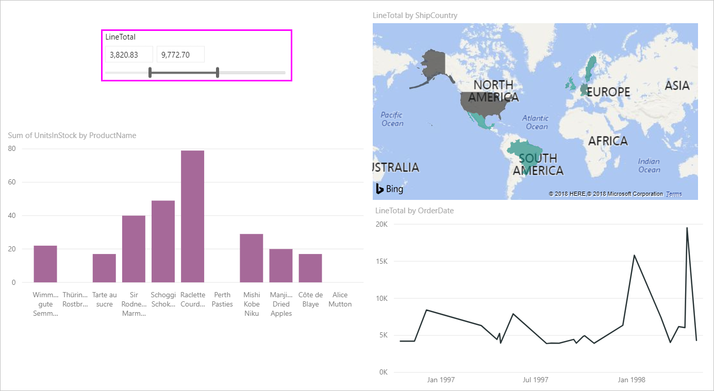
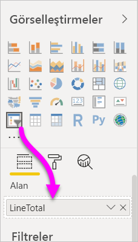
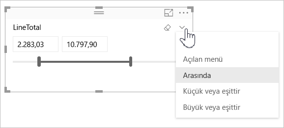
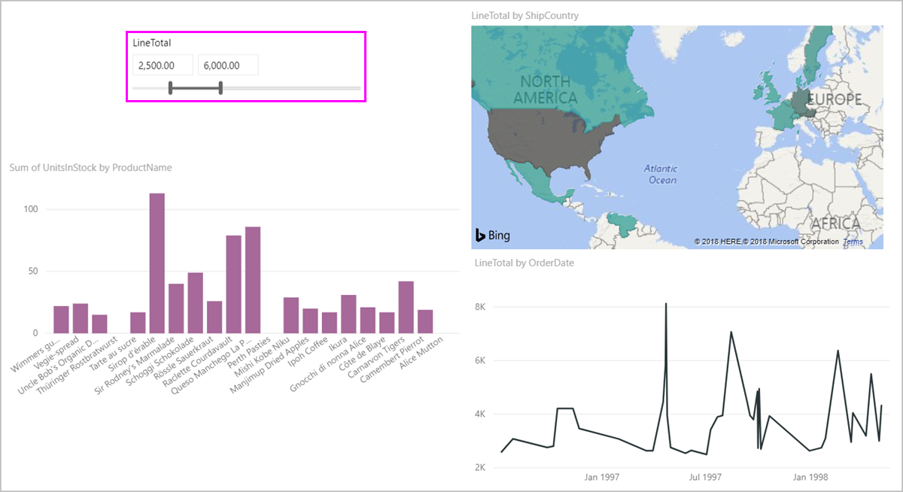
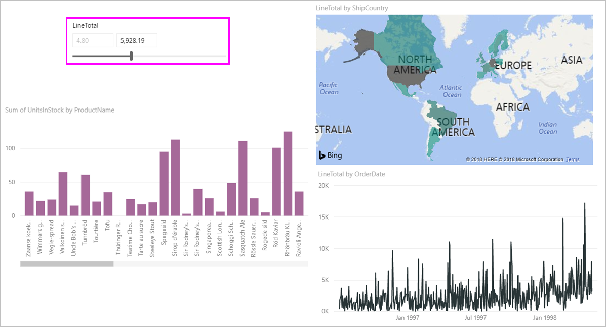
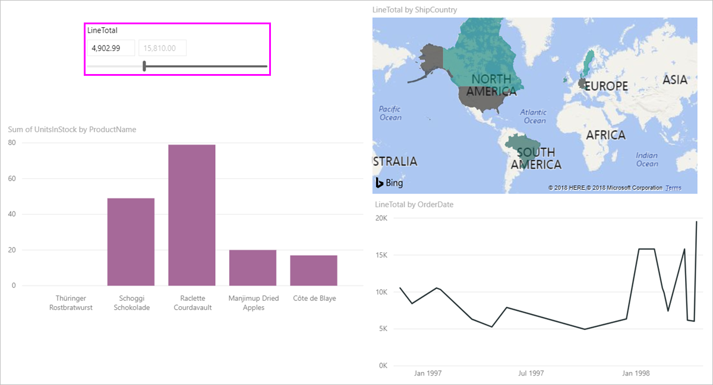

# Power BI’da sayısal aralık dilimleyiciyi kullanma

[!INCLUDE [applies-to](../includes/applies-to.md)] [!INCLUDE [yes-desktop](../includes/yes-desktop.md)] [!INCLUDE [yes-service](../includes/yes-service.md)]

Sayısal aralık dilimleyici ile veri modelinizdeki sayısal sütunlara her türlü filtreyi uygulayabilirsiniz. Sayısal verilerinizi filtrelemeye yönelik üç seçenek vardır: belirli sayılar arasında, belirli bir sayıdan küçük veya ona eşit ya da belirli bir sayıdan büyük veya ona eşit. Bu basit teknik verilerinizi filtrelemenin güçlü bir yoludur.

## Video

Bu videoda sayısal aralık dilimleyici oluşturma işleminde size yol göstereceğiz.

> [!NOTE]
> Bu videoda Power BI Desktop’ın eski bir sürümü kullanılmaktadır.

<iframe width="560" height="315" src="https://www.youtube.com/embed/zIZPA0UrJyA" frameborder="0" allowfullscreen></iframe> 

## Sayısal aralık dilimleyici ekleme

Sayısal aralık dilimleyiciyi aynı diğer dilimleyiciler gibi kullanabilirsiniz. Tek yapmanız gereken raporunuz için bir **Dilimleyici** görseli oluşturup **Alan** değeri olarak da bir sayısal değer seçmektir. Aşağıdaki görüntüde **LineTotal** alanını seçtik.

Sayısal aralık dilimleyicinin sağ üst köşesindeki aşağı oku seçtiğinizde bir menü açılır.

Sayısal aralık için aşağıdaki üç seçeneği kullanabilirsiniz:

* **Arasında**
* **Küçük veya eşittir**
* **Büyük veya eşittir**

Menüden **Arasında** seçeneğini kullandığınızda kaydırıcı görüntülenir. Kaydırıcıyı kullanarak ilgili sayılar arasında kalan sayısal değerleri seçebilirsiniz. Bazı durumlarda kaydırıcı çubuğunun hareket hassaslığı tam olarak istenen sayıya gelmeyi zorlaştırır. Ayrıca kaydırıcıyı kullanabilir ve istediğiniz değerleri yazmak için iki kutudan birini seçebilirsiniz. Belirli sayılara göre dilimlemek istediğiniz bu seçenek kullanışlıdır.

Aşağıdaki resimde rapor sayfası 2500,00 ile 6000,00 arasındaki **LineTotal** değerlerini gösterecek şekilde filtrelenmiştir.

**Küçük veya eşittir**'i seçtiğinizde kaydırıcı çubuğun sol tarafındaki tutamaç (düşük değer) kaybolur ve kaydırıcı çubuğun yalnızca üst sınırını ayarlayabilirsiniz. Aşağıdaki görüntüde kaydırıcı çubuğun en yüksek değerini 5928,19 değerine ayarladık.

Son olarak, **Büyüktür veya eşittir**'i seçerseniz sağ (yüksek değerli) kaydırıcı çubuğu tutamacı görüntüden kaldırılır. Bundan sonra aşağıdaki resimde görüldüğü gibi en düşük değeri ayarlayabilirsiniz. Bu durumda yalnızca **LineTotal** değeri 4902,99 değerine eşit veya ondan büyük olan öğeler rapor sayfasındaki görsellerde görüntülenir.

## Sayısal aralık dilimleyicide tam sayılara yaslama

Temel alınan alanın veri türü *Tam Sayı* ise sayısal aralık dilimleyici tam sayılara yaslanır. Bu özellik dilimleyicinizin tam sayılara düzgün bir şekilde hizalanmasına olanak tanır. *Ondalık Sayı* alanları, ondalık değerler girmenizi veya seçmenizi sağlar. Metin kutusunda ayarlanan biçimlendirme alanın biçimlendirme kümesiyle eşleşir, ancak isterseniz daha hassas sayılar girebilir veya seçebilirsiniz.

## Tarih aralığı dilimleyicisiyle biçimlendirmeyi görüntüleme

Bir veri aralığını görüntülemek veya ayarlamak için dilimleyici kullandığınızda, tarihler *Kısa Tarih* biçiminde görüntülenir. Tarihi biçimi kullanıcının tarayıcı veya işletim sistemi yerel ayarı tarafından belirlenir. Bundan dolayı, temel verilerin veya modelin veri türü ayarları ne olursa olsun görüntü biçimi o olacaktır.

Örneğin temel veri türünüz uzun veri biçiminde olabilir. Bu durumda *g AAAA yyyy, gggg* gibi bir tarih biçimi diğer görsellerde veya durumlarda tarihi *14 Mart 2001, Çarşamba* olarak biçimlendirebilir. Ama tarihi aralığı dilimleyicisinde bu tarih dilimleyicide *14/03/2001* olarak biçimlendirilir.

Dilimleyicide Kısa Tarih biçiminin görüntülenmesi, dilimleyicinin içinde dize uzunluğunun tutarlı ve kısa tutulmasını sağlar.

## Sınırlamalar ve önemli noktalar

Sayısal aralık dilimleyici için sınırlamalar ve önemli noktalar aşağıda belirtilmiştir:

* Sayısal aralık dilimleyici verilerdeki temel alınan satırları filtreler, toplanmış değerlere filtre uygulamaz. Örneğin bir *Satış Tutarı* alanı kullandığınızı varsayalım. Dilimleyici her işlemi görselin her veri noktası için satış tutarı toplamı temelinde değil satış tutarı temelinde filtreler.
* Bu özellik şu an için ölçülerle birlikte çalışmamaktadır.
* Sayısal dilimleyiciye, temel alınan sütundaki değer aralığının dışında olsa dahi istediğiniz sayı türünü girebilirsiniz. Bu seçenek, verilerin ileride değişme ihtimali olduğunu biliyorsanız filtreleri buna göre ayarlamanızı sağlar.
