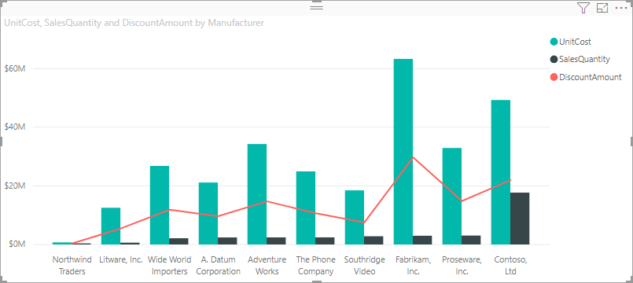
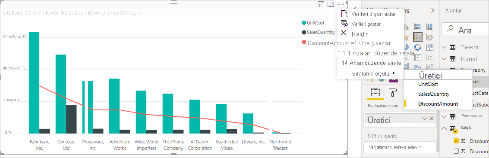
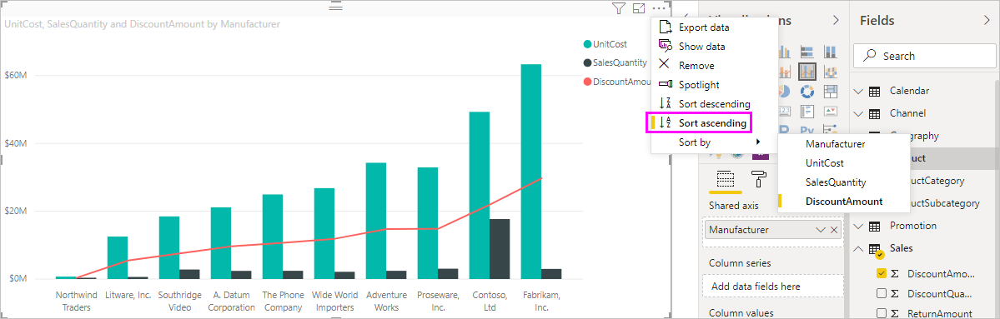
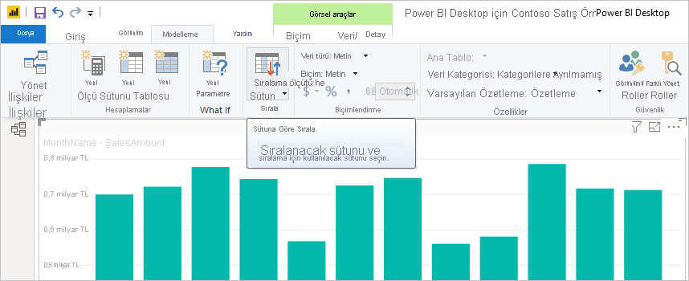
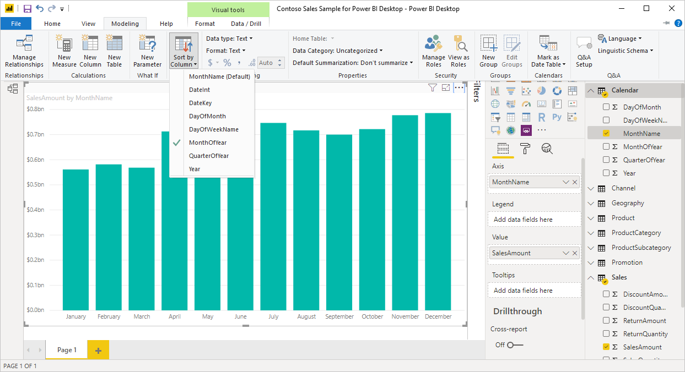

# Power BI Desktop'ta sütuna göre sıralama
Power BI Desktop uygulamasında ve Power BI hizmetinde farklı veri alanlarına göre sıralayarak bir görselin görüntülenme şeklini değiştirebilirsiniz. Görseli sıralama ölçütünü değiştirerek iletmek istediğiniz bilgileri vurgulayabilir ve görselin bu eğilimi yansıtmasını (veya vurgulamasını) sağlayabilirsiniz.

İster sayısal veriler (satış rakamları gibi) ister metin verileri (eyalet adları gibi) kullanıyor olun, görselleştirmelerinizi sıralayabilir ve istediğiniz gibi görünmelerini sağlayabilirsiniz. Power BI, sıralama için kullanabileceğiniz birçok seçenek ve hızlı menüler sunmaktadır. Herhangi bir görseli sıralamak için **Diğer seçenekler** (...) menüsünü seçin, **Sıralama ölçütü**'nü seçin ve ardından sıralama için kullanmak istediğiniz alanı seçin.

## Sıralama örneği
Şimdi daha ayrıntılı bir örneği ele alalım ve Power BI Desktop'ta nasıl çalıştığına bakalım.

Aşağıdaki görselleştirmede üretici adına göre maliyetler, miktarlar ve tutarlar gösterilmiştir. Daha ayrıntılı sıralama yapmadan önce görselleştirme aşağıdaki şekilde görünür:

Görsel şu anda **SalesQuantity** sütununa göre sıralanmış durumda. Sıralama sütununu belirlemek için artan çubukların rengini açıklamayla eşleştirebilirsiniz ancak bunun daha iyi bir yolu da vardır. Bu işlemi (...) simgesini seçerek erişebileceğiniz **Diğer seçenekler** menüsünden de yapabilirsiniz.

Sıralama seçenekleri şu şekildedir:

* Geçerli sıralama alanı **SalesQuantity**'dir ve bu nedenle **SalesQuantity** koyu renkle yazılmıştır ve sarı bir çubuk eklenmiştir. 

* Geçerli sıralama yönü artan düzendir ve bu nedenle **Artan düzende sırala** koyu renkle yazılmıştır ve sarı bir çubuk eklenmiştir.

Sonraki iki bölümde sıralama alanına ve sıralama yönüne bakacağız.

## Sıralama için kullanılacak sütunu seçme
**Diğer seçenekler** menüsündeki **SalesQuantity** seçeneğinin yanında bulunan ve görselin **SalesQuantity** sütununa göre sıralandığını gösteren sarı çubuğu fark ettiniz. Başka bir sütuna göre sıralamak kolaydır. Üç nokta (...) simgesini seçerek **Diğer seçenekler** menüsünü açın, **Sıralama ölçütü**'nü seçin ve farklı bir sütun belirleyin.

Aşağıdaki görüntüde sıralama sütunu olarak **DiscountAmount** sütununu seçtik. Bu sütun, görselde çubuk olarak değil çizgi olarak görünüyor. 

Görselin nasıl değiştiğine dikkat edin. Değerler en yüksek **DiscountAmount** değerine sahip olan Fabrikam Inc. girişinden en düşük değere sahip olan Northwind Traders girişine doğru sıralanıyor. 

Peki azalan yerine artan düzende sıralamak istiyorsak ne yapmamız gerekir? Bunun ne kadar kolay olduğunu bir sonraki bölümde görebilirsiniz.

## Sıralama düzenini seçme
Yukarıdaki görüntüde **Diğer seçenekler** menüsüne daha yakından baktığınızda **Azalan düzende sırala** ifadesinin koyu renkle yazıldığını ve önünde bir sarı çubuk olduğunu görebilirsiniz.

**Azalan düzende sırala** seçildiğinde görsel seçilen sütundaki en büyük değerden en küçük değere göre sıralama gerçekleştirir. Bunu değiştirmek mi istiyorsunuz? Sorun değil, **Artan düzende sırala**'yı seçtiğinizde seçilen sütunun sıralama düzeni küçükten büyüğe doğru olacak şekilde değişir.

**DiscountAmount** sıralaması değiştikten sonra elde edilen görsel aşağıdaki gibi olacaktır. Northwind Traders şirketinin şu anda listedeki ilk üretici, Fabrikam Inc. şirketinin ise son üretici (önceki sıralamanın tersi) olduğuna dikkat edin.

Görselde yer alan herhangi bir sütuna göre sıralama yapabilirsiniz. Sıralama sütunu olarak, **SalesQuantity**'yi kolayca seçerek en çok satışı yapan üreticileri ilk önce gösterebilir ve ilgili üreticiye nasıl uygulandıklarına bakılmaksızın görseldeki diğer sütunları tutabilirsiniz. Bu ayarların uygulandığı görseli aşağıda görebilirsiniz:

## Sütuna Göre Sırala düğmesiyle sıralama
Verilerinizi sıralamak için kullanabileceğiniz bir diğer yöntem de **Modelleme** şeridindeki **Sütuna Göre Sırala** düğmesidir.

Bu sıralama yaklaşımını kullanmak için ilk olarak **Alanlar** bölmesinden sıralamak istediğiniz sütunu (alan) seçmeniz ve ardından **Modelleme** > **Sütuna Göre Sırala**'yı seçerek görselinizi sıralamanız gerekir. Sütun seçmezseniz **Sütuna Göre Sırala** düğmesi devre dışı olur.

Sık kullanılan örneklerden birine göz atalım. Yılın aylarına ait verileriniz var ve bunları kronolojik olarak sıralamak istiyorsunuz. Aşağıdaki adımlarda bunu nasıl yapacağınız gösterilmektedir:

1. Görselin seçili olduğuna ancak **Alanlar** bölmesinde bir sütun seçimi yapılmadığı için **Sütuna Göre Sırala** düğmesinin devre dışı (gri renkte) olduğuna dikkat edin.
   
   

2. Sıralamada kullanmak istediğimiz sütunu **Alanlar** bölmesinden seçtikten sonra **Sütuna Göre Sırala** düğmesi etkin hale gelir.
   
   
3. Görsel seçili durumdayken **MonthOfYear** sütununu (varsayılan **MonthName** sütunu yerine) seçtiğimizde görsel istediğimiz şekilde yılın aylarına göre sıralanır.
   
   

<!---
This functionality is no longer active. Jan 2020

## Getting back to default column for sorting
You can sort by any column you'd like, but there may be times when you want the visual to return to its default sorting column. No problem. For a visual that has a sort column selected, open the **More options** menu and select that column again, and the visualization returns to its default sort column.

For example, here's our previous chart:

When we go back to the menu and select **SalesQuantity** again, the visual defaults to being ordered alphabetically by **Manufacturer**, as shown in the following image.

With so many options for sorting your visuals, creating just the chart or image you want is easy.
--->

## Sonraki adımlar

Aşağıdaki makaleler de ilginizi çekebilir:

* [Power BI Desktop'ta çapraz rapor detaylandırma özelliğini kullanma](desktop-cross-report-drill-through.md)
* [Power BI'da dilimleyiciler](../visuals/power-bi-visualization-slicers.md)
