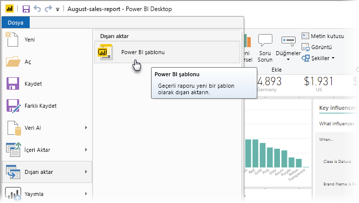
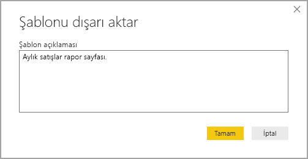
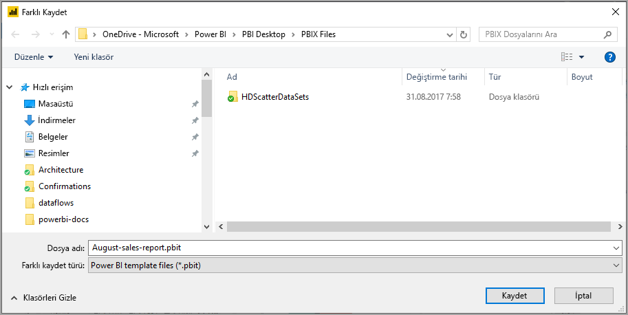
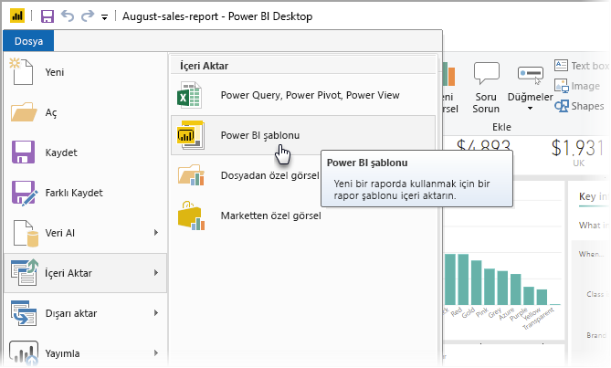
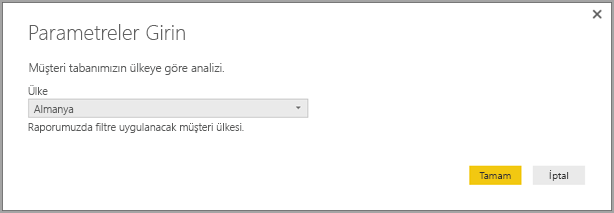
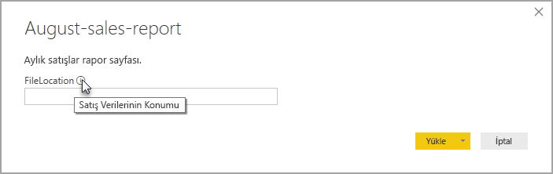

# Power BI Desktop için rapor şablonu oluşturma

**Power BI Desktop** ile kuruluşunuz genelinde içgörüler paylaşan etkileyici raporlar oluşturabilirsiniz. Power BI Desktop **şablonları** ile siz ve kuruluşunuzdaki diğer kullanıcıların, yeni raporun düzeni, veri modeli ve sorgular için başlangıç noktası olarak kullanabileceği, mevcut şablonu temel alan bir rapor oluşturarak çalışmanızı kolaylaştırabilirsiniz. **Power BI Desktop**’taki şablonlar hızlı bir başlangıç yapmanıza ve rapor oluşturma işlemini standart hale getirmenize yardımcı olur.

## Şablon oluşturma

Power BI rapor şablonları, oluşturuldukları rapordan aşağıdaki bilgileri içerir:

* Rapor **sayfaları**, görseller ve diğer görsel öğeler
* Şema, ilişkiler, ölçüler ve diğer model tanımı yapıtları dahil olmak üzere **veri modeli tanımı**
* Sorgular, Sorgu Parametreleri ve diğer sorgu öğeleri gibi tüm **sorgu tanımları**

Rapor verileri şablonlara *dahil edilmez*. 

Rapor şablonları .PBIT dosyasını kullanır (.PBIX uzantısını kullanan Power BI Desktop raporlarıyla karşılaştırın). 

Bir rapor şablonu oluşturmak için, menüden **Dosya > Dışarı Aktar > Power BI şablonu**’nu seçin. Bir şablon açıklaması sağlamanızı isteyen aşağıdaki pencere açılır. Bu örnekte, şablon açıklamamız *Aylık satış raporu şablonudur.*

**Tamam**'ı seçtiğinizde .PBIT şablon dosyasının depolanacağı dosya konumu sorulur.

Böylece, Power BI rapor şablonunuz belirttiğiniz dosya konumunda .PBIT uzantısıyla oluşturulur.

> [!NOTE]
> Power BI rapor şablonu dosyaları genellikle bir Power BI Desktop raporundan çok daha küçüktür, çünkü şablonlar hiçbir veri içermez, yalnızca rapor tanımlarını içerir. 

## Şablonları kullanma

Bir Power BI rapor şablonunu kullanmak için, dosyayı Power BI Desktop’ta açıp kullanmaya başlamanız yeterlidir. Power BI rapor şablonlarını iki şekilde açabilirsiniz:

* Herhangi bir .PBIT dosyasına çift tıklayarak Power BI Desktop’ı otomatik olarak açın ve şablonu yükleyin
* Power BI Desktop içinden **Dosya > İçeri Aktar > Power BI şablonu**’nu seçin

Bir rapor şablonu açtığınızda, şablonun temel aldığı raporda tanımlanmış tüm parametrelerin değerlerini gösteren bir iletişim kutusu görüntülenir. Örneğin, bir raporda müşteriler ülkeye veya bölgeye göre analiz ediliyor ve müşterinin bulunduğu yeri belirtmek için *Ülke* parametresi bulunuyorsa, parametre tanımlanırken belirtilen değer listesinden *Ülke* değeri seçmeniz için bir istem görüntülenir. 

Gerekli parametreler sağlandıktan sonra raporla ilişkili temel verilerin konumu sorulur. Geçerli rapor oluşturucusu bundan sonra kimlik bilgilerine göre verilere bağlanabilir.

Parametreler ve veriler belirtildikten sonra tüm sayfaları, görselleri, veri modeli yapıtlarını ve şablonun temel aldığı raporun parçası olan sorguları içeren bir rapor oluşturulur. 

İşte bu kadar. Power BI Desktop rapor şablonlarının oluşturulması ve kullanılması kolaydır, bu sayede etkileyici düzenleri ve diğer rapor yönlerini kolayca yeniden üretebilir ve başkalarıyla paylaşabilirsiniz.

## Sonraki adımlar
**Sorgu Parametreleri** hakkında bilgi edinmek de ilginizi çekebilir:
* [Power BI Desktop'ta Sorgu Parametrelerini kullanma](https://docs.microsoft.com/power-query/power-query-query-parameters)

Bunun yanı sıra, Power BI Desktop ile yapabileceğiniz birçok şey vardır. Özellikleri hakkında daha fazla bilgi için aşağıdaki kaynaklara bakın:

* [Power BI Desktop nedir?](../fundamentals/desktop-what-is-desktop.md)
* [Power BI Desktop ile Sorgulara Genel Bakış](../transform-model/desktop-query-overview.md)
* [Power BI Desktop'taki Veri Türleri](../connect-data/desktop-data-types.md)
* [Power BI Desktop'ta Verileri Şekillendirme ve Birleştirme](../connect-data/desktop-shape-and-combine-data.md)
* [Power BI Desktop'taki Genel Sorgu Görevleri](../transform-model/desktop-common-query-tasks.md)    
