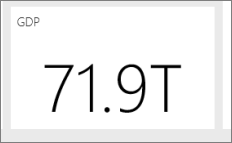

# Power BI Desktop'ta rapor oluşturmaya ilişkin ipuçları ve püf noktaları
Verilerinizden en yüksek verimi almak için zaman zaman biraz yardıma ihtiyacınız olabilir. Microsoft Power BI Desktop'ta *ve* Microsoft Excel 2016 veya Power Query yüklenmiş ve etkinleştirilmiş Excel 2013 Pro-Plus sürümlerinde rapor oluştururken faydalanabileceğiniz ipuçlarını ve püf noktalarını bir araya getirdik. 

## Sorgu Düzenleyicisi'ni kullanmayı öğrenme
Power BI Desktop'taki Sorgu Düzenleyicisi, Excel 2013'teki Power Query eklentisiyle hemen hemen aynı özelliklere sahiptir. Power BI Destek sayfalarındaki faydalı makalelere ek olarak başlarken support.office.com üzerindeki Power Query belgelerini de incelemek isteyebilirsiniz.

Daha fazla bilgi için [Power Query Kaynak Merkezi](https://support.office.com/article/Microsoft-Power-Query-for-Excel-Help-2b433a85-ddfb-420b-9cda-fe0e60b82a94)'ni ziyaret edebilirsiniz.

Ayrıca [Formül Başvurusu](https://support.office.com/Article/Learn-about-Power-Query-formulas-6bc50988-022b-4799-a709-f8aafdee2b2f)'nu da görüntüleyebilirsiniz.

## Sorgu Düzenleyicisi'ndeki veri türleri
Veri yüklemek için Power BI Desktop'taki Sorgu Düzenleyicisi'ni kullandığınızda veri türünü tahmin etmeye çalışırız. Bazen formül kullanıldığında sütunların veri türü ayarları korunmaz. Şu işlemleri gerçekleştirdikten sonra sütunların veri türlerinin doğru olduğundan emin olmanız gerekir:  Sorgu sekmesine ilk veri yükleme işlemi, İlk Satır Üst Bilgi içeriyor, Sütun ekleme, Gruplandırma, Birleştirme, Ekleme ve ilk kez veri yükleme işlemini başlatmadan önce.

Aklınızda tutmanız gereken noktalardan biri, veri kılavuzundaki italik metinlerin veri türünün doğru ayarlanmadığını değil yalnızca Metin olarak kabul edilmediğini göstermesidir.

## Sorgu Düzenleyicisi'ndeki başvuru sorguları
Power BI Desktop’ta Sorgu Düzenleyicisi'nin gezinti panelinde sorgulardan birine sağ tıkladığınızda "Başvuru" seçeneği açılır. Bu seçenek şu nedenlerden dolayı faydalıdır:

* Dosyalarınızı bir sorgu için veri kaynağı olarak kullandığınızda dosyanın mutlak yolu sorguda depolanır. Power BI Desktop dosyasını veya Excel çalışma kitabını paylaştığınızda ya da taşıdığınızda yollar yerine bu dosyayı veya çalışma kitabını yalnızca bir kez güncelleştirerek zaman kazanmış olursunuz.

Tüm sorgular varsayılan olarak veri modeline yüklenir. Bazı sorgular ara adımlardır ve son kullanıcılara yönelik değildir. Bu durum genellikle yukarıda belirtildiği gibi sorgulara başvurma sırasında ortaya çıkar. Gezginde sorguya sağ tıklayıp "Yüklemeyi Etkinleştir" seçeneğini ayarlayarak sorgu yükleme davranışını denetleyebilirsiniz. *Yüklemeyi Etkinleştir* seçeneğinin yanında onay işareti olmadığında da sorgu, sorgu sekmesinde görünür ve diğer sorgularla kullanılabilir. Bu durum özelikle Birleştir, Ekle ve Başvuru dönüşümlerinde kullanışlıdır. Ancak sorgu sonuçları veri modeline yüklenmediği için sorgu rapor alan listenizi veya veri modelinizi doldurmaz. 

## Dağılım grafikleri için bir nokta tanımlayıcısı gerekir
Sıcaklıkların ve ölçülme Zamanlarının yer aldığı basit bir tabloyu ele alalım. Bu tabloyu doğrudan bir dağılım grafiğinde çizerseniz Power BI tüm değerleri tek bir noktaya toplar. Veri noktalarını ayrı bir şekilde göstermek için alan bölümündeki Ayrıntılar demetine bir alan eklemeniz gerekir. Power BI Desktop’ta bunu yapmanın kolay yolu sorgu sekmesindeki "Sütun Ekle" şeridinde "Dizin sütunu ekle" seçeneğini kullanmaktır. 

## Raporunuzdaki başvuru çizgisi
Power BI Desktop’ta başvuru çizgisini tanımlamak için hesaplanmış bir sütun kullanabilirsiniz. Başvuru çizgisi oluşturmak için kullanmak istediğiniz tabloyu ve sütunu belirleyin. Şeritteki "Yeni Sütun" komutunu seçip formül çubuğuna aşağıdaki formülü yazın:

    Target Value = 100

Bu hesaplanmış sütun, kullanıldığı yerden bağımsız olarak 100 değerini döndürür. Yeni sütun Alan Listesinde gösterilir. Hedef Değer hesaplanmış sütununu bir çizgi grafiğe ekleyerek dizinin belirli başvuru çizgisiyle olan ilişkisini gösterebilirsiniz. 

## Başka bir sütuna göre sıralama
Power BI'da grafik eksenleri için ya da dilimleyicide veya filtrede kategori (dize) değeri kullandığınızda varsayılan olarak alfabetik sıralama kullanılır. Haftanın günleri veya aylar gibi girişler nedeniyle bu sıralamayı geçersiz kılmak isterseniz Power BI Desktop uygulamasına farklı bir sütuna göre sıralama yapma komutu verebilirsiniz. Daha fazla bilgi için bkz. [Power BI Desktop'ta sütuna göre sıralama](desktop-sort-by-column.md).

## Bing ipuçlarıyla haritaları daha kolay oluşturma
Power BI, varsayılan harita koordinatlarını sağlamak için Bing ile tümleşir (coğrafi kodlama adlı bir işlem). Bu sayede daha kolay bir şekilde harita oluşturabilirsiniz. Bing, doğru konumu almak için bazı algoritmalar ve ipuçları kullanır ancak sonuçta yapılan bir tahmindir. Doğru coğrafi kodlama ihtimalini artırmak için aşağıdaki ipuçlarından faydalanabilirsiniz:

Harita oluşturduğunuzda genelde ülke, eyalet ve şehir değerlerine önem verirsiniz. Power BI Desktop’ta sütunları coğrafi konuma göre adlandırırsanız Bing'e görüntülemek istediğiniz nesne konusunda yardımcı olmuş olursunuz. Örneğin "California" ve "Washington" gibi ABD'deki eyaletlerin adlarının yer aldığı bir alanınız varsa Bing, "Washington" kelimesi için Washington State yerine Washington, DC konumunu döndürebilir. Sütuna "Eyalet" adını vermeniz coğrafi kodlamayı geliştirecektir. Bu durum "Ülke" ve "Şehir" adlı sütunlar için de geçerlidir. 

Bazı terimler birden fazla ülke/bölge söz konusu olduğunda belirsiz olabilir. Bazı durumlarda bir ülkede/bölgede "eyalet" olarak kabul edilen bir ad başka bir yerde "şehir" veya "semt" olabilir. Birden fazla alanı bir araya getiren sütunlar ekleyip bunları veri konumlarını çizmek üzere kullanarak coğrafi kodlama doğruluğunu artırabilirsiniz. Örnek olarak yalnızca "Wiltshire" yerine "Wiltshire, England" yazarak daha doğru bir coğrafi kodlama sonucuna ulaşabilirsiniz. 

Power BI hizmetinde veya Desktop’ta dilediğiniz zaman enlem ve boylam konumlarını da kullanabilirsiniz. Bunu yaptığınızda ayrıca bir Konum alanı da iletmeniz gerekir. Aksi halde veriler varsayılan olarak toplanır ve enlem ile boylam konumu istediğiniz değeri vermeyebilir.

## Bing'e coğrafi kodlama konusunda yardımcı olmak için coğrafi alanları kategorilere ayırma
Veri alanlarında Veri Kategorisi belirlemek, alanlarda doğru coğrafi kodlamanın yapıldığından emin olmanın başka bir yoludur. Power BI Desktop'ta istediğiniz tabloyu seçin, Gelişmiş şeridine gidin ve Veri Kategorisini Adres, Şehir, Kıta, Ülke/Bölge, Posta Kodu, Eyalet veya İl olarak belirleyin. Bu veri kategorileri, Bing'in verileri doğru bir şekilde kodlamasına yardımcı olur. Daha fazla bilgi edinmek için bkz. [Power BI Desktop'ta verileri kategorilere ayırma](../transform-model/desktop-data-categorization.md).

## Daha belirli konumlarla daha iyi coğrafi kodlama
Bazen veri kategorilerinin ayarlanması bile harita oluşturma için yeterli olmaz. Power BI Desktop'taki Sorgu Düzenleyicisi'ni kullanarak açık adres gibi daha belirli bir konuma yer verebilirsiniz. Özel sütun oluşturmak için Sütun Ekle özelliğini kullanın. Ardından aşağıda belirtilen şekilde istediğiniz konumu oluşturun: 

    = [Field1] & " " & [Field2]

Ardından bu sonuç alanını harita görselleştirmelerinde kullanın. Bu durum özellikle veri kümelerinde sık kullanılan gönderim adresi alanlarından açık adresleri oluşturmak için kullanışlıdır. Bu kısaltma özelliğinin yalnızca metin alanlarında çalıştığını unutmayın. Gerekirse açık adresi adres oluşturmak üzere kullanmadan metin veri türüne dönüştürün.

## Sorgu aşamasındaki histogramlar
Power BI Desktop’ta histogram oluşturmak için kullanabileceğiniz birçok yöntem vardır. En kolayıyla başlayıp ilerleyeceğiz:

En Basit Histogramlar: Histogram oluşturmak istediğiniz alanın hangi sorguda bulunduğunu belirleyin. Sorgunun yeni bir sorgu oluşturması için "Başvuru" seçeneğini kullanın ve yeni sorguyu "FieldName Histogram" olarak adlandırın. "Dönüştür" şeridindeki "Gruplandır" seçeneğini kullanın ve "Satırları Say" toplamını seçin. Elde edilecek olan toplama sütunu için, veri türünün bir sayı olduğundan emin olun. Daha sonra bu verileri raporlar sayfasında görselleştirin. Bu hızlı ve kolay bir yol olsa da çok sayıda veri noktanız olması halinde pek kullanışlı değildir ve görsellerde fırça kullanılmasına izin vermez.

Histogram oluşturmak için demet tanımlama: Histogram oluşturmak istediğiniz alanın hangi sorguda bulunduğunu belirleyin. Sorgunun yeni bir sorgu oluşturması için "Başvuru" seçeneğini kullanın ve yeni sorguyu "FieldName" olarak adlandırın. Ardından, demetleri bir kural ile tanımlayın. Sütun Ekle şeridindeki Özel Sütun Ekle seçeneğini kullanarak özel bir kural oluşturun. Basit bir demet oluşturma kuralı şuna benzeyebilir:

    if([FieldName] \< 2) then "\<2 min" else
    if([FieldName] \< 5) then "\<5 min" else
    if([FieldName] \< 10) then "\<10 min" else
    if([FieldName] \< 30) then "\<30 min" else
    "longer")

Elde edilecek olan toplama sütunu için, veri türünün bir sayı olduğundan emin olun. Artık, En Basit Histogram bölümünde açıklanan gruplandırma yöntemini kullanarak histogramı oluşturabilirsiniz. Bu seçenek daha fazla veri noktasıyla birlikte kullanılabilir ancak fırça kullanımına bunda da izin verilmez.

Fırça kullanımını destekleyen bir histogram tanımlama: Fırça özelliği, görseller bağlantılıyken kullanıcı bir görselde bir veri noktasını seçtiğinde rapor sayfasında bulunan diğer görsellerin, seçilen veri noktası ile ilgili veri noktalarını vurgulaması veya filtrelemesi için kullanılır. Sorgu süresince verileri düzenlediğimiz için tablolar arasında bir ilişki oluşturmamız ve histogramda bulunan demetin hangi ayrıntı öğesiyle ilgili olduğundan (veya tam tersi) emin olmamız gerekir.

Histogram oluşturmak istediğiniz alanın bulunduğu sorguda "Başvuru" seçeneğini kullanarak işleme başlayın. Yeni sorguyu "Buckets" olarak adlandırın. Bu örnek için özgün sorguyu "Details" olarak adlandıralım. Ardından, histogram için demet olarak kullanacağınız sütun dışındaki tüm sütunları kaldırın. Şimdi, sorguda bulunan ve sütunu seçtiğinizde sağ tıklama menüsünde bulunan "Yinelenenleri Kaldır" özelliğini kullanın. Böylece sütunda yalnızca benzersiz değerler kalır. Elinizde ondalık sayılar varsa yönetebileceğiniz kadar demeti almak için bir histogram oluşturmak üzere ilk olarak demet tanımlama ipucunu kullanabilirsiniz. Şimdi, sorgu önizlemesinde gösterilen verileri kontrol edin. Boş veya null değerler görürseniz ilişki oluşturmadan önce bunları düzeltmeniz gerekir. Bkz. "Verilerinizde null veya boş değerler varsa ilişki oluşturma". Sıralama gereksinimi nedeniyle, bu yaklaşımın kullanılması sorunlara neden olabilir. Demetlerin doğru şekilde sıralanması için bkz. "Sıralama düzeni: kategorilerin istediğiniz düzende görünmesini sağlama". 

>[!NOTE]
>Herhangi bir görsel oluşturulmadan önce sıralama düzeni göz önünde bulundurulmalıdır. 

Bu işlemin bir sonraki adımında, demetler sütunundaki "Buckets" ve "Details" sorguları arasında bir ilişki tanımlayacağız. Power BI Desktop'ta, şeritte bulunan **İlişkileri Yönet**'e tıklayın. Buckets'ın sol tabloda, Details'in ise sağ tabloda olduğu bir ilişki oluşturun ve histogram için kullandığınız alanı seçin. 

Son adımda, histogramı oluşturacağız. "Buckets" tablosundaki Bucket alanını sürükleyin. Elde edilen sütun grafiğinden, varsayılan alanı kaldırın. Şimdi, "Details" tablosundaki histogram alanını aynı görsele sürükleyin. Alan kutusunda, varsayılan toplamı Sayı olarak değiştirin. Histogramınız oluşturulur. Details tablosundan ağaç haritası gibi başka bir görsel oluşturursanız ağaç haritasındaki bir veri noktasını seçerek histogramın, tüm veri kümesine ilişkin eğilime göre, seçili veri noktasına ait histogramı vurgulamasını ve göstermesini sağlayın.

## Histogramlar
Power BI Desktop’ta histogram tanımlamak için hesaplanan alanları kullanabilirsiniz. Histogram oluşturmak için kullanmak istediğiniz tabloyu ve sütunu belirleyin. Hesaplama alanına aşağıdaki formülü yazın:

> Frequency:=COUNTROWS(\<Column Name\>)
> 
> 

Değişikliklerinizi kaydedip rapora dönün. \<Column Name\> ve Frequency değerlerini bir tabloya ekleyip çubuk grafiğe dönüştürün. \<Column Name\> değerinin x ekseninde, hesaplanan alan Frequency öğesinin ise y ekseninde olduğundan emin olun.

## Power BI Desktop'ta ilişki oluşturmaya yönelik ipuçları ve püf noktaları
Birden fazla kaynaktan ayrıntı veri kümelerini yüklerken null değerler, boş değerler veya yinelenen değerler gibi sorunlar ilişki oluşturmanıza engel olabilir. 

Bir örneğe göz atalım: 

Aşağıdaki şemalara sahip olan etkin müşteri destek taleplerini içeren veri kümelerini ve iş öğelerini içeren başka bir veri kümesini yükleyecek olursak:

> CustomerIncidents: {IncidentID, CustomerName, IssueName, OpenedDate, Status} WorkItems: {WorkItemID, IncidentID, WorkItemName, OpenedDate, Status, CustomerName } 
> 
> 

Belirli bir CustomerName değeriyle ilişkili olan tüm olayları ve iş öğelerini takip etmek istediğimizde bu iki veri kümesi arasında basit bir ilişki oluşturamadığımızı görürüz. Bazı WorkItems öğeleri bir CustomerName ile ilişkili olmadığından alan boş veya NULL olabilir. Belirli bir CustomerName öğesine ait birden fazla WorkItems ve CustomerIncidents kaydı olabilir. 

### Verilerinizde null veya boş değerler olduğunda Power BI Desktop’ta ilişki oluşturma
Genellikle veri kümelerinde null veya boş değerler bulunan sütunlar mevcuttur. Bu sütunlar ilişki oluşturma sırasında sorunlara neden olabilir. Bu sorunları çözmek için kullanabileceğiniz iki temel yöntem vardır. Null veya boş değer içeren satırları kaldırabilirsiniz. Bunu yapmak için sorgu sekmesindeki filtreleme özelliğini kullanabilir veya sorgu birleştirme sırasında "yalnızca eşleşen satırları tut" seçeneğini belirleyebilirsiniz. Alternatif olarak null veya boş değerleri ilişkilerde kullanılabilen "NULL" ve "(Blank)" gibi değerlerle değiştirebilirsiniz. Burada kesin bir yaklaşım yoktur. Satırların sorgu aşamasında filtrelenmesi satırları kaldırır ve özet istatistiklerini ve hesaplamaları etkileyebilir. İkinci yaklaşımda veri satırları korunur ancak arasında ilişki olmayan satırlar modelde ilişkili gösterilerek yanlış hesaplamalara neden olabilir. İkinci çözümü kullanmaya karar verirseniz doğru sonuçları aldığınızdan emin olmak için Görünüm/Grafik aşamasında uygun filtreleri kullandığınızdan emin olun. En önemlisi de tutulan/kaldırılan satırları değerlendirin ve bu satırların analiz üzerindeki etkisinin farkında olun. 

### Verilerinizde yinelenen değerler olduğunda Power BI Desktop’ta ilişki oluşturma
Birden fazla kaynaktan ayrıntılı veri kümelerini yüklerken yinelenen veri değerleri ilişki oluşturmanıza engel olabilir. Bu sorunu çözmek için iki veri kümesindeki benzersiz değerleri içeren bir boyut tablosu oluşturabilirsiniz. 

Bir örneğe göz atalım: 

Aşağıdaki şemalara sahip olan etkin müşteri destek taleplerini içeren veri kümelerini ve iş öğelerini içeren başka bir veri kümesini yükleyecek olursak:

> CustomerInicdents: {IncidentID, CustomerName, IssueName, OpenedDate, Status} WorkItems: {WorkItemID, IncidentID, WorkItemName, OpenedDate, Status, CustomerName } 
> 
> 

Belirli bir CustomerName değeriyle ilişkili olan tüm olayları ve iş öğelerini takip etmek istediğimizde bu iki veri kümesi arasında basit bir ilişki oluşturamadığımızı görürüz. Bazı WorkItems öğeleri bir CustomerName ile ilişkili olmadığından alan boş veya NULL olabilir. CustomerNames tablosunda boş veya null değerleri olduğunda da ilişki oluşturamayabilirsiniz. Bkz. Verilerimde null veya boş değerler olduğunda ilişki oluşturma. Tek bir CustomerName öğesine ait birden fazla WorkItems ve CustomerIncidents öğesi olabilir. 

Böyle bir durumda ilişki oluşturmak için iki veri kümesindeki tüm CustomerNames değerlerini içeren bir mantıksal veri kümesi oluşturmamız gerekir. Sorgu sekmesinde aşağıdaki adımları izleyerek mantıksal veri kümesi oluşturabilirsiniz:

1. İki sorgunun da birer kopyasını alın, birincisine **Temp** ikincisine ise **CustomerNames** adını verin.
2. Sorgularda CustomerName sütunu *dışındaki* tüm sütunları kaldırın
3. Sorgularda **Yineleneni Kaldır** seçeneğini kullanın.
4. **CustomerNames** sorgusunda şeritteki **Ekle**'yi ve ardından **Temp** sorgusunu seçin.
5. **CustomerNames** sorgusunda **Yinelenenleri Kaldır**'ı seçin.

Artık CustomerIncidents ve WorkItems arasında ilişki kurmak için kullanabileceğiniz ve ikisindeki değerleri de içeren bir boyut tablonuz vardır. 

## Sorgu Düzenleyicisi'ne hızlı bir giriş yapmak için kullanabileceğiniz desenler
Sorgu Düzenleyicisi, verileri şekillendirip temizleyerek görselleştirmeye veya modellemeye uygun hale getiren oldukça güçlü bir araçtır. Bilmeniz gereken birkaç desen vardır.

### Bir sonuç hesaplandıktan sonra geçici sütunlar silinebilir
Power BI Desktop’ta genelde birden fazla sütundaki verileri yeni bir sütuna dönüştüren hesaplamalar oluşturmanız gerekir. Bu durum karmaşık olabilir. Bu sorunu çözmenin yollarından biri, işlemi adımlara ayırmaktır. Başlangıç sütunlarını çoğaltarak başlayın. Ardından geçici sütunları oluşturun. Daha sonra nihai sonuç için sütunu oluşturun. Son olarak geçici sütunları silerek son veri kümesinin karmaşık olmamasını sağlayabilirsiniz. Buna olanak sağlayan sorgu sekmesindeki adımların sırayla çalıştırılmasıdır. 

### Yineleme veya Başvurma adımlarından sonra sorguları özgün sorguyla birleştirme
Bazen bir veri kümesi için özet istatistikleri hesaplamanız gerekebilir. Bunu yapmanın en kolay yolu, sorguyu sorgu sekmesinden yinelemek veya başvuru yapmaktır. Ardından **Gruplandır** ile özet istatistiklerini hesaplayabilirsiniz. Özet istatistikleri, özgün verilerdeki verileri normalleştirmenizi sağlayarak karşılaştırmaya uygun hale getirmenize imkan tanır. Bu durum özellikle tek değerleri bütünle karşılaştırma açısından kullanışlıdır. Bunu yapmak için özgün sorguya gidip birleştirme seçeneğini belirleyin. Ardından özet istatistikleri sorgusundaki verileri uygun tanımlayıcılara göre birleştirin. Artık verilerinizi analiz etmek üzere normalleştirmeye hazırsınız.

## İlk kez DAX kullanma
DAX, Power BI Desktop'taki hesaplama formülü dilidir. BI analizi için en iyi duruma getirilmiştir. Yalnızca SQL gibi bir sorgu dili kullandıysanız biraz farklı gelebilir. DAX öğrenmek için faydalanabileceğiniz birçok çevrimiçi ve çevrimdışı kaynak mevcuttur. 

[Power BI Desktop’ta DAX Kullanımıyla İlgili Temel Bilgileri öğrenme](../transform-model/desktop-quickstart-learn-dax-basics.md)

[Veri Çözümleme İfadeleri (DAX) Başvurusu](/dax/)

[DAX Resource Center (DAX Kaynak Merkezi)](https://social.technet.microsoft.com/wiki/contents/articles/1088.dax-resource-center.aspx)

## Power BI hizmeti *ve* Power BI Desktop

### "Görsel olarak etkileyici raporlar (ve panolar) oluşturma" başlıklı makaleyi okuyun veya videoyu izleyin
Topluluk üyesi Miguel Myers, hem veri bilimcisi hem de grafik tasarımcısı olarak görev yapmaktadır. 

* [Blogu okuyun](https://powerbi.microsoft.com/blog/how-to-design-visually-stunning-reports/)
* [Web seminerini izleyin](https://community.powerbi.com/t5/Webinars-and-Video-Gallery/5-3-17-Webinar-How-to-Design-Visually-Stunning-Power-BI-Reports/m-p/168204?Is=Website)

### Hedef kitlenizi değerlendirin
Okuyucuların karar almasına yardımcı olacak ana ölçümler neler? Rapor nasıl kullanılır? Tasarım sırasında yapılacak seçimleri etkileyebilecek öğrenilen veya kültürel varsayımlar neler? Hedef kitlenizin başarılı olmasını sağlayacak bilgiler hangileri?

Rapor nerede görüntülenecek? Büyük bir monitörde görüntülenecek panolara daha fazla içerik ekleyebilirsiniz. Okuyucular panoyu tablette görüntüleyecekse daha az sayıda görselleştirme daha okunabilir olacaktır.

### Bir hikaye anlatın ve tek bir ekranla sınırlı tutun
Her rapor sayfası tek bakışta bir olay anlatmalıdır. Sayfalarınızda kaydırma çubuğu kullanılmasını önleyebilir misiniz? Rapor çok karışık veya çok yoğun mu?  Kolay okunup yorumlanacak temel bilgiler dışındakileri kaldırın.

### En önemli bilgiler için en büyük boyutları kullanın
Rapor sayfanızdaki tüm metinler ve görselleştirmeler aynı boyutta olursa kullanıcılarınız önemli olan bilgilere odaklanma konusunda sorun yaşayabilir. Örneğin, kart görselleştirmeleri, önemli sayıları belirgin bir şekilde görüntülemenin iyi bir yoludur:  

### Ancak bağlam sunduğunuzdan emin olun  

Görselleştirmelerinize bağlam eklemek için metin kutuları ve araç ipuçları gibi özellikleri kullanın.

### En önemli bilgileri üst köşeye yerleştirin
Çoğu kişi içeriği yukarıdan aşağıya doğru okuduğu için en yüksek ayrıntıya sahip olan öğeyi en üste yerleştirin ve hedef kitlenizin okuma yönüne göre (soldan sağa, sağdan sola) verileri ayrıntılandırın.

### Verilere uygun görselleştirmeleri kullanın ve okunaklı olacak şekilde biçimlendirin.
Görselleştirmeleri yalnızca farklı görselleştirmeler sergilemiş olmak için kullanmaktan sakının.  Görselleştirmelerin bir resim çizmesi ve hem "okunması" hem de yorumlanması kolay olmalıdır.  Bazı veriler ve görselleştirmeler için basit bir grafik yeterli olacaktır. Ancak bazı veriler için daha karmaşık görselleştirmeler gerekebilir. Okuyucuya yardımcı olmak için başlıklara, etiketlere ve diğer özelleştirmelere yer vermeyi unutmayın.  

* 3B grafikler ve sıfırdan başlamayan grafikler gibi gerçeği çarpıtan grafikleri kullanırken dikkat edin. İnsan beyninin dairesel şekilleri yorumlamakta daha fazla zorlandığını unutmayın. Pasta grafikleri, halka grafikler, ölçekler ve diğer dairesel grafik türleri güzel görünebilir ancak bunların yerine kullanabileceğiniz farklı bir görsel olabilir mi?    
* Eksenlerdeki grafik ölçekleri, grafik boyut sıralamaları ve grafiklerdeki boyut değerlerinde kullanılan renkler konusunda tutarlı olun.    
* Nicel verileri doğru şekilde kodladığınızdan emin olun. Sayıları gösterirken üç veya dört rakamı geçmeyin. Ölçüleri ondalık ayırıcının sol tarafında bir veya iki rakam olacak şekilde görüntüleyin ve bin veya milyon değerlerini kısaltın (3.400.000 yerine 3,4 milyon gibi).    
* Duyarlık ve süre düzeylerini karıştırmaktan kaçının. Zaman dilimlerinin iyi anlaşıldığından emin olun.  Yılın belirli bir ayındaki verileri gösteren filtrelenmiş grafiklerin yanına önceki ayın verilerini içeren bir grafik yerleştirmeyin.    
* Ayrıca, çizgi veya çubuk grafik gibi büyük ve küçük ölçümleri aynı ölçekte karıştırmamaya dikkat edin.  Örneğin, bir ölçeğin milyon, diğerinin ise bin seviyesinde olmaması gerekir.  Bu büyüklükteki bir ölçekte bin seviyesindeki ölçüde gözlemlenen farkları algılamak zor olacaktır.  Karıştırmanız gerekiyorsa, açılır kutu gibi ikinci bir eksen kullanımına izin veren bir görselleştirme seçin.    
* Gerekli olmayan veri etiketleriyle grafiklerinizi karmaşık hale getirmekten kaçının. Çubuk grafiklerdeki değerler, ***yeterince genişse***, genellikle gerçek sayı görüntülenmeden de anlaşılabilir.   
* [Grafiklerin sıralanma şekline](../consumer/end-user-change-sort.md) dikkat edin. En yüksek veya en düşük sayıya dikkat çekmek istiyorsanız ölçüye göre sıralayın. Okuyucuların birden fazla kategori arasından belirli bir kategoriyi hemen bulabilmesini istiyorsanız eksene göre sıralayın.  
* Pasta grafikleri, sekizden az kategori bulunuyorsa idealdir. Yan yana göremediğiniz için pasta grafiğindeki değerleri karşılaştırmak çubuk grafiklerdeki ve sütun grafiklerindeki değerlere kıyasla daha zordur. Pasta grafikleri, parçaları karşılaştırmak yerine parçalarla bütün arasındaki ilişkiyi görmek için kullanılabilir. Ölçek grafikleri, bir hedef bağlamında geçerli durumu görüntülemek için idealdir.    

Görselleştirmelere özgü bilgiler için bkz. [Power BI'daki görselleştirme türleri](../visuals/power-bi-visualization-types-for-reports-and-q-and-a.md).  

### Pano Tasarımındaki En İyi Uygulamalar hakkında daha fazla bilgi edinin
Favori kitaplarımızdan bazıları:

* *Verilerle Hikaye Anlatma*, Cole Nussbaumer Knafic
* *Veri noktaları*, Nathan Yau
* *Gerçek Sanat*, Alberto Cairo
* *Now You See It* (Şimdi Görüyorsunuz), Stephen Few  
* *Envisioning Information* (Bilgileri Görselleştirme), Edward Tufte  
* *Gelişmiş Sunumlar*, Andrew Abela   

## Sonraki adımlar
* [Power BI hizmetinde tasarımcılara yönelik temel kavramlar](../fundamentals/service-basic-concepts.md)
* [Power BI'daki raporlar](../consumer/end-user-reports.md)

Başka bir sorunuz mu var? [Power BI Topluluğu'na başvurun](https://community.powerbi.com/)
