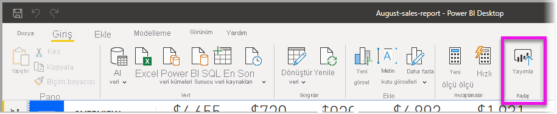
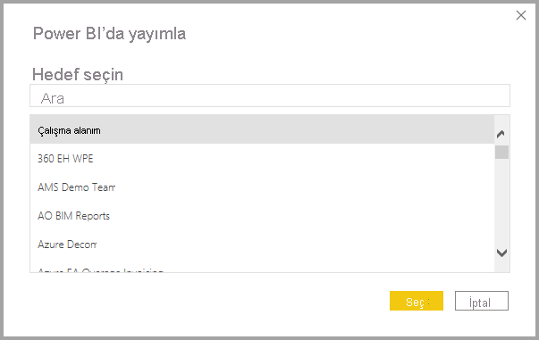
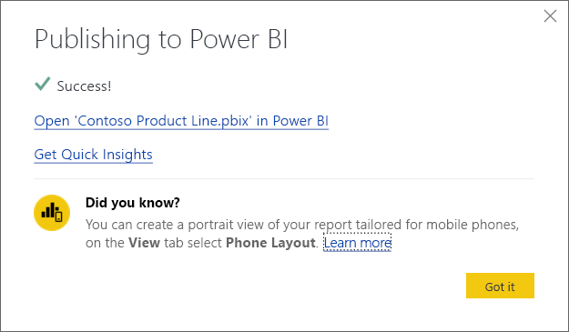
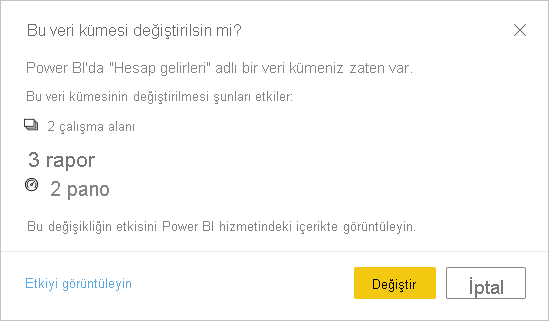

# Power BI Desktop'tan veri kümesi ve rapor yayımlama
Power BI Desktop dosyasını Power BI hizmetine yayımladığınızda, modeldeki verileri Power BI çalışma alanınızda yayımlarsınız. Aynı durum **Rapor** görünümünde oluşturduğunuz raporlar için de geçerlidir. Çalışma Alanı gezgininizde tüm raporları ve aynı adda yeni bir veri kümesi görürsünüz.

Power BI Desktop'tan yayımlamak ile Power BI Desktop dosyasına bağlanmak ve bu dosyayı yüklemek için Power BI'da **Veri Al** seçeneğini kullanmak aynı etkiyi yapar.

> [!NOTE]
> Power BI'da raporda yaptığınız hiçbir değişiklik özgün Power BI Desktop dosyasına geri kaydedilmez. Bu değişiklikler raporlardaki görselleştirmeleri eklemeyi, silmeye veya değiştirmeyi içerir.

## Bir Power BI Desktop veri kümesini ve raporları yayımlamak için
1. Power BI Desktop'ta **Dosya** \> **Yayımla** \> **Power BI'da Yayımla**'yı seçin veya şeritten **Yayımla**'yı seçin.  

   

2. Henüz yapmadıysanız Power BI’da oturum açın.
3. Hedefi seçin. Eylül 2020 sürümünden itibaren, yayımlamak istediğiniz çalışma alanını bulmak için kullanılabilir çalışma alanları listenizde arama yapabilirsiniz. Arama kutusu, çalışma alanlarınızı filtrelemenize olanak verir. Çalışma alanını seçin ve **Seç** düğmesine tıklayarak yayımlayın.

   

Yayımlama tamamlandığında, raporunuz için bir bağlantı alırsınız. Raporu Power BI sitenizde açmak için bağlantıyı seçin.

## Yeniden yayımlama veya Power BI Desktop'tan yayımlanmış bir veri kümesini değiştirme
Bir Power BI Desktop dosyası yayımladığınızda veri kümesi ve Power BI Desktop'ta oluşturduğunuz tüm raporlar Power BI sitenize yüklenir. Power BI Desktop dosyasını yeniden yayımladığınızda Power BI sitenizdeki veri kümesi, Power BI Desktop dosyasından güncelleştirilen veri kümesiyle değiştirilir.

Bu basit bir işlem olsa da bilmeniz gereken bazı noktalar vardır:

* Power BI'da, Power BI Desktop dosyasıyla aynı adda iki veya daha fazla veri kümesi olması yayımlama işleminin başarısız olmasına yol açabilir. Power BI'da aynı adda yalnızca bir veri kümeniz olduğundan emin olun. Ayrıca, dosyayı yeniden adlandırarak yayımlayabilir ve dosya ile aynı adda yeni bir veri kümesi oluşturabilirsiniz.
* Bir sütunu veya ölçüyü yeniden adlandırırsanız ya da silerseniz Power BI'da bu alanı içeren tüm görselleştirmeler bozulabilir. 
* Power BI mevcut sütunlardaki bazı biçim değişikliklerini yok sayar. Örneğin, bir sütunun biçimini %0,25 yerine %25 olarak değiştirdiğinizde.
* Power BI'daki mevcut veri kümeniz için yapılandırılmış bir yenileme zamanlamanız olduğunu düşünün. Dosyanıza yeni veri kaynakları ekleyip ardından yeniden yayımladığınızda, zamanlanmış sonraki yenilemeden önce bunlarda oturum açmanız gerekir.
* Bir yenileme zamanlaması tanımlanmışsa ve Power BI Desktop’tan yayımlanan bir veri kümesi yeniden yayımlanırsa, yeniden yayımlama işlemi yapıldığında bir veri kümesi yenilemesi başlatılır.
* Veri kümesinde değişiklik yaptığınızda ve ardından bunu yeniden yayımladığınızda, değişiklikten kaç çalışma alanı, rapor ve panonun etkilenmiş olabileceği bir iletiyle size gösterilir ve şu anda yayımlanmış durumda olan veri kümesinin yerine değiştirdiğiniz veri kümesinin konmasını istediğinizi onaylamanız istenir. Ayrıca iletide Power BI hizmetindeki tüm veri kümesi etki analizinin bağlantısı sağlanır. Burada daha fazla bilgi görebilir ve yaptığınız değişikliğin risklerini azaltacak önlemler alabilirsiniz.

   

   [Veri kümesi etki analizi hakkında daha fazla bilgi edinin](../collaborate-share/service-dataset-impact-analysis.md).

> [!NOTE]
> Power BI raporlarındaki bazı veri bağlantılarında, Power BI hizmetine içeri aktarılan veri kümesindeki veriler yerine, verilere yönelik bağlantılar yer alabilir. Örneğin DirectQuery bağlantıları verilerin kendisi içeri aktarıldığında değil, güncelleştirmeler veya etkileşimler oluştuğunda verilere bağlanır. Raporunuzdaki bağlı veri kaynakları şirket içindeyse bunlara Power BI’dan erişmek için bir ağ geçidine ihtiyacınız olabilir. Daha fazla bilgi için bkz. [Şirket içi veri ağ geçidi nedir?](../connect-data/service-gateway-onprem.md).
> 

## Sonraki adımlar

Power BI Desktop ile her şeyi yapabilirsiniz. Özellikler hakkında daha fazla bilgi edinmek için aşağıdaki kaynaklara bakın:

* [Power BI Desktop nedir?](../fundamentals/desktop-what-is-desktop.md)
* [Power BI Desktop ile sorgulara genel bakış](../transform-model/desktop-query-overview.md)
* [Power BI Desktop'taki veri türleri](../connect-data/desktop-data-types.md)
* [Öğretici: Power BI Desktop'ta verileri şekillendirme ve birleştirme](../connect-data/desktop-shape-and-combine-data.md)
* [Power BI Desktop'taki genel sorgu görevleri](../transform-model/desktop-common-query-tasks.md)
