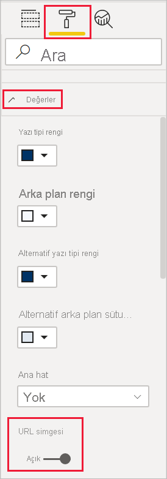
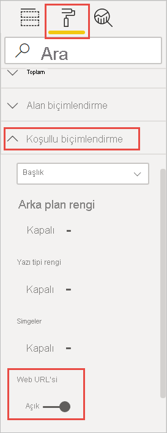
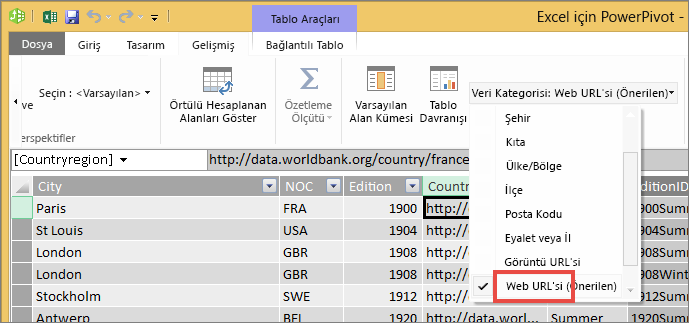

# Tabloya veya matrise köprü (URL) ekleme
Bu konu başlığı altında bir tabloya köprü (URL) eklemeyi öğreneceksiniz. Veri kümesine köprü (URL) eklemek için Power BI Desktop kullanırsınız. Söz konusu köprüleri Power BI Desktop’ta veya Power BI hizmetinde rapor tablolarınıza ve matrislerinize ekleyebilirsiniz. Ardından URL’yi veya bağlantı simgesini görüntüleyebilir ya da başka bir sütunu bağlantı metni olarak biçimlendirebilirsiniz.

Power BI hizmeti ve Power BI Desktop kullanarak, [raporlardaki metin kutularında](service-add-hyperlink-to-text-box.md) da köprüler oluşturabilirsiniz. Power BI hizmetinde, [panolardaki kutucuklara](service-dashboard-edit-tile.md) ve [panolardaki metin kutularına](service-dashboard-add-widget.md) köprü ekleyebilirsiniz. 

## Power BI Desktop’ta URL’yi köprü olarak biçimlendirme

Power BI Desktop'ta URL içeren bir alanı köprü olarak biçimlendirebilirsiniz ama Power BI hizmetinde bunu yapamazsınız. Ayrıca, çalışma kitabını Power BI'a aktarmadan önce [Excel PowerPivot'ta köprüleri biçimlendirebilirsiniz](#create-a-table-or-matrix-hyperlink-in-excel-power-pivot).

1. Power BI Desktop’ta köprü içeren bir alan yoksa, bu alanı [özel sütun](../transform-model/desktop-common-query-tasks.md) olarak ekleyin.

    > [!NOTE]
    > DirectQuery modunda sütun oluşturamazsınız.  Ancak, verileriniz zaten URL içeriyorsa bunları köprülere dönüştürebilirsiniz.

2. Veri görünümünde veya Rapor görünümünde sütunu seçin. 

3. **Modelleme** sekmesinde **Veri Kategorisi** > **Web URL’si** öğesini seçin.
   
    

    > [!NOTE]
    > URL'lerin belirli ön eklerle başlaması gerekir. Eksiksiz bir liste için bu makalenin [Önemli noktalar ve sorun giderme](#considerations-and-troubleshooting) bölümüne bakın.

## Köprü içeren bir tablo veya matris oluşturma

1. [Köprüyü URL olarak biçimlendirdikten](#format-a-url-as-a-hyperlink-in-power-bi-desktop) sonra Rapor görünümüne geçin.
2. Web URL’si olarak sınıflandırdığınız alanla bir tablo veya matris oluşturun. Köprüler mavi renkte ve altı çizili olarak görünür.

    

## URL yerine köprü simgesi görüntüleme

Tabloda uzun bir URL'nin görünmesini istemiyorsanız, bunun yerine köprü simgesini  gösterebilirsiniz. 

> [!NOTE]
> Matriste simge görüntüleyemezsiniz.
   
1. İlk olarak [köprü içeren bir tablo oluşturun](#create-a-table-or-matrix-with-a-hyperlink).

2. Tabloyu seçerek etkin duruma getirin.

    **Biçim** simgesini  seçerek Biçimlendirme sekmesini açın.

    **Değerler** bölümünü genişletin, **URL simgesini** bulun ve **Açık** duruma getirin.

    

1. (İsteğe bağlı) Raporu Power BI Desktop’tan Power BI hizmetine [yayımlayın](desktop-upload-desktop-files.md). Power BI hizmetinde raporu açtığınızda köprüler orada da çalışır.

## Bağlantı metnini köprü olarak biçimlendirme

Ayrıca tablodaki başka bir alanı da köprü olarak biçimlendirebilirsiniz ve URL için bir sütununuz olması gerekmez. Bu durumda sütunu Web URL’si olarak biçimlendirmezsiniz.

> [!NOTE]
> Matriste başka bir alanı köprü olarak biçimlendiremezsiniz.

1. Köprü içeren bir alan henüz veri kümenizde mevcut değilse Power BI Desktop'ı kullanın ve bu alanı [özel sütun](../transform-model/desktop-common-query-tasks.md) olarak ekleyin. Bir kez daha belirtelim, DirectQuery modunda sütun oluşturamazsınız.  Ancak, verileriniz zaten URL içeriyorsa bunları köprülere dönüştürebilirsiniz.

2. Veri görünümünde veya Rapor görünümünde URL'yi içeren sütunu seçin. 

3. **Modelleme** sekmesinde **Veri Kategorisi**'ni seçin. Sütunun **Kategorilere ayrılmamış** olarak biçimlendirildiğinden emin olun.

2. Rapor görünümünde, URL sütunu ve bağlantı metni olarak biçimlendireceğiniz sütunu içeren bir tablo veya matris oluşturun.

3. Tablo seçili durumdayken **Biçim** simgesini  seçerek Biçimlendirme sekmesini açın.

4. **Koşullu biçimlendirme**’yi genişletin; kutudaki adın köprü metni yapmak istediğiniz sütun olduğundan emin olun. **Web URL'si** seçeneğini bulun ve **Açık** duruma getirin.

    

    > [!NOTE]
    > **Web URL'si** seçeneği yoksa köprüleri içeren sütunun **Veri Kategorisi** açılan kutusunda **Web URL'si** olarak *biçimlendirilmediğinden* emin olun.

5. **Web URL’si** iletişim kutusundaki **Şu alana göre** kutusunda URL’yi içeren alanı seçin > **Tamam**’ı seçin.

    

    Artık söz konusu sütundaki metin köprü olarak biçimlendirilmiştir.

    

1. (İsteğe bağlı) Raporu Power BI Desktop’tan Power BI hizmetine [yayımlayın](desktop-upload-desktop-files.md). Power BI hizmetinde raporu açtığınızda köprüler orada da çalışır.

## Excel Power Pivot'ta bir tablo veya matris köprüsü oluşturma

Power BI tablolarınıza ve matrislerinize köprü eklemenin diğer bir yolu da ilgili veri kümesini Power BI'dan aktarmadan veya ilgili veri kümesine Power BI'dan bağlanmadan önce köprüleri bu veri kümesinde oluşturmaktır. Bu örnekte bir Excel çalışma kitabı kullanılmıştır.

1. Çalışma kitabını Excel'de açın.
2. **PowerPivot** sekmesini seçin ve ardından **Yönet** seçeneğini belirleyin.
   
   
1. PowerPivot açıldığında **Gelişmiş** sekmesini seçin.
   
   
4. İmlecinizi, Power BI tablolarında köprüye dönüştürmek istediğiniz URL'leri içeren sütuna yerleştirin.
   
   > [!NOTE]
   > URL'lerin belirli ön eklerle başlaması gerekir. Eksiksiz bir liste için aşağıdaki [Önemli noktalar ve sorun giderme](#considerations-and-troubleshooting) bölümüne bakın.
   > 
   
5. **Raporlama Özellikleri** grubundaki **Veri Kategorisi** açılan listesinden **Web URL'si** seçeneğini belirleyin. 
   
   

6. Power BI hizmetinden veya Power BI Desktop'tan bu çalışma kitabına bağlanın veya çalışma kitabını içeri aktarın.
7. URL alanını içeren bir tablo görselleştirmesi oluşturun.
   
   

## Önemli noktalar ve sorun giderme

URL’ler aşağıdakilerden biriyle başlamalıdır:
- http
- https
- mailto
- ftp
- news
- telnet

S: Bir tablo veya matriste köprü bağlantısını özel URL olarak kullanabilir miyim?    
C: Hayır. Bir bağlantı simgesi kullanabilirsiniz. Köprü bağlantılarınız için özel metin gerekirse ve URL listeniz kısaysa, bunun yerine bir metin kutusu kullanmayı düşünün.

## Sonraki adımlar
[Power BI raporlarındaki görselleştirmeler](../visuals/power-bi-report-visualizations.md)

[Power BI hizmetinde tasarımcılara yönelik temel kavramlar](../fundamentals/service-basic-concepts.md)

Başka bir sorunuz mu var? [Power BI Topluluğu'na başvurun](https://community.powerbi.com/)
