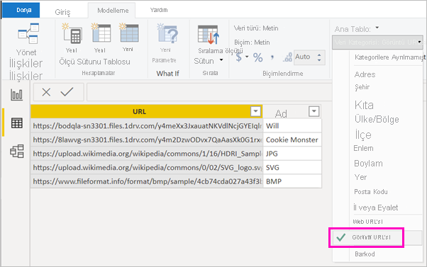

# Bir tablo, matris veya dilimleyicideki görüntüleri raporda görüntüleme

Raporlara görüntüler eklemek, raporlarınızı geliştirmenin iyi bir yoludur. Sayfadaki statik görüntüler bazı amaçlar için iyidir. Ancak bazen raporunuzdaki verilerle ilgili görüntülerin olmasını isteyebilirsiniz. Bu konu başlığı altında, görüntüleri bir tablo, matris, dilimleyici veya çok satırlı bir kartta nasıl görüntüleyeceğiniz öğretilir. 

## Raporunuza görüntü ekleme

1. Görüntülerin URL'leriyle bir sütun oluşturun. Gereksinimler için bu makalenin ilerleyen kısımlarında yer alan [Dikkat Edilmesi Gerekenler](#considerations) kısmına bakın.

1. O sütunu seçin. **Modelleme** şeridinde **Veri kategorisi** için **Görüntü URL’si** seçeneğini belirleyin.

    

1. Sütunu bir tablo, matris, dilimleyici veya çok satırlı karta ekleyin.

    

## Dikkat edilmesi gereken noktalar

- Görüntünün şu dosya biçimlerinden birinde olması gerekir: .bmp, .jpg, .jpeg, .gif, .png veya .svg
- URL'nin SharePoint gibi oturum açma gerektiren bir site üzerinde değil, anonim olarak erişilebilir olması gerekir. Ancak, görüntüler SharePoint veya OneDrive üzerinde barındırılıyorsa, doğrudan bunları işaret eden bir ekleme kodu alabilirsiniz. 

## Sonraki adımlar

[Sayfa düzeni ve biçimlendirme](/learn/modules/visuals-in-power-bi/12-formatting)

[Power BI hizmetinde tasarımcılar için temel kavramlar](../fundamentals/service-basic-concepts.md)

Başka bir sorunuz mu var? [Power BI Topluluğu'na başvurun](https://community.powerbi.com/)
