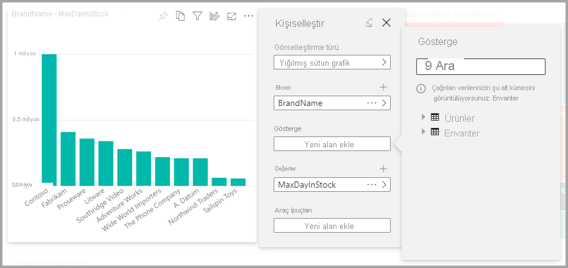

# Kullanıcıların rapordaki görselleri kişiselleştirmesine olanak tanıma

[!INCLUDE [applies-to](../includes/applies-to.md)] [!INCLUDE [yes-desktop](../includes/yes-desktop.md)] [!INCLUDE [yes-service](../includes/yes-service.md)]

Raporu geniş bir hedef kitleyle paylaşırken, kullanıcılarınızdan bir bölümü belirli görsellerin biraz farklı görünümlerini görmek isteyebilir. Eksendeki öğeleri değiştirmek, görsel türünü değiştirmek veya araç ipucuna bir şeyler eklemek isteyebilirler. Tek görselle herkesin gereksinimlerini karşılamak kolay değildir. Bu yeni özellikle işletme kullanıcılarınıza tümüyle rapor okuma görünümünde görselleri inceleme ve kişiselleştirme gücü verebilirsiniz. Görseli istedikleri gibi ayarlayabilir ve görsele geri dönmek üzere onu bir yer işareti olarak kaydedebilirler. Rapor üzerinde düzenleme iznine sahip olmaları veya değişiklik istemek için rapor yazarına dönmeleri gerekmez.

:::image type="content" source="media/power-bi-personalize-visuals/power-bi-personalize-visual.png" alt-text="Görseli kişiselleştirme":::
 
## Rapor kullanıcılarının değiştirebileceği öğeler

Bu özellik işletme kullanıcılarının Power BI raporunda görselleri rastgele inceleyerek daha fazla içgörü kazanmasına olanak tanır. Bir kullanıcı olarak bu özelliği nasıl kullanacağınızı öğrenmek için bkz. [Raporlarınızdaki görselleri kişiselleştirme](../consumer/end-user-personalize-visuals.md). Rapor okuyucularına temel inceleme senaryoları sağlamak isteyen rapor oluşturucuları için ideal bir özelliktir. Rapor okuyucuları şu değişiklikleri yapabilir:

- Görselleştirme türünü değiştirme
- Ölçü veya boyutu değiştirme
- Göstergeyi ekleme veya kaldırma
- İki veya daha fazla ölçüyü karşılaştırma
- Toplamaları vb. değiştirme

Bu özellik yeni inceleme olanakları sağlamakla kalmaz. Ayrıca kullanıcıların değişikliklerini yakalaması ve paylaşması için de yollar sağlar:

- Yaptıkları değişiklikleri yakalama
- Yaptıkları değişiklikleri paylaşma
- Bir raporda yaptıkları tüm değişiklikleri sıfırlama
- Bir görselde yaptıkları tüm değişiklikleri sıfırlama
- Son değişikliklerini temizleme

## Daha odaklanmış bir görünüm için Perspektifleri kullanma

Görsel öğeleri kişiselleştirmek için, daha odaklanmış bir görünüm sağlayan model alt kümelerinden birini seçmek amacıyla **Perspektifler**’i kullanabilirsiniz. Yönetilen alanlardan oluşan bir alt kümeye odaklanıp rapor okuyucularını bu büyük modeldeki tüm alanların yer aldığı eksiksiz koleksiyonla boğmadan, bir alt kümeyi seçmek buradaki büyük veri modeliyle çalışırken faydalı olabilir. 

Perspektiflerle çalışırken aşağıdaki konuları göz önünde bulundurun:

* Perspektiflerin güvenlik mekanizması olarak kullanılması amaçlanmaz, bunlar daha iyi bir kullanıcı deneyimi sunmaya yönelik araçlardır. Bir perspektifin tüm güvenliği, temelindeki modelden alınır.

* Hem tablosal hem d çok boyutlu modellerdeki perspektifler desteklenir. Ancak çok boyutlu modellerdeki perspektiflerde, perspektifi yalnızca raporun temel küpüyle aynı olacak şekilde ayarlayabilirsiniz.

* Modelden perspektif silmeden önce, perspektifin Görsel öğelerin kişiselleştirme deneyiminde kullanılmadığından emin olun. 

Perspektifleri kullanmak amacıyla, raporlarınız için Görsel öğeleri kişiselleştirmeniz gerekir. Ayrıca, son kullanıcıların Görsel öğeleri kişiselleştirme deneyimiyle etkileşim kurmasını istediğiniz boyutları ve ölçüleri de içeren en az bir Perspektif oluşturmanız gerekir.

Perspektif oluşturmak için, şu konumdan indirebileceğiniz [Tablosal Düzenleyici](https://tabulareditor.com/)’yi kullanın: Tablosal Düzenleyici’yi indirme

**Tablosal Düzenleyici**’yi indirdiğinizde raporu **Power BI Desktop**’ta açın ve aşağıda gösterildiği gibi, şeritteki **Dış Araçlar** sekmesinden **Tablosal Düzenleyici**’yi başlatın.

Tablosal Düzenleyici’de, yeni bir perspektif oluşturmak için **Perspektifler** klasörüne tıklayın.

Perspektifi yeniden adlandırmak için metne çift tıklayabilirsiniz.

Daha sonra, Tablosal Düzenleyici’deki **Tablolar** klasörünü açarak perspektife alanlar ekleyip perspektifte göstermek istediğiniz alanlara sağ tıklayın.

Perspektife eklemek istediğiniz her alan için bu işlemi tekrarlayın. Perspektife yinelenen alanlar eklenemez. Yani bir perspektife zaten eklediğiniz tüm alanlarda bunu devre dışı bırakılmış şekilde ekleme seçeneği bulunur.

İstediğiniz tüm alanları ekledikten sonra, ayarlarınızı hem Tablosal Düzenleyici’de hem de Power BI Desktop’ta kaydettiğinizden emin olun.

Modele yeni perspektifi ve Power BI Desktop raporunu kaydettikten sonra, **Görsel öğeyi kişiselleştirme** adlı yeni bölümü göreceğiniz **Biçim** bölmesine gidin.

*Rapor okuyucusu perspektifi* seçimi ilk olarak *Varsayılan alanlara* ayarlanır. Açılan oku seçtiğinizde, oluşturduğunuz diğer Perspektifleri görürsünüz.

Rapor sayfasının Perspektifini ayarladığınızda, bu sayfadaki Görsel öğeleri kişiselleştirme deneyimi seçili Perspektife göre filtrelenir. **Tüm sayfalara uygula** seçeneğini belirlemeniz, Perspektif ayarlarını raporunuzdaki tüm mevcut sayfalara uygulamanızı sağlar.

## Raporda kişiselleştirmeyi etkinleştirme

Bu özelliği Power BI Desktop'ta veya Power BI hizmetinde etkinleştirebilirsiniz. Eklenmiş raporlarda da etkinleştirebilirsiniz.

### Power BI Desktop'ta

Özelliği Power BI Desktop’ta etkinleştirmek için **Dosya** > **Seçenekler ve Ayarlar** > **Seçenekler** > **Geçerli dosya** > **Rapor ayarları**’na gidin. **Görselleri kişiselleştir** seçeneğinin açıldığından emin olun.

:::image type="content" source="media/power-bi-personalize-visuals/personalize-report-setting-desktop.png" alt-text="Raporda kişiselleştirmeyi etkinleştirme":::

### Power BI hizmetinde

Özelliği bunun yerine Power BI hizmetinde etkinleştirmek için raporunuzun **Ayarlar** bölümüne gidin.

:::image type="content" source="media/power-bi-personalize-visuals/power-bi-report-service-settings-personalize-visual.png" alt-text="Power BI hizmetinde rapor ayarları":::

**Görselleri kişiselleştir** > **Kaydet**'i seçin.

:::image type="content" source="media/power-bi-personalize-visuals/personalize-report-setting-service.png" alt-text="Hizmette görselleri kişiselleştirme seçeneğini açma":::

## Özelliği sayfa veya görsel düzeyinde açma ya da kapatma

Görselleri kişiselleştir ayarını belirli bir rapor için etkinleştirdiğinizde, varsayılan olarak rapordaki tüm görseller kişiselleştirilebilir. Tüm görsellerin kişiselleştirilmesini istemiyorsanız bu ayarı her görsel veya sayfa için açabilir ya da kapatabilirsiniz.

### Sayfa için

Sayfa sekmesini seçip **Görselleştirmeler** bölmesinden **Biçim**'i seçin.

:::image type="content" source="media/power-bi-personalize-visuals/personalize-page-level-setting.png" alt-text="Görseli kişiselleştir özelliğini bir sayfa için seçme.":::
 
**Görseli kişiselleştir** >  kaydırıcısını **Açık** veya **Kapalı** konuma getirin.

### Görsel için

Görseli seçin > **Görselleştirmeler** bölmesinde **Biçim**’i seçin > **Görsel üst bilgisi**’ni genişletin.

:::image type="content" source="media/power-bi-personalize-visuals/power-bi-format-visual-header-personalize.png" alt-text="Görsel üst bilgisi’ni seçme":::
 
**Görseli kişiselleştir** >  kaydırıcısını **Açık** veya **Kapalı** konuma getirin.

:::image type="content" source="media/power-bi-personalize-visuals/power-bi-format-visual-personalize-on-off.png" alt-text="Görseli kişiselleştir kaydırıcısı açık veya kapalı":::

## Sınırlamalar

Şu anda özelliğin bilinmesi gereken birkaç sınırlaması vardır.

- Bu özellik web'de yayımlama için desteklenmez.
- Kullanıcının incelemeleri otomatik olarak kalıcı olmaz. Değişikliklerinizi yakalamak için görünümünüzü kişisel bir yer işareti olarak kaydetmeniz gerekir.
- Bu özellik, iOS ve Android tabletler için Power BI mobil uygulamalarında ve Power BI Windows uygulamasında desteklenir; telefonlar için Power BI mobil uygulamalarında desteklenmez. Bununla birlikte, Power BI hizmetindeyken kişisel yer işaretine kayıtlı bir görselde yapılan değişiklikler, tüm Power BI mobil uygulamalarında dikkate alınır.

## Sonraki adımlar

[Raporlarınızdaki görselleri kişiselleştirme](../consumer/end-user-personalize-visuals.md)     

Yeni görsel kişiselleştirme deneyimini bir kez deneyin. [Power BI Ideas sitesinde](https://ideas.powerbi.com/forums/265200-power-bi) bu özellikle ilgili geri bildirimlerinizi sağlayın ve bu deneyimi geliştirmeye nasıl devam edebileceğimiz konusunda görüşlerinizi bildirin. 

Başka bir sorunuz mu var? [Power BI Topluluğu'na başvurun](https://community.powerbi.com/)
